> 参考博文 http://www.360doc.com/content/21/0104/15/64417993_955151966.shtml

## 主要内容

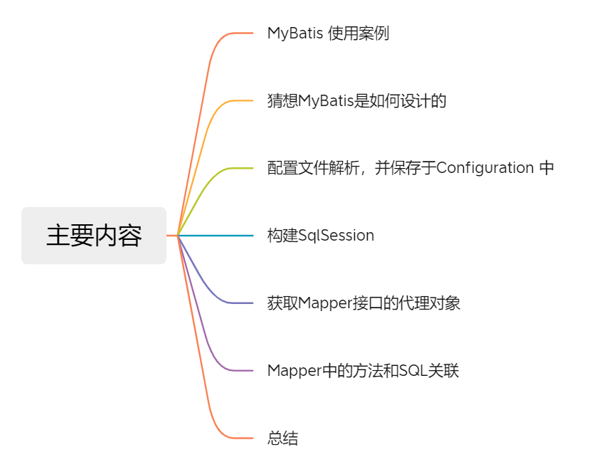

我们从一个简单案例入手，接着就是一步一步的剥开MyBatis的源码，大量的图文结合。


## MyBtais 使用案例

添加相关 pom 依赖 。

```pom
<!-- Mybatis依赖 -->
<dependency>
      <groupId>org.mybatis</groupId>
      <artifactId>mybatis</artifactId>
      <version>3.5.2</version>
</dependency>
<!-- MySQL依赖 -->
<dependency>
       <groupId>mysql</groupId>
       <artifactId>mysql-connector-java</artifactId>
       <version>8.0.16</version>
       <scope>runtime</scope>
</dependency>
```

本地创建数据库，创建一张表 `t_user` 。并初始化几条数据，方便后面 debug。

```sql
CREATE TABLE `t_user` (
  `id` int NOT NULL AUTO_INCREMENT,
  `name` varchar(255) CHARACTER SET utf8 COLLATE utf8_general_ci DEFAULT NULL,
  `pwd` varchar(255) DEFAULT NULL,
  `gender` int DEFAULT NULL,
  `age` int DEFAULT NULL,
  PRIMARY KEY (`id`)
) ENGINE=InnoDB AUTO_INCREMENT=4 DEFAULT CHARSET=utf8;
```

实体类 （User.java）

```java
public class User {
   private Integer id;
   private String userName;
   private Integer age;
   private Integer gender;
   //省略 set get.....
}
```

创建 UserMapper.java 接口 

```java
public interface UserMapper {  
  User selectById(Integer id);
}
```

创建 UserMapper.xml 配置文件

> 一个简单的按照 id 查询

```xml
<?xml version="1.0" encoding="UTF-8" ?>
<!DOCTYPE mapper  PUBLIC "-//mybatis.org//DTD Mapper 3.0//EN"
 "http://mybatis.org/dtd/mybatis-3-mapper.dtd">
<mapper namespace="com.tian.mybatis.mapper.UserMapper">
    <resultMap id="User" type="com.tian.mybatis.entity.User">
        <id column="id" property="id"/>
        <result column="name" property="userName"/>
    </resultMap> 
    <select id="selectById" resultMap="User">
        select * from t_user
        <where>
            <if test="id != null">
                id = #{id}
            </if>
        </where>
    </select>
</mapper>
```

创建 mybatis-config.xml 配置文件 。

```xml
<?xml version="1.0" encoding="UTF-8" ?>
<!DOCTYPE configuration
        PUBLIC "-//mybatis.org//DTD Config 3.0//EN"
        "http://mybatis.org/dtd/mybatis-3-config.dtd">
<configuration>
    <environments default="development">
        <environment id="development">
            <transactionManager type="JDBC"/>
            <dataSource type="POOLED">
                <property name="driver" value="com.mysql.cj.jdbc.Driver"/>
                <property name="url" value="jdbc:mysql://localhost:3306/tian?useUnicode=true"/>
                <property name="username" value="root"/>
                <property name="password" value="123456"/>
            </dataSource>
        </environment>
    </environments>
    <mappers>
        <mapper  resource="mapper/UserMapper.xml"/>
    </mappers>
</configuration>
```

使用案例 

```java
public class MybatisApplication {

    public static void main(String[] args) {
        String resource = "mybatis-config.xml";
        InputStream inputStream = null;
        SqlSession sqlSession = null;
        try {
            //读取mybatis-config.xml
            inputStream = Resources.getResourceAsStream(resource);
            //解析mybatis-config.xml配置文件，创建sqlSessionFactory
            SqlSessionFactory sqlSessionFactory = new SqlSessionFactoryBuilder().build(inputStream);
            //创建sqlSession
            sqlSession = sqlSessionFactory.openSession();
            //创建userMapper对象（UserMapper并没有实现类）
            UserMapper userMapper = sqlSession.getMapper(UserMapper.class);
            //调用userMapper对象的方法
            User user = userMapper.selectById(1);
            System.out.println(user);
        } catch (Exception e) {
            e.printStackTrace();
        } finally {
            //关闭资源
            try {
                inputStream.close();
            } catch (IOException e) {
                e.printStackTrace();
            }
            sqlSession.close();
        }
    }
}
```

输出结果：

```java
User{id=1, userName='刘德华', age=23, gender=1}
```


## 猜想MyBatis是如何设计的

从上面的案例中，我们可以大致可以猜测到 MyBatis 一共做了哪些步骤 。

- 1、定位到 mybatis-config.xml 配置文件并读取装载。获取输入流 InputStream 。
- 2、解析输入流 InputStream，解析 mybatis-config.xml 配置文件中相关配置项，校验，保存起来 。
- 3、创建 sqlSessionFactory 对象，session 就是一次会话，我们可以理解 sqlSessionFactory 就是一个工厂类。专门创建 sqlSession 对象，并且这个 sqlSessionFactory 工厂是唯一不变的（单例）。
- 4、创建 sqlSession ，SqlSession 中保存了配置文件内容信息和执行数据库相关的操作。
- 5、获取 UserMapper 对象，但是 UserMapper 是接口，并没有实现类，怎么就可以调用其方法呢？这里猜想可能用到动态代理。
- 6、UserMapper 接口中的方法 是如何关联到 SQL 的。猜想可能是有专门映射的类，而且，肯定使用到了接口全路径 + 方法名词，这样才能确保方法和 SQL 之间的关联（主要是使用的时候，都是方法名必须和 SQL 中 statementId 一致，由此猜想的）。
- 7、最后底层使用 JDBC 去操作数据库 。
- 8、作为一个持久化框架，很有可能会使用到缓存，用来存储每次查询数据。

面试中如果遇到，让你来设计一个 MyBatis 如何设计 ？


## 配置文件解析，并保存与 Configuration 中 

第一步是读取 mybatis-config.xml 配置文件，这里就没必要阅读这部分源码。得到的是 InputStream 输入流。

我们从下面这行代码开始 

```java
SqlSessionFactory sqlSessionFactory = new SqlSessionFactoryBuilder().build(inputStream);
```

SqlSessionFactory 没有构造方法，那么这里使用的就是调用默认午餐构造方法，我们直接进去 build 方法 

```java
// 这个方法什么也没干
public SqlSessionFactory build(InputStream inputStream) {
     // 调用的是另外一个 build 方法
     return this.build((InputStream)inputStream, (String)null, (Properties)null);
}
public SqlSessionFactory build(InputStream inputStream, String environment, Properties properties) {
     SqlSessionFactory var5;
     try {
          // 创建一个 XMLConfigBuilder 对象
          XMLConfigBuilder parser = new XMLConfigBuilder(inputStream, environment, properties);
          var5 = this.build(parser.parse());
     } catch (Exception var14) {
          throw ExceptionFactory.wrapException("Error building SqlSession.", var14);
     } finally {
          ErrorContext.instance().reset();

          try {
               inputStream.close();
          } catch (IOException var13) {
          }

     }

     return var5;
}
```

SqlSessionFactory 类中的 build 重载的方法如下 ：

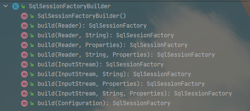

SqlSessionFactory 中提供了三种读取配置信息的方法 ：字节流 、字符流和 Configuration 配置类 。

创建 XMLConfigBuilder 对象，这个类似 BaseBuilder 的子类，BaseBuilder 类图如下 ：

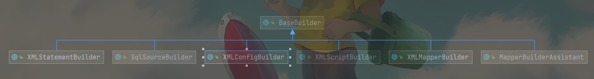

看到这些子类基本上都是以 Builder 结尾，所以这里使用的是 建造者设计模式 。

这个 类名可以猜出就是解析 xml 配置文件的，然后我们继续进入 

```java
public XMLConfigBuilder(InputStream inputStream, String environment, Properties props) {
     this(new XPathParser(inputStream, true, props, new XMLMapperEntityResolver()), environment, props);
}
```

MyBatis 对应解析包 `org.apache.ibatis.parsing` 

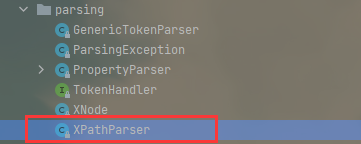

XPathParser 基于 Java XPath 解析器，用于解析 MyBatis 中 xml配置文件 。

- mybatis-config.xml
- mapper.xml

<br/>

XPathParser 主要内容 ：

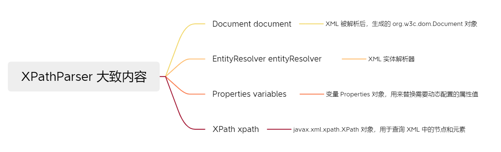

<br/>

继续 XMLConfigBuilder 构造方法源码分析 ：

```java
public XMLConfigBuilder(InputStream inputStream, String environment, Properties props) {
     this(new XPathParser(inputStream, true, props, new XMLMapperEntityResolver()), environment, props);
}
private XMLConfigBuilder(XPathParser parser, String environment, Properties props) {
     super(new Configuration());
     this.localReflectorFactory = new DefaultReflectorFactory();
     ErrorContext.instance().resource("SQL Mapper Configuration");
     this.configuration.setVariables(props);
     this.parsed = false;
     this.environment = environment;
     this.parser = parser;
}
```

构造一个 XMLConfigBuilder 对象，给属性设置相应值。

然后我们回到 SqlSessionFactoryBuilder 类中的 builder 方法里 ：

```java
public SqlSessionFactory build(InputStream inputStream, String environment, Properties properties) {
     SqlSessionFactory var5;
     try {
          XMLConfigBuilder parser = new XMLConfigBuilder(inputStream, environment, properties);
          var5 = this.build(parser.parse());
     } catch (Exception var14) {
          throw ExceptionFactory.wrapException("Error building SqlSession.", var14);
     } finally {
          ErrorContext.instance().reset();

          try {
               inputStream.close();
          } catch (IOException var13) {
          }

     }

     return var5;
}
```

先看 `parser.parse()` 方法 

```java
public Configuration parse() {
     if (this.parsed) {
          throw new BuilderException("Each XMLConfigBuilder can only be used once.");
     } else {
          this.parsed = true;
          // mybatis-config.xml 的一级标签
          this.parseConfiguration(this.parser.evalNode("/configuration"));
          return this.configuration;
     }
}
```

继续 parseConfiguration() 方法 ：

```java
private void parseConfiguration(XNode root) {
     try {
          this.propertiesElement(root.evalNode("properties"));
          Properties settings = this.settingsAsProperties(root.evalNode("settings"));
          this.loadCustomVfs(settings);
          this.typeAliasesElement(root.evalNode("typeAliases"));
          this.pluginElement(root.evalNode("plugins"));
          this.objectFactoryElement(root.evalNode("objectFactory"));
          this.objectWrapperFactoryElement(root.evalNode("objectWrapperFactory"));
          this.reflectorFactoryElement(root.evalNode("reflectorFactory"));
          this.settingsElement(settings);
          this.environmentsElement(root.evalNode("environments"));
          this.databaseIdProviderElement(root.evalNode("databaseIdProvider"));
          this.typeHandlerElement(root.evalNode("typeHandlers"));
          this.mapperElement(root.evalNode("mappers"));
     } catch (Exception var3) {
          throw new BuilderException("Error parsing SQL Mapper Configuration. Cause: " + var3, var3);
     }
}
```


结合 mybatis-config.xml 配置文件和解析方法，可以得出如下关联 

> 将 mybatis-config.xml 文件内容解析存放到 configuration 对象中

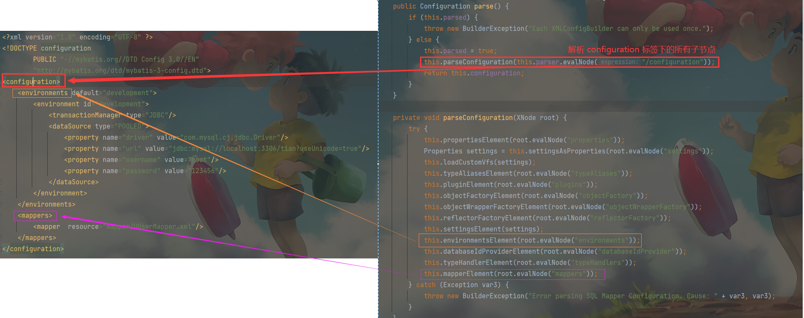

<br/>

有多少二级标签可以定义呢 ？

>  官网查看 ： https://mybatis.org/mybatis-3/zh/configuration.html 

并且在 `org.apache.ibatis.builder.xml` 下的 mybatis-3-config.dtd 也已经定义了 

```xml
<!ELEMENT configuration (properties?, settings?, typeAliases?, typeHandlers?, objectFactory?, objectWrapperFactory?, reflectorFactory?, plugins?, environments?, databaseIdProvider?, mappers?)>
```

Mapper.xml 中能定义哪些标签呢？

> 官网查看 ：https://mybatis.org/mybatis-3/zh/sqlmap-xml.html

关于 MyBatis 中标签相关介绍就介绍到此 。

<br/> 下面我们来看看标签是如何存入 configuration 对象中的。（这里列举部分，挑几个相对重要的）

propertiesElement() 方法 ：

```java
private void propertiesElement(XNode context) throws Exception {
     if (context != null) {
          Properties defaults = context.getChildrenAsProperties();
          String resource = context.getStringAttribute("resource");
          String url = context.getStringAttribute("url");
          if (resource != null && url != null) {
               throw new BuilderException("The properties element cannot specify both a URL and a resource based property file reference.  Please specify one or the other.");
          }

          if (resource != null) {
               defaults.putAll(Resources.getResourceAsProperties(resource));
          } else if (url != null) {
               defaults.putAll(Resources.getUrlAsProperties(url));
          }

          Properties vars = this.configuration.getVariables();
          if (vars != null) {
               defaults.putAll(vars);
          }

          this.parser.setVariables(defaults);
          // 将解析好的 properties 标签 set到 configuration对象中 
          this.configuration.setVariables(defaults);
     }

}
```

typeAliasesElement() 方法 ：

```java
private void typeAliasesElement(XNode parent) {
     if (parent != null) {
          Iterator var2 = parent.getChildren().iterator();

          while(var2.hasNext()) {
               XNode child = (XNode)var2.next();
               String alias;
               if ("package".equals(child.getName())) {
                    alias = child.getStringAttribute("name");
                    this.configuration.getTypeAliasRegistry().registerAliases(alias);
               } else {
                    alias = child.getStringAttribute("alias");
                    String type = child.getStringAttribute("type");

                    try {
                         Class<?> clazz = Resources.classForName(type);
                         // 在此处将解析的标签内容存放到 configuration 对象
                         if (alias == null) {
                              this.typeAliasRegistry.registerAlias(clazz);
                         } else {
                              this.typeAliasRegistry.registerAlias(alias, clazz);
                         }
                    } catch (ClassNotFoundException var7) {
                         throw new BuilderException("Error registering typeAlias for '" + alias + "'. Cause: " + var7, var7);
                    }
               }
          }
     }

}

public void registerAlias(Class<?> type) {
     String alias = type.getSimpleName();
     Alias aliasAnnotation = (Alias)type.getAnnotation(Alias.class);
     if (aliasAnnotation != null) {
          alias = aliasAnnotation.value();
     }

     this.registerAlias(alias, type);
}
// 最终都是调用该方法存放
public void registerAlias(String alias, Class<?> value) {
     if (alias == null) {
          throw new TypeException("The parameter alias cannot be null");
     } else {
          String key = alias.toLowerCase(Locale.ENGLISH);
          if (this.TYPE_ALIASES.containsKey(key) && this.TYPE_ALIASES.get(key) != null && !((Class)this.TYPE_ALIASES.get(key)).equals(value)) {
               throw new TypeException("The alias '" + alias + "' is already mapped to the value '" + ((Class)this.TYPE_ALIASES.get(key)).getName() + "'.");
          } else {
               this.TYPE_ALIASES.put(key, value);
          }
     }
}
```


### 插件 plugins 解析 

```java
private void pluginElement(XNode parent) throws Exception {
     if (parent != null) {
          Iterator var2 = parent.getChildren().iterator();
		// 可以定义多个插件
          while(var2.hasNext()) {
               XNode child = (XNode)var2.next();
               String interceptor = child.getStringAttribute("interceptor");
               Properties properties = child.getChildrenAsProperties();
               Interceptor interceptorInstance = (Interceptor)this.resolveClass(interceptor).newInstance();
               interceptorInstance.setProperties(properties);
               this.configuration.addInterceptor(interceptorInstance);
          }
     }

}
```

Configuration 类中 interceptorChain 用来存储所有定义的插件 。

```java
// InterceptorChain 类中有一个 List<Interceptor> interceptors
private final List<Interceptor> interceptors = new ArrayList();
// 存入 interceptor 中
public void addInterceptor(Interceptor interceptor) {
     this.interceptorChain.addInterceptor(interceptor);
}
// InterceptorChain.java
public void addInterceptor(Interceptor interceptor) {
     this.interceptors.add(interceptor);
}
```

InterceptorChain.java 插件链（连接链），责任链模式 。

```java
public class InterceptorChain {
    private final List<Interceptor> interceptors = new ArrayList();

    public InterceptorChain() {
    }

    public Object pluginAll(Object target) {
        Interceptor interceptor;
        for(Iterator var2 = this.interceptors.iterator(); var2.hasNext(); target = interceptor.plugin(target)) {
            interceptor = (Interceptor)var2.next();
        }

        return target;
    }

    public void addInterceptor(Interceptor interceptor) {
        this.interceptors.add(interceptor);
    }

    public List<Interceptor> getInterceptors() {
        return Collections.unmodifiableList(this.interceptors);
    }
}
```

我么继续看看 Mapper.xml 是如何解析的 。


### **mapper.xml 解析**

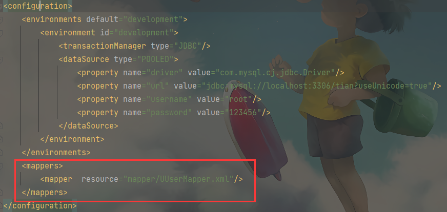

使用方法有以下四种

```xml
<--! 1使用类路径 -->
<mappers>
    <mapper resource="org/mybatis/builder/AuthorMapper.xml"/>
</mappers>
<--! 2使用绝对url路径 -->
<mappers>
   <mapper url="file:///var/mappers/AuthorMapper.xml"/>
</mappers>
<--! 3使用java类名 -->
<mappers>
   <mapper class="org.mybatis.builder.AuthorMapper"/>
</mappers>

<--! 4自动扫描包下所有映射器 -->
<mappers>
   <package name="org.mybatis.builder"/>
</mappers>
```

源码刨析 ：

```java
private void mapperElement(XNode parent) throws Exception {
     if (parent != null) {
          Iterator var2 = parent.getChildren().iterator();

          while(true) {
               while(var2.hasNext()) {
                    XNode child = (XNode)var2.next();
                    String resource;
                    // 扫描包下所有映射器
                    if ("package".equals(child.getName())) {
                         resource = child.getStringAttribute("name");
                         // 放到配置对象 configuration 中
                         this.configuration.addMappers(resource);
                    } else {
                         resource = child.getStringAttribute("resource");
                         String url = child.getStringAttribute("url");
                         String mapperClass = child.getStringAttribute("class");
                         XMLMapperBuilder mapperParser;
                         InputStream inputStream;
                         // 使用 Java 类名
                         if (resource != null && url == null && mapperClass == null) {
                              ErrorContext.instance().resource(resource);
                              // 根据文件存放目录, 读取 xxxMapper.xml
                              inputStream = Resources.getResourceAsStream(resource);
                              // 映射器较为复杂, 调用 XMLMapperBuilder
                              // 在 while 循环里每个 mapper 都重新 new 一个XMLMapperBuilder对象来解析
                              mapperParser = new XMLMapperBuilder(inputStream, this.configuration, resource, this.configuration.getSqlFragments());
                              mapperParser.parse();
                           // 使用绝对 url 路径    
                         } else if (resource == null && url != null && mapperClass == null) {
                              ErrorContext.instance().resource(url);
                              inputStream = Resources.getUrlAsStream(url);
                              // 同样是调用 XMLMapperBuilder 对象解析
                              mapperParser = new XMLMapperBuilder(inputStream, this.configuration, url, this.configuration.getSqlFragments());
                              mapperParser.parse();
                           // 使用类路径    
                         } else {
                              if (resource != null || url != null || mapperClass == null) {
                                   throw new BuilderException("A mapper element may only specify a url, resource or class, but not more than one.");
                              }

                              Class<?> mapperInterface = Resources.classForName(mapperClass);
                              // 直接把这个映射加入到配置
                              this.configuration.addMapper(mapperInterface);
                         }
                    }
               }

               return;
          }
     }
}

public BaseBuilder(Configuration configuration) {
     this.configuration = configuration;
     this.typeAliasRegistry = this.configuration.getTypeAliasRegistry();
     this.typeHandlerRegistry = this.configuration.getTypeHandlerRegistry();
}

public XMLMapperBuilder(InputStream inputStream, Configuration configuration, String resource, Map<String, XNode> sqlFragments) {
     this(new XPathParser(inputStream, true, configuration.getVariables(), new XMLMapperEntityResolver()), configuration, resource, sqlFragments);
}

private XMLMapperBuilder(XPathParser parser, Configuration configuration, String resource, Map<String, XNode> sqlFragments) {
     super(configuration);
     this.builderAssistant = new MapperBuilderAssistant(configuration, resource);
     this.parser = parser;
     this.sqlFragments = sqlFragments;
     this.resource = resource;
}
```

把这些 UserMapper (UserMapper.xml) 保存到 configuration  对象中 。

```java
this.configuration.addMapper(mapperInterface);
```

到这里，配置文件 mybatis-config.xml 和我们定义的映射文件 xxxMapper.xml 就全部解析完成 。

关于其他配置项，解析方式类似，最终都会保存到一个 Configuration 对象中 。

Configuration 对象类似于单例模式，整个 MyBatis 中只有一个 Configuration 对象 。


## 回到 SqlSessionFactoryBuilder 类

前面讲到 XMLConfigBuilder 类中的 parse() 方法，并返回一个 Configuration 对象 。

```java
XMLConfigBuilder parser = new XMLConfigBuilder(inputStream, environment, properties);
var5 = this.build(parser.parse());
```

这个 build() 方法就是传入一个 Configuration 对象，然后构建一个 DefaultSqlSessionFactory 对象 。

```java
public SqlSessionFactory build(Configuration config) {
     return new DefaultSqlSessionFactory(config);
}
```

继续回到我们的案例中如下代码中 ：

```java
SqlSessionFactory sqlSessionFactory = new SqlSessionFactoryBuilder().build(inputStream);
```

这一行代码相当于 下面一行代码，：

```java
SqlSessionFactory sqlSessionFactory = new DefaultSqlSessionFactory();
```

至此，配置文件解析完毕 。

<br/>

**配置文件解析流程**

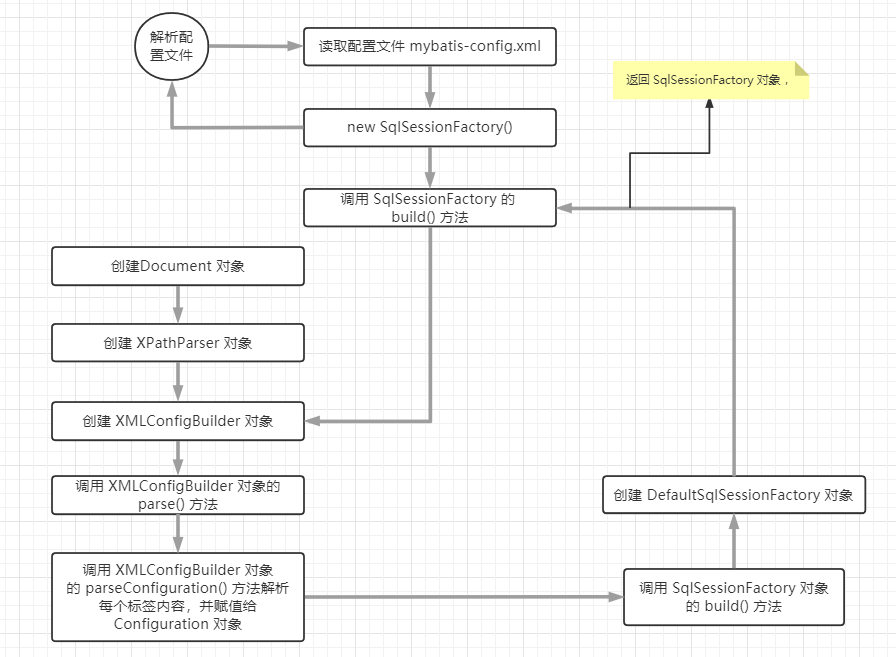

已经获取到 SqlSessionFactory ，此时我们可以构建 SqlSession 了 


<br/>

## 构建 SqlSession

前面已经做了配置文件的解析，那么我们现在来构建 SqlSession 。

```java
sqlSession = sqlSessionFactory.openSession();
```

这里的 sqlSessionFactory 是 DefaultSqlSessionFactory，那么调用的 openSession() 方法应为 DefaultSqlSessionFactory 中的方法 。

```java
public class DefaultSqlSessionFactory implements SqlSessionFactory {
    // 前面构建的 configuration, 配置文件的所有内容 
    private final Configuration configuration;

    public SqlSession openSession() {
        return this.openSessionFromDataSource(this.configuration.getDefaultExecutorType(), (TransactionIsolationLevel)null, false);
    }
     
     // 调用 openSessionFromDataSource 方法
     // protected ExecutorType defaultExecutorType = ExecutorType.SIMPLE; 取 ExecutorType 默认的.
     private SqlSession openSessionFromDataSource(ExecutorType execType, TransactionIsolationLevel level, boolean autoCommit) {
          Transaction tx = null;

          DefaultSqlSession var8;
          try {
               // 对应 xml 标签<environments>, 这个在配置文件解析的时候就已经存放到 configuration对象中了 .
               Environment environment = this.configuration.getEnvironment();
               // 构建事务工厂
               TransactionFactory transactionFactory = this.getTransactionFactoryFromEnvironment(environment);
               // 构建一个事务对象
               tx = transactionFactory.newTransaction(environment.getDataSource(), level, autoCommit);
               // 创建一个 Executor(执行器) 来执行 SQL 
               Executor executor = this.configuration.newExecutor(tx, execType);
               // 创建一个 DefaultSqlSession 对象并返回
               var8 = new DefaultSqlSession(this.configuration, executor, autoCommit);
          } catch (Exception var12) {
               this.closeTransaction(tx);
               throw ExceptionFactory.wrapException("Error opening session.  Cause: " + var12, var12);
          } finally {
               ErrorContext.instance().reset();
          }

          return var8;
     }
     
     private TransactionFactory getTransactionFactoryFromEnvironment(Environment environment) {
          return (TransactionFactory)(environment != null && environment.getTransactionFactory() != null ? environment.getTransactionFactory() : new ManagedTransactionFactory());
     }
}
```


### 创建事务 Transaction

TransactionFactory 类图 ：

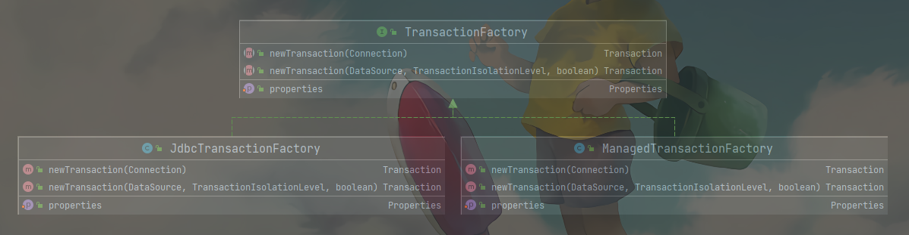

事务工厂类可以配置 JDBC 类型和 MANAGED 类型 

- JdbcTransactionFactory 生产 JdbcTransaction
- ManagedTransactionFactory 生产 ManagedTransaction

如果配置的是 JDBC，则会使用 Connection 对象的 commit()、rollback()、close() 方法来管理事务 。

如果配置的是 MANAGED，会把事务交给 容器来管理，比如JBOSS、Weblogic。因为案例是本地跑的程序，如果配置成 MANAGED 就不会有事务。

但是，如果是 Spring + MyBatis，则没有必要配置，因为我们会直接在 applicationContext.xml 配置数据源和事务管理器，从而覆盖 MyBatis 的配置 。

<br/>

把事务传给 newExecutor() 方法创建执行器 Executor 对象 

```java
Executor executor = this.configuration.newExecutor(tx, execType);
```

### 创建 Executor 对象 

调用 Configuration 的 newExecutor() 方法创建 Executor 对象 。

```java
Executor executor = this.configuration.newExecutor(tx, execType);

// Configuration.java
public Executor newExecutor(Transaction transaction, ExecutorType executorType) {
     executorType = executorType == null ? this.defaultExecutorType : executorType;
     executorType = executorType == null ? ExecutorType.SIMPLE : executorType;
     Object executor;
     // 1
     if (ExecutorType.BATCH == executorType) {
          executor = new BatchExecutor(this, transaction);
     } else if (ExecutorType.REUSE == executorType) {
          executor = new ReuseExecutor(this, transaction);
     } else {
          executor = new SimpleExecutor(this, transaction);
     }

     // 2
     if (this.cacheEnabled) {
          executor = new CachingExecutor((Executor)executor);
     }

     // 3
     Executor executor = (Executor)this.interceptorChain.pluginAll(executor);
     return executor;
}

public enum ExecutorType {
    SIMPLE,
    REUSE,
    BATCH;

    private ExecutorType() {
    }
}
```

该方法分为三个步骤 。

<br/>

#### 第一步 ：创建执行器

Executor 的基本类型 有三种 ：SIMPLE 为默认类型

```java
public enum ExecutorType {
    SIMPLE,
    REUSE,
    BATCH;

    private ExecutorType() {
    }
}
```

Executor 类图 ：

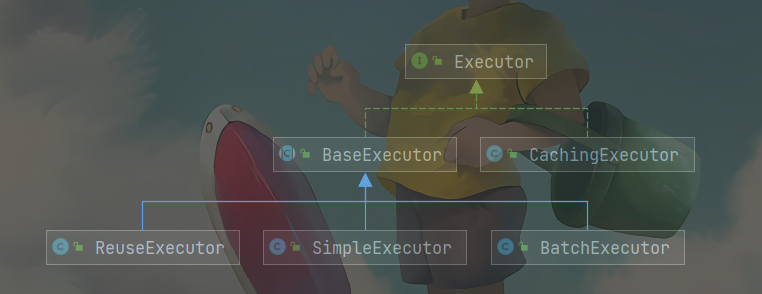

为什么要让抽象类 BaseExecutor 实现 Executor 接口 ，然后让具体实现类继承抽象类呢 ？

这就是模板方法模式的实现 。

> 模板方法就是定义一个算法骨架，并允许子类为一个或者多个步骤提供实现。子类可以再不改变算法结构的情况下，重新定义算法的某些步骤 。

抽象方法是在子类汇总实现的，每种执行器自己实现自己的逻辑，BaseExecutor 最终会调用到具体的子类 。

<br/>

抽象方法 ：BaseExecutor.java

```java
protected abstract int doUpdate(MappedStatement var1, Object var2) throws SQLException;
protected abstract List<BatchResult> doFlushStatements(boolean var1) throws SQLException;
protected abstract <E> List<E> doQuery(MappedStatement var1, Object var2, RowBounds var3, ResultHandler var4, BoundSql var5) throws SQLException;
protected abstract <E> Cursor<E> doQueryCursor(MappedStatement var1, Object var2, RowBounds var3, BoundSql var4) throws SQLException;
```


#### 第二步 ：缓存装饰

```java
if (this.cacheEnabled) {
     executor = new CachingExecutor((Executor)executor);
}
```

如果 cacheEnabled=true，会用装饰器设计模式对 Executor 进行装饰 。


#### 第三步 ：插件代理 

缓存装饰完后，就会执行

```java
Executor executor = (Executor)this.interceptorChain.pluginAll(executor);
```

这会对 Executor 植入插件逻辑 

mybatis 插件原理详解 ：https://mp.weixin.qq.com/s?__biz=MzU4MDM3MDgyMA==&mid=2247495157&idx=1&sn=1543a04ff3c6100661ed4b5819a65581&chksm=fd55451eca22cc085056e4578378a9a42735ba325af88682864cfce85cb67c0365cf4aa44044&scene=21#wechat_redirect

暂不对 插件展开详解 

到此，执行器的创建就搞定了 。

<br/>

Executor 创建完毕后，接着创建 DefaultSqlSession 对象，

```java
var8 = new DefaultSqlSession(this.configuration, executor, autoCommit);
```

进入 DefaultSqlSession 的构造方法中 ：

```java
public class DefaultSqlSession implements SqlSession {
    private final Configuration configuration;
    private final Executor executor;

    public DefaultSqlSession(Configuration configuration, Executor executor, boolean autoCommit) {
        this.configuration = configuration;
        this.executor = executor;
        this.dirty = false;
        this.autoCommit = autoCommit;
    }
}
```

DefaultSqlSession 中包含两个重要属性 ：

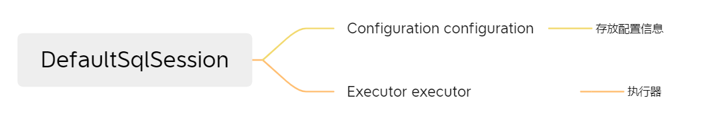

自此，SqlSession 对象构建完毕 。

```java
sqlSession = sqlSessionFactory.openSession();
```

整个构建过程 ：

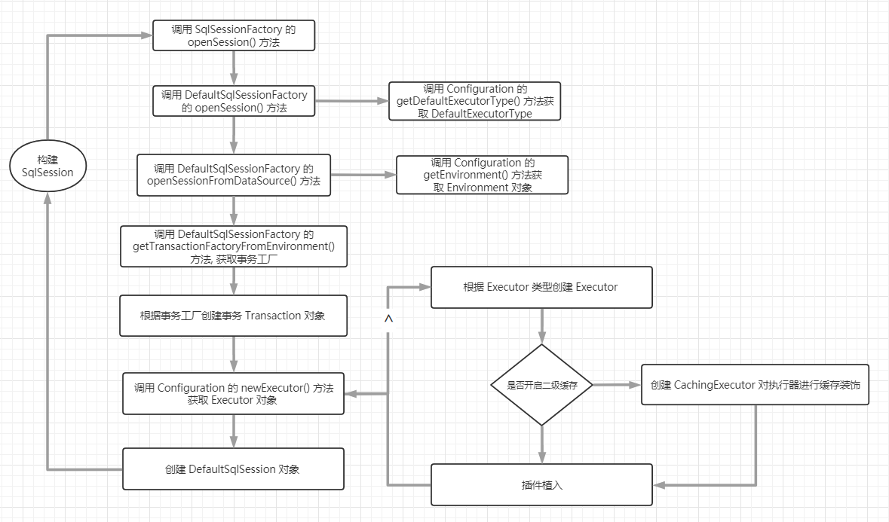


## 获取UserMapper接口的代理对象 

前面已经从 mybatis配置文件中解析并获取到 SqlSession 对象，下面我们来分析获取 UserMapper 接口的代理对象 。

```java
UserMapper userMapper = sqlSession.getMapper(UserMapper.class);
```

这里的 sqlSession 使用的是默认实现类 DefaultSqlSessionFactory。

直接进入到 DefaultSqlSessionFactory 类中的 getMapper() 方法 。

```java
private final Configuration configuration;
public <T> T getMapper(Class<T> type) {
     return this.configuration.getMapper(type, this);
}
```

<br/>

由此产生三个疑问 ：

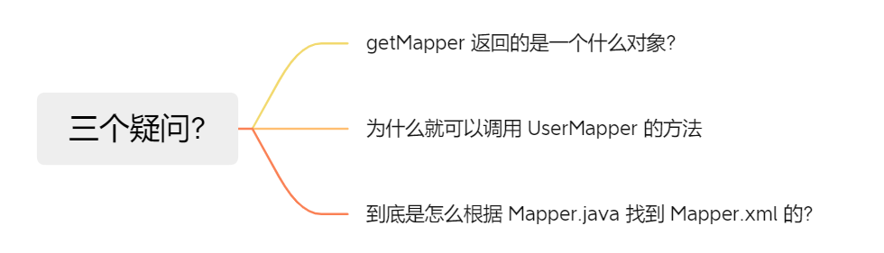

### 问题一 ：getMapper() 返回的是一个什么对象 

上面可以看出 getMapper() 方法调用的是 Configuration 中的 getMapper() 方法，进入 Configuration 中 

```java
protected final MapperRegistry mapperRegistry;
public Configuration() {
	this.mapperRegistry = new MapperRegistry(this);
}
public <T> T getMapper(Class<T> type, SqlSession sqlSession) {
     return this.mapperRegistry.getMapper(type, sqlSession);
}
```

继续调用 MapperRegistry 中的 getMapper() 方法 ：

```java
public class MapperRegistry {
    // 存放的是配置信息 
    private final Configuration config;
    // MapperRegistry 的映射 
    private final Map<Class<?>, MapperProxyFactory<?>> knownMappers = new HashMap();

    // 获得 Mapper Proxy 对象 
    // type=UserMapper.java, session 为当前会员 
    public <T> T getMapper(Class<T> type, SqlSession sqlSession) {
        // 从 MapperProxyFactory 的映射中获取到 UserMapper 的mapper代理工厂
        MapperProxyFactory<T> mapperProxyFactory = (MapperProxyFactory)this.knownMappers.get(type);
        if (mapperProxyFactory == null) {
            throw new BindingException("Type " + type + " is not known to the MapperRegistry.");
        } else {
            try {
                // 创建实例 
                return mapperProxyFactory.newInstance(sqlSession);
            } catch (Exception var5) {
                throw new BindingException("Error getting mapper instance. Cause: " + var5, var5);
            }
        }
    }
}

// 解析xml配置文件的时候就会调用这个方法 。
// type=UserMapper.java
public <T> void addMapper(Class<T> type) {
     // 判断 type 必须是接口, 即 Mapper 接口
     if (type.isInterface()) {
          // 如果存在(已经添加过), 抛出 BindingException 异常 。
          if (this.hasMapper(type)) {
               throw new BindingException("Type " + type + " is already known to the MapperRegistry.");
          }

          boolean loadCompleted = false;

          try {
               // 添加到 knownMappers 中 （MapperProxyFactory 映射）
               this.knownMappers.put(type, new MapperProxyFactory(type));
               // 创建 MapperAnnotationBuilder 对象, 解析 mapper 的注解配置
               MapperAnnotationBuilder parser = new MapperAnnotationBuilder(this.config, type);
               parser.parse();
               // 标记加载完成
               loadCompleted = true;
          } finally {
               // 若加载未完成, 从 knownMappers 中移除 
               if (!loadCompleted) {
                    this.knownMappers.remove(type);
               }

          }
     }

}
```

MapperProxyFactory 对象保存了 mapper 接口的 class对象。

在这个类里可以理解为使用了单例模式methodCache(注册式单例模式)，和工厂模式 getMapper()。

```java
public class MapperProxyFactory<T> {
    private final Class<T> mapperInterface;
    private final Map<Method, MapperMethod> methodCache = new ConcurrentHashMap();

    public MapperProxyFactory(Class<T> mapperInterface) {
        this.mapperInterface = mapperInterface;
    }

    public Class<T> getMapperInterface() {
        return this.mapperInterface;
    }

    public Map<Method, MapperMethod> getMethodCache() {
        return this.methodCache;
    }

    // 以JDK动态代理创建的对象返回 
    protected T newInstance(MapperProxy<T> mapperProxy) {
        return Proxy.newProxyInstance(this.mapperInterface.getClassLoader(), new Class[]{this.mapperInterface}, mapperProxy);
    }

    // 创建 MapperProxy 对象 
    public T newInstance(SqlSession sqlSession) {
        MapperProxy<T> mapperProxy = new MapperProxy(sqlSession, this.mapperInterface, this.methodCache);
        return this.newInstance(mapperProxy);
    }
}
```

继续看着行重点代码 

```java
return mapperProxyFactory.newInstance(sqlSession);
```

newInstance() 方法底层依然是基于 JDK Proxy 实现 ，而 InvocationHandler 参数是 MapperProxy 对象

```java
/**
* UserMapper 是类加载器
* 接口是 Usermapper
* h 的 mapperProxy 对象
*/
public static Object newProxyInstance(ClassLoader loader,
                                      Class<?>[] interfaces,
                                      InvocationHandler h)
     throws IllegalArgumentException
{
```


### 问题2 ：为什么就可以调用到Mapper的方法 ？

上面调用 newProxyInstance() 方法的时候创建了 MapperProxy 对象，并且是当作 newProxyInstance() 方法的第三个参数传递，所以 MapperProxy 类肯定实现了 InvocationHandler 接口 。

进入 MapperProxy 类 ：

果不其然实现了 InvocationHandler 接口 。

```java
public class MapperProxy<T> implements InvocationHandler, Serializable {
    private static final long serialVersionUID = -6424540398559729838L;
    private final SqlSession sqlSession;
    private final Class<T> mapperInterface;
    private final Map<Method, MapperMethod> methodCache;

    public MapperProxy(SqlSession sqlSession, Class<T> mapperInterface, Map<Method, MapperMethod> methodCache) {
        this.sqlSession = sqlSession;
        this.mapperInterface = mapperInterface;
        this.methodCache = methodCache;
    }

    // 调用 userMapper.selectById() 实质上是调用的这个 invoke() 方法  
    public Object invoke(Object proxy, Method method, Object[] args) throws Throwable {
        try {
            // 如果是 Objects 的方法 toString()、hashCode()等方法  
            if (Object.class.equals(method.getDeclaringClass())) {
                return method.invoke(this, args);
            }
            // JDK8以后的接口默认实现方法  
            if (this.isDefaultMethod(method)) {
                return this.invokeDefaultMethod(proxy, method, args);
            }
        } catch (Throwable var5) {
            throw ExceptionUtil.unwrapThrowable(var5);
        }

        // 创建 MapperMethod对象 
        MapperMethod mapperMethod = this.cachedMapperMethod(method);
        return mapperMethod.execute(this.sqlSession, args);
    }
}
```

> *getDeclaringClass*() 方法用于获取此类的声明类。如果该类或接口是另一个类的成员,则该方法返回此类的声明类

也就是说，getMapper() 方法返回的是一个 JDK 动态代理对象（类型是 $Proxy+数字）。这个代理对象会继承 Proxy 类，实现被代理的接口UserMapper，内部持有一个 MapperProxy 类型的触发管理类 。

当我们调用UserMapperr 的方法时候，实质上调用的是 MapperProxy 的 invoke() 方法 。


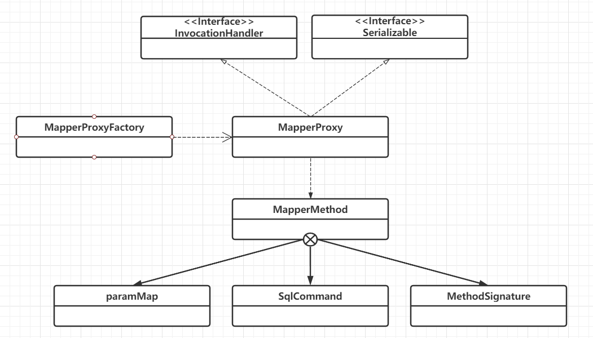

> 在  UML 类图中，空心三角线+虚线表示实现关系，类与接口之间的关系 。
>
> 虚线箭头表示 依赖关系 。

<br/>

现在我们来回答前面的问题 ：

<br/>

为什么要在 MapperRegistry 类中保存一个工厂类，原因是它用来创建并返回代理类。这里的代理模式是一个非常经典的应用 。

MapperProxy 如何实现对接口的代理 ？

我们知道，JDK 动态代理有三个核心角色 ：

- 被代理类 （就是实现类）
- 接口
- 实现了 InvocationHandler 接口的触发管理类，用来生成代理对象 。

被代理类必须实现接口，因为要通过接口获取方法，而且代理类也要实现这个接口 

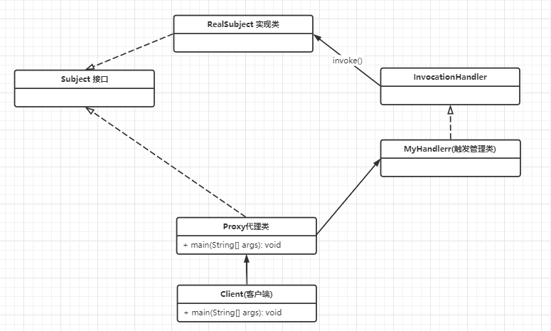

但是 MyBatis 并没有 Mapper 接口的实现类，怎么被代理呢？

因为它忽略了实现类，直接对 Mapper 接口进行代理 。

MyBatis 动态代理 ：

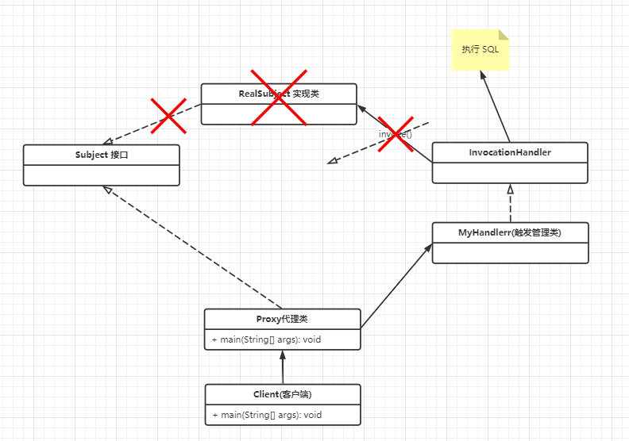

在 MyBatis 中，JDK 动态代理为什么不需要实现类呢 ？

这里其实就是根据一个可以执行的方法，直接找到 Mapper.xml 中 statementId，方便调用 。

最后返回的 userMapper对象就是 MapperProxyFactory 创建的代理对象 。然后这个对象包含了 MapperProxy 对象 。


### 问题三：怎么根据 Mapper.java 找到 Mapper.xml的 ？

最后我们调用的 `userMapper.selectUserById()` ，本质上调用的是 MapperProxy的 invoke() 方法 。

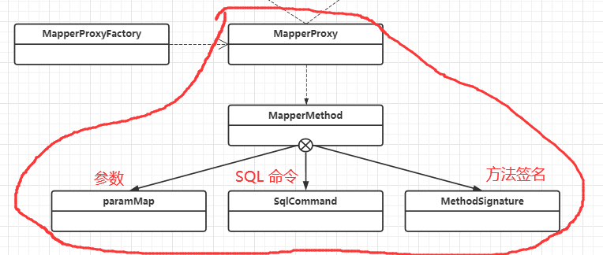

如何根据 接口+方法名 找到 StatementId ，这个逻辑在 InvocationHandler 的子类 ( MapperProxy 类 ) 中就可以完成了，其实也就没有必要在用实现类了 。

自此上面三个问题已经全部解决 。


### 整个流程 

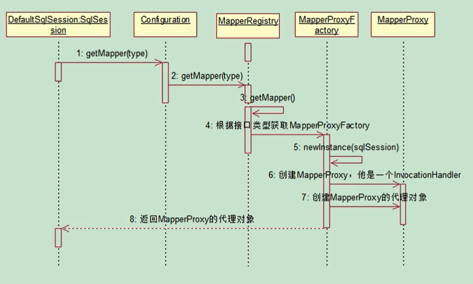

到这步为止，我们已经拿到了 UserMapper 接口的代理对象 。接下来我们就去调用这个代理对象的方法 。


## UserMapper中的方法和 SQL 关联 

```java
User user = userMapper.selectById(1));
```

通过前面的分析，我们已经知道 UserMapper 对象 是通过代理生成的代理对象。所以调用这个代理对象的任意方法都是执行触发器类 MapperProxy 的  invoke () 方法 。

分为两部分 ：

- 1、MapperProxy.invoke() 到 Executor.query() 方法和 SQL 关联 
- 2、Executor.query() 到 JDBC 的 SQL 执行 。

### 第一部分 

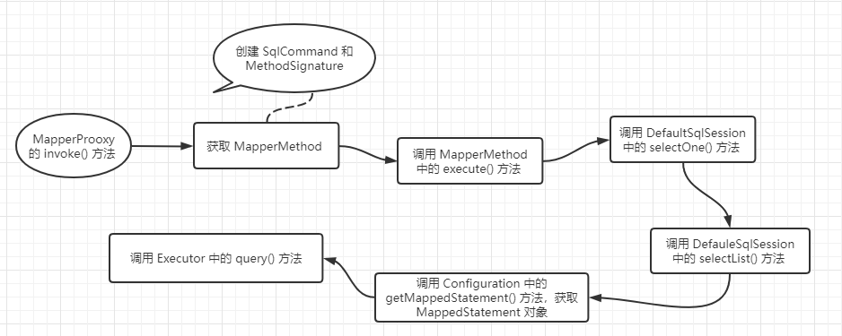

#### MapperProxy.invoke()

先来看 MapperProxy 的 invoke() 方法有什么逻辑 

```java
public class MapperProxy<T> implements InvocationHandler, Serializable {
	public Object invoke(Object proxy, Method method, Object[] args) throws Throwable {
        // 这里是一个很标准的JDK动态代理
        // 执行的时候会调用invoke()方法
        try {
            // 判断方法所属的类.是不是调用的Object默认的方法
            // 如果是,则不代理,不改变原先方法的行为 
            if (Object.class.equals(method.getDeclaringClass())) {
                return method.invoke(this, args);
            }

            /**
            对于默认方法的处理
            判断是否为default方法,即接口中定义的默认方法.
            如果是接口中的默认方法则把方法绑定到代理对象中然后调用
            ......
            */ 
            if (this.isDefaultMethod(method)) {
                return this.invokeDefaultMethod(proxy, method, args);
            }
        } catch (Throwable var5) {
            throw ExceptionUtil.unwrapThrowable(var5);
        }

        // 如果不是默认方法,则真正执行MyBatis代理逻辑
        // 获取MapperMethod代理对象  
        MapperMethod mapperMethod = this.cachedMapperMethod(method);
        // 执行   
        return mapperMethod.execute(this.sqlSession, args);
    }
}
```

从缓存获取 MapperMethod ，这里加入了缓存主要是为了提升 MapperMethod 的获取速度。这个设计非常的有意思，缓存的使用在 MyBatis 中也是非常之多 。

```java
private final Map<Method, MapperMethod> methodCache;
private MapperMethod cachedMapperMethod(Method method) {
     MapperMethod mapperMethod = (MapperMethod)this.methodCache.get(method);
     if (mapperMethod == null) {
          mapperMethod = new MapperMethod(this.mapperInterface, method, this.sqlSession.getConfiguration());
          this.methodCache.put(method, mapperMethod);
     }

     return mapperMethod;
}
```

动态代理会有缓存,如果缓存中有则直接从缓存中拿，如果缓存中没有则创建一个然后放入缓存中，因为动态代理是很耗资源的 。

<br/>

```java

/** 这个方法内部首先会判断SQL的类型.SELECT|DELETE|UPDATE|INSERT，用select举例,判断SQL类型为SELECT之后,就开始判断返回值类型,根据不同的情况做不同的操作,然后开始获取参数 -> 执行SQL */
// MapperMethod.class
// executr()这里是真正执行SQL的地方
public Object execute(SqlSession sqlSession, Object[] args) {
    Object result;
    // 判断是哪一个SQL语句
    switch (command.getType()) {
      case INSERT: {
      Object param = method.convertArgsToSqlCommandParam(args);
        result = rowCountResult(sqlSession.insert(command.getName(), param));
        break;
      }
      case UPDATE: {
        Object param = method.convertArgsToSqlCommandParam(args);
        result = rowCountResult(sqlSession.update(command.getName(), param));
        break;
      }
      case DELETE: {
        Object param = method.convertArgsToSqlCommandParam(args);
        result = rowCountResult(sqlSession.delete(command.getName(), param));
        break;
      }
        // 🌰栗子为SELECT
      case SELECT:
            // 判断是否有返回值
        if (method.returnsVoid() && method.hasResultHandler()) {
            // 无返回值
          executeWithResultHandler(sqlSession, args);
          result = null;
        } else if (method.returnsMany()) {
            // 返回值多行(多参数),这里调用这个方法
          result = executeForMany(sqlSession, args); 🏀
        } else if (method.returnsMap()) {
            // 返回Map
          result = executeForMap(sqlSession, args);
        } else if (method.returnsCursor()) {
            // 返回Cursor
          result = executeForCursor(sqlSession, args);
        } else {
          Object param = method.convertArgsToSqlCommandParam(args);
          result = sqlSession.selectOne(command.getName(), param);
        }
        break;
      case FLUSH:
        result = sqlSession.flushStatements();
        break;
      default:
        throw new BindingException("Unknown execution method for: " + command.getName());
    }
    if (result == null && method.getReturnType().isPrimitive() && !method.returnsVoid()) {
      throw new BindingException("Mapper method '" + command.getName() 
          + " attempted to return null from a method with a primitive return type (" + method.getReturnType() + ").");
    }
    return result;
  }
```

<br/>

继续看 MapperMethod 这个类 ，它定义了两个属性 command 和 method，以及两个静态内部类 。

```java
public class MapperMethod {
    private final MapperMethod.SqlCommand command;
    private final MapperMethod.MethodSignature method;
     
     public static class SqlCommand {
        private final String name;
        private final SqlCommandType type;

        public SqlCommand(Configuration configuration, Class<?> mapperInterface, Method method) {
             String methodName = method.getName();
             Class<?> declaringClass = method.getDeclaringClass();
             // 获取 MappedStatement 对象 
             MappedStatement ms = this.resolveMappedStatement(mapperInterface, methodName, declaringClass, configuration);
             // 如果 MappedStatement 对象为空
             if (ms == null) {
                  if (method.getAnnotation(Flush.class) == null) {
                       // 抛出 BindingException 异常, 找不到 MappedStatement, 说明该方法上, 没有对应的 SQL 生命 .
                       throw new BindingException("Invalid bound statement (not found): " + mapperInterface.getName() + "." + methodName);
                  }
                  // 如果有 @Flush 注解, 则标记为 Flush 类型 
                  this.name = null;
                  this.type = SqlCommandType.FLUSH;
             // 找到了 MappedStatement      
             } else {
                  // id=com.tian.mybatis.mapper.UserMapper.selectById
                  this.name = ms.getId();
                  // type=SELECT
                  this.type = ms.getSqlCommandType();
                  if (this.type == SqlCommandType.UNKNOWN) {
                       throw new BindingException("Unknown execution method for: " + this.name);
                  }
             }

          }

          public String getName() {
               return this.name;
          }

          public SqlCommandType getType() {
               return this.type;
          }

          private MappedStatement resolveMappedStatement(Class<?> mapperInterface, String methodName, Class<?> declaringClass, Configuration configuration) {
               // 获得编号, com.tian.mybatis.mapper.UserMapper.selectById
               String statementId = mapperInterface.getName() + "." + methodName;
               // 如果配置类中存在 该编号
               if (configuration.hasStatement(statementId)) {
                    // (MappedStatement)this.mappedStatements.get(id);
                    // 前面解析配置文件的时候创建并保存的 Map<String, MappedStatement> mappedStatements
                    return configuration.getMappedStatement(statementId);
               } else if (mapperInterface.equals(declaringClass)) {
                    return null;
               } else {
                    Class[] var6 = mapperInterface.getInterfaces();
                    int var7 = var6.length;
                    // 遍历父接口, 继续获得 MappedStatment 对象
                    for(int var8 = 0; var8 < var7; ++var8) {
                         Class<?> superInterface = var6[var8];
                         if (declaringClass.isAssignableFrom(superInterface)) {
                              MappedStatement ms = this.resolveMappedStatement(superInterface, methodName, declaringClass, configuration);
                              if (ms != null) {
                                   return ms;
                              }
                         }
                    }
				// 找不到, 返回 null
                    return null;
               }
          }
     }
}
public static class MethodSignature {
    private final boolean returnsMap;
    private final Class<?> returnType;
    private final Integer rowBoundsIndex;
    //....
}
```


SqlCommand 封装了 statementId ，比如说 ：

```java
com.tian.mybatis.mapper.UserMapper.selectById
```

和 SQL 类型 

```java
public enum SqlCommandType {
    UNKNOWN,
    INSERT,
    UPDATE,
    DELETE,
    SELECT,
    FLUSH;

    private SqlCommandType() {
    }
}
```

另外还有个属性 MethodSignature，主要封装的是返回值的类型和方法入参。

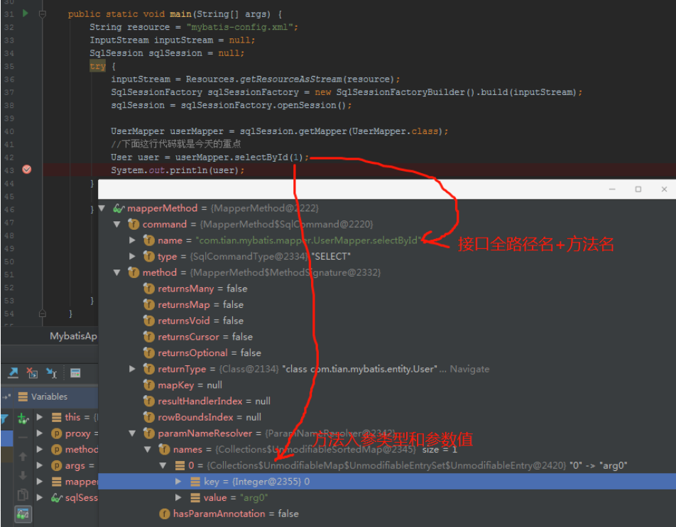

<br/>

#### **MapperMethod.execute()** 

先来看看 `execute()` 方法的整体逻辑

```java

// MapperMethod.class
// executr()这里是真正执行SQL的地方
public Object execute(SqlSession sqlSession, Object[] args) {
    Object result;
    // 判断是哪一个SQL语句
    switch (command.getType()) {
      case INSERT: {
      Object param = method.convertArgsToSqlCommandParam(args);
        result = rowCountResult(sqlSession.insert(command.getName(), param));
        break;
      }
      case UPDATE: {
        Object param = method.convertArgsToSqlCommandParam(args);
        result = rowCountResult(sqlSession.update(command.getName(), param));
        break;
      }
      case DELETE: {
        Object param = method.convertArgsToSqlCommandParam(args);
        result = rowCountResult(sqlSession.delete(command.getName(), param));
        break;
      }
        // 🌰栗子为SELECT
      case SELECT:
            // 判断是否有返回值
        if (method.returnsVoid() && method.hasResultHandler()) {
            // 无返回值
          executeWithResultHandler(sqlSession, args);
          result = null;
        } else if (method.returnsMany()) {
            // 返回值多行(多参数),这里调用这个方法
          result = executeForMany(sqlSession, args); 🏀
        } else if (method.returnsMap()) {
            // 返回Map
          result = executeForMap(sqlSession, args);
        } else if (method.returnsCursor()) {
            // 返回Cursor
          result = executeForCursor(sqlSession, args);
        } else {
          Object param = method.convertArgsToSqlCommandParam(args);
          result = sqlSession.selectOne(command.getName(), param);
        }
        break;
      case FLUSH:
        result = sqlSession.flushStatements();
        break;
      default:
        throw new BindingException("Unknown execution method for: " + command.getName());
    }
    if (result == null && method.getReturnType().isPrimitive() && !method.returnsVoid()) {
      throw new BindingException("Mapper method '" + command.getName() 
          + " attempted to return null from a method with a primitive return type (" + method.getReturnType() + ").");
    }
    return result;
  }
```

这个方法中，根据上面获取的不同 type (SELECT|DELETE|UPDATE|INSERT) 和 返回类型 

1、调用 convertArgsToSqlCommandParam() 方法将方法参数转换为 SQL 参数，

2、调用 sqlSession的 insert()、update()、dalete()、selectOne()。本案例是查询，所以调用的是 DefaultSqlSession 中的 selectOne() 方法 。

<br/>

#### **sqlSession.selectOne() 方法** 

```java
// DefaultSqlSession.java
public <T> T selectOne(String statement, Object parameter) {
     List<T> list = this.selectList(statement, parameter);
     if (list.size() == 1) {
          // 如果只有一套数据就返回第一条 
          return list.get(0);
     } else if (list.size() > 1) {
          // 常见错误, 方法定义的是返回一条数据《 结果集查出有多条数据, 就会报这个错误 。
          throw new TooManyResultsException("Expected one result (or null) to be returned by selectOne(), but found: " + list.size());
     } else {
          // 数据库中没有查到数据返回 null
          return null;
     }
}
```

调用的是 `selectList()` 方法 

```java
public <E> List<E> selectList(String statement, Object parameter) {
     return this.selectList(statement, parameter, RowBounds.DEFAULT);
}
public <E> List<E> selectList(String statement, Object parameter, RowBounds rowBounds) {
     List var5;
     try {
          // 解析XML时生成的对象,解析某一个SQL,会封装成MappedStatement,里面存放了所有执行SQL所需要的信息
          // 从 configuration 对象中获取 MappedStatement 对象 . 
          // 此时的 statement=com.tian.mybatis.mapper.UserMapper.selectById
          MappedStatement ms = this.configuration.getMappedStatement(statement);
          // 执行执行器中的 query() 方法查询 .
          var5 = this.executor.query(ms, this.wrapCollection(parameter), rowBounds, Executor.NO_RESULT_HANDLER);
     } catch (Exception var9) {
          throw ExceptionFactory.wrapException("Error querying database.  Cause: " + var9, var9);
     } finally {
          ErrorContext.instance().reset();
     }

     return var5;
}
```

> 在这里又出现了MappedStatement,通过前文我们了解到MappedStatement对象时解析Mapper.xml配置文件而产生的,用于存储SQL信息,执行SQL需要这个对象保存的关于SQL的信息,而selectList()方法内部调用了Executor对象执行SQL语句,这个Executor对象作为MyBtais四大对象之一. executor.query()

 在这个方法里是根据 statement 从 configuration 对象中获取 MappedStatement 对象 。

```java
MappedStatement ms = this.configuration.getMappedStatement(statement);
```

```java
// key是statement=com.tian.mybatis.mapper.UserMapper.selectById，value是MappedStatement
protected final Map<String, MappedStatement> mappedStatements = new Configuration.StrictMap("Mapped Statements collection");
public MappedStatement getMappedStatement(String id) {
     return this.getMappedStatement(id, true);
}
public MappedStatement getMappedStatement(String id, boolean validateIncompleteStatements) {
     if (validateIncompleteStatements) {
          this.buildAllStatements();
     }

     return (MappedStatement)this.mappedStatements.get(id);
}
```

而 MappedStatement 里面有 xml 中增删改查标签配置的所有属性，包括 id、statamentType、sqlSource、入参、返回值等 


现在，UserMapper类中的方法已经和 userMapper.xml 中的 sql 关联起来了 。

```java
var5 = this.executor.query(ms, this.wrapCollection(parameter), rowBounds, Executor.NO_RESULT_HANDLER);
```

这里执行的是 执行器 Executor 中的 query() 方法 。

<br/>

### 第二部分 

#### **Executor.query()** 

这里的 Executor 对象是在调用 openSession() 方法的时候创建的 。

调用执行器的 query() 方法的整个流程 

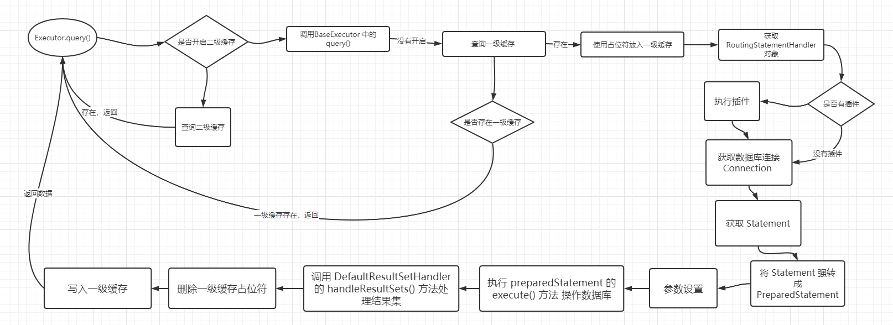

<br/>

#### **CachingExecutor.query()** 

```java
public <E> List<E> query(MappedStatement ms, Object parameterObject, RowBounds rowBounds, ResultHandler resultHandler) throws SQLException {
     BoundSql boundSql = ms.getBoundSql(parameterObject);
     CacheKey key = this.createCacheKey(ms, parameterObject, rowBounds, boundSql);
     return this.query(ms, parameterObject, rowBounds, resultHandler, key, boundSql);
}
```

BoundSql 中主要是 SQL 和 参数 ：

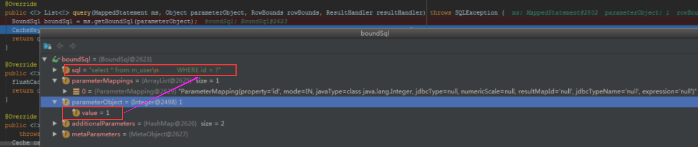

既然是缓存，那么肯定想到 key-value 数据结构。Map

来看看这个 key 的生成规则 ：

这个二级缓存是怎么构成的呢？并且还要保证在查询的时候必须是唯一的 。

```java
// CachingExecutor.java
CacheKey key = this.createCacheKey(ms, parameterObject, rowBounds, boundSql);
public CacheKey createCacheKey(MappedStatement ms, Object parameterObject, RowBounds rowBounds, BoundSql boundSql) {
     return this.delegate.createCacheKey(ms, parameterObject, rowBounds, boundSql);
}
```


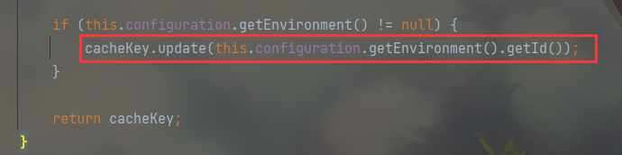

如此，构成 key 主要有 方法相同、翻页偏移量相同、SQL相同、参数相同、数据源环境相同才会被认为是同一个查询 。

如果要更深入一点，就得把下面这张图的参数扯进来 。


#### 处理二级缓存

> 首先 MyBatis 在查询时，不会直接查询数据库，而是会先进行二级缓存的查询，二级缓存的作用域是 namespace ，也可以理解为一个 mapper ，所以会判断一下这个 mapper 是否开启了二级缓存 ，如果没有开启，则进行一级缓存继续查询 。

首先是从 MappedStatement 对象中取出 cache 对象，判断 cache 对象是否为 null，如果为 null，则没有查询二级缓存和写入二级缓存的流程操作 。

```java
// CachingExecutor.java
public <E> List<E> query(MappedStatement ms, Object parameterObject, RowBounds rowBounds, ResultHandler resultHandler) throws SQLException {
     BoundSql boundSql = ms.getBoundSql(parameterObject);
     CacheKey key = this.createCacheKey(ms, parameterObject, rowBounds, boundSql);
     return this.query(ms, parameterObject, rowBounds, resultHandler, key, boundSql);
}

public <E> List<E> query(MappedStatement ms, Object parameterObject, RowBounds rowBounds, ResultHandler resultHandler, CacheKey key, BoundSql boundSql) throws SQLException {
     Cache cache = ms.getCache();
     // 判断是否有二级缓存
     if (cache != null) {
          this.flushCacheIfRequired(ms);
          if (ms.isUseCache() && resultHandler == null) {
               this.ensureNoOutParams(ms, boundSql);
               List<E> list = (List)this.tcm.getObject(cache, key);
               if (list == null) {
                    list = this.delegate.query(ms, parameterObject, rowBounds, resultHandler, key, boundSql);
                    this.tcm.putObject(cache, key, list);
               }

               return list;
          }
     }

     return this.delegate.query(ms, parameterObject, rowBounds, resultHandler, key, boundSql);
}
```

那么这个 Cache 对象是什么时候创建的呢 ？

配置项 ：mybatis-config.xml

```xml
<configuration>
 <settings>
  <setting name="cacheEnabled" value="true|false" />
 </settings>
</configuration>
```

cacheEnabled = true 表示二级缓存可用，但是要开启的话，还需要再 Mapper.xml 内配置 。

```xml
<cache eviction="FIFO" flushInterval="60000" size="512" readOnly="true"/>
<!--或者-->
<cache/>
```

属性项属性说明 ：

- `flushInterval="60000"` ：间隔 60 秒清空缓存，这个间隔 60 秒，是被动触发的，而不是定时器轮询的 。
- `size="512"` ：表示队列最大 512 个长度，超过这个长度则移除队列最前面的元素，这里的长度指的是 CacheKey 的个数，默认为 1024 。
- `readOnly="true"` ：表示任何获取对象的操作，都将返回同一实例对象。如果 `readOnly="false"` ：则每次返回该对象的拷贝对象 ，换言之就是序列化赋值一份返回 。
- `eviction="FIFO"` ：缓存会使用默认的 Least Recently Used (LRU，最少使用的) 算法来回收。`FIFO` ：First In First Out 先进先出队列 。

<br/>

在解析 Mapper.xml 的 XMLMapperBuilder 类中的 cacheElement() 方法中 ：

```java
public void parse() {
     if (!this.configuration.isResourceLoaded(this.resource)) {
          this.configurationElement(this.parser.evalNode("/mapper"));
          this.configuration.addLoadedResource(this.resource);
          this.bindMapperForNamespace();
     }

     this.parsePendingResultMaps();
     this.parsePendingCacheRefs();
     this.parsePendingStatements();
}

private void configurationElement(XNode context) {
     try {
          String namespace = context.getStringAttribute("namespace");
          if (namespace != null && !namespace.equals("")) {
               this.builderAssistant.setCurrentNamespace(namespace);
               this.cacheRefElement(context.evalNode("cache-ref"));
               this.cacheElement(context.evalNode("cache"));
               this.parameterMapElement(context.evalNodes("/mapper/parameterMap"));
               this.resultMapElements(context.evalNodes("/mapper/resultMap"));
               this.sqlElement(context.evalNodes("/mapper/sql"));
               this.buildStatementFromContext(context.evalNodes("select|insert|update|delete"));
          } else {
               throw new BuilderException("Mapper's namespace cannot be empty");
          }
     } catch (Exception var3) {
          throw new BuilderException("Error parsing Mapper XML. The XML location is '" + this.resource + "'. Cause: " + var3, var3);
     }
}
// 解析二级缓存中的标签 
private void cacheElement(XNode context) throws Exception {
     if (context != null) {
          String type = context.getStringAttribute("type", "PERPETUAL");
          Class<? extends Cache> typeClass = this.typeAliasRegistry.resolveAlias(type);
          String eviction = context.getStringAttribute("eviction", "LRU");
          Class<? extends Cache> evictionClass = this.typeAliasRegistry.resolveAlias(eviction);
          Long flushInterval = context.getLongAttribute("flushInterval");
          Integer size = context.getIntAttribute("size");
          boolean readWrite = !context.getBooleanAttribute("readOnly", false);
          boolean blocking = context.getBooleanAttribute("blocking", false);
          Properties props = context.getChildrenAsProperties();
          this.builderAssistant.useNewCache(typeClass, evictionClass, flushInterval, size, readWrite, blocking, props);
     }

}

// 创建 Cache 对象 (MapperBuilderAssistant.java)
public Cache useNewCache(Class<? extends Cache> typeClass, Class<? extends Cache> evictionClass, Long flushInterval, Integer size, boolean readWrite, boolean blocking, Properties props) {
     Cache cache = (new CacheBuilder(this.currentNamespace)).
          implementation((Class)this.valueOrDefault(typeClass, PerpetualCache.class)).
          addDecorator((Class)this.valueOrDefault(evictionClass, LruCache.class)).
          clearInterval(flushInterval).
          size(size).
          readWrite(readWrite).
          blocking(blocking).
          properties(props).
          build();
     this.configuration.addCache(cache);
     this.currentCache = cache;
     return cache;
}
```

二级缓存处理完了，咱们来到 BaseExecutor 类的 query() 方法中 。

<br/>


#### BaseExecutor.query() 

> query(MappedStatement ms, Object parameter, RowBounds rowBounds, ResultHandler resultHandler, CacheKey key, BoundSql boundSql) throws SQLException

第一步，清空缓存 

```java
if (this.queryStack == 0 && ms.isFlushCacheRequired()) {
     this.clearLocalCache();
}
```

queryStack 用于记录查询栈，防止递归查询重复处理缓存 。

`flushCache=true` 的时候，会先清理本地缓存 （一级缓存）。

如果和缓存中没有数据会从数据库中查询 

```java
list = this.queryFromDatabase(ms, parameter, rowBounds, resultHandler, key, boundSql);
```

瞅瞅这个 `queryFromDatabase()`方法的逻辑 ：

```java
private <E> List<E> queryFromDatabase(MappedStatement ms, Object parameter, RowBounds rowBounds, ResultHandler resultHandler, CacheKey key, BoundSql boundSql) throws SQLException {
     // 使用占位符的方法，先抢占一级缓存。
     this.localCache.putObject(key, ExecutionPlaceholder.EXECUTION_PLACEHOLDER);

     List list;
     try {
          // 调用doQuery方法查询数据库
          list = this.doQuery(ms, parameter, rowBounds, resultHandler, boundSql);
     } finally {
          // 删除上面抢占的占位符 
          this.localCache.removeObject(key);
     }

     // 在缓存中put真实数据
     this.localCache.putObject(key, list);
     if (ms.getStatementType() == StatementType.CALLABLE) {
          this.localOutputParameterCache.putObject(key, parameter);
     }

     return list;
}
```

先在缓存使用占位符占位，然后查询，移除占位符，将数据放入一级缓存中 。

执行 Executor 的 doQuery() 方法，默认使用 SimpleExecutor  

```java
list = this.doQuery(ms, parameter, rowBounds, resultHandler, boundSql);
```

接下来瞅瞅 SimpleExecutor 中的 doQuery() 方法 。

<br/>

#### SimpleExecutor.doQuery()

```java
public <E> List<E> doQuery(MappedStatement ms, Object parameter, RowBounds rowBounds, ResultHandler resultHandler, BoundSql boundSql) throws SQLException {
     Statement stmt = null;

     List var9;
     try {
          // 获取到保存在Configuration中的mybatis-config.xml全局配置文件的信息
          Configuration configuration = ms.getConfiguration();
          // 封装,StatementHandler也是MyBatis四大对象之一 
          StatementHandler handler = configuration.newStatementHandler(this.wrapper, ms, parameter, rowBounds, resultHandler, boundSql);
          // #{} -> ? SQL语句占位符在这里初始化
          stmt = this.prepareStatement(handler, ms.getStatementLog());
          // 执行RoutingStatementHandler的query方法  
          var9 = handler.query(stmt, resultHandler);
     } finally {
          this.closeStatement(stmt);
     }

     return var9;
}
```

<br/>

##### 创建 StatementHandler

在 configuration 中 newStatementHandler() 方法中，创建了一个 StatementHandler ，先得到 RoutingStatementHandler （路由） 。

```java
public StatementHandler newStatementHandler(Executor executor, MappedStatement mappedStatement, Object parameterObject, RowBounds rowBounds, ResultHandler resultHandler, BoundSql boundSql) {
     StatementHandler statementHandler = new RoutingStatementHandler(executor, mappedStatement, parameterObject, rowBounds, resultHandler, boundSql);
     // 执行 Statementhandler 类型的插件
     StatementHandler statementHandler = (StatementHandler)this.interceptorChain.pluginAll(statementHandler);
     return statementHandler;
}
```

RoutingStatementHandler 创建的时候是用来创建基本的 Statementhandler 的。这里会根据 MapperStatement 里面的 statementType 属性 决定 StatementHandler 类型 。

```java
// RoutingStatementHandler.java
public RoutingStatementHandler(Executor executor, MappedStatement ms, Object parameter, RowBounds rowBounds, ResultHandler resultHandler, BoundSql boundSql) {
     switch(ms.getStatementType()) {
          case STATEMENT:
               this.delegate = new SimpleStatementHandler(executor, ms, parameter, rowBounds, resultHandler, boundSql);
               break;
          case PREPARED:
               this.delegate = new PreparedStatementHandler(executor, ms, parameter, rowBounds, resultHandler, boundSql);
               break;
          case CALLABLE:
               this.delegate = new CallableStatementHandler(executor, ms, parameter, rowBounds, resultHandler, boundSql);
               break;
          default:
               throw new ExecutorException("Unknown statement type: " + ms.getStatementType());
     }

}
```

默认是 PREPARED 。

StatementHandler 里面包含了处理参数的 ParameterHandler 和处理结果集的 Resulthandler 。

```java
protected BaseStatementHandler(Executor executor, MappedStatement mappedStatement, Object parameterObject, RowBounds rowBounds, ResultHandler resultHandler, BoundSql boundSql) {
     this.configuration = mappedStatement.getConfiguration();
     this.executor = executor;
     this.mappedStatement = mappedStatement;
     this.rowBounds = rowBounds;
     this.typeHandlerRegistry = this.configuration.getTypeHandlerRegistry();
     this.objectFactory = this.configuration.getObjectFactory();
     if (boundSql == null) {
          this.generateKeys(parameterObject);
          boundSql = mappedStatement.getBoundSql(parameterObject);
     }

     this.boundSql = boundSql;
     /*********************************************/
     this.parameterHandler = this.configuration.newParameterHandler(mappedStatement, parameterObject, boundSql);
     this.resultSetHandler = this.configuration.newResultSetHandler(executor, mappedStatement, rowBounds, this.parameterHandler, resultHandler, boundSql);
     /*********************************************/
}
```

上面说的这几个对象是被插件拦截的四大对象，所以在创建的时候都要用拦截器的方法进行包装 。

`interceptorChain.pluginAll()` 方法进行包装 。

```java
public ParameterHandler newParameterHandler(MappedStatement mappedStatement, Object parameterObject, BoundSql boundSql) {
     ParameterHandler parameterHandler = mappedStatement.getLang().createParameterHandler(mappedStatement, parameterObject, boundSql);
     parameterHandler = (ParameterHandler)this.interceptorChain.pluginAll(parameterHandler);  🚗🚗🚗
     return parameterHandler;
}

public ResultSetHandler newResultSetHandler(Executor executor, MappedStatement mappedStatement, RowBounds rowBounds, ParameterHandler parameterHandler, ResultHandler resultHandler, BoundSql boundSql) {
     ResultSetHandler resultSetHandler = new DefaultResultSetHandler(executor, mappedStatement, parameterHandler, resultHandler, boundSql, rowBounds);
     ResultSetHandler resultSetHandler = (ResultSetHandler)this.interceptorChain.pluginAll(resultSetHandler); 🚗🚗🚗
     return resultSetHandler;
}

public StatementHandler newStatementHandler(Executor executor, MappedStatement mappedStatement, Object parameterObject, RowBounds rowBounds, ResultHandler resultHandler, BoundSql boundSql) {
     StatementHandler statementHandler = new RoutingStatementHandler(executor, mappedStatement, parameterObject, rowBounds, resultHandler, boundSql);
     StatementHandler statementHandler = (StatementHandler)this.interceptorChain.pluginAll(statementHandler); 🚗🚗🚗
     return statementHandler;
}

public Executor newExecutor(Transaction transaction, ExecutorType executorType) {
     executorType = executorType == null ? this.defaultExecutorType : executorType;
     executorType = executorType == null ? ExecutorType.SIMPLE : executorType;
     Object executor;
     if (ExecutorType.BATCH == executorType) {
          executor = new BatchExecutor(this, transaction);
     } else if (ExecutorType.REUSE == executorType) {
          executor = new ReuseExecutor(this, transaction);
     } else {
          executor = new SimpleExecutor(this, transaction);
     }

     if (this.cacheEnabled) {
          executor = new CachingExecutor((Executor)executor);
     }

     Executor executor = (Executor)this.interceptorChain.pluginAll(executor); 🚗🚗🚗
     return executor;
}
```


### 创建 Statement

```java
public <E> List<E> doQuery(MappedStatement ms, Object parameter, RowBounds rowBounds, ResultHandler resultHandler, BoundSql boundSql) throws SQLException {
     Statement stmt = null;

     List var9;
     try {
          Configuration configuration = ms.getConfiguration();
          StatementHandler handler = configuration.newStatementHandler(this.wrapper, ms, parameter, rowBounds, resultHandler, boundSql);
          stmt = this.prepareStatement(handler, ms.getStatementLog()); 🎁🎁🎁🎁
          var9 = handler.query(stmt, resultHandler);
     } finally {
          this.closeStatement(stmt);
     }

     return var9;
}
```

创建对象后就会执行 RoutingStatementHandler 的 query() 方法 。

```java
public <E> List<E> query(Statement statement, ResultHandler resultHandler) throws SQLException {
     // 委派 RoutingStatementHandler 调用方法  (delegate=RoutingStatementHandler)
     return this.delegate.query(statement, resultHandler);
}
```

这里的设计很有意思，所有的处理都要使用 RoutingStatementHandler 来路由，全部通过委托的方式进行调用 。

然后执行到 PreparedStatementHandler 中的 query() 方法 。

```java
public <E> List<E> query(Statement statement, ResultHandler resultHandler) throws SQLException {
     PreparedStatement ps = (PreparedStatement)statement;
     // JDBC 的流程 。
     ps.execute();
     // 处理结果集，如果有插件代理 ResultHandler, 会先走到被拦截的业务逻辑中 。
     return this.resultSetHandler.handleResultSets(ps);
}
```

看到了 `ps.execute();` 表示已经到了熟悉的 JDBC 层面了，这时候 SQL 已经执行完毕。后面调用 DefaultResultSetHandler 类进行处理 。

到这里 ，SQL 语句执行完毕，并将结果结果集赋值并返回 。

<br/>

## 整个流程 

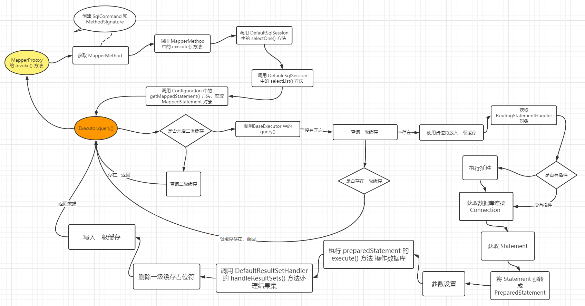

从 调用 UserMapper 的 selectById() 方法开始，到 JDBC 执行 SQL 的整个流程图 。

## 总结 

涉及到的涉及模式 ：单例模式 、建造者涉及吗、模板方法模式、代理模式 、装饰器模式。