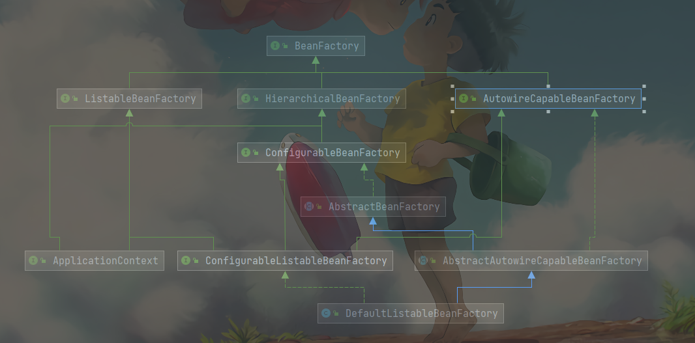

> 原文出处 ：https://javadoop.com/post/spring-ioc#toc_13

本文采用的源码版本是 4.3.11.RELEASE，但部分代码是直接拷贝的 5.x版本的源码

## 引言

先看下最基本的启动 Spring 容器的例子 ：

```java
public static void main(String[] args) {
    ApplicationContext context = new ClassPathXmlApplicationContext("classpath:applicationfile.xml");
}
```

以上代码就可以利用配置文件来启动一个 Spring 容器了。

如果是 maven 工程，加上以下依赖即可 ：spring 版本自定义

```pom
<dependency>
  <groupId>org.springframework</groupId>
  <artifactId>spring-context</artifactId>
  <version>4.3.11.RELEASE</version>
</dependency>
```

> spring-context 会自动将 spring-core、spring-beans、spring-aop、spring-expression 这几个基础 jar 包带进来。

<br/>

`ApplicationContext context = new ClassPathXmlApplicationContext(...)` 其实很好理解，从名字上就可以猜出一二，就是在 ClassPath

 中寻找 xml 配置问及那，根据 xml 文件内容来构建 ApplicationContext 。当然了，除了 ClassPathXmlApplicationContext 以外，我们也还有其他构建 ApplicationContext 的方案可供选择，我们先来看看大体的继承结构是怎么样的：


我们可以看到 ，ClassPathXmlApplicationContext  兜兜转转好久才到 ApplicationContext 接口，同样的，我们也可以使用绿色的  `FileSystemXmlApplicationContext` 和 `AnnotationConfigApplicationContext` 这两个类 。

1、FileSystemXmlApplicationContext 的构造函数需要一个 xml 配置文件在系统中的路径 ，比如 "C://xxx/xxx/application.xml" 。和 ClassPathXmlApplicationContext 基本上一样 。

2、AnnotationConfigApplicationContext 是基于注解来使用的，它不需要配置文件，采用 Java 配置类和各种注解来配置，是比较简单的方式，也是大势所趋吧 。

我们先来看一个简单的例子是怎么实例化 ApplicationContext 。

定义一个接口 ：

```java
public interface MessageService {
    String getMessage();
}
```

定义接口实现类 ：

```java
public class MessageServiceImpl implements MessageService {

    public String getMessage() {
        return "hello world";
    }
}
```

然后在 工程下 resources 目录新建一个配置文件，文件名随意，通常叫 application.xml 或 application-xxx.xml 就可以了：

```xml
<?xml version="1.0" encoding="UTF-8" ?>
<beans xmlns:xsi="http://www.w3.org/2001/XMLSchema-instance"
       xmlns="http://www.springframework.org/schema/beans"
       xsi:schemaLocation="http://www.springframework.org/schema/beans http://www.springframework.org/schema/beans/spring-beans.xsd" default-autowire="byName">

    <bean id="messageService" class="com.javadoop.example.MessageServiceImpl"/>
</beans>
```

这样，就可以跑起来了：

```java
public class App {
    public static void main(String[] args) {
        // 用我们的配置文件来启动一个 ApplicationContext
        ApplicationContext context = new ClassPathXmlApplicationContext("classpath:application.xml");

        System.out.println("context 启动成功");

        // 从 context 中取出我们的 Bean，而不是用 new MessageServiceImpl() 这种方式
        MessageService messageService = context.getBean(MessageService.class);
        // 这句将输出: hello world
        System.out.println(messageService.getMessage());
    }
}
```

由此引出本文的主题 ，怎=怎样通过配置文件来启动 Spring 的 ApplicationContext？这也是我们今天要分析的 IOC 的核心。ApplicationContext 启动过程中，会负责创建实例 Bean，往各个 Bean 中注入依赖等 。


## BeanFactory 简介

BeanFactory ，从名字上也很好理解，生产 bean 的工厂。它负责生产和管理各个 bean 实例 。

前面说的 ApplicationContext 其实就是一个 BeanFactory。我们来看一下 BeanFactory 接口相关的主要继承结构 ：


类图如下 ：



重点说明 ：

- ApplicationContext 继承了 ListableBeanFactory，这个 Listable 的意思就是，通过这个接口，我们可以获取多个 bean，大家阅读源码会发现，最顶层的 BeanFactory 接口的方法都是获取单个 Bean 的 。
- ApplicationContext 继承了 HierarchicalBeanFactory，Hierarchical单词本身已经能够说明问题了，也就是说我们可以在应用中起多个 BeanFactory ，然后可以将各个 BeanFactory 设置为 父子关系 。
- AutowireCapableBeanFactory 这个类名中的 Autowire 大家应该都非常的熟悉，它是用来自动装配 Bean 用的，但是仔细看上图，ApplicationContext 并没有继承它，不过不用担心，不使用继承，但不代表不可以使用组合。如果你看到 ApplicationContext 接口定义中的最后一个方法 getAutowireCapableBeanFactory()  就知道了 。
- ConfigurableListableBeanFactory 也是一个特殊的接口，看图，特殊之处在于它继承了第二层所有的三个接口，而 ApplicationContext 没有。这点之后会用到 。
- 请先不用花时间在其他的接口和类上，先理解我说的这几点就可以了 。

然后，请读者打开编辑器，翻一下 BeanFactory、ListableBeanFactory、HierarchicalBeanFactory、AutowireCapableBeanFactory、ApplicationContext 这几个接口的代码，大概看一下各个接口中的方法，大家心里要有底


## 启动过程分析

第一步 ，我们从 `ClassPathXmlApplicationContext` 的构造方法说起 。

```java
public class ClassPathXmlApplicationContext extends AbstractXmlApplicationContext {
    private Resource[] configResources;

    // 如果已经有 ApplicationContext 并需要配置成父子关系，那么调用这个构造方法 。 
    public ClassPathXmlApplicationContext(ApplicationContext parent) {
        super(parent);
    }

    public ClassPathXmlApplicationContext(String configLocation) throws BeansException {
        this(new String[]{configLocation}, true, (ApplicationContext)null);
    }
     public ClassPathXmlApplicationContext(String[] configLocations, boolean refresh, @Nullable ApplicationContext parent) throws BeansException {
          super(parent);
          // 根据提供的路径，处理成配置文件数组(以分号、逗号、空格、tab、换行符分割)
          this.setConfigLocations(configLocations);
          if (refresh) {
               // 核心方法 
               this.refresh();
          }

     }
}
```

接下来，就是 `refresh()` ，这里简单说一下为什么是 refresh()，而不是 init() 这种名字的方法 。因为 ApplicationContext 建立起来以后，其实我们是可以通过调用 refresh() 方法重建的，refresh() 会将原来的 ApplicationContext 销毁，然后再重新执行一次初始化操作 。

往下看，refresh() 方法调用了那么多方法，就知道肯定不简单。

```java
// AbstractApplicationContext.java
@Override
public void refresh() throws BeansException, IllegalStateException {
     // 来个锁, 不然 refresh() 方法还没执行完，你又来一个启动或销毁容器的操作，那不就乱套了嘛
     synchronized(this.startupShutdownMonitor) {
          
          // 准备工作，记录一下容器的启动时间，标记"已启动"状态，处理配置文件中的占位符
          this.prepareRefresh();
          
          /**
             这步比较关键，这步完成后，配置文件就会解析成一个个 Bean 定义，注册到 BeanFactory 中，
             当然，这里说的 Bean 还没有初始化，只是配置信息都提取出来了 。
             注册也只是将这些信息保存到了注册中心(说到底核心是一个 beanName-> beanDefinition 的 map)
          */
          ConfigurableListableBeanFactory beanFactory = this.obtainFreshBeanFactory();
          
          /**
             设置 BeanFactory 的来加载器，添加几个 BeanPostProcessor，手动注册的几个特殊的 bean
             这块待会会展开说
          */
          this.prepareBeanFactory(beanFactory);

          try {
               /**
                  【这里需要知道 BeanFactoryPostProcessor 这个知识点，Bean 如果实现了此接口，
                  那么在容器初始化以后，Spring 会负责调用里面的 postProcessBeanFactory() 方法。】
               */
               
               /**
                  这里是提供给子类的扩展点，到这里的时候，所有的 Bean 都加载、注册完成了，但是都还没有初始化
                  具体的子类可以在这步的时候添加一些特殊的 BeanFactoryPostProcessor 的实现类或做点什么事
               */
               this.postProcessBeanFactory(beanFactory);
               // 调用 BeanFactoryPostProcessor 各个实现类的 postProcessBeanFactory(factory) 方法
               this.invokeBeanFactoryPostProcessors(beanFactory);
               
               /**
                  注册 BeanPostProcessor 的实现类，注意看和 BeanFactoryPostProcessor 的区别
                  此接口的两个方法：postProcessBeforeInitialization 和 postProcessAfterInitialization
                  两个方法分别在 Bean 初始化之前和初始化之后得到执行。注意，到这里 Bean 还没初始化 。
               */
               this.registerBeanPostProcessors(beanFactory);
               
               // 初始化当前 ApplicationContext 的 MessageSource，国际化这里不展开说了，不然没完没了了。
               this.initMessageSource();
               
               // 初始化当前 ApplicationContext 的事件广播器，这里也不展开了
               this.initApplicationEventMulticaster();
               
               /**
                  从方法名就可以知道，典型的模板方法(钩子方法)，
                  具体的子类可以在这里初始化一些特殊的 Bean (在初始化 singleton beans 之前)
               */
               this.onRefresh();
               
               // 注册事件监听器，监听器需要实现 ApplicationListener 接口。这也不是我们的重点，过
               this.registerListeners();
               
               /**
                  重点,重点,重点,
                  初始化所有的 singleton benas
                  (lazy-init 的除外) (懒加载)
               */
               this.finishBeanFactoryInitialization(beanFactory);
               
               // 最后，广播事件，ApplicationContext 初始化完成 
               this.finishRefresh();
          } catch (BeansException var9) {
               if (this.logger.isWarnEnabled()) {
                    this.logger.warn("Exception encountered during context initialization - cancelling refresh attempt: " + var9);
               }

               // Destroy already created singletons to avoid dangling resources
               // 销毁已经初始化的 singleton 的 Beans，以免有些 bean 会一直占用资源
               this.destroyBeans();
               this.cancelRefresh(var9);
               
               // 异常往外抛
               throw var9;
          } finally {
               this.resetCommonCaches();
          }

     }
}
```

下面，我们开始一步步来深入这个 refresh() 方法 。

### 创建 Bean 容器前的准备工作

这个比较简单，直接看代码中的注释即可。

```java
protected void prepareRefresh() {
     /**
        记录启动事件，将 closed 属性设置为 false，active属性设置为 true，它们都是 AtomicBoolean 类型 
     */
     this.startupDate = System.currentTimeMillis();
     this.closed.set(false);
     this.active.set(true);
     if (this.logger.isDebugEnabled()) {
          if (this.logger.isTraceEnabled()) {
               this.logger.trace("Refreshing " + this);
          } else {
               this.logger.debug("Refreshing " + this.getDisplayName());
          }
     }

     // Initialize any placeholder property sources in the context environment (初始化上下文环境中的任何占位符属性源)
     this.initPropertySources();
     
     // 校验 xml 配置文件
     this.getEnvironment().validateRequiredProperties();
     this.earlyApplicationEvents = new LinkedHashSet();
}
```


### 创建 Bean 容器，加载并注册 Bean

我们回到 refresh() 方法中的下一行 this.obtainFreshBeanFactory();

注意，这个方法事全文最重要的部分之一，这里将会初始化 BeanFactory、加载 Bean、注册 Bean 等等 。

当然，这步结束后，Bean 并没有完成初始化，这里指的是 Bean 实例并未在这一步生成 。

```java
// AbstractApplicationContext.java
protected ConfigurableListableBeanFactory obtainFreshBeanFactory() {
   // 关闭旧的 BeanFactory (如果有)，创建新的 BeanFactory，加载 Bean 定义、注册 Bean 等等
   refreshBeanFactory();

   // 返回刚刚创建的 BeanFactory
   ConfigurableListableBeanFactory beanFactory = getBeanFactory();
   if (logger.isDebugEnabled()) {
      logger.debug("Bean factory for " + getDisplayName() + ": " + beanFactory);
   }
   return beanFactory;
}
```

AbstractRefreshableApplicationContext.java - 120

```java
protected final void refreshBeanFactory() throws BeansException {
     /**
        如果 ApplicationContext 中已经加载过 BeanFacotry，就销毁所有 Bean，关闭 BeanFactory
        注意，应用中 BeanFactory 本来就可以存在多个，这里可不是说应用全局是否有 BeanFactory ，而是当前
        ApplicationContext 是否有 BeanFactory 
     */
     if (this.hasBeanFactory()) {
          this.destroyBeans();
          this.closeBeanFactory();
     }

     try {
          // 初始化一个 DefaultListableBeanFactory，为什么用这个，我们马上说 。
          DefaultListableBeanFactory beanFactory = this.createBeanFactory();
          // 用于 BeanFactory 的序列化，我想部分人应该用不到。
          beanFactory.setSerializationId(this.getId());
          
          /**
             下面这两个方法很重要，别跟丢了，具体细节之后说
             设置 BeanFactory 的两个配置属性：是否允许 Bean 覆盖、是否允许循环引用
          */
          this.customizeBeanFactory(beanFactory);
          
          // 加载 Bean 到 BeanFactory 中
          this.loadBeanDefinitions(beanFactory);
          synchronized(this.beanFactoryMonitor) {
               this.beanFactory = beanFactory;
          }
     } catch (IOException var5) {
          throw new ApplicationContextException("I/O error parsing bean definition source for " + this.getDisplayName(), var5);
     }
}
```

看到这里的时候，我觉得读者就应站在高处看 ApplicationContext 了，ApplicationContext 继承自 BeanFactory，但是它不应该被理解为 BeanFactory 的实现类 ，而是说其内部持有一个实例化的 BeanFactory ( DefaultListableBeanFactory )。以后所有的 BeanFactory 相关的操作其实就是委托给这个实例来处理的 。

我们来说说为什么选择实例化 **DefaultListableBeanFactory** ？前面我们说了有个很重要的接口 ConfigurableListableBeanFactory，它实现了 BeanFactory 第二层的所有三个接口，我们重新过一遍继承图 ：


我们可以看到 ConfigurableListableBeanFactory 只有一个实现类 DefaultListableBeanFactory，而且实现类 DefaultListableBeanFactory 还通过实现右边的 AbstractAutowireCapableBeanFactory 通吃了右路，结论就是，最底下这个家伙 DefaultListableBeanFactory 基本数是最牛的 BeanFactory 了，这也是为什么这里会使用这个类来实例化的原因 。

> 如果你想要在程序运行的时候动态往 Spring IOC 容器注册新的 bean，就会使用到这个类。那我们怎么在运行时获得这个实例呢？
>
> 之前我们说过 ApplicationContext 接口能获取到 AutowireCapableBeanFactory，就是最右上角那个，然后它向下转型就能得到 DefaultListableBeanFactory 了。
>
> 那怎么拿到 ApplicationContext 实例呢？如果你不会，说明你没用过 Spring。

继续往下之前，我们需要先了解 BeanDefinition ，**我们说 BeanFactory 是 Bean 容器，那么 Bean 又是什么呢 ？**

这里的 BeanDefinition 就是我们所说的 Spring 的 Bean，我们自己定义的各个 Bean 其实会转换成一个个 BeanDefinition 存在于 Spring 的 BeanFactory 中 。

所以，如果有人问你 Bean 是什么的时候，你要知道 Bean 在代码层面上可以简单认为是 BeanDefinition 的实例 。

> BeanDefinition 中保存了我们的 Bean 信息，比如这个 Bean 指向的是哪个类、是否是单例的、是否懒加载、这个 Bean 依赖了哪些 Bean 等等 。

<br/>

#### BeanDefinition 接口定义

我们来看看 BeanDefinition 的接口定义 ：

```java
public interface BeanDefinition extends AttributeAccessor, BeanMetadataElement {
     
    /**
       我们可以看到，默认只提供 singleton 和 prototype 两种，
       很多读者可能知道还要 request, session, globalSession, application, websocket 这几种，
       不过它们属于基于 web 的扩展。
    */ 
    String SCOPE_SINGLETON = "singleton";
    String SCOPE_PROTOTYPE = "prototype";
     
    // 比较不重要，直接跳过 
    int ROLE_APPLICATION = 0;
    int ROLE_SUPPORT = 1;
    int ROLE_INFRASTRUCTURE = 2;

    /**
       设置父 Bean，这里涉及到 bean 继承，不是 Java 继承，请参见附录的详细介绍
       一句话就是：继承父 Bean 的配置信息而已
    */ 
    void setParentName(@Nullable String var1);

    // 获取父 Bean 
    @Nullable
    String getParentName();

    // 设置 Bean 的类名称，将来是要通过反射来生成实例的 
    void setBeanClassName(@Nullable String var1);

    // 获取 Bean 的类名称
    @Nullable
    String getBeanClassName();

    // 设置 bean 的 scope 
    void setScope(@Nullable String var1);

    @Nullable
    String getScope();

    // 设置是否懒加载 
    void setLazyInit(boolean var1);

    boolean isLazyInit();

    /** 
       设置该 Bean 依赖的所有的 Bean，注意，这里的依赖不是指属性依赖(如 @Autowire 标记的) ,
       是 depends-on="" 属性设置的值 。
    */
    void setDependsOn(@Nullable String... var1);

    // 返回该 Bean 的所有依赖 
    @Nullable
    String[] getDependsOn();

    /**
      设置该 Bean 是否可以注入到其他 Bean 中，只对根据类型注入有效
      如果根据名称注入，即使这里设置了 false，也是可以的
    */ 
    void setAutowireCandidate(boolean var1);

    // 该 Bean 是否可以注入到其他 Bean 中 
    boolean isAutowireCandidate();

    // 同一接口的多个实现，如果不指定名字的话，会优先选择设置 primary 为 true 的 bean
    void setPrimary(boolean var1);

    // 是否设置了 primary  
    boolean isPrimary();

    /**
       如果该 Bean 采用工厂方法生成，指定工厂名称。请参见附录
       一句话就是：有些实例不是有反射生成的，而是用工厂模式生成的
    */ 
    void setFactoryBeanName(@Nullable String var1);

    // 获取工厂名称 
    @Nullable
    String getFactoryBeanName();
    // 指定工厂类中的 工厂方法名称
    void setFactoryMethodName(@Nullable String var1);
    // 获取工厂类中的 工厂方法名称
    @Nullable
    String getFactoryMethodName();

    // 构造器参数 
    ConstructorArgumentValues getConstructorArgumentValues();

    // Bean 中的属性值，后面给 bena 注入属性值的时候会说到 
    MutablePropertyValues getPropertyValues();

    void setInitMethodName(@Nullable String var1);

    @Nullable
    String getInitMethodName();

    void setDestroyMethodName(@Nullable String var1);

    @Nullable
    String getDestroyMethodName();

    void setRole(int var1);

    int getRole();

    void setDescription(@Nullable String var1);

    @Nullable
    String getDescription();

    // 是否 singleton  
    boolean isSingleton();

    // 是否 prototype  
    boolean isPrototype();

    /**
       如果这个 Bean 是被设置为 abstract，那么不能实例化，
       常用于作为 父bena 用于继承，其实也很少用
    */ 
    boolean isAbstract();

    @Nullable
    String getResourceDescription();

    @Nullable
    BeanDefinition getOriginatingBeanDefinition();
}
```

> 这个 BeanDefinition 其实已经包含很多的信息了，暂时不清楚所有的方法对应什么东西。没关系，希望看完本文后读者可以彻底搞清楚里面的所有东西 。
>
> 这里接口虽然多，但是没有类似 getInstance() 这种方法来获取我们定义的类的实例，真正的我们定义的类生成的实例到哪里去了？别着急，这个要很后面才能讲到 。

有了 BeanDefinition 的概念以后，我们再往下看 refreshBeanFactory() 方法中的剩余部分 。

```java
// AbstractRefreshableApplicationContext.java
customizeBeanFactory(beanFactory);
loadBeanDefinitions(beanFactory);
```

#### customizeBeanFactory     

`customizeBeanFactory(beanFactory)` 比较简单，就是配置是否允许 BeanDefifition 覆盖、是否允许循环引用 。

```java
protected void customizeBeanFactory(DefaultListableBeanFactory beanFactory) {
     if (this.allowBeanDefinitionOverriding != null) {
          // 是否允许 Bena 定义覆盖
          beanFactory.setAllowBeanDefinitionOverriding(this.allowBeanDefinitionOverriding);
     }
     if (this.allowCircularReferences != null) {
          // 是否允许 Bean 之间的循环依赖
          beanFactory.setAllowCircularReferences(this.allowCircularReferences);
     }
}
```

BeanDefinition 的覆盖问题可能会有开发者碰到这个坑，就是在配置文件中定义 bean 时使用了相同的 id 或 name。默认情况下 ，allowBeanDefinitionOverriding 属性为 null，如果在同一配置文件中重复了，会抛错，但如果不是同一配置文件中，会发生覆盖 。

循环引用也很好理解：A 依赖 B，而 B 依赖 A，或者 A 依赖 B，B 依赖 C，而 C 依赖 A 。

默认情况下，Sprinng 允许循环依赖，当然如果你在 A 的构造方法中依赖 B，在 B 的构造方法中依赖 A 时不行的。

至于这两个属性在你们设置？附录中有介绍，尤其对于覆盖问题，很多人都希望禁止出现 Bean 覆盖，可是 Spring 默认是不同文件的时候可以覆盖的。


#### 加载 Bean: loadBeanDefinitions

接下来是最重要的  `loadBeanDefinitions(beanFactory)` 方法了，这个方法将根据配置，加载各个 Bean，然后放到 BeanFactory 中，读取配置的操作在 XmlBeanDefinitionReader 中，其负责加载配置、解析 。

```java
// AbstractXmlApplicationContext.java
/** 我们可以看到，此方法通过一个 XmlBeanDefinitionReader 实例来加载各个 Bean  */
@Override
protected void loadBeanDefinitions(DefaultListableBeanFactory beanFactory) throws BeansException, IOException {
     // Create a new XmlBeanDefinitionReader for the given BeanFactory.
     // 给这个 BeanFactory 实例化一个 XmlBeanDefinitionReader
     XmlBeanDefinitionReader beanDefinitionReader = new XmlBeanDefinitionReader(beanFactory);

     // Configure the bean definition reader with this context's
     // resource loading environment.
     beanDefinitionReader.setEnvironment(this.getEnvironment());
     beanDefinitionReader.setResourceLoader(this);
     beanDefinitionReader.setEntityResolver(new ResourceEntityResolver(this));

     // Allow a subclass to provide custom initialization of the reader,
     // then proceed with actually loading the bean definitions.
     /**
        初始化 BeanDefinitionReader，其实这个是提供给子类覆写的，
   	   我看了一下，没有类覆写这个方法，我们姑且当做不重要吧
     */
     initBeanDefinitionReader(beanDefinitionReader);
     // 重点来了，继续往下 。
     loadBeanDefinitions(beanDefinitionReader);
}
```

现在还在这个类中，接下来用刚刚初始化的 Reader 开始来加载 xml 配置，这块代码读者可以选择性跳过

```java
// AbstractXmlApplicationContext.java
protected void loadBeanDefinitions(XmlBeanDefinitionReader reader) throws BeansException, IOException {
     Resource[] configResources = getConfigResources();
     if (configResources != null) {
          // 往下看
          reader.loadBeanDefinitions(configResources);
     }
     String[] configLocations = getConfigLocations();
     if (configLocations != null) {
          // 2
          reader.loadBeanDefinitions(configLocations);
     }
}
// AbstractBeanDefinitionReader.java
// 上面虽然有两个分支，不过第二个分支很快通过解析路径转换为 Resource 以后也会进到这里 
@Override
public int loadBeanDefinitions(Resource... resources) throws BeanDefinitionStoreException {
     Assert.notNull(resources, "Resource array must not be null");
     int count = 0;
     // 注意这里是个 for 循环，也就是每个文件是一个 resource
     for (Resource resource : resources) {
          // 继续往下看
          count += loadBeanDefinitions(resource);
     }
     // 最后返回 count，表示总共加载了多少个 BeanDefinition
     return count;
}

// XmlBeanDefinitionReader.java
@Override
public int loadBeanDefinitions(Resource resource) throws BeanDefinitionStoreException {
     return loadBeanDefinitions(new EncodedResource(resource));
}

// XmlBeanDefinitionReader.java
public int loadBeanDefinitions(EncodedResource encodedResource) throws BeanDefinitionStoreException {
     Assert.notNull(encodedResource, "EncodedResource must not be null");
     if (logger.isTraceEnabled()) {
          logger.trace("Loading XML bean definitions from " + encodedResource);
     }

     // 用一个 ThreadLocal 来存放配置文件资源
     Set<EncodedResource> currentResources = this.resourcesCurrentlyBeingLoaded.get();
     if (currentResources == null) {
          currentResources = new HashSet<>(4);
          this.resourcesCurrentlyBeingLoaded.set(currentResources);
     }
     if (!currentResources.add(encodedResource)) {
          throw new BeanDefinitionStoreException(
               "Detected cyclic loading of " + encodedResource + " - check your import definitions!");
     }
     try {
          InputStream inputStream = encodedResource.getResource().getInputStream();
          try {
               InputSource inputSource = new InputSource(inputStream);
               if (encodedResource.getEncoding() != null) {
                    inputSource.setEncoding(encodedResource.getEncoding());
               }
               // 核心部分是这里，往下面看
               return doLoadBeanDefinitions(inputSource, encodedResource.getResource());
          }
          finally {
               inputStream.close();
          }
     }
     catch (IOException ex) {
          throw new BeanDefinitionStoreException(
               "IOException parsing XML document from " + encodedResource.getResource(), ex);
     }
     finally {
          currentResources.remove(encodedResource);
          if (currentResources.isEmpty()) {
               this.resourcesCurrentlyBeingLoaded.remove();
          }
     }
}

// XmlBeanDefinitionReader.java -388
protected int doLoadBeanDefinitions(InputSource inputSource, Resource resource)
     throws BeanDefinitionStoreException {

     try {
          // 这里就不看了，将 xml 文件转换为 Document 对象
          Document doc = doLoadDocument(inputSource, resource);
          // 继续
          int count = registerBeanDefinitions(doc, resource);
          if (logger.isDebugEnabled()) {
               logger.debug("Loaded " + count + " bean definitions from " + resource);
          }
          return count;
     }
     catch (...){}
}

// XmlBeanDefinitionReader.java 
// 返回值: 返回从当前配置文件加载了多少数量的 Bean
public int registerBeanDefinitions(Document doc, Resource resource) throws BeanDefinitionStoreException {
     BeanDefinitionDocumentReader documentReader = createBeanDefinitionDocumentReader();
     int countBefore = getRegistry().getBeanDefinitionCount();
     // 这里 
     documentReader.registerBeanDefinitions(doc, createReaderContext(resource));
     return getRegistry().getBeanDefinitionCount() - countBefore;
} 

// DefaultBeanDefinitionDocumentReader.java
@Override
public void registerBeanDefinitions(Document doc, XmlReaderContext readerContext) {
     this.readerContext = readerContext;
     // 从 xml 根节点开始解析文件
     doRegisterBeanDefinitions(doc.getDocumentElement());
}
```

经过漫长的链路，一个配置文件终于转换成一颗 DOM 树了，注意，这里指的是其中一个配置文件，不是所有的，读者可以看到上面有个 for 循环。下面开始从根节点开始解析 ：

```java
// DefaultBeanDefinitionDocumentReader.java -121
protected void doRegisterBeanDefinitions(Element root) {
     /**
        我们看名字就知道，BeanDefinitionParserDelegate 必定是一个重要的类，它负责解析 Bean 定义，
        这里为什么要定义一个 parent? 看到后面就知道了，是递归问题 ，
        因为 <beans/> 内部是可以定义 <beans/> 的，所以这个方法的 root 其实不一定就是 xml 的根节点，也可以是嵌套在里面的 <beans/> 节点  
        从源码分析的角度，我们当作根节点就好了 
     */
     BeanDefinitionParserDelegate parent = this.delegate;
     this.delegate = createDelegate(getReaderContext(), root, parent);

     if (this.delegate.isDefaultNamespace(root)) {
          /**
             这块说的是根节点 <beans ... profile="dev"/> 中的 profile 是否是当前环境需要的，
             如果当前环境配置的 profile 不包含此 profile，那就直接 return 了，不对此 <beans/> 解析
             部署徐 profile 为何物，不熟悉怎么配置 profile ，请异步附录区
          */
          String profileSpec = root.getAttribute(PROFILE_ATTRIBUTE);
          if (StringUtils.hasText(profileSpec)) {
               String[] specifiedProfiles = StringUtils.tokenizeToStringArray(
                    profileSpec, BeanDefinitionParserDelegate.MULTI_VALUE_ATTRIBUTE_DELIMITERS);
               // We cannot use Profiles.of(...) since profile expressions are not supported
               // in XML config. See SPR-12458 for details.
               if (!getReaderContext().getEnvironment().acceptsProfiles(specifiedProfiles)) {
                    if (logger.isDebugEnabled()) {
                         logger.debug("Skipped XML bean definition file due to specified profiles [" + profileSpec +
                                      "] not matching: " + getReaderContext().getResource());
                    }
                    return;
               }
          }
     }

     preProcessXml(root);	// 钩子
     // 往下看
     parseBeanDefinitions(root, this.delegate);
     postProcessXml(root);	// 钩子

     this.delegate = parent;
}
```

preProcessXml(root) 和 postProcessXml(root) 是给子类用的钩子方法，鉴于没有被使用到，也不是我们的重点，我们直接跳过。

这里涉及到了 profile 的问题，对于不了解的读者，我在附录中对 profile 做了简单的解释，读者可以参考一下。

接下来，看核心解析方法 parseBeanDefinitions(root, this.delegate) :

```java
// DefaultBeanDefinitionDocumentReader.java
// default namespance 涉及到的就四个标签 <import/>、<alias/>、<bean/> 和 <beans/>
// 其他的属于 costom 的
protected void parseBeanDefinitions(Element root, BeanDefinitionParserDelegate delegate) {
     if (delegate.isDefaultNamespace(root)) {
          NodeList nl = root.getChildNodes();
          for (int i = 0; i < nl.getLength(); i++) {
               Node node = nl.item(i);
               if (node instanceof Element) {
                    Element ele = (Element) node;
                    if (delegate.isDefaultNamespace(ele)) {
                         // 解析 default namespace 下面的几个元素
                         parseDefaultElement(ele, delegate);
                    }
                    else {
                         // 解析其他 namespace 的元素
                         delegate.parseCustomElement(ele);
                    }
               }
          }
     }
     else {
          delegate.parseCustomElement(root);
     }
}
```

从上面的代码我们可以看到，对于每个配置来说，分别进入到 `parseDefaultElement(ele, delegate)` 和 `delegate.parseCustomElement(ele)` 这个两个分支了。

<br/>

parseDefaultElement(ele, delegate) 代表解析解析的节点是 `<import/>`、`<alias/>`、`<bean/>`、`<beans/>` 这几个 。

> 这里的四个标签之所以是 **default** 的，是因为它们处于这个 namespace 下定义的 ：
>
> ```
> http://www.springframework.org/schema/beans
> ```
>
> 又到初学者科普时间了，不熟悉 namespace 的读者请看下面贴出的 xml ，这里的第二行 **xmlns** 就是的
>
> ```
> <beans xmlns:xsi="http://www.w3.org/2001/XMLSchema-instance"
>        xmlns="http://www.springframework.org/schema/beans"
>        xsi:schemaLocation="
>             http://www.springframework.org/schema/beans
>           http://www.springframework.org/schema/beans/spring-beans.xsd"
>        default-autowire="byName">
> ```
>
> 而对于其他的标签，将进入到 parseDefaultElement(ele, delegate) 这个分支 。如我们经常会使用到的 `<mvc />`、`<task />`、`<context />`、`<aop />`等。
>
> 这些属于扩展，如果需要使用上面这些 “非 default” 标签，那么上面的 xml 头部的地方也要引入相应的 namespace 和 .xsd 文件， 如下所示 。同时代码中需要提供相应的 parse 来解析，如 MvcNamespaceHandler、TaskNamespaceHandler、ContextNamespaceHandler、AopNamespaceHandler 等。
>
> 假如读者想分析 `<context:property-placeholder location="classpath:xx.properties" />` 的实现原理，就应该到 ContextNamespaceHandler 中找答案。
>
> ```
> <beans xmlns:xsi="http://www.w3.org/2001/XMLSchema-instance"
>       xmlns="http://www.springframework.org/schema/beans"
>       xmlns:context="http://www.springframework.org/schema/context"
>       xmlns:mvc="http://www.springframework.org/schema/mvc"
>       xsi:schemaLocation="
>            http://www.springframework.org/schema/beans 
>            http://www.springframework.org/schema/beans/spring-beans.xsd
>            http://www.springframework.org/schema/context
>            http://www.springframework.org/schema/context/spring-context.xsd
>            http://www.springframework.org/schema/mvc   
>            http://www.springframework.org/schema/mvc/spring-mvc.xsd  
>        "
>       default-autowire="byName">
> ```
>
> 同理，以后你要是碰到 `<dubbo />` 这种标签，那么就应该搜一搜是不是有 DubboNamespaceHandler 这个处理类 。

回过神来，看看处理 default 标签的方法 ：

```java
// DefaultBeanDefinitionDocumentReader.java
private void parseDefaultElement(Element ele, BeanDefinitionParserDelegate delegate) {
     if (delegate.nodeNameEquals(ele, IMPORT_ELEMENT)) {
          // 处理 <import /> 标签
          importBeanDefinitionResource(ele);
     }
     else if (delegate.nodeNameEquals(ele, ALIAS_ELEMENT)) {
          // 处理 <alias /> 标签定义
          // <alias name="fromName" alias="toName" />
          processAliasRegistration(ele);
     }
     else if (delegate.nodeNameEquals(ele, BEAN_ELEMENT)) {
          // 处理 <bean /> 标签定义，这也算是我们的重点吧
          processBeanDefinition(ele, delegate);
     }
     else if (delegate.nodeNameEquals(ele, NESTED_BEANS_ELEMENT)) {
          // recurse
          // 如果碰到的是嵌套 <beans /> 标签，需要递归 
          doRegisterBeanDefinitions(ele);
     }
}
```

挑我们的重点 `<bean />` 标签出来说 

<br/>

##### processBeanDefinition 解析 bean 标签

下面是 processBeanDefinition 解析 `<bean />`标签 ：

```java
// DefaultBeanDefinitionDocumentReader.java 
protected void processBeanDefinition(Element ele, BeanDefinitionParserDelegate delegate) {
     // 将 <bean /> 节点中的信息提取出来，然后封装到一个 BeanDefinitionHolder 中，细节往下看
     BeanDefinitionHolder bdHolder = delegate.parseBeanDefinitionElement(ele);
     
     // 下面的几行先不要看，跳过先，后面会继续说的
     if (bdHolder != null) {
          bdHolder = delegate.decorateBeanDefinitionIfRequired(ele, bdHolder);
          try {
               // Register the final decorated instance.
               BeanDefinitionReaderUtils.registerBeanDefinition(bdHolder, getReaderContext().getRegistry());
          }
          catch (BeanDefinitionStoreException ex) {
               getReaderContext().error("Failed to register bean definition with name '" +
                                        bdHolder.getBeanName() + "'", ele, ex);
          }
          // Send registration event.
          getReaderContext().fireComponentRegistered(new BeanComponentDefinition(bdHolder));
     }
}
```

继续往下看怎么解析之前，我们先看一下 `<bean />` 标签中可以定义哪些属性 ：

|         Property         | 定义                                                         |
| :----------------------: | :----------------------------------------------------------- |
|          class           | 类的全限定名                                                 |
|           name           | 可指定 id、name(用逗号、分号、空格分隔)                      |
|          scope           | 作用域                                                       |
|  constructor arguments   | 指定构造参数                                                 |
|        properties        | 设置属性的值                                                 |
|     autowiring mode      | no(默认值)、byName、byType、 constructor                     |
| lazy-initialization mode | 是否懒加载(如果被非懒加载的bean依赖了那么其实也就不能懒加载了) |
|  initialization method   | bean 属性设置完成后，会调用这个方法                          |
|    destruction method    | bean 销毁后的回调方法                                        |

上面表格中的内容想必大家都非常熟悉吧，如果不熟悉，那就是你不够了解 Spring 的配置了 。

简单地说就是像下面这样子 ：

```xml
<bean id="exampleBean" name="name1, name2, name3" class="com.javadoop.ExampleBean"
      scope="singleton" lazy-init="true" init-method="init" destroy-method="cleanup">

    <!-- 可以用下面三种形式指定构造参数 -->
    <constructor-arg type="int" value="7500000"/>
    <constructor-arg name="years" value="7500000"/>
    <constructor-arg index="0" value="7500000"/>

    <!-- property 的几种情况 -->
    <property name="beanOne">
        <ref bean="anotherExampleBean"/>
    </property>
    <property name="beanTwo" ref="yetAnotherBean"/>
    <property name="integerProperty" value="1"/>
</bean>
```

当然，除了上面举例出来的这些，还有 factory-bean、factory-method、`<lockup-method />`、`<replaced-method />`、`<meta />`、`<qualifier />` 这几个，大家是不是熟悉呢？自己检验一下自己对 Spring 中 bean 的了解程度。

有了以上这些知识以后，我们再继续往里看怎么解析 bean 元素，是怎么转换到 BeanDefinitionHolder 的。

```java
// BeanDefinitionParserDelegate.java
public BeanDefinitionHolder parseBeanDefinitionElement(Element ele) {
     return parseBeanDefinitionElement(ele, null);
}

public BeanDefinitionHolder parseBeanDefinitionElement(Element ele, @Nullable BeanDefinition containingBean) {
     String id = ele.getAttribute(ID_ATTRIBUTE);
     String nameAttr = ele.getAttribute(NAME_ATTRIBUTE);

     /**
        将 name 属性的定义按照 "逗号、分号、空格" 切分，形成一个别名列表数组，
        当然如果你不定义 name 属性的话，就是空的，
        大家可以移步去附录看一下 id 和 name 的配置，有个20秒就可以了。
     */
     List<String> aliases = new ArrayList<>();
     if (StringUtils.hasLength(nameAttr)) {
          String[] nameArr = StringUtils.tokenizeToStringArray(nameAttr, MULTI_VALUE_ATTRIBUTE_DELIMITERS);
          aliases.addAll(Arrays.asList(nameArr));
     }

     String beanName = id;
     // 如果没有指定 id，那么用别名列表的第一个名字作为 beanName 
     if (!StringUtils.hasText(beanName) && !aliases.isEmpty()) {
          beanName = aliases.remove(0);
          if (logger.isTraceEnabled()) {
               logger.trace("No XML 'id' specified - using '" + beanName +
                            "' as bean name and " + aliases + " as aliases");
          }
     }

     if (containingBean == null) {
          checkNameUniqueness(beanName, aliases, ele);
     }

     /**
        根据 <bean ...>...</bean> 中 的配置创建 BeanDefinition，然后把配置中的信息都设置到实例中，
        细节后面细说，先知道下面这行结束后，一个 BeanDefinition 实例就出来了 。
     */
     AbstractBeanDefinition beanDefinition = parseBeanDefinitionElement(ele, beanName, containingBean);
     
     // 到这里，整个 <bean /> 标签就算解析结束了，一个 BeanDefinition 就形成了 。
     if (beanDefinition != null) {
          
          /**
             如果都没有设置 id 和 name，那么此时的 beanName 就会为 null，进入下面这块代码
             如果读者不感兴趣的话，我觉得就不需要关心这块代码，对本文源码分析来说，这些东西不重要 。
          */
          if (!StringUtils.hasText(beanName)) {
               try {
                    // 按照我们的思路，这里的 containingBean 是 null 的
                    if ( containingBean != null) {
                         beanName = BeanDefinitionReaderUtils.generateBeanName(
                              beanDefinition, this.readerContext.getRegistry(), true);
                    }
                    else {
                         /**
                            如果我们不定义 id 和 name，那么我们引言里的那个例子 ：
                            1. beanName 为: com.javadoop.example.MessageServiceImpl#0
                            2. beanClassName 为: com.javadoop.example.MessageServiceImpl
                         */
                         beanName = this.readerContext.generateBeanName(beanDefinition);
                         // Register an alias for the plain bean class name, if still possible,
                         // if the generator returned the class name plus a suffix.
                         // This is expected for Spring 1.2/2.0 backwards compatibility.
                         String beanClassName = beanDefinition.getBeanClassName();
                         if (beanClassName != null &&
                             beanName.startsWith(beanClassName) && beanName.length() > beanClassName.length() &&
                             !this.readerContext.getRegistry().isBeanNameInUse(beanClassName)) {
                              // 把 beanClassName 设置为 Bean 的别名 
                              aliases.add(beanClassName);
                         }
                    }
                    if (logger.isTraceEnabled()) {
                         logger.trace("Neither XML 'id' nor 'name' specified - " +
                                      "using generated bean name [" + beanName + "]");
                    }
               }
               catch (Exception ex) {
                    error(ex.getMessage(), ele);
                    return null;
               }
          }
          String[] aliasesArray = StringUtils.toStringArray(aliases);
          // 返回 BeanDefinitionHolder 
          return new BeanDefinitionHolder(beanDefinition, beanName, aliasesArray);
     }

     return null;
}
```

然后，我们再看看怎么根据配置创建 BeanDefinition 实例的：

```java
public AbstractBeanDefinition parseBeanDefinitionElement(
     Element ele, String beanName, @Nullable BeanDefinition containingBean) {

     this.parseState.push(new BeanEntry(beanName));

     String className = null;
     if (ele.hasAttribute(CLASS_ATTRIBUTE)) {
          className = ele.getAttribute(CLASS_ATTRIBUTE).trim();
     }
     String parent = null;
     if (ele.hasAttribute(PARENT_ATTRIBUTE)) {
          parent = ele.getAttribute(PARENT_ATTRIBUTE);
     }

     try {
          // 创建 BeanDefinition，然后设置类信息，很简单，就不贴代码了
          AbstractBeanDefinition bd = createBeanDefinition(className, parent);

          // 设置 BeanDefinition 的一堆属性，这些属性定义在 AbstractBeanDefinition 中 
          parseBeanDefinitionAttributes(ele, beanName, containingBean, bd);
          bd.setDescription(DomUtils.getChildElementValueByTagName(ele, DESCRIPTION_ELEMENT));

          /**
             下面的一堆是解析 <bean>...</bean> 内部的子元素，
             解析出来以后的信息都放到 bd 的属性中
          */
          
          // 解析 <meta />
          parseMetaElements(ele, bd);
          // 解析 <lookup-method />
          parseLookupOverrideSubElements(ele, bd.getMethodOverrides());
          // 解析 <replaced-method />
          parseReplacedMethodSubElements(ele, bd.getMethodOverrides());

          // 解析 <constructor-arg />
          parseConstructorArgElements(ele, bd);
          // 解析 <property />
          parsePropertyElements(ele, bd);
          // 解析 <qualifier />
          parseQualifierElements(ele, bd);

          bd.setResource(this.readerContext.getResource());
          bd.setSource(extractSource(ele));

          return bd;
     }
     catch (ClassNotFoundException ex) {
          error("Bean class [" + className + "] not found", ele, ex);
     }
     catch (NoClassDefFoundError err) {
          error("Class that bean class [" + className + "] depends on not found", ele, err);
     }
     catch (Throwable ex) {
          error("Unexpected failure during bean definition parsing", ele, ex);
     }
     finally {
          this.parseState.pop();
     }

     return null;
}
```

到这里，我们已经完成了根据 `<bean/>` 配置创建了一个 BeanDefinitionHolder 实例。注意，是一个 。

<br/>

我们回到解析 `<bean />` 的入口方法 

```java
// DefaultBeanDefinitionDocumentReader.java
protected void processBeanDefinition(Element ele, BeanDefinitionParserDelegate delegate) {
     // 将 <bean /> 节点转换为 BeanDefinitionHolder，就是上面说的一堆
     BeanDefinitionHolder bdHolder = delegate.parseBeanDefinitionElement(ele);
     if (bdHolder != null) {
          // 如果有自定义属性的话，进行相应的解析，先忽略
          bdHolder = delegate.decorateBeanDefinitionIfRequired(ele, bdHolder);
          try {
               // Register the final decorated instance.
               // 我们把这步叫做 注册Bean 吧
               BeanDefinitionReaderUtils.registerBeanDefinition(bdHolder, getReaderContext().getRegistry());
          }
          catch (BeanDefinitionStoreException ex) {
               getReaderContext().error("Failed to register bean definition with name '" +
                                        bdHolder.getBeanName() + "'", ele, ex);
          }
          // Send registration event.
          // 注册完成后，发送事件，本文不展开说这个
          getReaderContext().fireComponentRegistered(new BeanComponentDefinition(bdHolder));
     }
}
```

大家再仔细看一下这块吧，我们后面就不回来说这个了。这里已经根据一个 `<bean />` 标签产生了一个 BeanDefinitionHolder 的实例，这个实例里面也就是一个 BeanDefinition 的实例和它的 beanName、aliases 这三个信息，注意，我们的关注点始终在 BeanDefinition 上：

```java
public class BeanDefinitionHolder implements BeanMetadataElement {

	private final BeanDefinition beanDefinition;

	private final String beanName;

	@Nullable
	private final String[] aliases;
 ...
```

然后我们准备注册这个 BeanDefinition，最后，把这个注册事件发送出去。

下面，我们开始说说注册 Bean 吧。

<br/>

##### 注册 Bean

```java
// BeanDefinitionReaderUtils.java
public static void registerBeanDefinition(
     BeanDefinitionHolder definitionHolder, BeanDefinitionRegistry registry)
     throws BeanDefinitionStoreException {

     // Register bean definition under primary name.
     String beanName = definitionHolder.getBeanName();
     // 注册这个 Bean
     registry.registerBeanDefinition(beanName, definitionHolder.getBeanDefinition());

     // Register aliases for bean name, if any.
     // 如果还要别名的话，也要根据别名全部注册一遍，不然根据别名就会找不到 Bean 了
     String[] aliases = definitionHolder.getAliases();
     if (aliases != null) {
          for (String alias : aliases) {
               /**
                  alias -> beanName 保存它们的别名信息，这个很简单，用一个 map 保存一下就可以了，
                  获取的时候，会先将 alias 转换为 beanName，然后再查找
               */
               registry.registerAlias(beanName, alias);
          }
     }
}
```

别名注册的放一边，毕竟它很简单，我们看看怎么注册 Bean。

```java
// DefaultListableBeanFactory.java
@Override
public void registerBeanDefinition(String beanName, BeanDefinition beanDefinition)
     throws BeanDefinitionStoreException {

     Assert.hasText(beanName, "Bean name must not be empty");
     Assert.notNull(beanDefinition, "BeanDefinition must not be null");

     if (beanDefinition instanceof AbstractBeanDefinition) {
          try {
               ((AbstractBeanDefinition) beanDefinition).validate();
          }
          catch (BeanDefinitionValidationException ex) {
               throw new BeanDefinitionStoreException(beanDefinition.getResourceDescription(), beanName,
                                                      "Validation of bean definition failed", ex);
          }
     }

     /**
        还记得 "允许 bean 覆盖" 这个配置吗？ allowBeanDefinitionOverriding
        之后会看到，所有的 Bean 注册后会放入这个 beanDefinitionMap 中
     */
     BeanDefinition existingDefinition = this.beanDefinitionMap.get(beanName);
     
     // 处理重复名称的 Bean 定义的情况
     if (existingDefinition != null) {
          if (!isAllowBeanDefinitionOverriding()) {
               // 如果不允许覆盖的话，抛异常
               throw new BeanDefinitionOverrideException(beanName, beanDefinition, existingDefinition);
          }
          else if (existingDefinition.getRole() < beanDefinition.getRole()) {
               // log...用框架定义的 Bean 覆盖用户自定义的 Bean
          }
          else if (!beanDefinition.equals(existingDefinition)) {
               if (logger.isDebugEnabled()) {
                    // log...用新的 Bean 覆盖旧的 Bean
               }
          }
          else {
               if (logger.isTraceEnabled()) {
                    // log...用同等的 Bean 覆盖旧的 Bean，这里指定是 equals() 方法返回 true 的 Bean 
               }
          }
          // 覆盖 
          this.beanDefinitionMap.put(beanName, beanDefinition);
     }
     else {
          /**
             判断是否已经有其他的 Bean 开始初始化了
             注意，"注册Bean" 这个动作结束，Bean 依然还没有初始化，我们后面会有大篇幅说初始化过程，
             在 Spring 容器启动的最后，会 "预初始化" 所有的 singleton beans
          */
          if (hasBeanCreationStarted()) {
               // Cannot modify startup-time collection elements anymore (for stable iteration)
               synchronized (this.beanDefinitionMap) {
                    this.beanDefinitionMap.put(beanName, beanDefinition);
                    List<String> updatedDefinitions = new ArrayList<>(this.beanDefinitionNames.size() + 1);
                    updatedDefinitions.addAll(this.beanDefinitionNames);
                    updatedDefinitions.add(beanName);
                    this.beanDefinitionNames = updatedDefinitions;
                    if (this.manualSingletonNames.contains(beanName)) {
                         Set<String> updatedSingletons = new LinkedHashSet<>(this.manualSingletonNames);
                         updatedSingletons.remove(beanName);
                         this.manualSingletonNames = updatedSingletons;
                    }
               }
          }
          else {
               // 最正常的应该是进到这个分支 。
               
               // 将 BeanDefinition 放到这个 map 中，这个 map 保存了所有的 BeanDefinition
               // Still in startup registration phase
               this.beanDefinitionMap.put(beanName, beanDefinition);
               // 这个是 ArrayList，所以会按照 bean 配置的顺序保存每一个注册的 Bean 的名称
               this.beanDefinitionNames.add(beanName);
               /**
                  这是个 LinkedHashSet,代表的是手动注册的 singleton bean，
                  注意这里是 remove() 方法，到这里的 Bean 当然不是手动注册的
                  手动指的是通过调用以下方法注册的 bean
                  registerSingleton(String beanName, Object singletonObject)
                  这不是重点，解释只是为了不让大家疑惑。Spring 会在后面"手动"注册一些 Bean，
                  如 "environment"、"systemProperties" 等 bean，我们自己也可以在运行时注册 Bean 到容器中的
               */
               this.manualSingletonNames.remove(beanName);
          }
          // 这个不重要，在预初始化的适合会用到，不习管它
          this.frozenBeanDefinitionNames = null;
     }

     if (existingDefinition != null || containsSingleton(beanName)) {
          resetBeanDefinition(beanName);
     }
}
```

总结一下，到这里已经初始化了 Bean 容器，`<bean /> ` 配置也相应的转换为一个个 BeanDefifition，然后注册各个 BeanDefinition 到注册中心，并且发送注册事件 。

<br/>

<br/>

到这里是一个分水岭，前面的内容都还算比较简单。不过应该也比较繁琐，大家要清除地知道都做了哪些事情 。

### Bean 容器实例化完成后

说到这里，我们回到 `refresh()` 方法，我重新贴了一遍代码，看看我们说到哪了。是的，我们才说完 obtainFreshBeanFactory() 方法 。

考虑到篇幅，这里开始大幅缩减掉没必要详细介绍的部分，大家直接看下面的代码中的注释就好了 。

```java
// AbstractApplicationContext.java
@Override
public void refresh() throws BeansException, IllegalStateException {
     // 来个锁，不然 refresh() 还没结束，你又来个启动或销毁容器的操作，那不就乱套了嘛
     synchronized (this.startupShutdownMonitor) {

          // 准备工作，记录下容器的启动时间、标记“已启动”状态、处理配置文件中的占位符
          prepareRefresh();

          // 这步比较关键，这步完成后，配置文件就会解析成一个个 Bean 定义，注册到 BeanFactory 中，
          // 当然，这里说的 Bean 还没有初始化，只是配置信息都提取出来了，
          // 注册也只是将这些信息都保存到了注册中心(说到底核心是一个 beanName-> beanDefinition 的 map)
          ConfigurableListableBeanFactory beanFactory = obtainFreshBeanFactory();

          // 设置 BeanFactory 的类加载器，添加几个 BeanPostProcessor，手动注册几个特殊的 bean
          // 这块待会会展开说
          prepareBeanFactory(beanFactory);

          try {
               // 【这里需要知道 BeanFactoryPostProcessor 这个知识点，Bean 如果实现了此接口，
               // 那么在容器初始化以后，Spring 会负责调用里面的 postProcessBeanFactory 方法。】

               // 这里是提供给子类的扩展点，到这里的时候，所有的 Bean 都加载、注册完成了，但是都还没有初始化
               // 具体的子类可以在这步的时候添加一些特殊的 BeanFactoryPostProcessor 的实现类或做点什么事
               postProcessBeanFactory(beanFactory);
               // 调用 BeanFactoryPostProcessor 各个实现类的 postProcessBeanFactory(factory) 回调方法
               invokeBeanFactoryPostProcessors(beanFactory);          


               // 注册 BeanPostProcessor 的实现类，注意看和 BeanFactoryPostProcessor 的区别
               // 此接口两个方法: postProcessBeforeInitialization 和 postProcessAfterInitialization
               // 两个方法分别在 Bean 初始化之前和初始化之后得到执行。这里仅仅是注册，之后会看到回调这两方法的时机
               registerBeanPostProcessors(beanFactory);

               // 初始化当前 ApplicationContext 的 MessageSource，国际化这里就不展开说了，不然没完没了了
               initMessageSource();

               // 初始化当前 ApplicationContext 的事件广播器，这里也不展开了
               initApplicationEventMulticaster();

               // 从方法名就可以知道，典型的模板方法(钩子方法)，不展开说
               // 具体的子类可以在这里初始化一些特殊的 Bean（在初始化 singleton beans 之前）
               onRefresh();

               // 注册事件监听器，监听器需要实现 ApplicationListener 接口。这也不是我们的重点，过
               registerListeners();

               // 重点，重点，重点
               // 初始化所有的 singleton beans
               //（lazy-init 的除外）
               finishBeanFactoryInitialization(beanFactory);

               // 最后，广播事件，ApplicationContext 初始化完成，不展开
               finishRefresh();
          }

          catch (BeansException ex) {
               if (logger.isWarnEnabled()) {
                    logger.warn("Exception encountered during context initialization - " +
                                "cancelling refresh attempt: " + ex);
               }

               // Destroy already created singletons to avoid dangling resources.
               // 销毁已经初始化的 singleton 的 Beans，以免有些 bean 会一直占用资源
               destroyBeans();

               // Reset 'active' flag.
               cancelRefresh(ex);

               // 把异常往外抛
               throw ex;
          }

          finally {
               // Reset common introspection caches in Spring's core, since we
               // might not ever need metadata for singleton beans anymore...
               resetCommonCaches();
          }
     }
}
```


### 准备 Bean 容器: prepareBeanFactory

之前我们说过，Spring 把我们在 xml 配置的 bean  都注册以后，会"手动"注册一些特殊的  bean 。

这里简单介绍下 prepareBeanFactory(factory) 方法 。

```java
protected void prepareBeanFactory(ConfigurableListableBeanFactory beanFactory) {
     // Tell the internal bean factory to use the context's class loader etc.
     /**
        设置 BeanFactory 的类加载器，我们知道 BeanFactory 需要加载类，也就需要类加载器 。
     */
     beanFactory.setBeanClassLoader(getClassLoader());
     beanFactory.setBeanExpressionResolver(new StandardBeanExpressionResolver(beanFactory.getBeanClassLoader()));
     beanFactory.addPropertyEditorRegistrar(new ResourceEditorRegistrar(this, getEnvironment()));

     // Configure the bean factory with context callbacks.
     beanFactory.addBeanPostProcessor(new ApplicationContextAwareProcessor(this));
     beanFactory.ignoreDependencyInterface(EnvironmentAware.class);
     beanFactory.ignoreDependencyInterface(EmbeddedValueResolverAware.class);
     beanFactory.ignoreDependencyInterface(ResourceLoaderAware.class);
     beanFactory.ignoreDependencyInterface(ApplicationEventPublisherAware.class);
     beanFactory.ignoreDependencyInterface(MessageSourceAware.class);
     beanFactory.ignoreDependencyInterface(ApplicationContextAware.class);

     // BeanFactory interface not registered as resolvable type in a plain factory.
     // MessageSource registered (and found for autowiring) as a bean.
     beanFactory.registerResolvableDependency(BeanFactory.class, beanFactory);
     beanFactory.registerResolvableDependency(ResourceLoader.class, this);
     beanFactory.registerResolvableDependency(ApplicationEventPublisher.class, this);
     beanFactory.registerResolvableDependency(ApplicationContext.class, this);

     // Register early post-processor for detecting inner beans as ApplicationListeners.
     beanFactory.addBeanPostProcessor(new ApplicationListenerDetector(this));

     // Detect a LoadTimeWeaver and prepare for weaving, if found.
     if (beanFactory.containsBean(LOAD_TIME_WEAVER_BEAN_NAME)) {
          beanFactory.addBeanPostProcessor(new LoadTimeWeaverAwareProcessor(beanFactory));
          // Set a temporary ClassLoader for type matching.
          beanFactory.setTempClassLoader(new ContextTypeMatchClassLoader(beanFactory.getBeanClassLoader()));
     }

     // Register default environment beans.
     if (!beanFactory.containsLocalBean(ENVIRONMENT_BEAN_NAME)) {
          beanFactory.registerSingleton(ENVIRONMENT_BEAN_NAME, getEnvironment());
     }
     if (!beanFactory.containsLocalBean(SYSTEM_PROPERTIES_BEAN_NAME)) {
          beanFactory.registerSingleton(SYSTEM_PROPERTIES_BEAN_NAME, getEnvironment().getSystemProperties());
     }
     if (!beanFactory.containsLocalBean(SYSTEM_ENVIRONMENT_BEAN_NAME)) {
          beanFactory.registerSingleton(SYSTEM_ENVIRONMENT_BEAN_NAME, getEnvironment().getSystemEnvironment());
     }
}
```

