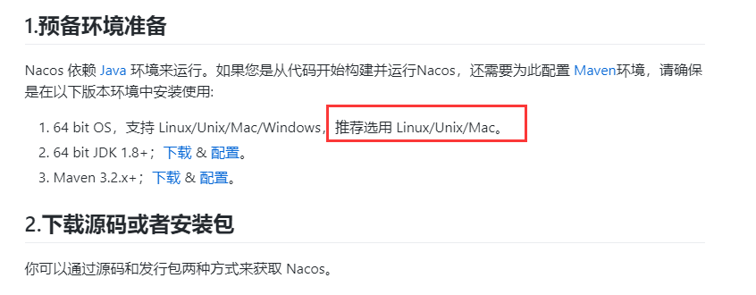
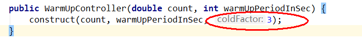
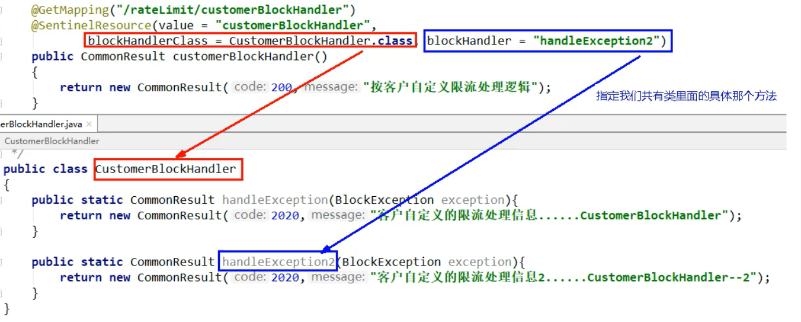

## 四个纬度 学习新技术  思路

- 是什么？

- 能干什么？

- 去哪下载？

- 怎么玩

> HelloWorld 入门案例


## 前言


## 一、Eureka 服务注册与发现

### 1、什么是注册中心

注册中心可以说是微服务架构中的“通讯录”，它记录了服务和服务地址的映射关系。在分布式架构中，服务会注册到这里，当服务需要调用其他服务时，就到这里找到服务的地址，进行调用。

> 我们现在给张三打电话，我们要打开通讯录，查找张三的电话号码，然后拨出电话。这样一个过程，在微服务注册中心当中，可以理解为服务发现的过程。
>
> 现在给李四打电话，那么前提李四的电话是哪来的？我们要先把李四的电话先收录到通讯录中，将李四的姓名电话号码添加到通讯录中，这样添加的过程就是服务注册的过程。
>
> 这个通讯录扮演的什么角色？扮演的是注册中心的角色

服务注册中心的作用就是 **服务的注册** 和 **服务的发现**

Eureka 包含两个组件 ：Eureka Server 和 Eureka Client

**Eureka Server** 提供服务注册服务

**Eureka Client** 通过注册中心进行访问


### 2、为什么需要注册中心

在分布式系统中，不仅仅是需要在注册中心找到 服务和服务地址的映射关系，还需要考虑更多更复杂的问题 ：

- 服务注册后，如何被及时发现
- 服务宕机后，如何即使下线
- 服务如何有效的水平扩展
- 服务发现时，如何进行路由
- 服务异常时，如何进行降级
- 注册中心如何实现自身的高可用


注册中心 解决了什么问题 ？

- 服务管理
- 服务的依赖关系管理


### 3、Eureka注册中心三种角色


#### Eureka Server

通过 Register、Get、Renew 等接口提供服务的注册和发现。


#### Service Provider

服务提供方，把自身的服务实例注册到 Eureka Server 中 。


#### Service Consumer

服务调用方，通过 Eureka Server 获取服务列表，消费服务。


## Eureka 入门案例 

配置

```yaml
server:
	port: 8080
spring:
	application:
		name: eureka-server # 应用名称
# 配置 Eureka Server 注册中心
eureka:
	instance:
		hostname: localhost # 主机名
     client:
     	register-with-eureka: false	# 是否将自己注册到注册中心 默认true
     	fetch-register: false	# 是否从注册中心获取服务注册信息 默认true
     	service-url:	# 注册中心对外暴露的注册地址
     		defaultZone: http://${eureka.instance.hostname}:${server.port}/eureka/
```

如果应用的角色是注册中心并且是单节点的话 ，需要关闭两个配置项 `register-with-eureka`、`fetch-register` 设置为 false 

省略 App.java

在启动类加上注解 `@EnableEurekaServer`

> http://localhost:8080/eureka/  访问即可


## 高可用 Eureka 注册中心


#### 注册中心 - server

> 导入的依赖 ：spring-cloud-starter-netflix-eureka-server

##### 配置文件 

```yaml
server:
	port: 8080
spring:
	application:
		name: eureka-server # 应用名称	(集群下相同)
# 配置 Eureka Server 注册中心
eureka:
	instance:
		hostname: eureka01  # 主机名
     client:
     	# 设置服务注册中心地址，指向另一个注册中心
     	service-url:	# 注册中心对外暴露的注册地址
     		defaultZone: http://192.168.0.102:8081/eureka/
```

```yaml
server:
	port: 8081
spring:
	application:
		name: eureka-server # 应用名称	(集群下相同)
# 配置 Eureka Server 注册中心
eureka:
	instance:
		hostname: eureka02  # 主机名
     client:
     	# 设置服务注册中心地址，指向另一个注册中心
     	service-url:	# 注册中心对外暴露的注册地址
     		defaultZone: http://192.168.0.102:8080/eureka/
```


##### 使用 ip+端口方式访问

```yaml
server:
	port: 8080
spring:
	application:
		name: eureka-server # 应用名称	(集群下相同)
# 配置 Eureka Server 注册中心
eureka:
	instance:
		hostname: eureka02  # 主机名
	prefer-ip-address: true	# 是否使用ip地址注册
	instance-id: ${spring.cloud.client.ip-address}:${server.port} # ip:port
     client:
     	# 设置服务注册中心地址，指向另一个注册中心
     	service-url:	# 注册中心对外暴露的注册地址
     		defaultZone: http://192.168.0.102:8081/eureka/
```

```yaml
server:
	port: 8081
spring:
	application:
		name: eureka-server # 应用名称	(集群下相同)
# 配置 Eureka Server 注册中心
eureka:
	instance:
		hostname: eureka02  # 主机名
	prefer-ip-address: true	# 是否使用ip地址注册
	instance-id: ${spring.cloud.client.ip-address}:${server.port} # ip:port
     client:
     	# 设置服务注册中心地址，指向另一个注册中心
     	service-url:	# 注册中心对外暴露的注册地址
     		defaultZone: http://192.168.0.102:8080/eureka/
```

> 注册中心构建集群是相互注册


#### 服务提供者 -service-provider

> 导入的依赖 ：spring-cloud-starter-netflix-eureka-client


环境搭建

##### 配置文件 

```yaml
server:
	port: 7070
spring:
	application:
		name: service-provider	# 应用名称 集群下相同
eureka:
	instance:
		prefer-ip-address: true
		instance-id: ${spring.cloud.client.ip-address}:${server.port}
	client:
		service-url:	# 设置服务注册中心地址
			defaultZone: http://localhost:8761/eureka/,http://localhost:8762/eureka/
```


启动类加上注解 `@EnableEurekaClient` 如果配置了 Eureka 注册中心，默认会开启该注解


#### 服务消费者 service -consumer

> 导入的依赖 ：spring-cloud-starter-netflix-eureka-client


环境搭建

```yaml
server:
	port: 9090
spring:
	application:
		name: service-consumer	# 应用名称
eureka:
	instance:
		prefer-ip-address: true
		instance-id: ${spring.cloud.client.ip-address}:${server.port}
	client:
		registerr-with-eureka: false	# 是否将自己注册到注册中心 默认true
		register-fetch-interval-seconds: 10	# 标识 Eureka Client 间隔多久取服务器拉取注册信息 默认30s
		service-url:	# 设置服务注册中心地址
			defaultZone: http://localhost:8761/eureka/,http://localhost:8762/eureka/
```


#### 消费服务 - 方式

- DiscoveryClient ：通过元数据获取服务信息
- LoadBalancerClient ：Ribbon 的负载均衡器
- @LoadBalanced ：通过注解开启 Ribbon 的负载均衡器


##### **方式一 ： DiscoveryClient**  

```java
@Service
public class OrderServiceImpl implements OrderService {
     @Autowired
     private RestTemplate restTemplate;
     @Autowired
     private DiscoveryClient discoveryClient;
     
     @Override
     public Order selectOrderbyId(Integer id) {
          return new Order(id, "order-001", "中国", 319D, selectProductsByDiscoveryClient());
     }
     
     private List<Product> selectProductsByDiscoveryClient() {
          StringBuffer sb = null;
          
          // 获取服务列表
          List<String> serviceIds = discoveryClient.getServices();
          if (CollectionUtils.isEmpty(serviceIds)) {
               return null;
          }
          
          // 根据服务名称获取服务
          List<ServiceInstance> serviceInstance = discoveryClient.getInstances("service-provider");
          if (CollectionUtils.isEmpty(serviceInstance)) {
               return null;
          }
          ServiceInstance si = serviceInstance.get(0);
          sb = new StringBuffer();
          sb.append("http://").append(si.getHost()).append(si.getPort()).append("/product/list");
          
          // ResponseEntity 封装返回数据
          ResponseEntity<List<Product>> response = restTemplate.exchange(
          	sb.toString(), 
               HttpMethod.GET, 
               null, 
               new ParameterizedTypeReference<List<Product>>() {}
          );
          return response.getBody();
     }
}
```


启动类 App.java

> RestTemplate SpringBoot默认不会集成 需要手动注入Bean
>
> 注解 @EnableEurekaClient

```java
​```
     @Bean
     public RestTemplate restTemplate() {
     	return new RestTemplate();
	}
​```
```


##### **方式二 ：LoadBalancerClient** 

```java
@Service
public class OrderServiceImpl implements OrderService {
     @Autowired
     private RestTemplate restTemplate;
     @Autowiired
     private LoadBalancerClient loadBalancerClient; // Ribbon 负载均衡器
     
     @Override
     public Order selectOrderbyId(Integer id) {
          return new Order(id, "order-001", "中国", 319D, selectProductListByLoadBalancerClient());
     }
     
     private List<Prodct> selectProductListByLoadBalancerClient() {
          StringBuffer sb = null;
          
          // 根据服务名称获取服务
          ServiceInstance si = loadBalancerClient.choose("service-provider");
          if (null == si) {
               return null;
          }
          sb = new StringBuffer();
          sb.append("http://").append(si.getHost()).append(si.getPort()).append("/product/list");
     	
                    // ResponseEntity 封装返回数据
          ResponseEntity<List<Product>> response = restTemplate.exchange(
          	sb.toString(), 
               HttpMethod.GET, 
               null, 
               new ParameterizedTypeReference<List<Product>>() {}
          );
          return response.getBody();
     }
}
```


##### **方式三 ：@LoadBalanced** 

在启动类注入 `RestTemplate` 同时添加 `@LoadBalanced` 负载均衡器注解， 表示这个 `RestTemplate` 在请求时拥有客户端负载均衡的能力

```java
​```
     @Bean
     @LoadBalanced // 负载均衡注解
     public RestTemplate restTemplate() {
    		return new RestTemplate();
	} 
​```
```


```java
@Service
public class OrderServiceImpl implements OrderService {
     @Autowired
     private RestTemplate restTemplate;
     
          @Override
     public Order selectOrderbyId(Integer id) {
          return new Order(id, "order-001", "中国", 319D, selectProductListByLoadBalancerClient());
     }
     
     private List<Product> selectProductListByLoadBalancerAnnotation() {
          ResponseEntity<List<Product>> response = restTemplate.exchange(
          	"http://service-provider/product/list",
               HttpMethod.GET,
               null,
               new ParameterizedTypeReference<List<Product>>() {}
          );
          return response.getBody();
     }
}    
```


## Eureka 架构原理 


- Register（服务注册）：把自己的 IP 和 端口 注册到 Eureka。
- Renew（服务续约）：发送心跳包，每 30 s发送一次，告诉 Eureka 自己还在运行，如果 90 s还未发送心跳，将其宕机。
- Cancel（服务下线）：当 Provider 关闭时会向 Eureka 发送消息，让 Eureka 把自己从服务列表中删除，防止 Consumer 调用到不存的服务。
- Get Register（获取服务注册列表）：获取其他服务列表。
- Replicate（集群中数据同步）：Eureka 集群中的数据复制与同步。
- Make Remote Call（远程调用）：完成服务的远程调用


## 服务发现 DiscoveryClient

> 对于注册进 Eureka 里面的微服务，可以通过服务发现来获取某个服务的信息

> 启动类上加上注解 `@EnableDiscoveryClient`
>
> Controller 类中 注入 DiscoveryClient 类
>
> @Resource
>    	 private DiscoveryClient discoveryClient;

controller

```java
@RestController
@Slf4j
public class PaymentController
{
    @Resource
    private DiscoveryClient discoveryClient;
    
         @GetMapping(value = "/payment/discovery")
    public Object discovery()
    {
        List<String> services = discoveryClient.getServices();
        for (String element : services) {
            log.info("*****element: "+element);
        }

        List<ServiceInstance> instances = discoveryClient.getInstances("CLOUD-PAYMENT-SERVICE");
        for (ServiceInstance instance : instances) {
            log.info(instance.getServiceId()+"\t"+instance.getHost()+"\t"+instance.getPort()+"\t"+instance.getUri());
        }

        return this.discoveryClient;
    }
}
```

打印日志情况

> element: cloud-payment-service
>
> element: cloud-order-service
>
> CLOUD-PAYMENT-SERVICE	192.168.56.1	8001	http://192.168.56.1:8001
>
> CLOUD-PAYMENT-SERVICE	192.168.56.1	8002	http://192.168.56.1:8002


## Eureka 自我保护

### 故障现象

保护模式主要用于一组客户端 和 Eureka Server 之间存在网络分区场景下的保护。

一旦进入保护模式，Eureka Server 将会尝试保护其服务注册表中的信息，不再删除服务注册表中的数据，也就是说不会注销任何微服务。


如果在 Eureka Server 的首页看到以下这段提示，则说明 Eureka 进入到保护模式 。

> #### **EMERGENCY! EUREKA MAY BE INCORRECTLY CLAIMING INSTANCES ARE UP WHEN THEY'RE NOT. RENEWALS ARE LESSER THAN THRESHOLD AND HENCE THE INSTANCES ARE NOT BEING EXPIRED JUST TO BE SAFE.** 


### 导致原因

> 一句话 ：某时刻某一个微服务不可用了，Eureka 不会马上清理，依旧会对该微服务的信息进行保存。

属于 CAP 原则里面的 AP 分支 


#### 为什么会产生 Eureka 自我保护机制 ？

为了防止 EurekaClient可以正常运行，但是与 EurekaServer 网络不通情况下，EurekaServer 不会马上将 EurekaClient 服务剔除


#### 什么是自我保护模式 ？

默认情况下，如果 EurekaServer 在一定时间内没有接收到某个微服务实例的心跳，EurekaServer 将会注销该实例（默认90s）。但是当网络分区故障发生时（延时、卡顿、拥挤），微服务与 EurekaServer 之间无法正常通信，以上行为可能变得非常危险。因为微服务本身其实是健康的，此时本不应该注销这个微服务。

Eureka 通过 “自我保护模式” 来解决这个问题 —— 当 EurekaServer 节点在短时间内丢失过多客户端时（可能发生了网络分区故障），那么这个节点就会进入自我保护模式。


它的设计就是 宁可保留错误的服务注册信息，也不盲目注销任何可能健康的服务实例。

综上，自我保护模式是一种应对网络异常的安全保护措施。


#### 禁止自我保护机制

> 默认是开启的

服务注册中心 EurekaServer

```yaml
eureka
  server:
    #关闭自我保护机制，保证不可用服务被及时踢除
    enable-self-preservation: false
    eviction-interval-timer-in-ms: 2000
```

服务消费者 EurekaClient

```yaml
eureka:
	 #Eureka客户端向服务端发送心跳的时间间隔，单位为秒(默认是30秒)
      lease-renewal-interval-in-seconds: 1
      #Eureka服务端在收到最后一次心跳后等待时间上限，单位为秒(默认是90秒)，超时将剔除服务
      lease-expiration-duration-in-seconds: 2
```


## zookeeper 注册与发现

> zookeeper 的服务节点是临时节点

### 入门 

> https://blog.csdn.net/qq_41112238/article/details/105240421
>
> 首先在 centos 7 系统安装 zookeeper ，zookeeper 依赖 jdk ，需要先安装 jdk


> 依赖 

```pom
        <!-- SpringBoot整合zookeeper客户端 -->
        <dependency>
            <groupId>org.springframework.cloud</groupId>
            <artifactId>spring-cloud-starter-zookeeper-discovery</artifactId>
            <!--先排除自带的zookeeper-->
            <exclusions>
                <exclusion>
                    <groupId>org.apache.zookeeper</groupId>
                    <artifactId>zookeeper</artifactId>
                </exclusion>
            </exclusions>
        </dependency>
        <!--添加zookeeper3.4.9版本-->
        <dependency>
            <groupId>org.apache.zookeeper</groupId>
            <artifactId>zookeeper</artifactId>
            <version>3.4.9</version>
        </dependency>
```


application.yaml

```yaml
#8004表示注册到zookeeper服务器的支付服务提供者端口号
server:
  port: 8004


#服务别名----注册zookeeper到注册中心名称
spring:
  application:
    name: cloud-provider-payment
  cloud:
    zookeeper:
    	 # zookeeper 服务器ip+端口
      connect-string: 192.168.0.199:2181
```


App.java

```java
import org.springframework.boot.SpringApplication;
import org.springframework.boot.autoconfigure.SpringBootApplication;
import org.springframework.cloud.client.discovery.EnableDiscoveryClient;
@SpringBootApplication
// 该注解用于向使用consul或者zookeeper作为注册中心时注册服务
@EnableDiscoveryClient 
public class PaymentMain8004 {
    public static void main(String[] args) {
            SpringApplication.run(PaymentMain8004.class, args);
    }
}
```


将服务注册进 zookeeper


> 如图，服务名 与 配置文件配置的相同，说明注册成功


## Consul 

Consul 是什么 ？

> Consul 是一套开源的分布式服务发现和配置管理系统， Go 语言开发

Consul 提供了微服务系统中的 服务治理、配置中心、控制总线等功能。这些功能每一个都可以根据需要单独使用，也可以一起使用用以构建全方位的服务网格，Consul 提供了一种完整的服务网格解决方案 。


默认是安装好的

> 使用开发模式启动 consul agent -dev
>
> http://localhost:8500 

> 依赖 

```pom
<dependency>
     <groupId>org.springframework.cloud</groupId>
     <artifactId>spring-cloud-starter-consul-discovery</artifactId>
</dependency>
```


### 服务提供者

配置 

application.yaml

```yaml
###consul服务端口号
server:
  port: 8006

spring:
  application:
    name: consul-provider-payment
####consul注册中心地址
  cloud:
    consul:
      host: localhost
      port: 8500
      discovery:
        #hostname: 127.0.0.1
        service-name: ${spring.application.name}
```


App.java

```java
import org.springframework.boot.SpringApplication;
import org.springframework.boot.autoconfigure.SpringBootApplication;
import org.springframework.cloud.client.discovery.EnableDiscoveryClient;

@SpringBootApplication
@EnableDiscoveryClient
public class PaymentMain8006
{
    public static void main(String[] args) {
            SpringApplication.run(PaymentMain8006.class, args);
    }
}
```


controller

```java
public class PaymentController
{
    @Value("${server.port}")
    private String serverPort;

    @RequestMapping(value = "/payment/consul")
    public String paymentConsul()
    {
        return "springcloud with consul: "+serverPort+"\t   "+ UUID.randomUUID().toString();
    }
}
```

> http://localhost:8006/payment/consul 启动 


### 服务消费者

配置 

application.yaml 

```yaml
###consul服务端口号
server:
  port: 80

spring:
  application:
    name: cloud-consumer-order
####consul注册中心地址
  cloud:
    consul:
      host: localhost
      port: 8500
      discovery:
        #hostname: 127.0.0.1
        service-name: ${spring.application.name}
```


controller

```java
import org.springframework.web.client.RestTemplate;
public class OrderConsulController
{
    public static final String INVOKE_URL = "http://consul-provider-payment";

    @Resource
    private RestTemplate restTemplate;

    @GetMapping(value = "/consumer/payment/consul")
    public String paymentInfo()
    {
        String result = restTemplate.getForObject(INVOKE_URL+"/payment/consul",String.class);
        return result;
    }
}
```

> 注入RestTemplate

```java
@Configuration
public class ApplicationContextConfig
{
    @Bean
    @LoadBalanced
    public RestTemplate getRestTemplate()
    {
        return new RestTemplate();
    }
}
```


App.java

```java
@SpringBootApplication
@EnableDiscoveryClient //该注解用于向使用consul或者zookeeper作为注册中心时注册服务
public class OrderConsulMain80
{
    public static void main(String[] args) {
            SpringApplication.run(OrderConsulMain80.class, args);
    }
}
```

> 启动 http://localhost/consumer/payment/consul


## 三个注册中心异同点 

- C : Consistency（强一致性）

- A : Availability（可用性）

- P : Partition tolerance（分区容错性）

> CAP理论关注粒度是数据，而不是整体系统设计的策略


> 最多只能同时较好的满足两个。
>  CAP理论的核心是：一个分布式系统不可能同时很好的满足一致性，可用性和分区容错性这三个需求，
> 因此，根据 CAP 原理将 NoSQL 数据库分成了满足 CA 原则、满足 CP 原则和满足 AP 原则三 大类：
> CA - 单点集群，满足一致性，可用性的系统，通常在可扩展性上不太强大。
> CP - 满足一致性，分区容忍必的系统，通常性能不是特别高。
> AP - 满足可用性，分区容忍性的系统，通常可能对一致性要求低一些。
>
>  


## Ribbon 入门介绍

Spring Cloud Ribbon是基于Netflix Ribbon实现的一套客户端       负载均衡的工具。

简单的说，Ribbon是Netflix发布的开源项目，**主要功能是提供客户端的软件负载均衡算法和服务调用**。Ribbon客户端组件提供一系列完善的配置项如连接超时，重试等。简单的说，就是在配置文件中列出Load Balancer（简称LB）后面所有的机器，Ribbon会自动的帮助你基于某种规则（如简单轮询，随机连接等）去连接这些机器。我们很容易使用Ribbon实现自定义的负载均衡算法。


### LB负载均衡

> 负载均衡 + RestTemplate 调用

LB负载均衡(Load Balance)是什么
简单的说就是将用户的请求平摊的分配到多个服务上，从而达到系统的HA（高可用）。
常见的负载均衡有软件Nginx，LVS，硬件 F5等。

**Ribbon本地负载均衡客户端 VS Nginx服务端负载均衡区别**

Nginx是服务器负载均衡，客户端所有请求都会交给nginx，然后由nginx实现转发请求。即负载均衡是由服务端实现的。

Ribbon本地负载均衡，在调用微服务接口时候，会在注册中心上获取注册信息服务列表之后缓存到JVM本地，从而在本地实现RPC远程服务调用技术。


#### 集中式LB

> 即在服务的消费方和提供方之间使用独立的LB设施(可以是硬件，如F5, 也可以是软件，如nginx), 由该设施负责把访问请求通过某种策略转发至服务的提供方；


#### 进程内LB

> 将LB逻辑集成到消费方，消费方从服务注册中心获知有哪些地址可用，然后自己再从这些地址中选择出一个合适的服务器。
>
> Ribbon就属于进程内LB，它只是一个类库，集成于消费方进程，消费方通过它来获取到服务提供方的地址。


## Ribbon 核心组件 IRule

> IRule：根据特定算法中从服务列表中选取一个要访问的服务


- com.netflix.loadbalancer.RoundRobinRule
	- 轮询
- com.netflix.loadbalancer.RandomRule
	- 随机
- com.netflix.loadbalancer.RetryRule
	- 先按照RoundRobinRule的策略获取服务，如果获取服务失败则在指定时间内会进行重试，获取可用的服务
- WeightedResponseTimeRule
	- 对RoundRobinRule的扩展，响应速度越快的实例选择权重越大，越容易被选择
- BestAvailableRule
	- 会先过滤掉由于多次访问故障而处于断路器跳闸状态的服务，然后选择一个并发量最小的服务
- AvailabilityFilteringRule
	- 先过滤掉故障实例，再选择并发较小的实例
- ZoneAvoidanceRule
	- 默认规则,复合判断server所在区域的性能和server的可用性选择服务器


### Ribbon负载均衡替换

>  官方文档明确给出了警告
>
> ​	自定义配置类不能放在 `@ComponentScan` 所扫描的当前包下及其子包下，否则 自定义的配置类就会被 Ribbon 客户端所共享，达不到特殊化定制的目的

 

 


配置  自定义 负载均衡 规则类

MySelfRule.java

```java
@Configuration
public class MySelfRule
{
    @Bean
    public IRule myRule()
    {
        return new RandomRule();//定义为随机
    }
}
```


主启动类  App.java

```java
@SpringBootApplication
@EnableEurekaClient
@RibbonClient(name = "CLOUD-PAYMENT-SERVICE",configuration=MySelfRule.class)
public class OrderMain80
{
    public static void main(String[] args) {
            SpringApplication.run(OrderMain80.class, args);
    }
}
```

> @RibbonClient(name = "CLOUD-PAYMENT-SERVICE",configuration=MySelfRule.class)
>
> 当前服务消费者访问 支付微服务，配置 `configuration` 不要用默认配置，改为自定义的随机 负载均衡


### Ribbon负载均衡算法

#### 原理 

>  **负载均衡算法：** 
>
> rest接口第几次请求数 % 服务器集群总数量 = 实际调用服务器位置下标 ，每次服务重启动后rest接口计数从1开始。 
>
> List instances = discoveryClient.getInstances("CLOUD-PAYMENT-SERVICE"); 
>
> 如：  List [0] instances = 127.0.0.1:8002　　　
>
> List [1] instances = 127.0.0.1:8001 
>
> - 8001+ 8002 组合成为集群，它们共计2台机器，集群总数为2，
>
>  **按照轮询算法原理：** 
>
> - 当总请求数为1时： 1 % 2 =1 对应下标位置为1 ，则获得服务地址为127.0.0.1:8001
>
> - 当总请求数位2时： 2 % 2 =0 对应下标位置为0 ，则获得服务地址为127.0.0.1:8002
>
> - 当总请求数位3时： 3 % 2 =1 对应下标位置为1 ，则获得服务地址为127.0.0.1:8001
>
> - 当总请求数位4时： 4 % 2 =0 对应下标位置为0 ，则获得服务地址为127.0.0.1:8002
>
> 如此类推......   

12 - 15  29


#### RoundRobinRule 源码 

```java
public class RoundRobinRule extends AbstractLoadBalancerRule {

    private AtomicInteger nextServerCyclicCounter;
    private static final boolean AVAILABLE_ONLY_SERVERS = true;
    private static final boolean ALL_SERVERS = false;

    private static Logger log = LoggerFactory.getLogger(RoundRobinRule.class);

    public RoundRobinRule() {
        nextServerCyclicCounter = new AtomicInteger(0);
    }

    public RoundRobinRule(ILoadBalancer lb) {
        this();
        setLoadBalancer(lb);
    }

    public Server choose(ILoadBalancer lb, Object key) {
        if (lb == null) {
            log.warn("no load balancer");
            return null;
        }

        Server server = null;
        int count = 0;
        while (server == null && count++ < 10) {
            List<Server> reachableServers = lb.getReachableServers();
            List<Server> allServers = lb.getAllServers();
            int upCount = reachableServers.size();
            int serverCount = allServers.size();

            if ((upCount == 0) || (serverCount == 0)) {
                log.warn("No up servers available from load balancer: " + lb);
                return null;
            }

            int nextServerIndex = incrementAndGetModulo(serverCount);
            server = allServers.get(nextServerIndex);

            if (server == null) {
                /* Transient. */
                Thread.yield();
                continue;
            }

            if (server.isAlive() && (server.isReadyToServe())) {
                return (server);
            }

            // Next.
            server = null;
        }

        if (count >= 10) {
            log.warn("No available alive servers after 10 tries from load balancer: "
                    + lb);
        }
        return server;
    }

    /**
     * Inspired by the implementation of {@link AtomicInteger#incrementAndGet()}.
     *
     * @param modulo The modulo to bound the value of the counter.
     * @return The next value.
     */
    private int incrementAndGetModulo(int modulo) {
        for (;;) {
            int current = nextServerCyclicCounter.get();
            int next = (current + 1) % modulo;
            if (nextServerCyclicCounter.compareAndSet(current, next))
                return next;
        }
    }

    @Override
    public Server choose(Object key) {
        return choose(getLoadBalancer(), key);
    }

    @Override
    public void initWithNiwsConfig(IClientConfig clientConfig) {
    }
}
```


#### 手写一个负载的算法

> 原理 + JUC （CAS + 自旋锁）


接口 

```java
public interface LoadBalancer
{
    ServiceInstance instances(List<ServiceInstance> serviceInstances);
}
```


实现类 

```java
@Component
public class MyLB implements LoadBalancer
{

    private AtomicInteger atomicInteger = new AtomicInteger(0);

    public final int getAndIncrement()
    {
        int current;
        int next;

        do {
            current = this.atomicInteger.get();
            next = current >= 2147483647 ? 0 : current + 1;
        }while(!this.atomicInteger.compareAndSet(current,next));
        System.out.println("*****第几次访问，次数next: "+next);
        return next;
    }

    //负载均衡算法：rest接口第几次请求数 % 服务器集群总数量 = 实际调用服务器位置下标  ，每次服务重启动后rest接口计数从1开始。
    @Override
    public ServiceInstance instances(List<ServiceInstance> serviceInstances)
    {
        int index = getAndIncrement() % serviceInstances.size();

        return serviceInstances.get(index);
    }
}
```


controller

```java
    @Resource
    private LoadBalancer loadBalancer;
    @Resource
    private DiscoveryClient discoveryClient;

    @GetMapping(value = "/consumer/payment/lb")
    public String getPaymentLB() {
        List<ServiceInstance> instances = discoveryClient.getInstances("CLOUD-PAYMENT-SERVICE");
        if(instances == null || instances.size() <= 0) {
            return null;
        }
        ServiceInstance serviceInstance = loadBalancer.instances(instances);
        URI uri = serviceInstance.getUri();
        return restTemplate.getForObject(uri+"/payment/lb",String.class);
    }
```


8001端口 微服务 controller

```java
    @GetMapping(value = "/payment/lb")
    public String getPaymentLB()
    {
        return serverPort;
    }
```


运行

> http://localhost/consumer/payment/lb

​                           


## OpenFeign 服务调用

> Feign是一个声明式的Web服务客户端，让编写Web服务客户端变得非常容易，**只需创建一个接口并在接口上添加注解即可**
>
> Feign 在消费端使用


Feign 和 OpenFeign 两者区别 

>  FeignOpenFeignFeign是Spring Cloud组件中的一个轻量级RESTful的HTTP服务客户端Feign内置了Ribbon，用来做客户端负载均衡，去调用服务注册中心的服务。Feign的使用方式是：使用Feign的注解定义接口，调用这个接口，就可以调用服务注册中心的服务
>
> OpenFeign是Spring Cloud 在Feign的基础上支持了SpringMVC的注解，如@RequesMapping等等。OpenFeign的@FeignClient可以解析SpringMVC的@RequestMapping注解下的接口，并通过动态代理的方式产生实现类，实现类中做负载均衡并调用其他服务。  
>
> org.springframework.cloud  spring-cloud-starter-feign  
>
> org.springframework.cloud  spring-cloud-starter-openfeign  


### 入门案例

> 依赖
>
> ```pom
> <dependency>
>     <groupId>org.springframework.cloud</groupId>
>     <artifactId>spring-cloud-starter-openfeign</artifactId>
> </dependency>
> ```

application.yaml

```yaml
server:
  port: 80

eureka:
  client:
    register-with-eureka: false
    service-url:
      defaultZone: http://eureka7001.com:7001/eureka/,http://eureka7002.com:7002/eureka/
```

主启动类 

> 加上注解 开启 `@EnableFeignClients`

```java
@SpringBootApplication
@EnableFeignClients
public class OrderFeignMain80
{
    public static void main(String[] args) {
            SpringApplication.run(OrderFeignMain80.class, args);
    }
}
```


业务逻辑接口+@FeignClient配置调用provider服务

新建PaymentFeignService接口并新增注解@FeignClient

> @FeignClient(value = "CLOUD-PAYMENT-SERVICE")
>
> Eureka 注册中心中注册的服务名称 (要调用的服务名)

```java
@Component
@FeignClient(value = "CLOUD-PAYMENT-SERVICE")
public interface PaymentFeignService
{
    @GetMapping(value = "/payment/get/{id}")
    public CommonResult<Payment> getPaymentById(@PathVariable("id") Long id);
}
```

controller

```java
public class OrderFeignController
{
    @Resource
    private PaymentFeignService paymentFeignService;

    @GetMapping(value = "/consumer/payment/get/{id}")
    public CommonResult<Payment> getPaymentById(@PathVariable("id") Long id)
    {
        return paymentFeignService.getPaymentById(id);
    }
}
```


> 客户端的服务接口使用用 **`@FeignClient`** 注解根据服务名称去调用服务提供方的具体服务
>
> 微服务调用接口+@FeignClient


### OpenFeign超时控制

  默认Feign客户端只等待一秒钟，但是服务端处理需要超过1秒钟，导致Feign客户端不想等待了，直接返回报错。为了避免这样的情况，有时候我们需要设置Feign客户端的超时控制。yml文件中开启配置 

> 在 application.yaml 配置文件中添加 如下配置 

```yaml
#设置feign客户端超时时间(OpenFeign默认支持ribbon)
ribbon:
#指的是建立连接所用的时间，适用于网络状况正常的情况下,两端连接所用的时间
  ReadTimeout: 5000
#指的是建立连接后从服务器读取到可用资源所用的时间
  ConnectTimeout: 5000
```


### OpenFeign日志打印功能

使用步骤 

> 配置日志bean
>
> 注入 OpenFeign 日志 Bean

```java
@Configuration
public class FeignConfig
{
    @Bean
    Logger.Level feignLoggerLevel()
    {
        return Logger.Level.FULL;
    }
}
```


> YML文件里需要开启日志的Feign客户端，在yaml配置文件中 添加如下配置

```yaml
logging:
  level:
    # feign日志以什么级别监控哪个接口
    com.atguigu.springcloud.service.PaymentFeignService: debug
```


## Hystrix断路器

### 前言 

服务雪崩

> 分布式系统面临的问题复杂分布式体系结构中的应用程序有数十个依赖关系，每个依赖关系在某些时候将不可避免地失败。 服务雪崩多个微服务之间调用的时候，假设微服务A调用微服务B和微服务C，微服务B和微服务C又调用其它的微服务，这就是所谓的“扇出”。如果扇出的链路上某个微服务的调用响应时间过长或者不可用，对微服务A的调用就会占用越来越多的系统资源，进而引起系统崩溃，所谓的“雪崩效应”. 
>
> 对于高流量的应用来说，单一的后端依赖可能会导致所有服务器上的所有资源都在几秒钟内饱和。比失败更糟糕的是，这些应用程序还可能导致服务之间的延迟增加，备份队列，线程和其他系统资源紧张，导致整个系统发生更多的级联故障。这些都表示需要对故障和延迟进行隔离和管理，以便单个依赖关系的失败，不能取消整个应用程序或系统。
>
> 所以，通常当你发现一个模块下的某个实例失败后，这时候这个模块依然还会接收流量，然后这个有问题的模块还调用了其他的模块，这样就会发生级联故障，或者叫雪崩。     


### Hystrix 是什么 ？

>  Hystrix是一个用于处理分布式系统的**延迟**和**容错**的开源库，在分布式系统里，许多依赖不可避免的会调用失败，比如超时、异常等，Hystrix能够保证在一个依赖出问题的情况下，**不会导致整体服务失败，避免级联故障，以提高分布式系统的弹性**。
>
>  “断路器”本身是一种开关装置，当某个服务单元发生故障之后，通过断路器的故障监控（类似熔断保险丝），**向调用方返回一个符合预期的、可处理的备选响应（FallBack）**，**而不是长时间的等待或者抛出调用方无法处理的异常**，这样就保证了服务调用方的线程不会被长时间、不必要地占用，从而避免了故障在分布式系统中的蔓延，乃至雪崩。   


###  Hystrix能做什么？

> 主要有服务降级、服务熔断、接近实时的监控、限流、隔离等等，其[官方文档](https://github.com/Netflix/Hystrix/wiki/How-To-Use)参考。当然Hystrix现在已经停更了，虽然有一些替代品，但是学习Hystrix及其里面的思想还是非常重要的！


### Hystrix重要概念

#### 1、服务降级 —— Fall Back

> 假设微服务A要调用的服务B不可用了，需要服务B提供一个兜底的解决方法，而不是让服务A在那里傻等，耗死。不让客户端等待并立刻返回一个友好图示，比如像客户端提示服务器忙，请稍后再试等。
>
> 哪些情况会触发服务降级呢？     
>
> - 比如程序运行异常、超时、服务熔断触发服务降级、线程池/信号量打满也会导致服务降级。


#### 2、服务熔断 —— Break

可以理解为保险丝，首先是服务的降级 -> 进而熔断 -> 再恢复调用链路

> 服务熔断就相当于物理上的**熔断保险丝**。类比保险丝达到最大服务访问后，直接拒绝访问，拉闸断点，然后调用服务降级的方法并返回友好提示。
>
> 熔断 -> 降级 


#### 3、服务限流 —— Flow Limit

> 秒杀高并发等操作，严禁一窝蜂的过来拥挤，大家排队，一秒钟N个，有序进行。


### Hystrix 微服务构建 

> 依赖 
>
> ```pom
> <dependency>
>     <groupId>org.springframework.cloud</groupId>
>     <artifactId>spring-cloud-starter-netflix-hystrix</artifactId>
> </dependency>
> ```


application.yaml

```yaml
server:
  port: 8001

spring:
  application:
    name: cloud-provider-hystrix-payment

eureka:
  client:
    register-with-eureka: true
    fetch-registry: true
    service-url:
      #defaultZone: http://eureka7001.com:7001/eureka,http://eureka7002.com:7002/eureka
      defaultZone: http://eureka7001.com:7001/eureka
```


主启动类

```java
@SpringBootApplication
@EnableEurekaClient
public class PaymentHystrixMain8001
{
    public static void main(String[] args) {
            SpringApplication.run(PaymentHystrixMain8001.class, args);
    }
}
```


```java
@Service
public class PaymentService
{
    /**
     * 正常访问，肯定OK
     * @param id
     * @return
     */
    public String paymentInfo_OK(Integer id)
    {
        return "线程池:  "+Thread.currentThread().getName()+"  paymentInfo_OK,id:  "+id+"\t"+"O(∩_∩)O哈哈~";
    }

    public String paymentInfo_TimeOut(Integer id)
    {
        //int age = 10/0;
        try { TimeUnit.MILLISECONDS.sleep(3000); } catch (InterruptedException e) { e.printStackTrace(); }
        return "线程池:  "+Thread.currentThread().getName()+" id:  "+id+"\t"+"O(∩_∩)O哈哈~"+"  耗时(秒): ";
    }
}
```


```java
@RestController
@Slf4j
public class PaymentController
{
    @Resource
    private PaymentService paymentService;

    @Value("${server.port}")
    private String serverPort;

    @GetMapping("/payment/hystrix/ok/{id}")
    public String paymentInfo_OK(@PathVariable("id") Integer id)
    {
        String result = paymentService.paymentInfo_OK(id);
        log.info("*****result: "+result);
        return result;
    }

    @GetMapping("/payment/hystrix/timeout/{id}")
    public String paymentInfo_TimeOut(@PathVariable("id") Integer id)
    {
        String result = paymentService.paymentInfo_TimeOut(id);
        log.info("*****result: "+result);
        return result;
    }
}
```

> 不模拟高并发下 访问接口 测试


> 访问服务超时或服务宕机如何解决？


### 服务降级 Fall Back

#### 服务端 - 服务提供方服务降级

> 首先在服务提供方的业务类上启用 **`@HystrixCommand`** 实现报异常后如何处理，也就是一旦调用服务方法失败并抛出了错误信息后，会自动调用 **`@HystrixCommand`** 标注好的fallbackMethod服务降级方法。
>
> 然后在主启动类上添加 **`@EnableCircuitBreaker`** 注解对熔断器进行激活

> 在 服务接口方法上 添加 `@HystrixCommand` 注解 ，如下文

```java
{
     // fallbackMethod = "paymentInfo_TimeOutHandler"  超时走 paymentInfo_TimeOutHandler() 方法
     
     @HystrixCommand(fallbackMethod = "paymentInfo_TimeOutHandler",commandProperties = {
            @HystrixProperty(name="execution.isolation.thread.timeoutInMilliseconds",value="5000")
    })

     // 五秒以内走正常业务逻辑
 	commandProperties = {
            @HystrixProperty(name="execution.isolation.thread.timeoutInMilliseconds",value="5000")
    } 		
}
```


```java
@Service
public class PaymentService
{    
	@HystrixCommand(fallbackMethod = "paymentInfo_TimeOutHandler",commandProperties = {
            @HystrixProperty(name="execution.isolation.thread.timeoutInMilliseconds",value="5000")
    })
    public String paymentInfo_TimeOut(Integer id)
    {
        //int age = 10/0;
        try { TimeUnit.MILLISECONDS.sleep(3000); } catch (InterruptedException e) { e.printStackTrace(); }
        return "线程池:  "+Thread.currentThread().getName()+" id:  "+id+"\t"+"O(∩_∩)O哈哈~"+"  耗时(秒): ";
    }
    public String paymentInfo_TimeOutHandler(Integer id)
    {
        return "线程池:  "+Thread.currentThread().getName()+"  8001系统繁忙或者运行报错，请稍后再试,id:  "+id+"\t"+"o(╥﹏╥)o";
    }
}
```


> 主启动类激活  在App.java 类上加上 `@EnableCircuitBreaker` 注解

```java
@EnableCircuitBreaker
```

> `fallbackMethod` 后面跟的什么方法名，就是谁来处理接口服务异常.

程序运行异常，超时异常等服务不可用了，做服务降级，兜底的方案都是 `paymentInfo_TimeOutHandler()`


> FallBack 服务降级，一般是放在客户端 服务消费方

#### 客户端 - 服务消费方的服务降级

> 服务的提供方可以进行降级保护，那么服务的消费方，也可以更好的保护自己，也可以对自己进行降级保护，也就是说Hystrix服务降级既可以放在服务端（服务提供方），也可以放在客户端（服务消费方），但是！！！**通常是用客户端做服务降级**，

开启 消费方 支持 Hystrix 配置 

```yaml
feign:
  hystrix:
    enabled: true
```

主启动 App.java  类上 添加 `@EnableHystrix` 激活 注解 ，然后在 80端口的 Controller 中 加入 `@HystrixCommand` 注解 实现服务降级

```java
public class PaymentHystirxController{    
     @Resource    
     private PaymentHystrixService paymentHystrixService;    
     @GetMapping("/consumer/payment/hystrix/ok/{id}")    
     public String paymentInfo_OK(@PathVariable("id") Integer id)    {        
          String result = paymentHystrixService.paymentInfo_OK(id);        r
               eturn result;    
     }
     @GetMapping("/consumer/payment/hystrix/timeout/{id}")
     @HystrixCommand(fallbackMethod = "paymentTimeOutFallbackMethod",commandProperties = {        			                 @HystrixProperty(name="execution.isolation.thread.timeoutInMilliseconds",value="1500")
     })
     public String paymentInfo_TimeOut(@PathVariable("id") Integer id){    
          String result = paymentHystrixService.paymentInfo_TimeOut(id);    
          return result;
     }
     public String paymentTimeOutFallbackMethod(@PathVariable("id") Integer id){    
          return "我是消费者80,对方支付系统繁忙请10秒钟后再试或者自己运行出错请检查自己,o(╥﹏╥)o";
     }
}      
```

> 解释 ：也就是说，如果消费方调用服务提供者接口的调用时间超过了 1.5 s，那么就会访问消费方自己的服务降级方法 。

> 而当前的这种处理方式是有问题的，也就是**每个业务方法都对应了一个服务降级犯法，这会导致代码膨胀**，所以我们应该定义一个统一的服务降级方法，统一的方法和自定义的方法分开。而且我们**将服务降级方法和业务逻辑混合在了一起，这会导致代码混乱，业务逻辑不清晰**

> 1、每个方法配置一个？？？膨胀 ？ 2、和业务逻辑混一起？？？混乱？


#### 全局服务降级 **`DefaultProperties`**

> 对于第一个问题，我们可以使用 feign 接口的 `@DefaultProperties(defaultFallback = "")` 注解来配置全局的服务降级方法 。
>
> 配置过 `@HystrixCommand(fallbackMethod = "")` 注解的方法采用自己配置的服务降级方法，没有配置锅自己的服务降级处理就采用 `@DefaultProperties(defaultFallback = "")` 配置的全局服务降级方法，这样的话通用的服务降级方法和独享的服务降级方法分开，避免了代码膨胀，合理减少了代码量

```java
@RestController
@Slf4j
@DefaultProperties(defaultFallback = "payment_Global_FallbackMethod")
public class OrderHystirxController
{
    @Resource
    private PaymentHystrixService paymentHystrixService;

    @GetMapping("/consumer/payment/hystrix/ok/{id}")
    public String paymentInfo_OK(@PathVariable("id") Integer id)
    {
        String result = paymentHystrixService.paymentInfo_OK(id);
        return result;
    }

    /*@GetMapping("/consumer/payment/hystrix/timeout/{id}")
    @HystrixCommand(fallbackMethod = "paymentTimeOutFallbackMethod",commandProperties = {
            @HystrixProperty(name="execution.isolation.thread.timeoutInMilliseconds",value="1500")
    })*/
    //@HystrixCommand
    public String paymentInfo_TimeOut(@PathVariable("id") Integer id)
    {
        int age = 10/0;
        String result = paymentHystrixService.paymentInfo_TimeOut(id);
        return result;
    }
    public String paymentTimeOutFallbackMethod(@PathVariable("id") Integer id)
    {
        return "我是消费者80,对方支付系统繁忙请10秒钟后再试或者自己运行出错请检查自己,o(╥﹏╥)o";
    }

    // 下面是全局fallback方法
    public String payment_Global_FallbackMethod()
    {
        return "Global异常处理信息，请稍后再试，/(ㄒoㄒ)/~~";
    }
}
```


> 对于第二个问题，可以为 Feign **客户端定义的调用服务提供方接口** 添加一个服务降级处理的实现类实现解耦，新建一个类并实现该接口，重写接口方法。为接口内的方法进行异常处理，并且在 其 实现的接口内声明服务降级方法所在的类 。

application.yaml

```yaml
feign:  
	hystrix:   
		enabled: true #在Feign中开启Hystrix  
```


接口 

```java
@Component
//当出现错误时，到PaymentFallbackService类中找服务降级方法
@FeignClient(value = "CLOUD-PROVIDER-HYSTRIX-PAYMENT" ,fallback = PaymentFallbackService.class)
public interface PaymentHystrixService
{
    @GetMapping("/payment/hystrix/ok/{id}")
    public String paymentInfo_OK(@PathVariable("id") Integer id);

    @GetMapping("/payment/hystrix/timeout/{id}")
    public String paymentInfo_TimeOut(@PathVariable("id") Integer id);
}
```

实现类

```java
@Component
public class PaymentFallbackService implements PaymentHystrixService
{
    @Override
    public String paymentInfo_OK(Integer id)
    {
        return "-----PaymentFallbackService fall back-paymentInfo_OK ,o(╥﹏╥)o";
    }

    @Override
    public String paymentInfo_TimeOut(Integer id)
    {
        return "-----PaymentFallbackService fall back-paymentInfo_TimeOut ,o(╥﹏╥)o";
    }
}
```

> 移除controller 中的耦合代码，并测试

```java
@RestController
@Slf4j
// @DefaultProperties(defaultFallback = "payment_Global_FallbackMethod")
public class OrderHystirxController
{
    @Resource
    private PaymentHystrixService paymentHystrixService;

    @GetMapping("/consumer/payment/hystrix/ok/{id}")
    public String paymentInfo_OK(@PathVariable("id") Integer id)
    {
        String result = paymentHystrixService.paymentInfo_OK(id);
        return result;
    }

    /*@GetMapping("/consumer/payment/hystrix/timeout/{id}")
    @HystrixCommand(fallbackMethod = "paymentTimeOutFallbackMethod",commandProperties = {
            @HystrixProperty(name="execution.isolation.thread.timeoutInMilliseconds",value="1500")
    })*/
    //@HystrixCommand
    public String paymentInfo_TimeOut(@PathVariable("id") Integer id)
    {
        int age = 10/0;
        String result = paymentHystrixService.paymentInfo_TimeOut(id);
        return result;
    }
}
```


### 服务熔断 Break

https://martinfowler.com/bliki/CircuitBreaker.html

 **熔断机制概述** 

> 熔断机制是应对雪崩效应的一种微服务链路保护机制。当扇出链路的某个微服务出错不可用或者响应时间太长时，会进行服务的降级，进而熔断该节点微服务的调用，快速返回错误的响应信息。**当检测到该节点微服务调用响应正常后，恢复调用链路。**
>
>  在Spring Cloud框架里，熔断机制通过Hystrix实现。Hystrix会监控微服务间调用的状况，当失败的调用到一定阈值，缺省是5秒内20次调用失败，就会启动熔断机制。熔断机制的注解是@HystrixCommand。   

> 这个简单的断路器避免在电路打开时进行受保护的呼叫，但当一切恢复正常时需要外部干预来重置它。对于建筑物中的电路断路器，这是一种合理的方法，但对于软件断路器，我们可以让断路器本身检测底层调用是否再次工作。我们可以通过在合适的时间间隔后再次尝试受保护的调用来实现这种自重置行为，并在成功时重置断路器


#### 服务熔断案例

在服务提供方的 Service 中添加如下代码 

```java
@Service
public class PaymentService{
     ...
	 
    //=====服务熔断
    /**
     * fallbackMethod                               服务降级方法
     * circuitBreaker.enabled                       是否开启断路器
     * circuitBreaker.requestVolumeThreshold        请求次数
     * circuitBreaker.sleepWindowInMilliseconds     时间窗口期
     * circuitBreaker.errorThresholdPercentage      失败率达到多少后跳闸
     * 以下配置意思是在10秒时间内请求10次，如果有6此是失败的，就触发熔断器
     * 注解@HystrixProperty中的属性在com.netflix.hystrix.HystrixCommandProperties类中查看
     * @param id
     * @return
     */
    @HystrixCommand(fallbackMethod = "paymentCircuitBreaker_fallback",commandProperties = {
            @HystrixProperty(name = "circuitBreaker.enabled",value = "true"),// 是否开启断路器
            @HystrixProperty(name = "circuitBreaker.requestVolumeThreshold",value = "10"),// 请求次数
            @HystrixProperty(name = "circuitBreaker.sleepWindowInMilliseconds",value = "10000"), // 时间窗口期
            @HystrixProperty(name = "circuitBreaker.errorThresholdPercentage",value = "60"),// 失败率达到多少后跳闸
    })
    public String paymentCircuitBreaker(@PathVariable("id") Integer id){
        if(id < 0)
        {
            throw new RuntimeException("******id 不能负数");
        }
        String serialNumber = IdUtil.simpleUUID();

        return Thread.currentThread().getName()+"\t"+"调用成功，流水号: " + serialNumber;
    }
    public String paymentCircuitBreaker_fallback(@PathVariable("id") Integer id){
        return "id 不能负数，请稍后再试，/(ㄒoㄒ)/~~   id: " +id;
    }
}
```

在 controller 加入如下代码 

```java
    //====服务熔断
    @GetMapping("/payment/circuit/{id}")
    public String paymentCircuitBreaker(@PathVariable("id") Integer id)
    {
        String result = paymentService.paymentCircuitBreaker(id);
        log.info("****result: "+result);
        return result;
    }
```


> `@HystrixCommand` 请求次数+时间窗口期+失败率多少后跳闸   -> 在10s时间内 访问接口次数10次 达到60%失败率 跳闸。

`@HystrixCommand` 注解中 `@HystrixCommand` 配置熔断机制的参数 如下

|                   属性                   |         含义         | 默认值 |
| :--------------------------------------: | :------------------: | :----: |
|          circuitBreaker.enabled          |    是否开启断路器    |  true  |
|  circuitBreaker.requestVolumeThreshold   |       请求次数       |   20   |
| circuitBreaker.sleepWindowInMilliseconds |      时间窗口期      |  5000  |
| circuitBreaker.errorThresholdPercentage  | 失败率达到多少后跳闸 |   50   |

这些属性名的具体含义一级其默认值可以在 `com.netflix.hystrix.HystrixCommandProperties` 类中进行查看。而我们在service中配置的意思就是**在10秒时间内请求10次，如果有6次是失败的，就触发熔断器**

> 触发了服务熔断，即使再进行正确的访问也无法进行，但是一定时间后，正确的服务访问又可以顺利进行，这就是服务熔断的整体过程：在触发了服务熔断后，先进行服务的降级，再**逐渐恢复调用链路**


### 总结 

熔断类型 

| 熔断器打开 OPEN          | 请求不再进行调用当前服务，内部设置时钟一般为MTTR（平均故障处理时间)，当打开时长达到所设时钟则进入半熔断状态 |
| ------------------------ | ------------------------------------------------------------ |
| **熔断器关闭 CLOSED**    | **熔断关闭不会对服务进行熔断**                               |
| **熔断器半开 HALF-OPEN** | **部分请求根据规则调用当前服务，如果请求成功且符合规则则认为当前服务恢复正常，关闭熔断** |

熔断器打开和关闭方式 

- 1、假设电路上的访问达到某个阈值（`HystrixCommandProperties.circuitBreakerRequestVolumeThreshold()`）
- 2、并假设误差百分比超过阈值误差百分比（`HystrixCommandProperties.circuitBreakerErrorThresholdPercentage()`）
- 3、然后，**断路器从`CLOSED`为`OPEN`，触发熔断机制**
- 4、当它断开时，它会使针对该断路器的所有请求短路
- 5、**经过一段时间（`HystrixCommandProperties.circuitBreakerSleepWindowInMilliseconds()`）后**，**会让其中一个请求**被允许通过（这是`HALF-OPEN`状态）。**如果请求失败，继续开启。重复4和5，断路器将`OPEN`在睡眠窗口期间返回到该状态**，**如果请求成功，则断路器切换到，`CLOSED`** 并且由 步骤 1的逻辑接管 。


官网的熔断器流程图 


**断路器在什么情况下开始起作用** 

- 涉及到断路器的三个重要参数：快照时间窗、请求总数阀值、错误百分比阀值。

> 1：快照时间窗 **`circuitBreaker.sleepWindowInMilliseconds`** ：断路器确定是否打开需要统计一些请求和错误数据，而统计的时间范围就是快照时间窗，默认为最近的10秒。 
>
> 2：请求总数阀值 **`circuitBreaker.requestVolumeThreshold`** ：在快照时间窗内，必须满足请求总数阀值才有资格熔断。默认为20，意味着在10秒内，如果该hystrix命令的调用次数不足20次，即使所有的请求都超时或其他原因失败，断路器都不会打开。 
>
> 3：错误百分比阀值 **`circuitBreaker.errorThresholdPercentage`** ：当请求总数在快照时间窗内超过了阀值，比如发生了30次调用，如果在这30次调用中，有15次发生了超时异常，也就是超过50%的错误百分比，在默认设定50%阀值情况下，这时候就会将断路器打开。  


**断路器打开之后**

> 1：再有请求调用的时候，将不会调用主逻辑，而是直接调用降级fallback。通过断路器，实现了自动地发现错误并将降级逻辑切换为主逻辑，减少响应延迟的效果。
>
> 2：原来的主逻辑要如何恢复呢？
>
> - 当断路器打开，对主逻辑进行熔断之后，hystrix会启动一个休眠时间窗，在这个时间窗内，降级逻辑是临时的成为主逻辑，当休眠时间窗到期，断路器将进入半开状态，释放一次请求到原来的主逻辑上，如果此次请求正常返回，那么断路器将继续闭合，主逻辑恢复，如果这次请求依然有问题，断路器继续进入打开状态，休眠时间窗重新计时。


HyStrix 工作流程图 


步骤说明

>  1创建 HystrixCommand（用在依赖的服务返回单个操作结果的时候） 或 HystrixObserableCommand（用在依赖的服务返回多个操作结果的时候） 对象。
>
> 2命令执行。其中 HystrixComand 实现了下面前两种执行方式；而 HystrixObservableCommand 实现了后两种执行方式：execute()：同步执行，从依赖的服务返回一个单一的结果对象， 或是在发生错误的时候抛出异常。queue()：异步执行， 直接返回 一个Future对象， 其中包含了服务执行结束时要返回的单一结果对象。observe()：返回 Observable 对象，它代表了操作的多个结果，它是一个 Hot Obserable（不论 "事件源" 是否有 "订阅者"，都会在创建后对事件进行发布，所以对于 Hot Observable 的每一个 "订阅者" 都有可能是从 "事件源" 的中途开始的，并可能只是看到了整个操作的局部过程）。toObservable()： 同样会返回 Observable 对象，也代表了操作的多个结果，但它返回的是一个Cold Observable（没有 "订阅者" 的时候并不会发布事件，而是进行等待，直到有 "订阅者" 之后才发布事件，所以对于 Cold Observable 的订阅者，它可以保证从一开始看到整个操作的全部过程）。
>
> 3若当前命令的请求缓存功能是被启用的， 并且该命令缓存命中， 那么缓存的结果会立即以 Observable 对象的形式 返回。
>
> 4检查断路器是否为打开状态。如果断路器是打开的，那么Hystrix不会执行命令，而是转接到 fallback 处理逻辑（第 8 步）；如果断路器是关闭的，检查是否有可用资源来执行命令（第 5 步）。
>
> 5线程池/请求队列/信号量是否占满。如果命令依赖服务的专有线程池和请求队列，或者信号量（不使用线程池的时候）已经被占满， 那么 Hystrix 也不会执行命令， 而是转接到 fallback 处理逻辑（第8步）。
>
> 6Hystrix 会根据我们编写的方法来决定采取什么样的方式去请求依赖服务。HystrixCommand.run() ：返回一个单一的结果，或者抛出异常。HystrixObservableCommand.construct()： 返回一个Observable 对象来发射多个结果，或通过 onError 发送错误通知。
>
> 7Hystrix会将 "成功"、"失败"、"拒绝"、"超时" 等信息报告给断路器， 而断路器会维护一组计数器来统计这些数据。断路器会使用这些统计数据来决定是否要将断路器打开，来对某个依赖服务的请求进行 "熔断/短路"。
>
> 8当命令执行失败的时候， Hystrix 会进入 fallback 尝试回退处理， 我们通常也称该操作为 "服务降级"。而能够引起服务降级处理的情况有下面几种：第4步： 当前命令处于"熔断/短路"状态，断路器是打开的时候。第5步： 当前命令的线程池、 请求队列或 者信号量被占满的时候。第6步：HystrixObservableCommand.construct() 或 HystrixCommand.run() 抛出异常的时候。
>
> 9当Hystrix命令执行成功之后， 它会将处理结果直接返回或是以Observable 的形式返回。tips：如果我们没有为命令实现降级逻辑或者在降级处理逻辑中抛出了异常， Hystrix 依然会返回一个 Observable 对象， 但是它不会发射任何结果数据， 而是通过 onError 方法通知命令立即中断请求，并通过onError()方法将引起命令失败的异常发送给调用者。


### 服务监控hystrixDashboard

>  除了隔离依赖服务的调用以外，Hystrix还提供了准实时的调用监控（Hystrix Dashboard），Hystrix会持续地记录所有通过Hystrix发起的请求的执行信息，并以统计报表和图形的形式展示给用户，包括每秒执行多少请求多少成功，多少失败等。Netflix通过hystrix-metrics-event-stream项目实现了对以上指标的监控。Spring Cloud也提供了Hystrix Dashboard的整合，对监控内容转化成可视化界面。  

- 新建Module：cloud-consumer-hystrix-dashboard9001作为Hystrix Dashboard服务

- 添加依赖 

> ```pom
> <dependency>
> 	<groupId>org.springframework.cloud</groupId>
> 	<artifactId>spring-cloud-starter-netflix-hystrix-dashboard</artifactId>
> </dependency>
> ```

- application.yaml  

```yaml
server:
  port: 9001
```

- 主程序  在主程序类上 添加 `@EnableHystrixDashboard` 注解 开启 HystrixDashboard 功能

```java
package cn.sher6j.springcloud;

import org.springframework.boot.SpringApplication;
import org.springframework.boot.autoconfigure.SpringBootApplication;
import org.springframework.cloud.netflix.hystrix.dashboard.EnableHystrixDashboard;

/**
 * @author sher6j
 * @create 2020-05-21-23:47
 */
@SpringBootApplication
@EnableHystrixDashboard
public class HystrixDashboardMain9001 {
    public static void main(String[] args) {
        SpringApplication.run(HystrixDashboardMain9001.class);
    }
}
```

- 所有的服务提供方微服务（如我们的8001/8002）都需要监控依赖配置

```pom
<!--actuator监控信息完善-->
<dependency>
	<groupId>org.springframework.boot</groupId>
	<artifactId>spring-boot-starter-actuator</artifactId>
</dependency>
```


在服务提供方的主程序类中添加如下配置 

```java
    /**
     *此配置是为了服务监控而配置，与服务容错本身无关，springcloud升级后的坑
     *ServletRegistrationBean因为springboot的默认路径不是"/hystrix.stream"，
     *只要在自己的项目里配置上下面的servlet就可以了
     */
    @Bean
    public ServletRegistrationBean getServlet() {
        HystrixMetricsStreamServlet streamServlet = new HystrixMetricsStreamServlet();
        ServletRegistrationBean registrationBean = new ServletRegistrationBean(streamServlet);
        registrationBean.setLoadOnStartup(1);
        registrationBean.addUrlMappings("/hystrix.stream");
        registrationBean.setName("HystrixMetricsStreamServlet");
        return registrationBean;
    }
```


如何观察监控窗口

> 七种颜色，状态值，

> 曲线：用来记录2分钟内流量的相对变化，可以通过它来观察到流量的上升和下降趋势。

>  实心圆：共有两种含义。它通过颜色的变化代表了实例的健康程度，它的健康度从绿色<黄色<橙色<红色递减。该实心圆除了颜色的变化之外，它的大小也会根据实例的请求流量发生变化，流量越大该实心圆就越大。所以通过该实心圆的展示，就可以在大量的实例中快速的发现故障实例和高压力实例。 


## 服务网关 GateWay 

### 概述 

#### SpringCloud Gateway是什么？

> 服务网关还可以用Zuul网关，但是Zuul网关由于一些维护问题，所以这里我们学习Gateway网关，SpringCloud全家桶里有个很重要的组件就是网关， 在1.x的版本中都是采用Zuul网关；但在2.x版本中，Zuul的升级一直跳票，SpringCloud最后自己研发了一个网关代替Zuul，也就是说SpringCloud Gateway是原Zuul1.x版的替代品。SpringCloud Gateway是在Spring生态系统之上构建的API网关服务，基于Spring5，SpringBoot2和Project Reactor等技术。Gateway旨在提供一种简单而有效的方式来对API进行路由，以及提供一些强大的过滤功能，例如熔断、限流、重试等。
>
> SpringCloud Gateway作为SpringCloud生态系统中的网关，目的是替代Zuul，在SpringCloud2.0以上版本中，没有对新版本的Zuul2.0以上最新高新能版本进行集成，仍然使用的是Zuul 1.x非Reactor模式的老版本。而为了提升网关的性能，SpringCloud Gateway是基于WebFlux框架实现的，而WebFlux框架底层则使用了高性能的Reactor模式通信框架Netty。
>
> SpringCloud Gateway的目标是提供统一的路由方式且基于Filter链的方式提供了网关基本的功能，例如：安全、监控/指标、限流等。

> SpringCloud Gateway 使用的Webflux中的reactor-netty响应式编程组件，底层使用了Netty通讯框架。

####  SpringCloud Gateway能做什么？

反向代理、鉴权、流量控制、熔断、日志监控等等。SpringCloud Gateway具有如下特性：

- 基于Spring Framework 5， Project Reactor和SpringBoot 2.x进行构建；
- 动态路由：能够匹配任何请求属性；
- 可以对路由指定Predicate（断言）和Filter（过滤器）；
- 集成Hystrix的熔断器功能；
- 集成SpringCloud服务发现功能；
- 请求限流功能；
- 支持路径重写等待。


#### 在整个微服务架构中，网关的位置

> 网关是所有微服务的入口。


#### SpringCloud Gateway 与 Zuul的区别

> 在SpringCloud Finchley正式版以前，SpringCloud推荐的网关是Netflix提供的Zuul：
>
> - Zuul 1.x 是一个基于阻塞I/O的API Gateway；
> - Zuul 1.x 基于Servlet 2.5使用阻塞架构，它不支持任何长连接（如WebSocket），Zuul的设计模式和Nginx比较像，每次I/O操作都是从工作线程中选择一个执行，请求线程被阻塞到工作线程完成，但是差别是Nginx是用C++实现的，Zuul用Java实现，而JVM本身会有第一次加载较慢的情况，使得Zuul的性能相对较差；
> - Zuul 2.x 理念更先进，想基于Netty非阻塞和支持长连接，但是SpringCloud目前还没有整合。Zuul 2.x 的性能较Zull 1.x有很大提升。根据官方提供的基准测试，SpringCloud Gateway的RPS（每秒请求数）是Zuul的1.6倍。
> - SpringCloud Gateway基于Spring Framework 5， Project Reactor和SpringBoot 2.x进行构建，使用非阻塞API，还支持WebSocket。


### 核心概念

#### 路由 Route

> - 路由是构建网关的基本模块，它由ID，目标URI，一系列的断言和过滤器组成，如果断言为true则匹配该路由

#### 断言 Predicate

> - 参考的是Java8的 `java.util.function.Predicate` 开发人员可以匹配HTTP请求中的所有内容(例如请求头或请求参数)，**如果请求与断言相匹配则进行路由** 

#### 过滤器 Filter

> - 指的是Spring框架中GatewayFilter的实例，使用过滤器，可以在请求被路由前或者之后对请求进行修改。


**总结** 

>  web请求，通过一些匹配条件，定位到真正的服务节点。并在这个转发过程的前后，进行一些精细化控制。predicate就是我们的匹配条件；而filter，就可以理解为一个无所不能的拦截器。有了这两个元素，再加上目标uri，就可以实现一个具体的路由了 


### 网关工作流程

> 客户端向Spring Cloud Gateway发出请求。如果**网关处理程序映射（Gateway Handler Mapping）**确定请求与路由匹配，则将其发送到**网关Web处理程序（Gateway Web Handler）**。（Hanndler 再通过指定的过滤器链来将请求发送到**实际的服务执行业务逻辑，然后返回**。）该处理程序通过特定于请求的**过滤器链**来运行请求。过滤器器由虚线分隔的原因是，过滤器可以在发送代理请求**之前**和**之后**运行逻辑。所有“前置”过滤器逻辑均被执行。然后发出代理请求。发出代理请求后，将运行“后置”过滤器逻辑。图中虚线左边的对应于**前置过滤器**，虚线右边的对应于**后置过滤器**。


> 前置过滤器可以做参数校验、权限校验、流量监控、日志输出、协议转换等；
>
> 后置过滤器可以做响应内容、响应头的修改、日志的输出、流量监控等。SpringCloud Gateway的核心逻辑其实就是**路由转发和执行过滤器链**

核心逻辑 > 路由转发 + 执行过滤链


### 入门配置 

> 依赖   需要注意的是，网关微服务**不需要引入Web启动器**

```pom
        <dependency>
            <groupId>org.springframework.cloud</groupId>
            <artifactId>spring-cloud-starter-gateway</artifactId>
        </dependency>
```

> 主启动类

```java
@SpringBootApplication
@EnableEurekaClient
public class GateWayMain9527 {
    public static void main(String[] args) {
            SpringApplication.run(GateWayMain9527.class, args);
    }
}
```

> 修改 application.yaml 配置

```yaml
server:
  port: 9527

spring:
  application:
    name: cloud-gateway
  cloud:
    gateway:
      routes:
        - id: payment_routh #payment_route    #路由的ID，没有固定规则但要求唯一，建议配合服务名
          uri: http://localhost:8001          #匹配后提供服务的路由地址
          predicates:
            - Path=/payment/get/**         # 断言，路径相匹配的进行路由

        - id: payment_routh2 #payment_route    #路由的ID，没有固定规则但要求唯一，建议配合服务名
          uri: http://localhost:8001          #匹配后提供服务的路由地址
          predicates:
            - Path=/payment/lb/**         # 断言，路径相匹配的进行路由

eureka:
  instance:
    hostname: cloud-gateway-service
  client: #服务提供者provider注册进eureka服务列表内
    service-url:
      register-with-eureka: true
      fetch-registry: true
      defaultZone: http://eureka7001.com:7001/eureka, # http://eureka7002.com:7002/eureka

```

运行


> SpringCloud Gateway的网关路由有两种配置方式，
>
> - 一种就是上面**通过配置文件application.yml进行网关路由配置**，
>
> - 还可以**在代码中注入`RouteLocator`的Bean**进行配置


非配置文件，编码方式实现 网关路由配置

编写如下配置类 

```java
@Configuration
public class GateWayConfig {
     /**     
      * 配置了一个id为 path_route_atguigu 的路由规则，     
      * 当访问地址 http://localhost:9527/guonei时会自动转发到地址：http://news.baidu.com/guonei     
      * @param builder     
      * @return     
      */
    @Bean
    public RouteLocator customRouteLocator(RouteLocatorBuilder routeLocatorBuilder) {
        RouteLocatorBuilder.Builder routes = routeLocatorBuilder.routes();
        routes.route("path_route_atguigu",
                r -> r.path("/guonei")
                        .uri("http://news.baidu.com/guonei")).build();
        return routes.build();
    }
}
```

两者 对应关系


### 通过微服务名实现动态路由

> 默认情况下Gateway会根据注册中心注册的服务列表，以注册中心上微服务名为路径**创建动态路由进行转发，从而实现动态路由的功能**

> 在 application.yaml 添加如下配置

```yaml
spring:
  cloud:
    gateway:
      discovery:
        locator:
          enabled: true #开启从注册中心动态创建路由的功能，利用微服务名进行路由
```

> 将原 域名+端口的 uri 替换成如下配置 
>
> 需要注意的是uri的协议为lb，表示启用Gateway的负载均衡功能。
>
> lb://serviceName是spring cloud gateway在微服务中自动为我们创建的负载均衡uri

```yaml
 uri: lb://cloud-payment-service #匹配后提供服务的路由地址
```

运行

- 可以看出其默认的负载均衡算法也是轮询负载均衡

> http://localhost:9527/payment/lb


**Route Predicate Factories这个是什么?** 

> Spring Cloud Gateway将**路由匹配**作为Spring WebFlux HandlerMapping基础架构的一部分。
>
> Spring Cloud Gateway包括许多内置的Route Predicate工厂。所有这些Predicate都与HTTP请求的不同属性匹配。多个Route Predicate工厂可以进行组合 
>
> Spring Cloud Gateway 创建 Route 对象时， 使用 RoutePredicateFactory 创建 Predicate 对象，Predicate 对象可以赋值给 Route。 Spring Cloud Gateway 包含许多内置的Route Predicate Factories。 
>
> 所有这些谓词都匹配HTTP请求的不同属性。多种谓词工厂可以组合，并通过逻辑and。   


> http://localhost:9527/payment/lb --cookie "username=zzyy" 


> 说白了，Predicate就是为了实现一组匹配规则，让请求过来找到对应的Route进行处理。


### 自定义过滤器

> SpringCloud Gateway中自定义过滤器要是实现两个接口**`org.springframework.cloud.gateway.filter.GlobalFilter`** 和 **`org.springframework.core.Ordered`** 。前者实现了全局过滤器，后者规定了过滤器的执行顺序，该顺序数字越小，过滤器会优先被执行 。


```java
@Component
@Slf4j
public class MyLogGateWayFilter implements GlobalFilter,Ordered {
    @Override
    public Mono<Void> filter(ServerWebExchange exchange, GatewayFilterChain chain) {
        log.info("***********come in MyLogGateWayFilter:  "+new Date());
        String uname = exchange.getRequest().getQueryParams().getFirst("uname");
        if(uname == null) {
            log.info("*******用户名为null，非法用户，o(╥﹏╥)o");
            exchange.getResponse().setStatusCode(HttpStatus.NOT_ACCEPTABLE);
            return exchange.getResponse().setComplete();
        }
        return chain.filter(exchange);
    }
    @Override
    public int getOrder() {
        return 0;
    }
}
```

> 运行 http://localhost:9527/payment/lb?uname=23


## Config 分布式配置中心

> 将公共配置 汇总到 一个中里面 ，三台服务器中的配置有一半是相同，难不成要写三份部分相同的配置？那相同的配置发生变更了，也修改三次？哭了，所以需要一个统一管理公共的配置文件的地方。相当于码头的角色，——SpringCloud Config 配置中心。

### 是什么？能干嘛？怎么玩？

> 微服务意味着要将单体应用中的业务拆分成一个一个子服务，每个服务的粒度相对较小，因此系统中会出现大量的 服务。由于每个服务都需要必要的配置才能运行，所以一套集中式的、动态的配置管理设施是必不可少的。
>
> SpringCloud提供了Config Server来解决这个问题，
>
> SpringCloud Config为微服务架构中的微服务提供集中化的外部配置支持，配置服务器**为各个不同微服务应用**的所有环境提供了一个**中心化的外部配置**。
>
> SpringCloud Config分为**服务端和客户端两部分**，
>
> - 服务端也称为**分布式配置中心**，它是一个**独立的微服务应用**，用来连接配置服务器并为客户端提供获取配置信息，加密/解密信息等访问接口，将配置信息以REST接口的形式暴露给客户端（客户端可以用REST风格方式读取到该配置信息）。
> - 客户端则是通过指定的配置中心来管理应用资源，以及与业务相关的配置内容，并在启动的时候从配置中心获取和加载配置信息。配置服务器默认采用git来存储配置信息，这样就有助于对环境配置进行版本管理，并且可以通过git客户端工具来方便的管理和访问配置内容


> 上图 ，服务配置中心从远端读取配置文件，然后客户端再通过服务配置中心读取配置


### config 服务端配置

#### 在 git 上新建一个用作配置中心的仓库，（github、gitlab），并克隆到本地


#### 新建Module：cloud-config-center-3344作为配置中心微服务

> 依赖 

```pom
<dependency>
     <groupId>org.springframework.cloud</groupId>
     <artifactId>spring-cloud-config-server</artifactId>
</dependency>
```

> application.yml配置 

```yaml
server:
  port: 3344

spring:
  application:
    name:  cloud-config-center #注册进Eureka服务器的微服务名
  cloud:
    config:
      server:
        git:
          uri: https://gitee.com/yuanwu233/spring-cloud.git #GitHub上面的git仓库名字
          username: xxx
          password: xxx
          skip-ssl-validation: true
        ####搜索目录
          search-paths:
            - spring-cloud
      ####读取分支
      label: main
#服务注册到eureka地址
eureka:
  client:
    service-url:
      defaultZone: http://localhost:7001/eureka
```

> 主启动类   添加 `@EnableConfigServer` 注解 ，使其具有配置中心功能。

```java
@SpringBootApplication 
@EnableConfigServer
public class ConfigCenterMain3344{
    public static void main(String[] args) {
            SpringApplication.run(ConfigCenterMain3344.class, args);
    }
}
```

> 启动 eureka 注册中心，在启动 config 配置中心

> 值得注意的是，我配置了 本地 ip 映射 域名 config-3344.com  但用域名访问访问不到


### config 客户端配置

> 依赖

```pom
<dependency>
     <groupId>org.springframework.cloud</groupId>
     <artifactId>spring-cloud-starter-config</artifactId>
</dependency>
```

> 配置文件  bootstrap.yml

> application.yml是用户级的资源配置项，
>
> bootstrap.yml是系统级的资源配置项，bootstrap.yml的优先级更高，
>
> SpringCloud会创建一个"Bootstrap Context"，作为Spring应用的“Application Context"的父上下文。初始化的时候，“Bootstrap Context"负责从外部源加载配置属性并解析配置，这两个上下文共享一个从外部获取的"Environment”。
>
> ”Bootstrap“属性有高优先级，默认情况系，它们不会被本地配置覆盖。"Bootstrap Context"和"Application Context"这两个上下文有不同的约定，所以新增一个bootstrap.yml文件，保证这两个上下文的配置分离

```yaml
server:
  port: 3355

spring:
  application:
    name: config-client
  cloud:
    #Config客户端配置
    config:
      label: main #分支名称
      name: config #配置文件名称
      profile: dev #读取后缀名称   上述3个综合：master分支上config-dev.yml的配置文件被读取http://config-3344.com:3344/main/config-dev.yml
      uri: http://localhost:3344 #配置中心地址k

#服务注册到eureka地址
eureka:
  client:
    service-url:
      defaultZone: http://localhost:7001/eureka
```

主启动类

```java
@EnableEurekaClient
@SpringBootApplication
public class ConfigClientMain3355 {
    public static void main(String[] args) {
            SpringApplication.run(ConfigClientMain3355.class, args);
    }
}
```

controller

```java
@RestController
public class ConfigClientController {
    @Value("${config.info}") 
    private String configInfo;
    
    @GetMapping("/configInfo")
    public String getConfigInfo() {
        return configInfo;
    }
}
```


> 如果一切正常 ， 3355 端口 是可以拿到 3344 配置中心中的 配置信息，

此时，存在问题

> 我们在GitHub上修改配置文件内容，刷新3344配置中心服务端，发现Config Server配置中心立刻响应并刷新了配置信息，但是！！我们刷新3355客户端Config Client，发现没有任何响应，配置信息仍然是原来的配置信息
>
> 难道每次远端修改了配置文件后，客户端都需要重启来进行对配置信息的重新加载吗？


### config 客户端的动态刷新

> 依赖 

```pom
<dependency>
	<groupId>org.springframework.boot</groupId>
	<artifactId>spring-boot-starter-actuator</artifactId>
</dependency>
```

> 配置文件  botstrap.yml

```yaml
# 暴露监控端点
management:
  endpoints:
    web:
      exposure:
        include: "*"
```

> 在业务类 controller 添加如下 注解 使其客户端具有刷新功能 `@RefreshScope` 

```java
@RestController
@RefreshScope
public class ConfigClientController{
    @Value("${config.info}")
    private String configInfo;
    @GetMapping("/configInfo")
    public String getConfigInfo(){
        return configInfo;
    }
}
```

> 在 windows 命令窗口 执行 curl -X POST "http://localhost:3355/actuator/refresh" 命令 刷新 客户端 3355


> 当出现以上信息时激活刷新客户端3355成功，再次访问客户端，发现已经可以得到刷新后的配置信息。

> 但是假设如果我们有多个微服务客户端呢？难道每个微服务都需要执行一次POST请求进行手动刷新吗？
>
> 事实上我们可以通过广播的方式进行一次通知，处处生效，这里就要学习消息总线——SpringCloud Bus


## Bus消息总线

### 简述

> 用SpringCloud Config时，我们可以实现配置信息手动的动态刷新，也就是远端配置信息发生改变后，需要告诉服务端配置信息发生变化后，服务端才会更新配置信息，而现在我们想要实现分布式自动刷新配置信息功能，
>
> 这就需要我们使用SpringCloud Bus消息总线配合SpringCloud Config实现配置信息的动态刷新。
>
> SpringCloud Bus是用来将分布式系统的节点与轻量级消息系统连接起来的框架，整合了Java的事件处理机制和消息中间件的功能，SpringCloud Bus目前支持两种消息代理：RabbitMQ和Kafka。
>
> SpringCloud Bus能管理和传播分布式系统间的消息，就像一个分布式执行器，可用于广播状态更改、事件推送等， 也可以当做微服务间的通信通道


是什么？能干嘛、怎么用？

> 在微服务架构的系统中，通常会使用**轻量级的消息代理**来构建一个**共用的消息主题**，并让系统中所有微服务实例都连接上来，由于**该主题中产生的消息会被所有实例监听和消费，所以称它为消息总线**。在总线上的各个实例，都可以方便地广播一些需要让其他连接在该主题上的实例都知道的消息。
>
> 基本原理
>
> - SpringCloud Config客户端的实例都监听消息队列中的同一个主题（topic）（默认是SpringCloud Bus），当一个服务器刷新数据的时候，它会把这个信息放入到 topic 中，这样其他监听了同一 Topic 的服务就能得到通知，然后去更新自身的配置。


### **设计思想** 

- 1）利用消息总线触发一个**客户端**/bus/refresh,而刷新所有客户端的配置


- 2）利用消息总线触发一个**服务端**ConfigServer的/bus/refresh端点，而刷新所有客户端的配置


明显第二种架构更加合适，第一种架构不合适的原因主要有：

- 打破了微服务的职责单一性，因为微服务本身是业务模块，它本不应该承担配置刷新的职责；

- 破坏了微服务各节点的对等性；

- 有一定的局限性，比如在微服务迁移时，它的网络地址常常会发生变化，此时如果想要做到自动刷新，那就会增加更多的修改。


### 动态刷新全局广播的设计 

**配置 **

> 依赖 

```pom
<!--添加消息总线RabbitMQ支持-->
<dependency>
	<groupId>org.springframework.cloud</groupId>
	<artifactId>spring-cloud-starter-bus-amqp</artifactId>
</dependency>
```

> bootstrap.yml

```yaml
# RabbitMQ相关配置
spring:
  rabbitmq:
    host: localhost
    port: 5672
    username: guest
    password: guest
# 暴露总线刷新配置的端点  
management:
  endpoints:
    web:
      exposure:
        include: 'bus-refresh'
```


> **客户端 配置 服务端地址**  


> 然后给其客户端添加消息总线支持 

```pom
<!--添加消息总线RabbitMQ支持-->
<dependency>
	<groupId>org.springframework.cloud</groupId>
	<artifactId>spring-cloud-starter-bus-amqp</artifactId>
</dependency>
```


> bootstrap.yml

```yaml
# RabbitMQ相关配置
spring:
  rabbitmq:
    host: localhost
    port: 5672
    username: guest
    password: guest
```


> 修改 git 仓库的配之后 ，然后对服务配置中心发送 POST 请求，即可刷新服务端关联的客户端全局配置信息

```bash
curl -X POST "http://localhost:3344/actuator/bus-refresh"
```


### 动态刷新定点通知

> 在全局广播中，更新配置文件的信息对所有服务都进行了通知，但是我只想通知两个服务，此时需要用到定点通知去指定具体的某个实例。
>
> 进行消息通知时只指定具体某个实例生效而不是全部生效。
>
> /bus/refresh请求不再发送到具体的服务实例上，而是发给config server并通过destination参数类指定需要更新配置的服务或实例


```bash
curl -X POST "http://{配置中心的地址}/actuator/bus-refresh/{destination}"
```

> destination  具体的配置为  微服务名 + 端口号 

```bash
curl -X POST "http://localhost:3344/actuator/bus-refresh/config-client:3355"
```


## MQ 消息中间件 

ActivityMQ 、RabbitMQ、RocketMQ、Kafka


## SpringCloud Stream 消息驱动

### 是什么？能干嘛？怎么用 ？

> 消息驱动，它能**屏蔽底层消息中间件的差异，降低切换成本，统一消息的编程模型**。

> 官方定义 Spring Cloud Stream 是一个构建消息驱动微服务的框架。 
>
> 应用程序通过 inputs (消息消费者) 或者 outputs ( 消息发送者 ) 来与 Spring Cloud Stream中binder (绑定器) 对象交互。通过我们配置来binding(绑定) ，而 Spring Cloud Stream 的 binder对象负责与消息中间件交互。所以，我们只需要搞清楚如何与 Spring Cloud Stream 交互就可以方便使用消息驱动的方式。
>
> 通过使用Spring Integration来连接消息代理中间件以实现消息事件驱动。Spring Cloud Stream 为一些供应商的消息中间件产品提供了个性化的自动化配置实现，引用了发布-订阅、消费组、分区的三个核心概念。
>
> **目前仅支持RabbitMQ、Kafka。**  


### 设计思想

> 在经典的消息队列中，生产者/消费者之间靠消息媒介传递信息内容，消息必须走特定的通道**Message Channel**，消息通道里的子接口**Subscribable Channel**消费消息，然后**MessageHandler**负责收发处理。
>
> 在SpringCloud Stream中，**通过定义绑定器（binder）作为中间层，实现了应用程序与消息中间件细节之间的隔离**。在消息绑定器中，INPUT对应于消费者，OUTPUT对应于生产者，
>
> **Stream中的消息通信方式遵循了发布—订阅模式**：用Topic（主题）进行广播（RabbitMQ中对应于Exchange交换机，Kafka中就是Topic）。


### Stream 编码API和常用注解

|   API / 注解   |                             说明                             |
| :------------: | :----------------------------------------------------------: |
|   Middleware   |              中间件，目前仅支持 RabbitMQ、Kafka              |
|     Binder     | Binder是应用与消息中间件之间的封装，目前实行了RabbitMQ和Kafka的Binder，通过Binder可以很方便的连接中间件，可以动态的改变消息类型（对应于Kafka的topic，RabbitMQ的exchange），这些都可以通过配置文件来实现 |
|     @Input     | 注解标识输入通道，通过**该输入通道接收到的信息**进入应用程序 |
|    @Output     |   注解标识输出通过，发布的**消息将通过该通道**离开应用程序   |
| @StreamListner |              监听队列，用于消费者队列的消息接收              |
| @EnableBinding |  使信道 Channel 和交换机/主题 ( Exchange/Topic ) 绑定在一起  |


新建三个子模块分别对应于消息的生产者和消费者：

|               模块名               |      微服务功能      |
| :--------------------------------: | :------------------: |
| cloud-stream-rabbitmq-provider8801 | 生产者，发送消息模块 |
| cloud-stream-rabbitmq-consumer8802 | 消费者，接收消息模块 |
| cloud-stream-rabbitmq-consumer8803 | 消费者，接收消息模块 |


### Stream 消息驱动之 生产者

> 依赖

```pom
<dependency>
	<groupId>org.springframework.cloud</groupId>
	<artifactId>spring-cloud-starter-stream-rabbit</artifactId>
</dependency>
```

> 配置文件 application.yml

```yaml
server:
  port: 8801

spring:
  application:
    name: cloud-stream-provider
  cloud:
    stream:
      binders: # 在此处配置要绑定的rabbitmq的服务信息；
        defaultRabbit: # 表示定义的名称，用于于binding整合
          type: rabbit # 消息组件类型
          environment: # 设置rabbitmq的相关的环境配置
            spring:
              rabbitmq:
                host: localhost
                port: 5672
                username: guest
                password: guest
      bindings: # 服务的整合处理
        output: # 这个名字是一个通道的名称，OUTPUT表示这是消息的发送方
          destination: testExchange # 表示要使用的Exchange名称定义
          content-type: application/json # 设置消息类型，本次为json，文本则设置“text/plain”
          binder: defaultRabbit # 设置要绑定的消息服务的具体设置

eureka:
  client: # 客户端进行Eureka注册的配置
    service-url:
      defaultZone: http://eureka7001.com:7001/eureka,http://eureka7002.com:7002/eureka
  instance:
    lease-renewal-interval-in-seconds: 2 # 设置心跳的时间间隔（默认是30秒）
    lease-expiration-duration-in-seconds: 5 # 如果现在超过了5秒的间隔（默认是90秒）
    instance-id: send-8801.com  # 在信息列表时显示主机名称
    prefer-ip-address: true     # 访问的路径变为IP地址
```

> 主启动类  App.java

```java
@SpringBootApplication
public class StreamMQMain8801 {
    public static void main(String[] args) {
        SpringApplication.run(StreamMQMain8801.class,args);
    }
}
```

> 业务类  (  发送消息接口、发送消息接口实现类、controller 入口程序 )
>
> 在发送消息接口的实现类中添加 `@EnableBinding(Source.class)` 注解用来绑定消息的推送管道，消息生产者绑定的消息推送管道定义为 `org.springframework.cloud.stream.messaging.Source` 
>
> 并且此时 实现类中 不再需要 `@Service` 注解 ，而是需要跟绑定器打交道的 service , 是跟消息中间件打交道的逻辑

```java
// 接口 
public interface IMessageProvider {
    public String send();
}
// 实现类 import com.atguigu.springcloud.service.IMessageProvider;
import org.springframework.cloud.stream.annotation.EnableBinding;
import org.springframework.messaging.MessageChannel;
import org.springframework.integration.support.MessageBuilder;
import javax.annotation.Resource;
import org.springframework.cloud.stream.messaging.Source;
import java.util.UUID;

@EnableBinding(Source.class) //定义消息的推送管道
public class MessageProviderImpl implements IMessageProvider {
    @Resource
    private MessageChannel output; // 消息发送管道

    @Override
    public String send() {
        String serial = UUID.randomUUID().toString();
        output.send(MessageBuilder.withPayload(serial).build());
        System.out.println("*****serial: "+serial);
        return null;
    }
}
```

```java
// 入口程序  controller
@RestController
public class SendMessageController {
    @Resource
    private IMessageProvider messageProvider;
    @GetMapping(value = "/sendMessage")
    public String sendMessage() {
        return messageProvider.send();
    }
}
```

> 运行 [localhost:8801/sendMessage](http://localhost:8801/sendMessage)   


在RabbitMQ的控制面板中我们也看到了确实发送了消息


### Stream 消息驱动之 消费者

> 特别需要注意的是，**消息生产者微服务用到的通道为OUTPUT，而消息消费者微服务用到的通道为INPUT**
>
> 这是从队列中获取到的消息，

application.yml

```yaml
spring:
  cloud:
      bindings: 
        input: # 这个名字是一个通道的名称，INPUT表示消息消费者
```

省略主启动类 ，同上 生产者主启动类

业务类 

> controller 同样需要添加注解 `@EnableBinding` 用来绑定消息的推送管道，消息消费者绑定的消息推送管道为 `org.springframework.cloud.stream.messaging.Sink` ，在需要接收消息的方法上使用 `@StreamListener` 注解来监听其绑定的消息推送管道

```java
package cn.sher6j.springcloud.controller;

import org.springframework.beans.factory.annotation.Value;
import org.springframework.cloud.stream.annotation.EnableBinding;
import org.springframework.cloud.stream.annotation.StreamListener;
import org.springframework.cloud.stream.messaging.Sink;
import org.springframework.messaging.Message;
import org.springframework.stereotype.Component;

@Component
@EnableBinding(Sink.class)
public class ReceiveMessageController {
    @Value("${server.port}")
    private String serverPort;
    @StreamListener(Sink.INPUT)
    public void input(Message<String> message) {
        System.out.println("消费者" + serverPort + "号，收到消息：" + message.getPayload());
    }
}

```

> [localhost:8801/sendMessage](http://localhost:8801/sendMessage) 
>
> 生产者发送消息 ，消费者接收消息


### 分组消费与持久化

#### 重复消费问题

> 当生产者发送消息后，此时的我们的消费者都接受了消息并进行了消费，也就是说同一条消息被多个消息消费者所消费


> **其实重复消费这个问题本身不可怕，可怕的是没考虑到重复消费之后，怎么保证幂等性** ？（ **幂等性**  通俗的说，就是一条数据，或者一个请求，重复很多次，需要确保对应的数据是不会改变的，不能出错）。
>
> 分布式微服务应用为了实现高可用和负载均衡，实际上同一功能的服务都会部署多个具体的服务实例。举个例子，假设有一个系统，有一条消息要求往数据库里插入一条数据，要是这个消息重复消费两次，结果就是向数据库里插入了两条数据，这样数据就错了，就违背了幂等性原则，但是要是该消息消费到第二次的时候，可以判断一下已经消费过了，然后直接将该消息丢弃，这就实现了只插入一条数据，一条消息重复出现了两次，但是只有第一次真正被消费了，数据库里也就只插入了一条数据，这就保证了系统的幂等性。

如何解决重复消费问题呢 ？

- 进行分组和持久化属性组操作 ，利用 SpringCloud Stream 中的消息分组来解决这个问题。
- 注意在Stream中处于同一个group中的多个消费者是竞争关系，就能够保证消息只会被其中一个应用消费一次。也就是保证**生产者所发送的同一个消息只会被其中一个消费者消费一次**。**不同组是可以全面消费的(重复消费)，同一组内会发生竞争关系，只有其中一个可以消费。**

> 在 RabbitMQ 中，默认分组是不同的。

> **两条队列同时绑定交换器，当发消息时两条队列都会有消息，只要让两个消费者监听同一个队列就不会有重复消费**


#### 解决消息重复消费问题

> 在 消费者 配置文件中 添加如下配置 application.yml

```yaml
spring:
  cloud:
    stream:
      bindings:
        input:
          group: atguiguA / atguiguB ## 分组名称
```


> 此时由于 8802/8803 位于两个不同分组下，所以没有竞争关系，消息生产者发送消息后，仍然可以重复消费。
>
> 在Spring Cloud Stream中提供了消费组的概念。
>
> **解决重复消费就是把 MQ 的工作模式从 广播模式 改成 工作队列模式** 

> 重启 8083 服务 并运行 [localhost:8801/sendMessage](http://localhost:8801/sendMessage) 
>
> 轮询分组
>
> 同一个组的多个微服务实例，每次只会有一个拿到


**持久化**  

有分组属性配置 ,组下的某一个实例重启后，RabbitMQ 上面还没有消费的消息，可以重新捡起来消费。 后台打出来了MQ上的消息

无分组属性配置，启动的时候后台没有打出来消息

```yaml
spring:
  cloud:
    stream:
      bindings:
        input:
          group: atguiguA / atguiguB ## 分组名称
```


## Sleuth 分布式请求链路跟踪

### 是什么？能干嘛？怎么用？

>  在微服务框架中，一个由客户端发起的请求在后端系统中会经过多个不同的的服务节点调用来协同产生最后的请求结果，每一个前端请求都会形成一条复杂的分布式服务调用链路，链路中的任何一环出现高延时或错误都会引起整个请求最后的失败。所以在较复杂的系统中，一个调用链路中会有很多个微服务，无疑我们需要对链路上的微服务进行跟踪。
>
> Spring Cloud Sleuth提供了一套完整的服务跟踪的解决方案。在分布式系统中提供追踪解决方案并且兼容支持了zipkin
>
> Sleuth 负责对微服务调用链路的收集整理，而 Zipkin 负责对链路的展现。


### Zikpin 搭建

SpringCloud从F版之后就不需要自己构建Zipkin Server了，只需要调用相关jar包即可。下载 jar 包 

> java -jar zipkin-server-2.12.9-exec.jar


> http://localhost:9411/zipkin/   进入 zipkin 监控平台 。


### 术语

> 一条链路通过 Trace Id 唯一标识，Span 标识发起的请求信息，各 span 通过 Parent Id 关联起来 
>
> A 是 父服务 即第一个服务，ParentId 为 null，A 调 B服务 ，B 调 C 服务， C 调 D、F 服务 ........
>
> Trace 类似树结构的 Span 集合 ，标识一条链路调用，存在唯一标识。span 标识调用链路来源，通俗理解 span 就是一次请求信息 。
>
> 链路 我个人理解为 ：一次请求 ，比如 > @GetMapping("/xxx/getId")  该请求处理方法下的服务调用


整个来南路的依赖关系如下 。


### Sleuth 链路监控展现 

> 在 服务提供方 和 服务消费方添加如下 配置。

> 依赖 

```pom
<!--包含了sleuth+zipkin-->
<dependency>
	<groupId>org.springframework.cloud</groupId>
	<artifactId>spring-cloud-starter-zipkin</artifactId>
</dependency>
```

> application.yml

```yaml
spring:
  zipkin:
    base-url: http://localhost:9411 # 监控地址
  sleuth:
    sampler:
      # 采样率值介于0到1之间，1表示全部采集
      probability: 1
```

启动Eureka服务注册中心、8001服务提供方服务、80服务消费方服务 

> http://localhost/consumer/payment/zipkin 
>
> 在zipkin面板中即可查看服务调用链路


### 原理 


## SpringCloud Alibaba简介 

### 是什么？能干嘛？去哪下？怎么玩？

> Spring Cloud Alibaba 致力于提供微服务开发的一站式解决方案。此项目包含开发分布式应用微服务的必需组件，方便开发者通过 Spring Cloud 编程模型轻松使用这些组件来开发分布式应用服务。
>
> 依托 Spring Cloud Alibaba，您只需要添加一些注解和少量配置，就可以将 Spring Cloud 应用接入阿里微服务解决方案，通过阿里中间件来迅速搭建分布式应用系统。


> 服务限流降级：默认支持 Servlet、Feign、RestTemplate、Dubbo 和 RocketMQ 限流降级功能的接入，可以在运行时通过控制台实时修改限流降级规则，还支持查看限流降级 Metrics 监控。
>
> 服务注册与发现：适配 Spring Cloud 服务注册与发现标准，默认集成了 Ribbon 的支持。
>
> 分布式配置管理：支持分布式系统中的外部化配置，配置更改时自动刷新。
>
> 消息驱动能力：基于 Spring Cloud Stream 为微服务应用构建消息驱动能力。
>
> 阿里云对象存储：阿里云提供的海量、安全、低成本、高可靠的云存储服务。支持在任何应用、任何时间、任何地点存储和访问任意类型的数据。
>
> 分布式任务调度：提供秒级、精准、高可靠、高可用的定时（基于 Cron 表达式）任务调度服务。同时提供分布式的任务执行模型，如网格任务。网格任务支持海量子任务均匀分配到所有 Worker（schedulerx-client）上执行。


### 官网

> https://github.com/alibaba/spring-cloud-alibaba/blob/master/README-zh.md

> https://spring-cloud-alibaba-group.github.io/github-pages/greenwich/spring-cloud-alibaba.html


## Nacos服务注册和配置中心

> 全称 ：Nacos: Dynamic Naming and Configuration Service

### 是什么？能干嘛？在哪下？怎么玩？

> 前四个字母分别为Naming和Configuration的前两个字母，最后的s为Service。

> 一个更易于构建云原生应用的动态服务发现、配置管理和服务管理平台。
>
> Nacos就是注册中心 + 配置中心的组合，等价于 -> Nacos = Eureka+Config +Bus

> 替代Eureka做服务注册中心、替代Config做服务配置中心

> https://github.com/alibaba/Nacos  
>
> 官网文档 :  https://nacos.io/zh-cn/index.html  、https://spring-cloud-alibaba-group.github.io/github-pages/greenwich/spring-cloud-alibaba.html#_spring_cloud_alibaba_nacos_discovery


### 主流注册中心比较 


### 安装并运行 Nacos 

> https://github.com/alibaba/nacos/releases   从官网下载Nacos

> 解压安装包，直接运行bin目录下的startup.cmd

> 命令运行成功后直接访问http://localhost:8848/nacos

> 账号密码 都是 nacos ，页面左上角出现版本号即是成功启动 。


### Nacos 服务注册中心

#### Nacos 服务提供者

> 值得注意的是，nacos 自带负载均衡功能

> 官网  https://spring-cloud-alibaba-group.github.io/github-pages/greenwich/spring-cloud-alibaba.html#_spring_cloud_alibaba_nacos_config

#### 环境搭建 

> 父 POM 引入依赖 

```pom
<dependency>
     <groupId>com.alibaba.cloud</groupId>
     <artifactId>spring-cloud-alibaba-dependencies</artifactId>
     <version>2.1.0.RELEASE</version>
     <type>pom</type>
     <scope>import</scope>
</dependency>
```

> 在需要用到 nacos 的模块 引入依赖

```pom
<dependency>
    <groupId>com.alibaba.cloud</groupId>
    <artifactId>spring-cloud-starter-alibaba-nacos-discovery</artifactId>
</dependency>
```

> 配置文件 YML  application.yml

```yaml
server:
  port: 9001

spring:
  application:
    name: nacos-payment-provider # 服务提供者名字
  cloud:
    nacos:
      discovery:
        server-addr: localhost:8848 #配置Nacos地址

management:
  endpoints:
    web:
      exposure:
        include: '*' # 暴露监控
```

> 主启动类 App.java  添加 `@EnableDiscoveryClient` 注解 开启 nacos 支持 

```java
@SpringBootApplication
@EnableDiscoveryClient
public class NacosProviderDemoApplication {

    public static void main(String[] args) {
        SpringApplication.run(NacosProviderDemoApplication.class, args);
    }
}
```

> 业务类 controller

```java
@RestController
public class PaymentController{
    @Value("${server.port}")
    private String serverPort;

    @GetMapping(value = "/payment/nacos/{id}")
    public String getPayment(@PathVariable("id") Integer id) {
        return "nacos registry, serverPort: "+ serverPort+"\t id"+id;
    }
}
```

> 启动 http://localhost:8848/nacos/  


> 新建cloudalibaba-provider-payment9002
>
> 除了端口需要更改 ，其他代码可以直接 copy  参照同上配置
>
> 并启动 9001 9002 服务 


                      


> 点击 服务列表 -> 操作列的 详情 ，会出现下图


#### Nacos 服务消费者

#### 环境配置 

> 引入依赖 

```pom
<!--SpringCloud ailibaba nacos -->
<dependency>
     <groupId>com.alibaba.cloud</groupId>
     <artifactId>spring-cloud-starter-alibaba-nacos-discovery</artifactId>
</dependency>
```

> application.yml   配置文件

```yaml
server:
  port: 83


spring:
  application:
    name: nacos-order-consumer
  cloud:
    nacos:
      discovery:
        server-addr: localhost:8848


#消费者将要去访问的微服务名称(注册成功进nacos的微服务提供者) 可写可不写
service-url:
  nacos-user-service: http://nacos-payment-provider
```

> 主启动类 添加注解 `@EnableDiscoveryClient` 

```java
@EnableDiscoveryClient
@SpringBootApplication
public class OrderNacosMain83 {
    public static void main(String[] args) {
        SpringApplication.run(OrderNacosMain83.class,args);
    }
}
```

> config 配置类

```java
@Configuration
public class ApplicationContextConfig {
    @Bean
    @LoadBalanced
    public RestTemplate getRestTemplate()
    {
        return new RestTemplate();
    }
}
```

> 业务类  controller

```java
@RestController
@Slf4j
public class OrderNacosController {
    @Resource
    private RestTemplate restTemplate;

    @Value("${service-url.nacos-user-service}")
    private String serverURL;

    @GetMapping(value = "/consumer/payment/nacos/{id}")
    public String paymentInfo(@PathVariable("id") Long id) {
        return restTemplate.getForObject(serverURL+"/payment/nacos/"+id,String.class);
    }
}
```

> 启动   http://localhost:83/consumer/payment/nacos/100   出现下图  ，成功。83 访问 9001、9002，轮询负载成功。
>
> 83 (服务消费者) 服务 调用 9001、9002 ( 服务生产者 )	


#### 为什么 nacos 支持负载均衡 

> nacos 内部整合了 Ribbon


#### Nacos 服务注册中心对比提升 

> nacos 自动支持 AP + CP 的切换 。


> Nacos 支持 AP 和 CP 模式的切换 

>  C 是所有节点在同一时间看到的数据是一致的；而A的定义是所有的请求都会收到响应。
>
> 何时选择使用何种模式？一般来说，
>
> - 如果不需要存储服务级别的信息且服务实例是通过nacos-client注册，并能够保持心跳上报，那么就可以选择AP模式。当前主流的服务如 Spring cloud 和 Dubbo 服务，都适用于AP模式，AP模式为了服务的可能性而减弱了一致性，因此AP模式下只支持注册临时实例。 
> - 如果需要在服务级别编辑或者存储配置信息，那么 CP 是必须，K8S服务和DNS服务则适用于CP模式。CP模式下则支持注册持久化实例，此时则是以 Raft 协议为集群运行模式，该模式下注册实例之前必须先注册服务，如果服务不存在，则会返回错误。

> 切换模式 命令
>
> curl -X PUT '$NACOS_SERVER:8848/nacos/v1/ns/operator/switches?entry=serverMode&value=CP'  


### Nacos 服务配置中心

#### 环境搭建 

> 新建 model   cloudalibaba-config-nacos-client3377

> 引入依赖 

```pom
<!--nacos-config-->
<dependency>
     <groupId>com.alibaba.cloud</groupId>
     <artifactId>spring-cloud-starter-alibaba-nacos-config</artifactId>
</dependency>
<!--nacos-discovery-->
<dependency>
     <groupId>com.alibaba.cloud</groupId>
     <artifactId>spring-cloud-starter-alibaba-nacos-discovery</artifactId>
</dependency>
```

> YML  配置两个 yml 文件 1、bootstrap.yml	2、application.yml
>
> 为什么要配置两个 yml 文件，Nacos 同 springcloud-config 一样，在 项目初始化时，要保证先从配置中心进行配置拉取，拉取配置之后，才能保证项目的正常启动。先有共性，在有个性。
>
> springboot 中配置文件的加载时存在优先级顺序的，bootstrap 优先级高于 application

bootstrap.yml

```yaml
# nacos配置
server:
  port: 3377

spring:
  application:
    name: nacos-config-client
  cloud:
    nacos:
      discovery:
        server-addr: localhost:8848 #Nacos服务注册中心地址
      config:
        server-addr: localhost:8848 #Nacos作为配置中心地址
        file-extension: yaml #指定yaml格式的配置
        group: DEV_GROUP
        namespace: 7d8f0f5a-6a53-4785-9686-dd460158e5d4

# ${spring.application.name}-${spring.profile.active}.${spring.cloud.nacos.config.file-extension}
# nacos-config-client-dev.yaml

# nacos-config-client-test.yaml   ----> config.info
```

application.yml

```yaml
spring:
  profiles:
    active: dev # 表示开发环境
```

> 主启动类

```java
@EnableDiscoveryClient
@SpringBootApplication
public class NacosConfigClientMain3377{
    public static void main(String[] args) {
        SpringApplication.run(NacosConfigClientMain3377.class, args);
    }
}
```

> 业务类 controller ，在controller 类上 添加 注解 `@RefreshScope`  通过 springcloud 原生注解 实现配置自动更新 。

```java
@RestController
@RefreshScope //支持Nacos的动态刷新功能。
public class ConfigClientController{
    @Value("${config.info}")
    private String configInfo;

    @GetMapping("/config/info")
    public String getConfigInfo() {
        return configInfo;
    }
}
```


> 在 Nacos 中添加配置信息 ，如下时 Nacos 中的匹配规则 ，需要注意的是：应该严格按照官网格式，否则会出问题。
>
> 之所以需要配置 spring.application.name ，是因为它是构成 Nacos 配置管理 dataId 字段的一部分 。

在 Nacos Spring Cloud 中，`dataId` 的完整格式如下：

```plain
${prefix}-${spring.profiles.active}.${file-extension}
```

- `prefix` 默认为 `spring.application.name` 的值，也可以通过配置项 `spring.cloud.nacos.config.prefix`来配置。
- `spring.profiles.active` 即为当前环境对应的 profile，详情可以参考 [Spring Boot文档](https://docs.spring.io/spring-boot/docs/current/reference/html/boot-features-profiles.html#boot-features-profiles)。 **注意：当 `spring.profiles.active` 为空时，对应的连接符 `-` 也将不存在，dataId 的拼接格式变成 `${prefix}.${file-extension}`**
- `file-exetension` 为配置内容的数据格式，可以通过配置项 `spring.cloud.nacos.config.file-extension` 来配置。目前只支持 `properties` 和 `yaml` 类型。
- 通过 Spring Cloud 原生注解 `@RefreshScope` 实现配置自动更新：

> 最后公式 ：${spring.application.name}-${spring.profile.active}.${spring.cloud.nacos.config.file-extension}


**实操**


> 一切准备就绪，调用接口查看配置信息     http://localhost:3377/config/info


> 修改 Nacos 中的yaml配置文件，再次调用接口，就会发现配置已经刷新


#### Nacos 命名空间、分组和DataId三者关系

引入问题

> 实际开发中，一个系统通常会准备 dev、test、prod、等环境，如何保证指定环境启动时，服务能正确读取到 Nacos 上的相应环境的配置文件呢 ？
>
> 一个大型分布式微服务系统会有很多微服务子项目，每个微服务项目都会有相应的开发环境。那怎么对这些微服务配置进行管理呢？
>
> `开发环境` 指的是 ：dev-开发环境、test-测试环境、prod-生产环境 


Namespace+Group+Data ID三者关系？为什么这么设计？

>  1 是什么  
>
> - 类似Java里面的package名和类名  最外层的namespace是可以用于区分部署环境的，Group和DataID逻辑上区分两个目标对象。
>
> 2 三者情况  


> - 默认情况：Namespace=public，Group=DEFAULT_GROUP, 默认Cluster是DEFAULT 
> - Nacos默认的命名空间是public，Namespace主要用来实现隔离。
> - 比方说我们现在有三个环境：开发、测试、生产环境，我们就可以创建三个Namespace，不同的Namespace之间是隔离的。 
> - Group默认是DEFAULT_GROUP，Group可以把不同的微服务划分到同一个分组里面去  [ SpringCloud Stream 也有 group 分组 ]
> - Service就是微服务；一个Service可以包含多个Cluster（集群），Nacos默认Cluster是DEFAULT，Cluster是对指定微服务的一个虚拟划分。比方说为了容灾，将Service微服务分别部署在了杭州机房和广州机房，这时就可以给杭州机房的Service微服务起一个集群名称（HZ），给广州机房的Service微服务起一个集群名称（GZ），还可以尽量让同一个机房的微服务互相调用，以提升性能。 
> - 最后是Instance，就是微服务的实例。           


**实操** **-** **三种方案加载配置**

> 这里不做实操演示

- DataID方案

> - 指定spring.profile.active和配置文件的DataID来使不同环境下读取不同的配置   **`最常用的`** 
>
> 	默认空间+默认分组+新建dev和test两个DataID ，通过spring.profile.active属性就能进行多环境下配置文件的读取


- Group方案

> - 通过Group实现环境区分
>
> 	在nacos图形界面控制台上面新建配置文件DataID 并修改 Group ，bootstrap+application ，在config下增加一条group的配置即可。
> 	可配置为DEV_GROUP或TEST_GROUP，通过修改 `spring.cloud.nacos.config.group` 和 `spring.profiles.active` 属性来进行多环节下配置文件的读取 。


- Namespace方案

> - 新建dev/test的Namespace
>
> 回到服务管理-服务列表查看


> 按照域名配置填写

`spring.cloud.nacos.config.namespace:名称空间id`

```yaml
spring:
  application:
    name: nacos-config-client
  cloud:
    nacos:
      discovery:
        server-addr: localhost:8848 #Nacos服务注册中心地址
      config:
        server-addr: localhost:8848 #Nacos作为配置中心地址
        file-extension: yaml #指定yaml格式的配置
        group: DEV_GROUP
        namespace: 7d8f0f5a-6a53-4785-9686-dd460158e5d4
```


> namespace 包着 group  ，group 包着 DataId


## Nacos 集群架构说明


>  默认Nacos使用嵌入式数据库实现数据的存储。所以，如果启动多个默认配置下的Nacos节点，数据存储是存在一致性问题的。为了解决这个问题，Nacos采用了**集中式存储的方式来支持集群化部署，目前只支持MySQL的存储**。    

> 官网 ：https://nacos.io/zh-cn/docs/deployment.html


### Nacos 持久化切换配置

> Nacos默认自带的是嵌入式数据库derby


> derby到mysql切换配置步骤
>
> - 1、nacos-server-1.1.4\nacos\conf目录下找到sql脚本  nacos-mysql.sql


> 先创建表 `nacos_config` ，然后在自己本机数据库 或者 linux 数据库中 执行 nacos-mysql.sql 脚本， 复制 粘贴 即可，


 


> - 2、nacos-server-1.1.4\nacos\conf目录下找到application.properties，nacos1.1.4 版本粘贴 如下配置 ，更改为自己的数据库，nacos 1.3 版本 已经写好了，不用复制下面配置 ，直接把配置放开就可以了，去掉前面的 `#`

> spring.datasource.platform=mysql 
>
> db.num=1
>
> db.url.0=jdbc:mysql://127.0.0.1:3306/nacos_config?characterEncoding=utf8&connectTimeout=1000&socketTimeout=3000&autoReconnect=true
>
> db.user=root
>
> db.password=123456

> 启动Nacos，可以看到是个全新的空记录界面，以前是记录进derby

如果重启报错 ：

- 报错的可能是最新版本的nacos里面的proprieties自带数据库连接信息，不需要粘贴进去直接去掉前面的#号然后修改即可
- 报错可以降一下mysql级 降到5.7

如果你的mysql是8.0以上的需要下载1.2以上的nacos和修改数据库驱动

> 用mysql8.0然后改完配置Nacos进不去的

- 第一步：在application.properties增加jdbc.DriverClassName=com.mysql.cj.jdbc.Driver
- 第二步：在 db.url.0那一行加上参数useJDBCCompliantTimezoneShift=true&useLegacyDatetimeCode=false&serverTimezone=UTC
- 第三步：在你nacos的安装目录新建plugins/mysql文件夹，加入一个8.0+版本的mysql-connector-java...jar

然后重启 nacos 即可 。


### Nacos Linux版本安装



三个 或 三个以上 Nacos 节点才能构成集群 。

> 预计需要，1个Nginx+3个nacos注册中心+1个mysql

> Nacos下载Linux版
>
> 官网 ：https://github.com/alibaba/nacos/releases/tag/1.1.4    nacos-server-1.1.4.tar.gz
>
> 解压后安装


> 这里不做详细介绍
>
> 搭建 nacos 集群环境 https://www.cnblogs.com/linchenguang/p/12827582.html
>
> 安装 nginx  https://blog.csdn.net/qq_37345604/article/details/90034424


> 新建 Model  ，model 配置过很多次了，这里不再赘述了。参数 `spring.cloud.naco.discovery.server-addr` 设置为 服务器 nginx 地址 即可 。

```yaml
server:
  port: 9002

spring:
  application:
    name: nacos-payment-provider
  cloud:
    nacos:
      discovery:
#        server-addr: localhost:8848 #配置Nacos地址
        # 换成nginx的1111端口，做集群
        server-addr: 192.168.0.188:1111

management:
  endpoints:
    web:
      exposure:
        include: '*'
```

> 运行 ：http://192.168.0.188:1111/


## Sentinel 

官网 ：https://github.com/alibaba/Sentinel    中文 ：https://github.com/alibaba/Sentinel/wiki/%E4%BB%8B%E7%BB%8D

> A powerful flow control component enabling reliability, resilience and monitoring for microservices. (**面向云原生微服务的高可用流控防护组件**)
>
> The Sentinel of Your Microservices  --- 微服务的哨兵  能够监控你的微服务


### 是什么？去哪下？能干嘛？怎么玩？

> 同 Hystrix 功能一样 ，服务降级、服务熔断


> 能干嘛 


> 下载好 sentinel-dashboard-1.8.1.jar 之后，cmd  ，java -jar sentinel-dashboard-1.8.1.jar 启动

 

> 运行 http://localhost:8080/     账号密码都是 sentinel


### 初始化监控

- 1、启动 Nacos 8848

- 2、新建 Module

	- cloudalibaba-sentinel-service8401

		

	- POM  引入依赖 

	```pom
	        <!--SpringCloud ailibaba nacos -->
	        <dependency>
	            <groupId>com.alibaba.cloud</groupId>
	            <artifactId>spring-cloud-starter-alibaba-nacos-discovery</artifactId>
	        </dependency>
	        <!--SpringCloud ailibaba sentinel-datasource-nacos 后续做持久化用到-->
	        <dependency>
	            <groupId>com.alibaba.csp</groupId>
	            <artifactId>sentinel-datasource-nacos</artifactId>
	        </dependency>
	        <!--SpringCloud ailibaba sentinel -->
	        <dependency>
	            <groupId>com.alibaba.cloud</groupId>
	            <artifactId>spring-cloud-starter-alibaba-sentinel</artifactId>
	        </dependency>
	```

	- YML

	```yaml
	server:
	  port: 8401
	
	spring:
	  application:
	    name: cloudalibaba-sentinel-service
	  cloud:
	    nacos:
	      discovery:
	        server-addr: localhost:8848 #Nacos服务注册中心地址
	    sentinel:
	      transport:
	        dashboard: localhost:8080 #配置Sentinel dashboard地址
	        # 默认8719端口, 假如被占用会自动从8719开始依次+1扫描,直到找到未被占用的端口.
	        port: 8719
	
	management:
	  endpoints:
	    web:
	      exposure:
	        include: '*'
	```

	

	- 主启动类

	```java
	@EnableDiscoveryClient
	@SpringBootApplication
	public class MainApp8401{
	    public static void main(String[] args) {
	        SpringApplication.run(MainApp8401.class, args);
	    }
	}
	```

	- 业务类 controller

	```java
	@RestController
	@Slf4j
	public class FlowLimitController{
	    @GetMapping("/testA")
	    public String testA(){
	        return "------testA";
	    }
	
	    @GetMapping("/testB")
	    public String testB(){
	        log.info(Thread.currentThread().getName()+"\t"+"...testB");
	        return "------testB";
	    }
	}
	```

	

- 3、启动 Sentinel 8080

- 4、启动微服务 8401

- 5、查看 sentienl 控制台 

> Sentinel采用的懒加载，需先运行 8401   http://localhost:8401/testA   http://localhost:8401/testB  ，再次查看 sentienl 控制台 即可 。


### 流控规则

名词解释说明


#### 流控模式-QPS -直接失败


> QPS  每秒钟请求数 ，此时我设置的是 ，一秒钟一个请求，如果操作这个规则，假设一秒钟两个请求，那么就直接报错，直接失败


会出现下图的默认错误


#### 流控模式-线程数直接失败

> 同一时间线程数达到阀值后直接失败。


#### 流控模式-关联 

> **当关联的资源达到阈值时，就限流自己**，当与A关联的资源B达到阀值后，就限流A自己，一句话 ：B惹事，A挂了

测试 http://localhost:8401/testB  一秒钟多次请求 。

此时 请求 `/testB` 一秒钟只允许一次请求，我们可以使用 jMeter 测试，一秒钟多次请求。超过了` /testB` 的阀值。那么此时会造成`/testA` 直接挂了


#### 流控效果 -预热

> 直接->快速失败(默认的流控处理)


> 结果就是 直接失败，抛出异常   `Blocked by Sentinel (flow limiting)`
>
> 源码 `com.alibaba.csp.sentinel.slots.block.flow.controllerDefaulstController` 


> **默认coldFactor为3，即请求 QPS 从 threshold / 3 开始，经预热时长逐渐升至设定的 QPS 阈值。** 


> 上图解释 ：`/testA` 我希望每秒钟能承受 10 QPS，一开始 单机阈值就是 3，但是给系统 5 s 的预热时间（缓冲时间），5 s 以后 从 3 慢慢过渡到 10 QPS
>
> 系统初始化的阀值为10 / 3 约等于3,即阀值刚开始为3；然后过了5秒后阀值才慢慢升高恢复到10     

何以证明 默认 coldFactor 是3呢 ？看源码 

源码  ： `com.alibaba.csp.sentinel.slots.block.flow.controller.WarmUpController`



**应用场景**

> 如：秒杀系统在开启的瞬间，会有很多流量上来，很有可能把系统打死，预热方式就是把为了保护系统，可慢慢的把流量放进来，慢慢的把阀值增长到设置的阀值。


#### 排队等待

>  匀速排队，让请求以均匀的速度通过，阀值类型必须设成QPS，否则无效。
>
> 设置含义：/testA每秒1次请求，超过的话就排队等待，等待的超时时间为20000毫秒。   


**原理** 

> 匀速排队，阈值必须设置为QPS


**源码** 

> `com.alibaba.csp.sentinel.slots.block.flow.controller.RateLimiterController`


### 降级

#### 是什么？去哪下？能干嘛？怎么玩？

熔断降级

官网

> https://github.com/alibaba/Sentinel/wiki/%E7%86%94%E6%96%AD%E9%99%8D%E7%BA%A7


-  RT（平均响应时间，秒级）   
	- 平均响应时间  超出阈值 且  在时间窗口内通过的请求>=5，两个条件同时满足后触发降级   
	- 熔断时长(过后关闭断路器  
	-  RT最大4900（更大的需要通过-Dcsp.sentinel.statistic.max.rt=XXXX才能生效） 
- 异常比列（秒级）  
	- QPS >= 5 且异常比例（秒级统计）超过阈值时，触发降级；熔断时长(结束后，关闭降级 异常数（分钟级）  
-  异常数（分钟统计）
	- 超过阈值时，触发降级；熔断时长(结束后，关闭降级   


> **说明** 

Sentinel 熔断降级会在调用链路中某个资源出现不稳定状态时（例如调用超时或异常比例升高），对这个资源的调用进行限制，让请求快速失败，避免影响到其它的资源而导致级联错误。

当资源被降级后，在接下来的降级时间窗口之内，对该资源的调用都自动熔断（默认行为是抛出 DegradeException）。

值得注意的是 ：

Sentinel的断路器是没有半开状态的

> 半开的状态系统自动去检测是否请求有异常，没有异常就关闭断路器恢复使用，有异常则继续打开断路器不可用。具体可以参考Hystrix


#### RT

> 慢调用比例 (`SLOW_REQUEST_RATIO`)：选择以慢调用比例作为阈值，需要设置允许的慢调用 RT（即最大的响应时间），请求的响应时间大于该值则统计为慢调用。当单位统计时长（`statIntervalMs`）内请求数目大于设置的最小请求数目，并且慢调用的比例大于阈值，则接下来的熔断时长内请求会自动被熔断。经过熔断时长后熔断器会进入探测恢复状态（HALF-OPEN 状态），若接下来的一个请求响应时间小于设置的慢调用 RT 则结束熔断，若大于设置的慢调用 RT 则会再次被熔断


> 一秒中进来 5 个请求，并且 200 毫秒处理一次任务。
>
> 如果一秒钟持续进入 10 个请求， 且 200 毫秒还没处理完，在未来 1 秒钟的熔断时长内，断路器打开，微服务不可用 。

使用 jMeter 压测


#### 异常比例

> - 异常比例 (`ERROR_RATIO`)：当单位统计时长（`statIntervalMs`）内请求数目大于设置的最小请求数目，并且异常的比例大于阈值，则接下来的熔断时长内请求会自动被熔断。经过熔断时长后熔断器会进入探测恢复状态（HALF-OPEN 状态），若接下来的一个请求成功完成（没有错误）则结束熔断，否则会再次被熔断。异常比率的阈值范围是 `[0.0, 1.0]`，代表 0% - 100%。


> 正确率 在 80%，10个请求，最多出现两个异常数，低于 80% ，熔断时长内该服务不可用

- 业务类 controller

```java
    @GetMapping("/testD")
    public String testD()
    {
        log.info("testD 异常比例");
        int age = 10/0;
        return "------testD";
    }
```


jMeter 测试 


> 停掉 jMeter ，再次请求`/testD`，会发现会抛出异常 ，`RunntimeException` 

原因是 ，不满足熔断条件 ，一秒钟只有一个请求，没有超过阀值 ，系统抛出 `RunntimeException` 异常


#### 异常数

- 异常数 (`ERROR_COUNT`)：当单位统计时长内的异常数目超过阈值之后会自动进行熔断。经过熔断时长后熔断器会进入探测恢复状态（HALF-OPEN 状态），若接下来的一个请求成功完成（没有错误）则结束熔断，否则会再次被熔断。


> 异常数 达到 5 次后 ，先熔断后降级 。


#### 热点规则

相当于 Hystrix 兜底方法规则。`HystrixCommand` 

>  何为热点。热点即经常访问的数据，很多时候我们希望统计或者限制某个热点数据中访问频次最高的TopN数据，并对其访问进行限流或者其它操作   

**官网：** https://github.com/alibaba/Sentinel/wiki/%E7%83%AD%E7%82%B9%E5%8F%82%E6%95%B0%E9%99%90%E6%B5%81


**源码** 

- `com.alibaba.csp.sentinel.slots.block.BlockException` 


**业务实现** 

```java
public class FlowLimitController{
    @GetMapping("/testHotKey")
    @SentinelResource(value = "testHotKey",blockHandler = "deal_testHotKey")
    public String testHotKey(@RequestParam(value = "p1",required = false) String p1,
                             @RequestParam(value = "p2",required = false) String p2){
        return "------testHotKey";
    }
     // 兜底的方法，
    public String deal_testHotKey (String p1, String p2, BlockException exception){
        return "------deal_testHotKey,o(╥﹏╥)o";  //sentinel系统默认的提示：Blocked by Sentinel (flow limiting)
    }
}    
```

> blockHandler="" 指定兜底的方法名


**配置**

> 方法testHotKey里面第一个参数只要QPS超过每秒1次，马上降级处理 。一秒钟只允许一个请求访问，如果超过一个请求，则执行 deal_testHotkey() 兜底方法 。


> 测试   http://localhost:8401/testHotkey?p1=a


**注意 ：** 

- 如果用到了热点规则注解，请一定要加上 blockHandler="" 指定兜底处理方法，如果不加 blockHandler=""，error Page会打印到页面，不友好


##### 参数例外项


**添加配置** 


> 结合上述配置解释 ，p1 QPS 超过每秒一个则限流，（参数例外项）但是如果 p1=5 时，允许p1 QPS 为 200


**如果出现 Java RunntimeException 异常** 

>  @SentinelResource
>
> - 处理的是Sentinel控制台配置的违规情况，有blockHandler方法配置的兜底处理；
>
>  RuntimeException
>
> - int age = 10/0,这个是java运行时报出的运行时异常RunTimeException，@SentinelResource不管
>
> 总结 
>
> - @SentinelResource主管配置出错，运行出错该走异常走异常


#### 系统规则

**官网 ：** https://github.com/alibaba/Sentinel/wiki/%E7%B3%BB%E7%BB%9F%E8%87%AA%E9%80%82%E5%BA%94%E9%99%90%E6%B5%81

> Sentinel 系统自适应限流从整体维度对应用入口流量进行控制，结合应用的 Load、CPU 使用率、总体平均 RT、入口 QPS 和并发线程数等几个维度的监控指标，通过自适应的流控策略，让系统的入口流量和系统的负载达到一个平衡，让系统尽可能跑在最大吞吐量的同时保证系统整体的稳定性


**各项配置参数说明**


### SentinelResource 

引入 pom 相关依赖 

```pom
<parent>
     <artifactId>cloud2020</artifactId>
     <groupId>com.atguigu.springcloud</groupId>
     <version>1.0-SNAPSHOT</version>
</parent>

<dependency><!-- 引入自己定义的api通用包，可以使用Payment支付Entity -->
     <groupId>com.atguigu.springcloud</groupId>
     <artifactId>cloud-api-commons</artifactId>
     <version>${project.version}</version>
</dependency>
```

业务类 RateLimitController

```java
public class RateLimitController
{
    @GetMapping("/byResource")
    @SentinelResource(value = "byResource",blockHandler = "handleException")
    public CommonResult byResource() {
        return new CommonResult(200,"按资源名称限流测试OK",new Payment(2020L,"serial001"));
    }
    public CommonResult handleException(BlockException exception) {
        return new CommonResult(444,exception.getClass().getCanonicalName()+"\t 服务不可用");
    }
}
```


<hr/>

可以按照 url 地址进行限流，也可以按照资源名称进行限流 。


不过上诉方案也面临的 跟 Hystrix 同样的问题 

>  1  系统默认的，没有体现我们自己的业务要求。 
>
> 2 依照现有条件，我们自定义的处理方法又和业务代码耦合在一块，不直观。 
>
> 3 每个业务方法都添加一个兜底的，那代码膨胀加剧。
>
> 4 全局统一的处理方法没有体现。 

```java
@GetMapping("/rateLimit/customerBlockHandler")
@SentinelResource(value = "customerBlockHandler",
        blockHandlerClass = CustomerBlockHandler.class,
        blockHandler = "handlerException2")
public CommonResult customerBlockHandler() {
    return new CommonResult(200,"按客戶自定义",new Payment(2020L,"serial003"));
}
```

```java
value=""唯一名称 . blockHandlerClass="" 指定哪个类兜底处理. blockHandler="" 指定兜底类的哪个方法处理异常
```

注意 ： 兜底类的处理方法 必须是 静态方法 也就是 static 修饰的方法 。




<br/>

更多注解属性说明


