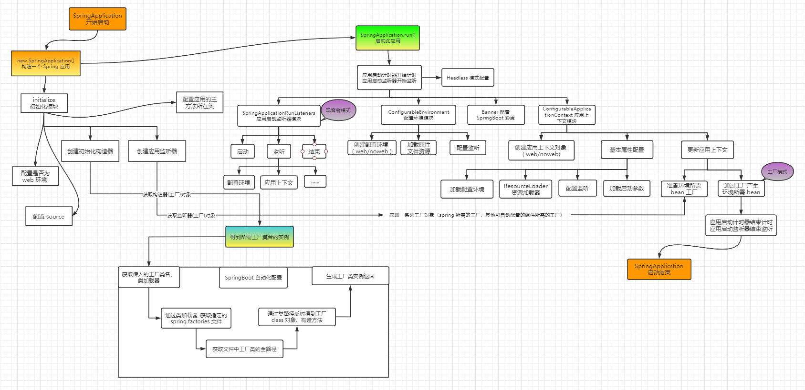

# 前言

SpringBoot为我们做的自动配置，确实方便快捷，但是对于新手来说，如果不大懂SpringBoot内部启动原理，以后难免会吃亏。所以这次博主就跟你们一起一步步揭开SpringBoot的神秘面纱，让它不在神秘。




# 正文

我们开发任何一个 Spring Boot 项目，都会用到如下的启动类 。

```java
@SpringBootApplication
public class Application {
    public static void main(String[] args) {
        SpringApplication.run(Application.class, args);
    }
}
```

从上面代码可用看出，Annotation(注解)（**@SpringBootApplication**）定义和类定义（**SpringApplication.run()**）最为耀眼 ，所以要揭开 Spring Boot 神秘的面纱，就从这两位开始延申。

## SpringBootApplication背后的秘密

```java
@Target({ElementType.TYPE})				// 注解的适用范围,TYPE用于描述类、接口（包括 包注解类型）或enum声明
@Retention(RetentionPolicy.RUNTIME)		// 注解的声明周期, 保留到class文件中（三个声明周期）
@Documented							// 表明这个注解应该被 javaDoc 记录
@Inherited							// 子类可以继承该注解
@SpringBootConfiguration					// 继承了 Configuration, 表示当前是注解类
@EnableAutoConfiguration					// 开启Spring Boot 注解功能, springboot的四大神器之一, 其借助@Import
@ComponentScan(						// 扫描路径设置
    excludeFilters = {@Filter(
    type = FilterType.CUSTOM,
    classes = {TypeExcludeFilter.class}
), @Filter(
    type = FilterType.CUSTOM,
    classes = {AutoConfigurationExcludeFilter.class}
)}
)
public @interface SpringBootApplication {
     ...
}
```

虽然定义适用了多个 Annotation 进行原信息标注，但实际上重要的只有三个 Annotation ：

- @Configuration 	（@SpringBootConfiguration 点开查看发现其内部还是应用了 @Configuration）
- @EnableAutoConfiguration
- @ComponentScan

所以，如果我们使用如下的 SpringBoot 启动类，Spring Boot 应用依然可以与之前的启动类功能对等 。

```java
@Configuration
@EnableAutoConfiguration
@ComponentScan
public class Application {
    public static void main(String[] args) {
        SpringApplication.run(Application.class, args);
    }
}
```

但是每次都要写三个注解比较繁琐，所以 写一个 @SpringBootApplication 方便点 。


## @Configuration

这里的 `@Configuration` 对我们来说并不陌生，它就是 javaConfig形式的 Spring IOC 容器的配置类使用的那个 `@Configuration` ，Spring Boot 推荐使用基于 JavaCOnfig 的配置形式。所以这里的启动类标注了 @Configuration 之后，其本身其实也是一个 IOC 容器的配置类 。

举个简单的例子回顾下，XML 跟 Config 配置方式的区别 

- 基于 XML 配置的方式 

```xml
<?xml version="1.0" encoding="UTF-8"?>
<beans xmlns="http://www.springframework.org/schema/beans"
       xmlns:xsi="http://www.w3.org/2001/XMLSchema-instance"
       xsi:schemaLocation="http://www.springframework.org/schema/beans http://www.springframework.org/schema/beans/spring-beans-3.0.xsd"
       default-lazy-init="true">
    <!--bean定义-->
</beans>
```

- 基于 JavaCOnfig 的配置方式 

```java
@Configuration
public class MockConfiguration{
    //bean定义
}
```

任何一个标注了 `@Configuration` 注解的 Java 类定义都是一个 JavaConfig 配置类 。

- 基于 XML

```xml
<bean id="mockService" class="..MockServiceImpl">
    ...
</bean>
```

- 基于 JavaConfig 

```java
@Configuration
public class MockConfiguration{
    @Bean
    public MockService mockService(){
        return new MockServiceImpl();
    }
}
```

任何一个标注了 `@Bean` 的方法，其返回值将作为一个 bean 定义注册到 Spring 的 IOC 容器中，方法名将默认成该bean定义的id。

- 为了表达bean与bean之间的依赖关系，在XML形式中一般是这样：

```xml
<bean id="mockService" class="..MockServiceImpl">
    <propery name ="dependencyService" ref="dependencyService" />
</bean>

<bean id="dependencyService" class="DependencyServiceImpl"></bean>
```

- JavaConfig 配置形式

```java
@Configuration
public class MockConfiguration{
    @Bean
    public MockService mockService(){
        return new MockServiceImpl(dependencyService());
    }
    
    @Bean
    public DependencyService dependencyService(){
        return new DependencyServiceImpl();
    }
}
```

如果一个 bean 的定义依赖其他 bean ，则直接调用对应的 JavaConfig类中依赖 bean 的创建方法就可以了 。


## @ComponentScan

@ComponentScan 注解在 Spring 很重要，它对应 XML 配置中的元素，`@ComponentScan` 的功能其实就是自动扫描并加载符合条件的组件（比如@Component 和 @Repository 等）或者 bean 定义 ，最终将这些 bean 定义加载到 IOC 容器中 。

我们可以通过 basePackages="" 等属性来细粒度的定制 @ComponentScan 自动扫描的范围，如果不指定，则**默认** Spring 会从声明 @ComponentScan 所在类的 package 包进行扫描 。

> 注：所以SpringBoot的启动类最好是放在root package (根包下) 下，因为默认不指定basePackages。


