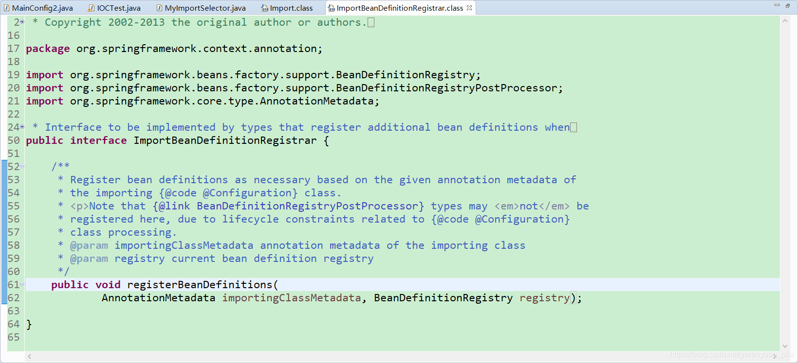
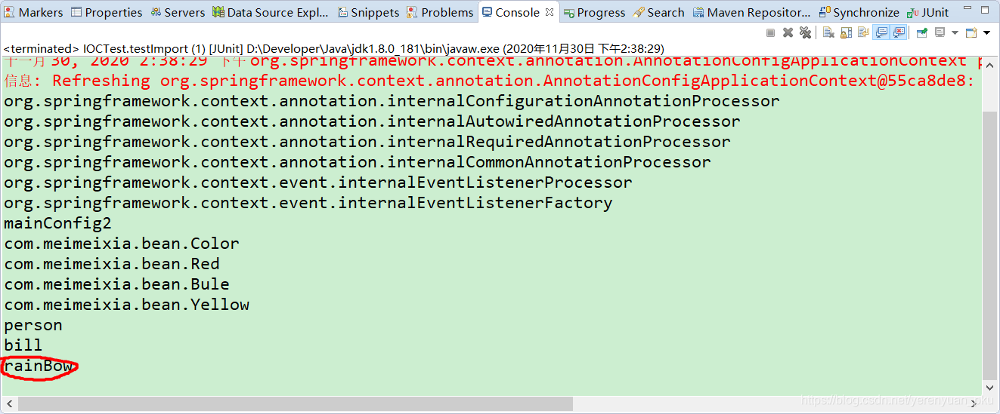

# 写在前面

在前面的文章中，我们学习了如何使用@Import注解向Spring容器中导入bean，不仅可以使用@Import注解快速向容器中导入bean，也可以在@Import注解中使用ImportSelector接口的方法导入bean，今天，我们就来说说，如何在@Import注解中使用ImportBeanDefinitionRegistrar向容器中注册bean。

# ImportBeanDefinitionRegistrar接口的简要介绍

## 概述

我们先来看看ImportBeanDefinitionRegistrar是个什么鬼，点击进入ImportBeanDefinitionRegistrar源码，如下所示。



由源码可以看出，ImportBeanDefinitionRegistrar本质上是一个接口。在ImportBeanDefinitionRegistrar接口中，有一个registerBeanDefinitions()方法，通过该方法，我们可以向Spring容器中注册bean实例。

Spring官方在动态注册bean时，大部分套路其实是使用ImportBeanDefinitionRegistrar接口。

所有实现了该接口的类都会被ConfigurationClassPostProcessor处理，ConfigurationClassPostProcessor实现了BeanFactoryPostProcessor接口，所以ImportBeanDefinitionRegistrar中动态注册的bean是优先于依赖其它bean初始化的，也能被aop、validator等机制处理。

## 使用方法

**ImportBeanDefinitionRegistrar需要配合@Configuration和@Import这俩注解**，其中，

- @Configuration注解定义Java格式的Spring配置文件，

- @Import注解导入实现了ImportBeanDefinitionRegistrar接口的类。

# ImportBeanDefinitionRegistrar接口实例

既然ImportBeanDefinitionRegistrar是一个接口，那我们就创建一个MyImportBeanDefinitionRegistrar类，去实现ImportBeanDefinitionRegistrar接口，如下所示。

```java
package com.meimeixia.condition;

import org.springframework.beans.factory.support.BeanDefinitionRegistry;
import org.springframework.context.annotation.ImportBeanDefinitionRegistrar;
import org.springframework.core.type.AnnotationMetadata;

public class MyImportBeanDefinitionRegistrar implements ImportBeanDefinitionRegistrar {

	/**
	 * AnnotationMetadata：当前类的注解信息
	 * BeanDefinitionRegistry：BeanDefinition注册类
	 * 
	 * 我们可以通过调用BeanDefinitionRegistry接口中的registerBeanDefinition方法，手动注册所有需要添加到容器中的bean
	 */
	@Override
	public void registerBeanDefinitions(AnnotationMetadata importingClassMetadata, BeanDefinitionRegistry registry) {

	}

}
```

可以看到，这里，我们先创建了MyImportBeanDefinitionRegistrar类的大体框架。然后，我们在MainConfig2配置类上的@Import注解中，添加MyImportBeanDefinitionRegistrar类，如下所示。

```java
package com.meimeixia.config;

import org.springframework.context.annotation.Bean;
import org.springframework.context.annotation.Conditional;
import org.springframework.context.annotation.Configuration;
import org.springframework.context.annotation.Import;
import org.springframework.context.annotation.Lazy;

import com.meimeixia.bean.Color;
import com.meimeixia.bean.Person;
import com.meimeixia.bean.Red;
import com.meimeixia.condition.LinuxCondition;
import com.meimeixia.condition.MyImportBeanDefinitionRegistrar;
import com.meimeixia.condition.MyImportSelector;
import com.meimeixia.condition.WindowsCondition;

// 对配置类中的组件进行统一设置
@Conditional({WindowsCondition.class}) // 满足当前条件，这个类中配置的所有bean注册才能生效
@Configuration
@Import({Color.class, Red.class, MyImportSelector.class, MyImportBeanDefinitionRegistrar.class}) // @Import快速地导入组件，id默认是组件的全类名
public class MainConfig2 {
	
	@Lazy
	@Bean("person")
	public Person person() {
		System.out.println("给容器中添加咱们这个Person对象...");
		return new Person("superMan", 25);
	}
	
	@Bean("bill")
	public Person person01() {
		return new Person("Bill Gates", 62);
	}
	
	@Conditional({LinuxCondition.class})
	@Bean("linus")
	public Person person02() {
		return new Person("linus", 48);
	}
	
}
```

接着，创建一个RainBow类，作为测试ImportBeanDefinitionRegistrar接口的bean来使用，如下所示。

```java
package com.meimeixia.bean;

public class RainBow {

}
```

紧接着，我们就要实现MyImportBeanDefinitionRegistrar类中的**registerBeanDefinitions**()方法里面的逻辑了，添加逻辑后的registerBeanDefinitions()方法如下所示。

```java
package com.meimeixia.condition;

import org.springframework.beans.factory.support.BeanDefinitionRegistry;
import org.springframework.beans.factory.support.RootBeanDefinition;
import org.springframework.context.annotation.ImportBeanDefinitionRegistrar;
import org.springframework.core.type.AnnotationMetadata;

import com.meimeixia.bean.RainBow;

public class MyImportBeanDefinitionRegistrar implements ImportBeanDefinitionRegistrar {

	/**
	 * AnnotationMetadata：当前类的注解信息
	 * BeanDefinitionRegistry：BeanDefinition注册类
	 * 
	 * 我们可以通过调用BeanDefinitionRegistry接口中的registerBeanDefinition方法，手动注册所有需要添加到容器中的bean
	 */
	@Override
	public void registerBeanDefinitions(AnnotationMetadata importingClassMetadata, BeanDefinitionRegistry registry) {
		boolean definition = registry.containsBeanDefinition("com.meimeixia.bean.Red");
		boolean definition2 = registry.containsBeanDefinition("com.meimeixia.bean.Blue");
		if (definition && definition2) {
			// 指定bean的定义信息，包括bean的类型、作用域等等
			// RootBeanDefinition是BeanDefinition接口的一个实现类
			RootBeanDefinition beanDefinition = new RootBeanDefinition(RainBow.class); // bean的定义信息
			// 注册一个bean，并且指定bean的名称
			registry.registerBeanDefinition("rainBow", beanDefinition);
		}
	}

}
```

以上registerBeanDefinitions()方法的实现逻辑很简单，就是判断Spring容器中是否同时存在以`com.meimeixia.bean.Red`命名的bean和以`com.meimeixia.bean.Blue`命名的bean，如果真的同时存在，那么向Spring容器中注入一个以rainBow命名的bean。

最后，我们运行IOCTest类中的testImport()方法来进行测试，输出结果信息如下所示。



可以看到，此时输出了rainBow，说明Spring容器中已经成功注册了以rainBow命名的bean。