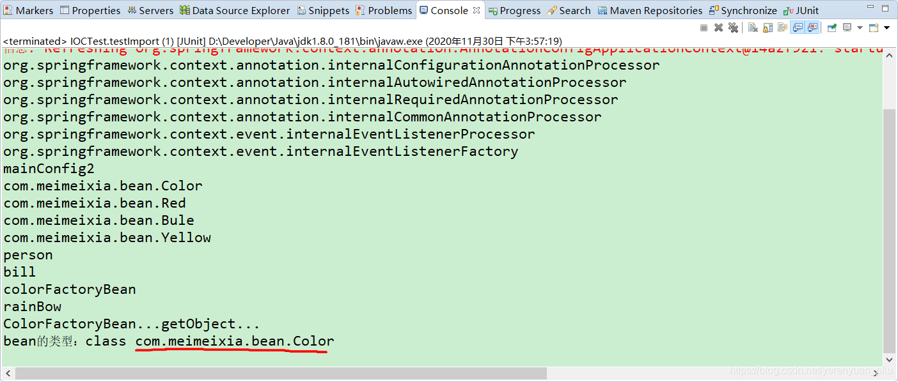

# 写在前面

经过前面的学习，我们知道可以通过多种方式向Spring容器中注册bean。可以使用@Configuration注解结合@Bean注解向Spring容器中注册bean；可以按照条件向Spring容器中注册bean；可以使用@Import注解向容器中快速导入bean对象；可以在@Import注解中使用ImportBeanDefinitionRegistrar向容器中注册bean。

而在本文中，我就来讲讲如何使用FactoryBean向Spring容器中注册bean。

# FactoryBean概述

一般情况下，Spring是通过反射机制利用bean的class属性指定实现类来实例化bean的。在某些情况下，实例化bean过程比较复杂，如果按照传统的方式，那么则需要在标签中提供大量的配置信息，配置方式的灵活性是受限的，这时采用编码的方式可以得到一个更加简单的方案。Spring为此提供了一个org.springframework.bean.factory.FactoryBean的工厂类接口，用户可以通过实现该接口定制实例化bean的逻辑。

FactoryBean接口对于Spring框架来说占有非常重要的地位，Spring自身就提供了70多个FactoryBean接口的实现。它们隐藏了实例化一些复杂bean的细节，给上层应用带来了便利。从Spring 3.0开始，FactoryBean开始支持泛型，即接口声明改为FactoryBean<T>的形式。

在`Spring 4.3.12.RELEASE`这个版本中，FactoryBean接口的定义如下所示。


- T getObject()：返回由FactoryBean创建的bean实例，如果isSingleton()返回true，那么该实例会放到Spring容器中单实例缓存池中
- boolean isSingleton()：返回由FactoryBean创建的bean实例的作用域是singleton还是prototype
- Class getObjectType()：返回FactoryBean创建的bean实例的类型

这里，需要注意的是：**当配置文件中标签的class属性配置的实现类是FactoryBean时，通过 getBean()方法返回的不是FactoryBean本身，而是FactoryBean#getObject()方法所返回的对象，相当于FactoryBean#getObject()代理了getBean()方法。** 

# FactoryBean案例

首先，创建一个ColorFactoryBean类，它得实现FactoryBean接口，如下所示。

```java
package com.meimeixia.bean;

import org.springframework.beans.factory.FactoryBean;

/**
 * 创建一个Spring定义的FactoryBean
 * T（泛型）：指定我们要创建什么类型的对象
 * @author liayun
 * 
 */
public class ColorFactoryBean implements FactoryBean<Color> {

	// 返回一个Color对象，这个对象会添加到容器中
	@Override
	public Color getObject() throws Exception {
		// TODO Auto-generated method stub
		System.out.println("ColorFactoryBean...getObject...");
		return new Color();
	}

	@Override
	public Class<?> getObjectType() {
		// TODO Auto-generated method stub
		return Color.class; // 返回这个对象的类型
	}

	// 是单例吗？
	// 如果返回true，那么代表这个bean是单实例，在容器中只会保存一份；
	// 如果返回false，那么代表这个bean是多实例，每次获取都会创建一个新的bean
	@Override
	public boolean isSingleton() {
		// TODO Auto-generated method stub
		return false;
	}

}
```

然后，我们在MainConfig2配置类中加入ColorFactoryBean的声明，如下所示。

```java
package com.meimeixia.config;

import org.springframework.context.annotation.Bean;
import org.springframework.context.annotation.Conditional;
import org.springframework.context.annotation.Configuration;
import org.springframework.context.annotation.Import;
import org.springframework.context.annotation.Lazy;

import com.meimeixia.bean.Color;
import com.meimeixia.bean.ColorFactoryBean;
import com.meimeixia.bean.Person;
import com.meimeixia.bean.Red;
import com.meimeixia.condition.LinuxCondition;
import com.meimeixia.condition.MyImportBeanDefinitionRegistrar;
import com.meimeixia.condition.MyImportSelector;
import com.meimeixia.condition.WindowsCondition;

// 对配置类中的组件进行统一设置
@Conditional({WindowsCondition.class}) // 满足当前条件，这个类中配置的所有bean注册才能生效
@Configuration
@Import({Color.class, Red.class, MyImportSelector.class, MyImportBeanDefinitionRegistrar.class}) // @Import快速地导入组件，id默认是组件的全类名
public class MainConfig2 {
	
	@Lazy
	@Bean("person")
	public Person person() {
		System.out.println("给容器中添加咱们这个Person对象...");
		return new Person("superMan", 25);
	}

	@Bean("bill")
	public Person person01() {
		return new Person("Bill Gates", 62);
	}
	
	@Conditional({LinuxCondition.class})
	@Bean("linus")
	public Person person02() {
		return new Person("linus", 48);
	}

	@Bean
	public ColorFactoryBean colorFactoryBean() {
		return new ColorFactoryBean();
	}
	
}
```

这里需要小伙伴们注意的是：我在这里使用@Bean注解向Spring容器中注册的是ColorFactoryBean对象。

```java
@Test
public void testImport() {
    AnnotationConfigApplicationContext applicationContext = new AnnotationConfigApplicationContext(MainConfig2.class);
    String[] definitionNames = applicationContext.getBeanDefinitionNames();
    for (String name : definitionNames) {
        System.out.println(name);
    }
}
```

那现在我们就来看看Spring容器中到底都有哪些bean。我们所要做的事情就是，运行IOCTest类中的testImport()方法，此时，输出的结果信息如下所示。


再次运行IOCTest类中的testImport()方法，发现输出的结果信息如下所示。



可以看到，虽然我在代码中使用@Bean注解注入的是ColorFactoryBean对象，但是实际上从Spring容器中获取到的bean对象却是调用ColorFactoryBean类中的getObject()方法获取到的Color对象。

在ColorFactoryBean类中，我们将Color对象设置为单实例bean，即让isSingleton()方法返回true。接下来，我们在IOCTest类中的testImport()方法里面多次获取Color对象，并判断一下多次获取的对象是否为同一对象，如下所示。

```java
@Test
public void testImport() {
    AnnotationConfigApplicationContext applicationContext = new AnnotationConfigApplicationContext(MainConfig2.class);
    String[] definitionNames = applicationContext.getBeanDefinitionNames();
    for (String name : definitionNames) {
        System.out.println(name);
    }
    
    // 工厂bean获取的是调用getObject方法创建的对象
    Object bean2 = applicationContext.getBean("colorFactoryBean");
    Object bean3 = applicationContext.getBean("colorFactoryBean");
    System.out.println("bean的类型：" + bean2.getClass());
    System.out.println(bean2 == bean3);
}
```

然后，运行IOCTest类中的testImport()方法，此时输出的结果信息如下所示。


可以看到，在ColorFactoryBean类中的isSingleton()方法里面返回true时，每次获取到的Color对象都是同一个对象，说明Color对象是单实例bean。

这里，可能就会有小伙伴要问了，如果将Color对象修改成多实例bean呢？别急，这里我们只需要在ColorFactoryBean类的isSingleton()方法中返回false即可，这样就会将Color对象设置为多实例bean，如下所示。

```java
package com.meimeixia.bean;

import org.springframework.beans.factory.FactoryBean;

/**
 * 创建一个Spring定义的FactoryBean
 * T（泛型）：指定我们要创建什么类型的对象
 * @author liayun
 * 
 */
public class ColorFactoryBean implements FactoryBean<Color> {

	// 返回一个Color对象，这个对象会添加到容器中
	@Override
	public Color getObject() throws Exception {
		// TODO Auto-generated method stub
		System.out.println("ColorFactoryBean...getObject...");
		return new Color();
	}

	@Override
	public Class<?> getObjectType() {
		// TODO Auto-generated method stub
		return Color.class; // 返回这个对象的类型
	}

	// 是单例吗？
	// 如果返回true，那么代表这个bean是单实例，在容器中只会保存一份；
	// 如果返回false，那么代表这个bean是多实例，每次获取都会创建一个新的bean
	@Override
	public boolean isSingleton() {
		// TODO Auto-generated method stub
		return false;
	}

}
```

**Spring 容器会调用 getObject() 方法获取到其方法定义的Bean** 

接着，再次运行IOCTest类中的testImport()方法，会发现输出的结果信息如下所示。


可以看到，最终结果返回了false，说明此时Color对象是多实例bean。

# 如何在Spring容器中获取到FactoryBean对象本身呢？

之前，我们使用@Bean注解向Spring容器中注册的是ColorFactoryBean，获取出来的却是Color对象。那么，小伙伴们可能会问了，我就想获取ColorFactoryBean实例，那么该怎么办呢？

其实，这也很简单，**只需要在获取工厂Bean本身时，在id前面加上&符号即可，例如&colorFactoryBean。**

打开我们的IOCTest测试类，在testImport()方法中添加获取ColorFactoryBean实例的代码，如下所示。

```java
public void testImport() {
    AnnotationConfigApplicationContext applicationContext = new AnnotationConfigApplicationContext(MainConfig2.class);
    String[] definitionNames = applicationContext.getBeanDefinitionNames();
    for (String name : definitionNames) {
        System.out.println(name);
    }
    
    // 工厂bean获取的是调用getObject方法创建的对象
    Object bean2 = applicationContext.getBean("colorFactoryBean");
    Object bean3 = applicationContext.getBean("colorFactoryBean");
    System.out.println("bean的类型：" + bean2.getClass());
    System.out.println(bean2 == bean3);
    
    Object bean4 = applicationContext.getBean("&colorFactoryBean");
    System.out.println(bean4.getClass());
}
```

此时，运行以上testImport()方法，会发现输出的结果信息如下所示。


可以看到，在获取bean时，在id前面加上&符号就会获取到ColorFactoryBean实例对象。

那问题又来了！！**为什么在id前面加上&符号就会获取到ColorFactoryBean实例对象呢？** 

接下来，我们就要揭开这个神秘的面纱了，打开BeanFactory接口，查看其源码。


看到这里，是不是明白了呢？没错，在BeanFactory接口中定义了一个&前缀，只要我们使用bean的id来从Spring容器中获取bean时，Spring就会知道我们是在获取FactoryBean本身。

