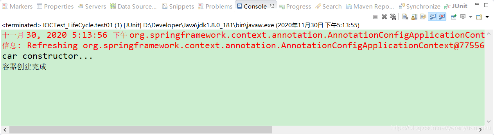
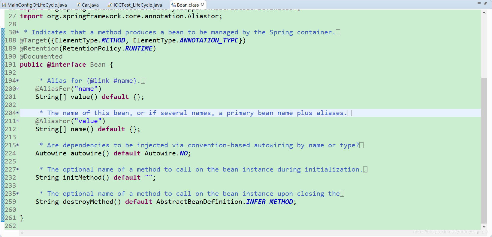
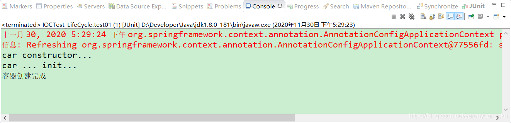
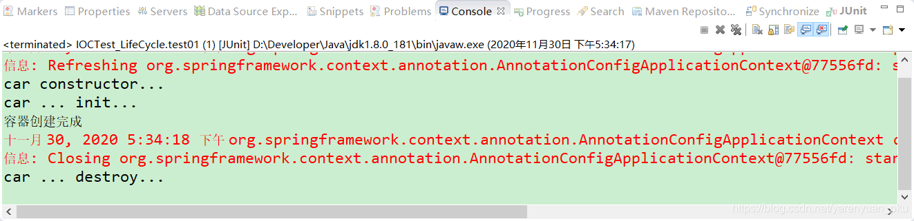
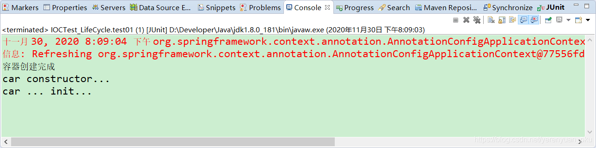
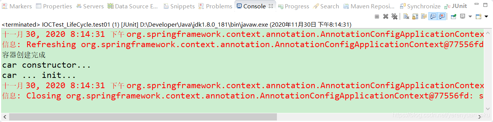

# bean的生命周期

通常意义上讲的bean的生命周期，指的是bean从创建到初始化，经过一系列的流程，最终销毁的过程。只不过，在Spring中，bean的生命周期是由Spring容器来管理的。在Spring中，我们可以自己来指定bean的初始化和销毁的方法。我们指定了bean的初始化和销毁方法之后，当容器在bean进行到当前生命周期的阶段时，会自动调用我们自定义的初始化和销毁方法。

<br/>

# 如何定义初始化和销毁方法？

我们已经知道了由Spring管理bean的生命周期时，我们可以指定bean的初始化和销毁方法，那具体该如何定义这些初始化和销毁方法呢？接下来，我们就介绍第一种定义初始化和销毁方法的方式：通过@Bean注解指定初始化和销毁方法。

如果是使用XML配置文件的方式配置bean的话，那么可以在标签中指定bean的初始化和销毁方法，如下所示。

```xml
<bean id="person" class="com.meimeixia.bean.Person" init-method="init" destroy-method="destroy">
    <property name="age" value="18"></property>
    <property name="name" value="liayun"></property>
</bean>
```

这里，需要注意的是，在我们自己写的Person类中，**需要存在init()方法和destroy()方法**。而且Spring中还规定，这里的**init()方法和destroy()方法必须是无参方法**，但可以抛出异常。

如果我们使用注解的方式，那么该如何实现指定bean的初始化和销毁方法呢？别急，我们下面就一起来搞定它！！

首先，创建一个名称为Car的类，这个类的实现比较简单，如下所示。

```java
package com.meimeixia.bean;

public class Car {

	public Car() {
		System.out.println("car constructor...");
	}
	
	public void init() {
		System.out.println("car ... init...");
	}
	
	public void destroy() {
		System.out.println("car ... destroy...");
	}
	
}
```

然后，我们将Car类对象通过注解的方式注册到Spring容器中，具体的做法就是新建一个MainConfigOfLifeCycle类作为Spring的配置类，将Car类对象通过MainConfigOfLifeCycle类注册到Spring容器中，MainConfigOfLifeCycle类的代码如下所示。

```java
package com.meimeixia.config;

import org.springframework.context.annotation.Bean;
import org.springframework.context.annotation.Configuration;

import com.meimeixia.bean.Car;

@Configuration
public class MainConfigOfLifeCycle {

	@Bean
	public Car car() {
		return new Car();
	}

}
```

接着，我们就新建一个IOCTest_LifeCycle类来测试容器中的Car对象，该测试类的代码如下所示。

```java
package com.meimeixia.test;

import org.junit.Test;
import org.springframework.context.annotation.AnnotationConfigApplicationContext;

import com.meimeixia.config.MainConfigOfLifeCycle;

public class IOCTest_LifeCycle {
	
	@Test
	public void test01() {
		// 1. 创建IOC容器
		AnnotationConfigApplicationContext applicationContext = new AnnotationConfigApplicationContext(MainConfigOfLifeCycle.class);
		System.out.println("容器创建完成");
	}

}
```

在前面的文章中，我们说过，对于单实例bean对象来说，在Spring容器创建完成后，就会对单实例bean进行实例化。那么，我们先来运行下IOCTest_LifeCycle类中的test01()方法，发现输出的结果信息如下所示。



可以看到，在Spring容器创建完成时，会自动调用单实例bean的构造方法，对单实例bean进行了实例化操作。

**总之，对于单实例bean来说，会在Spring容器启动的时候创建对象；对于多实例bean来说，会在每次获取bean的时候创建对象。** 

现在，我们在Car类中指定了init()方法和destroy()方法，那么，如何让Spring容器知道Car类中的init()方法是用来执行对象的初始化操作，而destroy()方法是用来执行对象的销毁操作呢？如果是使用XML文件配置的话，那么我们可以使用如下配置来实现。

```xml
<bean id="car" class="com.meimeixia.bean.Car" init-method="init" destroy-method="destroy">

</bean>
```

如果我们使用的是@Bean注解，那么又该如何实现呢？其实很简单，我们来看下@Bean注解的源码，如下所示。



看到@Bean注解的源码，相信小伙伴们会有种豁然开朗的感觉，没错，就是使用@Bean注解的**initMethod**属性和**destroyMethod**属性来指定bean的初始化方法和销毁方法。

所以，我们得在 MainConfigOfLifeCycle 配置类的@Bean注解中指定**initMethod**属性和**destroyMethod**属性，如下所示。

```java
package com.meimeixia.config;

import org.springframework.context.annotation.Bean;
import org.springframework.context.annotation.Configuration;

import com.meimeixia.bean.Car;

@Configuration
public class MainConfigOfLifeCycle {

	@Bean(initMethod="init", destroyMethod="destroy")
	public Car car() {
		return new Car();
	}

}
```

此时，我们再来运行IOCTest_LifeCycle类中的test01()方法，会发现输出的结果信息如下所示。



从输出结果中可以看出，在Spring容器中，先是调用了Car类的构造方法来创建Car对象，接下来便是调用了Car对象的init()方法来进行初始化。

**有些小伙伴们可能会问了，运行上面的测试方法并没有打印出bean的销毁方法中的信息啊，那什么时候执行bean的销毁方法呢？这个问题问的很好，bean的销毁方法是在容器关闭的时候被调用的。** 

所以，我们在IOCTest_LifeCycle类中的test01()方法中，添加关闭容器的代码，如下所示。

```java
package com.meimeixia.test;

import org.junit.Test;
import org.springframework.context.annotation.AnnotationConfigApplicationContext;

import com.meimeixia.config.MainConfigOfLifeCycle;

public class IOCTest_LifeCycle {
	
	@Test
	public void test01() {
		// 1. 创建IOC容器
		AnnotationConfigApplicationContext applicationContext = new AnnotationConfigApplicationContext(MainConfigOfLifeCycle.class);
		System.out.println("容器创建完成");
		
		// 关闭容器
		applicationContext.close();
	}

}
```

此时，我们再来运行IOCTest_LifeCycle类中的test01()方法，会发现输出的结果信息如下所示。



可以看到，此时输出了对象的销毁方法中的信息，说明执行了对象的销毁方法。

# 指定初始化和销毁方法的使用场景

一个典型的使用场景就是对于数据源的管理。例如，在配置数据源时，在初始化的时候，会对很多的数据源的属性进行赋值操作；在销毁的时候，我们需要对数据源的连接等信息进行关闭和清理。这个时候，我们就可以在自定义的初始化和销毁方法中来做这些事情了！

<br/>

# 初始化和销毁方法调用的时机

你有没有想过这样一个问题，初始化方法和销毁方法是在什么时候被调用的啊？

- bean对象的初始化方法调用的时机：对象创建完成，如果对象中存在一些属性，并且这些属性也都赋好值之后，那么就会调用bean的初始化方法。对于单实例bean来说，在Spring容器创建完成后，Spring容器会自动调用bean的初始化方法；对于多实例bean来说，在每次获取bean对象的时候，调用bean的初始化方法。
- bean对象的销毁方法调用的时机：对于单实例bean来说，在容器关闭的时候，会调用bean的销毁方法；对于多实例bean来说，Spring容器不会管理这个bean，也就不会自动调用这个bean的销毁方法了。不过，小伙伴们可以手动调用多实例bean的销毁方法。

前面，我们已经说了单实例bean的初始化和销毁方法。接下来，我们来说下多实例bean的初始化和销毁方法。我们将Car对象变成多实例bean来验证下。

首先，我们在MainConfigOfLifeCycle配置类中的car()方法上通过@Scope注解将Car对象设置成多实例bean，如下所示。

```java
package com.meimeixia.config;

import org.springframework.context.annotation.Bean;
import org.springframework.context.annotation.Configuration;
import org.springframework.context.annotation.Scope;

import com.meimeixia.bean.Car;

@Configuration
public class MainConfigOfLifeCycle {

	@Scope("prototype")
	@Bean(initMethod="init", destroyMethod="destroy")
	public Car car() {
		return new Car();
	}

}
```

然后，我们修改一下IOCTest_LifeCycle类中的test01()方法，将关闭容器的那行代码给注释掉，如下所示。



可以看到，此时，结果信息中输出了构造方法和初始化方法中的信息。

当我们在获取多实例bean对象的时候，会创建对象并进行初始化，但是销毁方法是在什么时候被调用呢？是在容器关闭的时候吗？我们可以将IOCTest_LifeCycle类中的test01()方法里面的那行关闭容器的代码放开来进行验证，就像下面这样。

```java
@Test
public void test01() {
	// 1. 创建IOC容器
	AnnotationConfigApplicationContext applicationContext = new AnnotationConfigApplicationContext(MainConfigOfLifeCycle.class);
	System.out.println("容器创建完成");
	
	applicationContext.getBean("car"); // 多实例bean在获取的时候才创建对象
	
	// 关闭容器
	applicationContext.close();
}
```

此时，运行以上test01()方法，输出的结果信息如下所示。



可以看到，多实例的bean在容器关闭的时候是不进行销毁的，也就是说你每次获取时，IOC容器帮你创建出对象交还给你，至于要什么时候销毁这是你自己的事，Spring容器压根就不会再管理这些多实例的bean了。