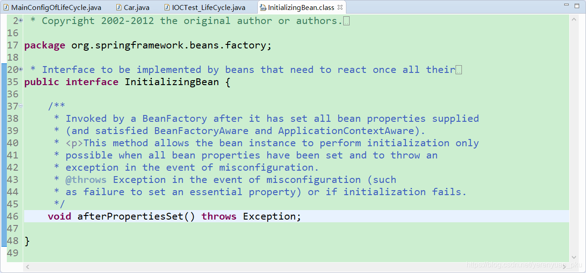
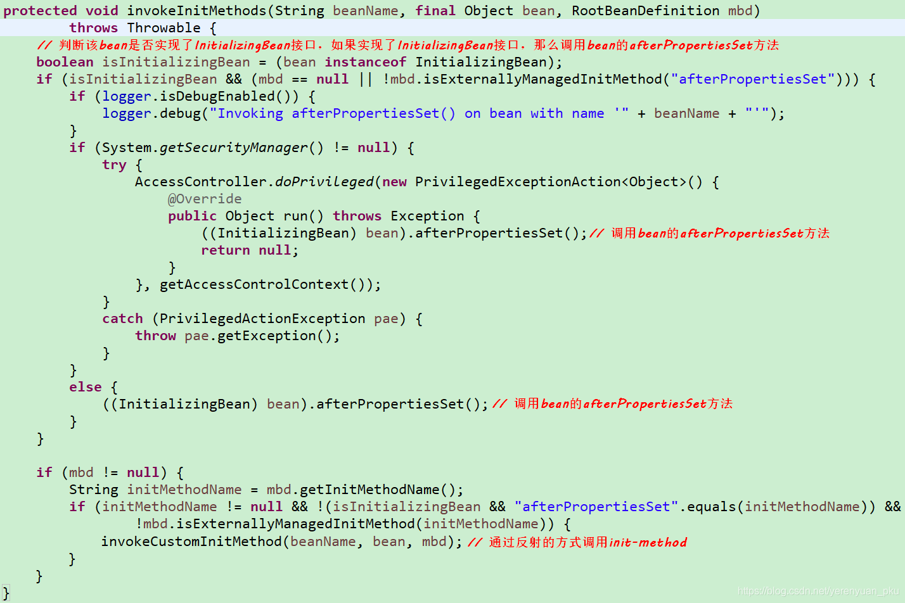
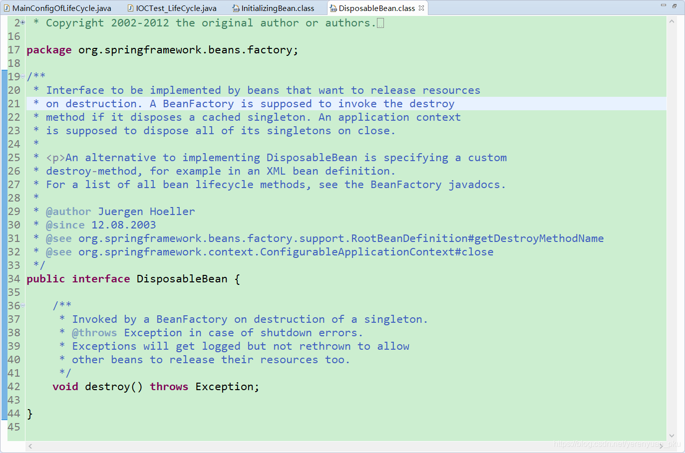
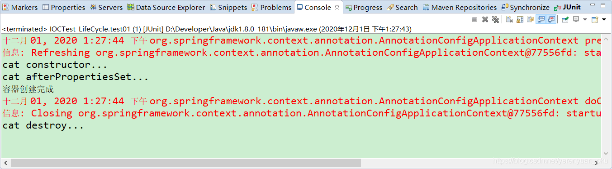
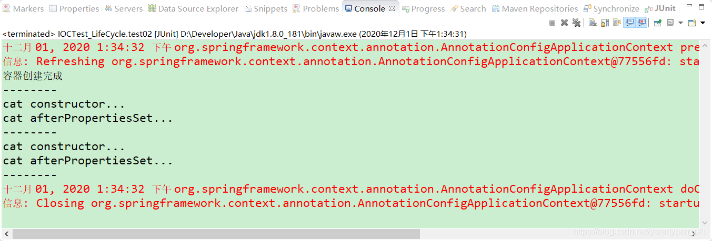

# 写在前面

在上一讲中，我们讲述了如何使用@Bean注解来指定bean初始化和销毁的方法，具体的用法就是在@Bean注解中使用init-method属性和destroy-method属性来指定初始化方法和销毁方法。除此之外，Spring中是否还提供了其他的方式来对bean实例进行初始化和销毁呢？

# InitializingBean接口

## InitializingBean接口概述

Spring中提供了一个InitializingBean接口，该接口为bean提供了属性初始化后的处理方法，它只包括afterPropertiesSet方法，凡是继承该接口的类，在bean的属性初始化后都会执行该方法。InitializingBean接口的源码如下所示。	



根据InitializingBean接口中提供的afterPropertiesSet()方法的名字不难推断出，afterPropertiesSet()方法是在属性赋好值之后调用的。

那到底是不是这样的呢？下面我们来分析下afterPropertiesSet()方法的调用时机。

<br/>

## 何时调用InitializingBean接口？

我们定位到Spring中的 `org.springframework.beans.factory.support.AbstractAutowireCapableBeanFactory` 这个类里面的**invokeInitMethods**()方法中，来查看Spring加载bean的方法。

**题外话：不要问我为什么会是这个invokeInitMethods()方法，问我我也不知道，因为我就不熟悉Spring框架的源码，那就更加没看过它的源码了，可能有些小伙伴比较熟悉Spring框架的源码，那他自然就知道是这个invokeInitMethods()方法了。不熟悉Spring框架的源码的同学（比如笔者本人），也没关系，你只须定位到该方法中即可。所以，小伙伴们不要只顾着使用Spring，还是要多看看Spring的源码啊！Spring框架中使用了大量优秀的设计模型，其代码的编写规范和严谨程度也是业界开源框架中数一数二的，非常值得阅读。**

我们来到AbstractAutowireCapableBeanFactory类中的invokeInitMethods()方法处，如下所示。



分析上述代码后，我们可以初步得出如下信息：

1. Spring为bean提供了两种初始化的方式，**实现InitializingBean接口**（也就是要实现该接口中的afterPropertiesSet方法），或者在配置文件或**@Bean注解中通过init-method**来指定，两种方式可以同时使用。
2. 实现InitializingBean接口是直接调用afterPropertiesSet()方法，与通过反射调用init-method指定的方法相比，效率相对来说要高点。但是**init-method方式消除了对Spring的依赖**。
3. 如果调用afterPropertiesSet方法时出错，那么就不会调用init-method指定的方法了。

也就是说Spring为bean提供了两种初始化的方式，第一种方式是实现InitializingBean接口（也就是要实现该接口中的afterPropertiesSet方法），第二种方式是在配置文件或@Bean注解中通过init-method来指定，这两种方式可以同时使用，同时使用先调用afterPropertiesSet方法，后执行init-method指定的方法。

<br/>

# DisposableBean接口

## DisposableBean接口概述

实现 `org.springframework.beans.factory.DisposableBean` 接口的bean在销毁前，Spring将会调用DisposableBean接口的destroy()方法。也就是说我们可以实现DisposableBean这个接口来定义咱们这个销毁的逻辑。

我们先来看下DisposableBean接口的源码，如下所示。



可以看到，在DisposableBean接口中只定义了一个destroy()方法。

在bean生命周期结束前调用destroy()方法做一些收尾工作，亦可以使用destroy-method。

前者与Spring耦合高，使用**类型强转.方法名()**，效率高；后者耦合低，使用反射，效率相对来说较低。

<br/>

## DisposableBean接口注意事项

多实例bean的生命周期不归Spring容器来管理，这里的DisposableBean接口中的方法是由Spring容器来调用的，所以如果一个多实例bean实现了DisposableBean接口是没有啥意义的，因为相应的方法根本不会被调用，当然了，在XML配置文件中指定了destroy方法，也是没有任何意义的。所以，**在多实例bean情况下，Spring是不会自动调用bean的销毁方法的**。

# 单实例bean案例

首先，创建一个Cat的类来实现InitializingBean和DisposableBean这俩接口，代码如下所示，注意该Cat类上标注了一个@Component注解。

```java
package com.meimeixia.bean;

import org.springframework.beans.factory.DisposableBean;
import org.springframework.beans.factory.InitializingBean;
import org.springframework.stereotype.Component;

@Component
public class Cat implements InitializingBean, DisposableBean {
	
	public Cat() {
		System.out.println("cat constructor...");
	}

	/**
	 * 会在容器关闭的时候进行调用
	 */
	@Override
	public void destroy() throws Exception {
		// TODO Auto-generated method stub
		System.out.println("cat destroy...");
	}

	/**
	 * 会在bean创建完成，并且属性都赋好值以后进行调用
	 */
	@Override
	public void afterPropertiesSet() throws Exception {
		// TODO Auto-generated method stub
		System.out.println("cat afterPropertiesSet...");
	}

}
```

然后，在MainConfigOfLifeCycle配置类中通过包扫描的方式将以上类注入到Spring容器中。

```java
package com.meimeixia.config;

import org.springframework.context.annotation.Bean;
import org.springframework.context.annotation.ComponentScan;
import org.springframework.context.annotation.Configuration;
import org.springframework.context.annotation.Scope;

import com.meimeixia.bean.Car;

@ComponentScan("com.meimeixia.bean")
@Configuration
public class MainConfigOfLifeCycle {

	@Scope("prototype")
	@Bean(initMethod="init", destroyMethod="destroy")
	public Car car() {
		return new Car();
	}
	
}
```

```java
@Test
public void test01() {
    // 1. 创建IOC容器
    AnnotationConfigApplicationContext applicationContext = new AnnotationConfigApplicationContext(MainConfigOfLifeCycle.class);
    System.out.println("容器创建完成");
    
    // 调用时创建对象
    Object bean = applicationContext.getBean("cat");
    
    // 关闭容器
    applicationContext.close();
}
```

接着，运行IOCTest_LifeCycle类中的test01()方法，输出的结果信息如下所示。



从输出的结果信息中可以看出，单实例bean情况下，IOC容器创建完成后，会自动调用bean的初始化方法；而在容器销毁前，会自动调用bean的销毁方法。

<br/>

# 多实例bean案例

多实例bean的案例代码基本与单实例bean的案例代码相同，只不过是在Cat类上添加了一个`@Scope("prototype")`注解，如下所示。

```java
package com.meimeixia.bean;

import org.springframework.beans.factory.DisposableBean;
import org.springframework.beans.factory.InitializingBean;
import org.springframework.context.annotation.Scope;
import org.springframework.stereotype.Component;

@Scope("prototype")
@Component
public class Cat implements InitializingBean, DisposableBean {
	
	public Cat() {
		System.out.println("cat constructor...");
	}

	/**
	 * 会在容器关闭的时候进行调用
	 */
	@Override
	public void destroy() throws Exception {
		// TODO Auto-generated method stub
		System.out.println("cat destroy...");
	}

	/**
	 * 会在bean创建完成，并且属性都赋好值以后进行调用
	 */
	@Override
	public void afterPropertiesSet() throws Exception {
		// TODO Auto-generated method stub
		System.out.println("cat afterPropertiesSet...");
	}

}
```

然后，我们在IOCTest_LifeCycle类中新增一个test02()方法来进行测试，如下所示。

```java
@Test
public void test02() {
    // 1. 创建IOC容器
    AnnotationConfigApplicationContext applicationContext = new AnnotationConfigApplicationContext(MainConfigOfLifeCycle.class);
    System.out.println("容器创建完成");
    System.out.println("--------");
    
    // 调用时创建对象
    Object bean = applicationContext.getBean("cat");
    System.out.println("--------");
    
    // 调用时创建对象
    Object bean1 = applicationContext.getBean("cat");
    System.out.println("--------"); 
    
    // 关闭容器
    applicationContext.close();
}
```

接着，运行IOCTest_LifeCycle类中的test02()方法，输出的结果信息如下所示。



从输出的结果信息中可以看出，在多实例bean情况下，Spring不会自动调用bean的销毁方法。