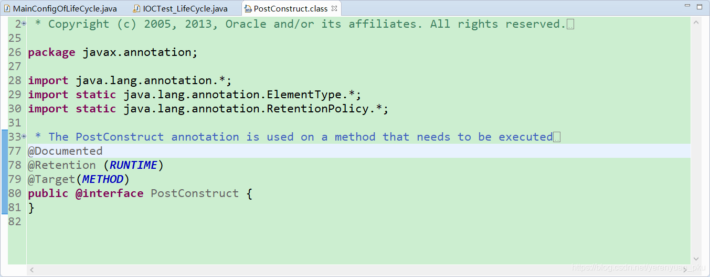
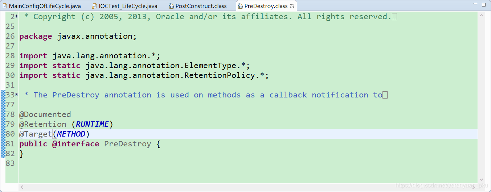
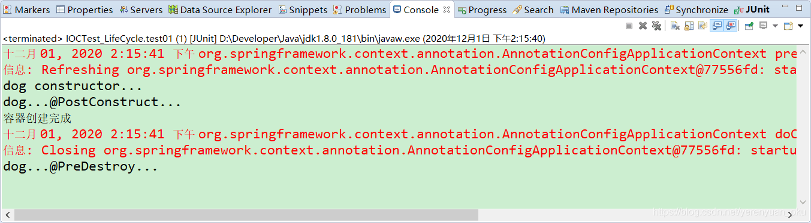

# 写在前面

在之前的文章中，我们介绍了如何使用 `@Bean` 注解指定初始化和销毁的方法，也介绍了使用 `InitializingBean` 和 `DisposableBean` 来处理bean的初始化和销毁。除此之外，在JDK中还提供了两个注解能够在bean创建完成并且属性赋值完成之后执行一些初始化工作和在容器销毁bean之前通知我们进行一些清理工作。今天，我们就一起来看看这两个注解的用法。

# @PostConstruct注解和@PreDestroy注解

## @PostConstruct注解

`@PostConstruct` 注解好多人以为是Spring提供的，其实它是Java自己的注解，是 JSR-250 规范里面定义的一个注解。我们来看下 `@PostConstruct` 注解的源码，如下所示。



从源码可以看出，**@PostConstruct注解是Java中的注解，并不是Spring提供的注解。** 

**@PostConstruct 注解被用来修饰一个非静态的void()方法**。**被 @PostConstruct 注解修饰的方法会在服务器加载Servlet的时候运行，并且只会被服务器执行一次**。**被@PostConstruct注解修饰的方法通常在构造函数之后，init()方法之前执行。**

通常我们是会在Spring框架中使用到@PostConstruct注解的，该注解的方法在整个bean初始化中的执行顺序如下：

> Constructor（构造方法）→@Autowired（依赖注入）→@PostConstruct（注释的方法）

<br/>

## @PreDestroy注解

`@PreDestroy` 注解同样是Java提供的，它也是 JSR-250 规范里面定义的一个注解。看下它的源码，如下所示。



被 `@PreDestroy` 注解修饰的方法会在**服务器卸载Servlet的时候运行，并且只会被服务器调用一次**，类似于Servlet的destroy()方法。被@PreDestroy注解修饰的方法会在destroy()方法之后，Servlet被彻底卸载之前执行。执行顺序如下所示：

> 调用destroy()方法→@PreDestroy→destroy()方法→bean销毁

<br/>

## 小结

@PostConstruct 和 @PreDestroy 是Java规范 JSR-250 引入的注解，定义了对象的创建和销毁工作，同一期规范中还有 @Resource 注解，Spring 也支持了这些注解。

<br/>

# 案例

对@PostConstruct注解和@PreDestroy注解有了简单的了解之后，接下来，我们就写一个简单的程序来加深对这两个注解的理解。

首先，我们创建一个Dog类，如下所示，注意在该类上标注了一个@Component注解。

```java
package com.meimeixia.bean;

import javax.annotation.PostConstruct;
import javax.annotation.PreDestroy;

import org.springframework.stereotype.Component;

/**
 *
 * @author liayun
 *
 */
@Component
public class Dog {

	public Dog() {
		System.out.println("dog constructor...");
	}
	
	// 在对象创建完成并且属性赋值完成之后调用
	@PostConstruct
	public void init() {
		System.out.println("dog...@PostConstruct...");
	}
	
	// 在容器销毁（移除）对象之前调用
	@PreDestroy
	public void destory() {
		System.out.println("dog...@PreDestroy...");
	}
	
}
```

可以看到，在以上Dog类中，我们提供了构造方法、init() 方法以及 destroy() 方法，并且还使用了 @PostConstruct 注解和 @PreDestroy 注解来分别标注 init() 方法和 destroy() 方法。

然后，在MainConfigOfLifeCycle配置类中通过包扫描的方式将以上类注入到Spring容器中。

```java
package com.meimeixia.config;

import org.springframework.context.annotation.Bean;
import org.springframework.context.annotation.ComponentScan;
import org.springframework.context.annotation.Configuration;
import org.springframework.context.annotation.Scope;

import com.meimeixia.bean.Car;

@ComponentScan("com.meimeixia.bean")
@Configuration
public class MainConfigOfLifeCycle {

	@Scope("prototype")
	@Bean(initMethod="init", destroyMethod="destroy")
	public Car car() {
		return new Car();
	}
	
}
```

```java
@Test
public void test01() {
    // 1. 创建IOC容器
    AnnotationConfigApplicationContext applicationContext = new AnnotationConfigApplicationContext(MainConfigOfLifeCycle.class);
    System.out.println("容器创建完成");
    
    // 调用时创建对象
    Object bean = applicationContext.getBean("cat");
    
    // 关闭容器
    applicationContext.close();
}
```

接着，运行IOCTest_LifeCycle类中的test01()方法，输出的结果信息如下所示。



从输出的结果信息中可以看出

@PostConstruct 注解修饰的方法是在bean创建完成并且属性赋值完成之后才执行的，

@PreDestroy 注解修饰的方法是在容器销毁bean之前执行的，通常是进行一些清理工作。