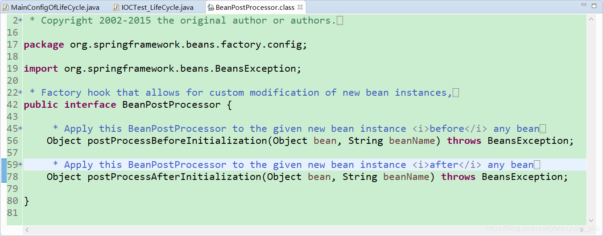
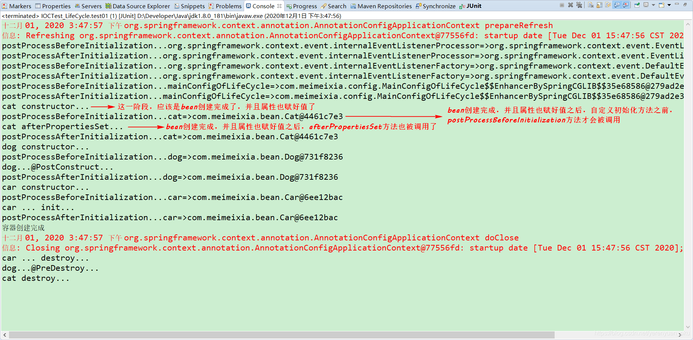
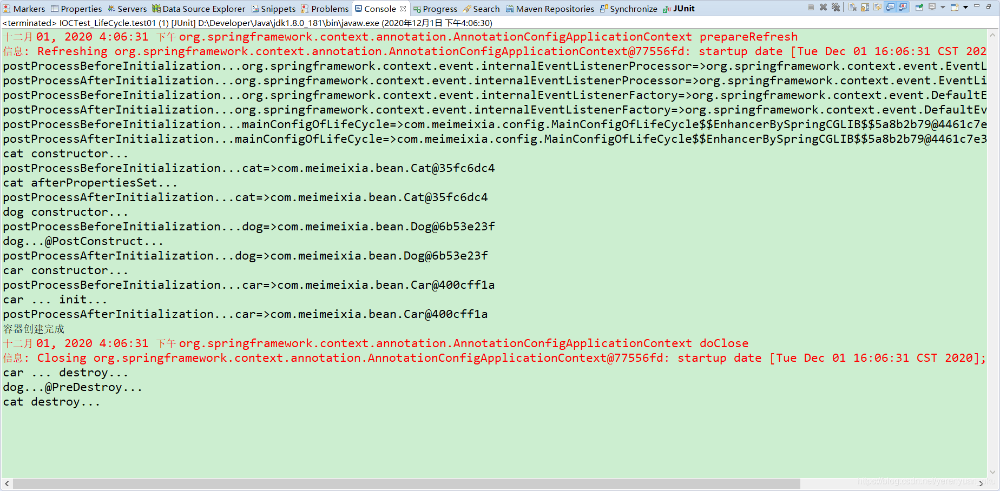
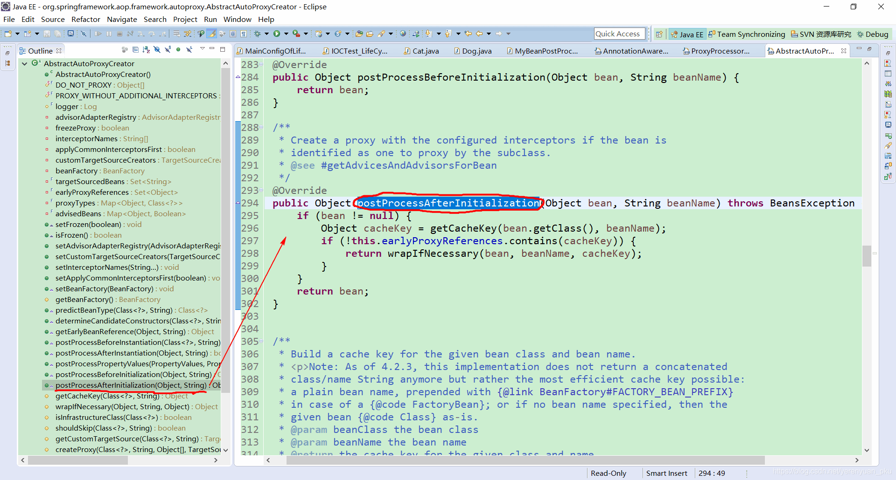

# BeanPostProcessor后置处理器概述

首先，我们来看下 BeanPostProcessor 的源码，看下它到底是个什么鬼，如下所示。



从源码可以看出，**BeanPostProcessor** 是一个接口，其中有两个方法，即 **postProcessBeforeInitialization** 和 **postProcessAfterInitialization** 这两个方法，这两个方法分别是在Spring容器中的bean初始化前后执行，**所以Spring容器中的每一个bean对象初始化前后，都会执行BeanPostProcessor接口的实现类中的这两个方法。**

也就是说，**postProcessBeforeInitialization方法会在bean实例化和属性设置之后，自定义初始化方法之前被调用，而postProcessAfterInitialization方法会在自定义初始化方法之后被调用。当容器中存在多个BeanPostProcessor的实现类时，会按照它们在容器中注册的顺序执行。对于自定义的BeanPostProcessor实现类，还可以让其实现Ordered接口自定义排序。**

因此我们可以在每个bean对象初始化前后，加上自己的逻辑。实现方式是自定义一个BeanPostProcessor接口的实现类，例如MyBeanPostProcessor，然后在该类的postProcessBeforeInitialization 和 postProcessAfterInitialization 这俩方法中写上自己的逻辑。

<br/>

# BeanPostProcessor后置处理器实例

我们创建一个MyBeanPostProcessor类，实现BeanPostProcessor接口，如下所示。

```java
package com.meimeixia.bean;

import org.springframework.beans.BeansException;
import org.springframework.beans.factory.config.BeanPostProcessor;
import org.springframework.stereotype.Component;

/**
 * 后置处理器，在初始化前后进行处理工作
 * @author liayun
 *
 */
@Component // 将后置处理器加入到容器中，这样的话，Spring就能让它工作了
public class MyBeanPostProcessor implements BeanPostProcessor {

	@Override
	public Object postProcessBeforeInitialization(Object bean, String beanName) throws BeansException {
		// TODO Auto-generated method stub
		System.out.println("postProcessBeforeInitialization..." + beanName + "=>" + bean);
		return bean;
	}

	@Override
	public Object postProcessAfterInitialization(Object bean, String beanName) throws BeansException {
		// TODO Auto-generated method stub
		System.out.println("postProcessAfterInitialization..." + beanName + "=>" + bean);
		return bean;
	}

}
```

接下来，我们应该是要编写测试用例来进行测试了。不过，在这之前，咱们得做几处改动，第一处改动是将MainConfigOfLifeCycle配置类中的car()方法上的 `@Scope("prototype")` 注解给注释掉，因为咱们之前做测试的时候，是将Car对象设置成多实例bean了。

```java
package com.meimeixia.config;

import org.springframework.context.annotation.Bean;
import org.springframework.context.annotation.ComponentScan;
import org.springframework.context.annotation.Configuration;
import org.springframework.context.annotation.Scope;

import com.meimeixia.bean.Car;

@ComponentScan("com.meimeixia.bean")
@Configuration
public class MainConfigOfLifeCycle {

//	@Scope("prototype")
	@Bean(initMethod="init", destroyMethod="destroy")
	public Car car() {
		return new Car();
	}
	
}
```

第二处改动是将Cat类上添加的 `@Scope("prototype")` 注解给注释掉，因为咱们之前做测试的时候，也是将Cat对象设置成多实例bean了。

```java
package com.meimeixia.bean;

import org.springframework.beans.factory.DisposableBean;
import org.springframework.beans.factory.InitializingBean;
import org.springframework.context.annotation.Scope;
import org.springframework.stereotype.Component;

// @Scope("prototype")
@Component
public class Cat implements InitializingBean, DisposableBean {
	
	public Cat() {
		System.out.println("cat constructor...");
	}

	/**
	 * 会在容器关闭的时候进行调用
	 */
	@Override
	public void destroy() throws Exception {
		// TODO Auto-generated method stub
		System.out.println("cat destroy...");
	}

	/**
	 * 会在bean创建完成，并且属性都赋好值以后进行调用
	 */
	@Override
	public void afterPropertiesSet() throws Exception {
		// TODO Auto-generated method stub
		System.out.println("cat afterPropertiesSet...");
	}

}
```

好了，现在咱们就可以编写测试用例来进行测试了。可喜的是，我们也不用再编写一个测试用例了，直接运行IOCTest_LifeCycle类中的test01()方法就行，该方法的代码如下所示。

```java
@Test
public void test01() {
    // 1. 创建IOC容器
    AnnotationConfigApplicationContext applicationContext = new AnnotationConfigApplicationContext(MainConfigOfLifeCycle.class);
    System.out.println("容器创建完成");
    
    // 关闭容器
    applicationContext.close();
}
```

此时，运行IOCTest_LifeCycle类中的test01()方法，输出的结果信息如下所示。



可以看到，**postProcessBeforeInitialization 方法会在bean实例化和属性设置之后，自定义初始化方法之前被调用**，**而 postProcessAfterInitialization 方法会在自定义初始化方法之后被调用。**

当然了，也可以让我们自己写的MyBeanPostProcessor类来实现Ordered接口自定义排序，如下所示。

```java
package com.meimeixia.bean;

import org.springframework.beans.BeansException;
import org.springframework.beans.factory.config.BeanPostProcessor;
import org.springframework.core.Ordered;
import org.springframework.stereotype.Component;

/**
 * 后置处理器，在初始化前后进行处理工作
 * @author liayun
 *
 */
@Component // 将后置处理器加入到容器中，这样的话，Spring就能让它工作了
public class MyBeanPostProcessor implements BeanPostProcessor, Ordered {

	@Override
	public Object postProcessBeforeInitialization(Object bean, String beanName) throws BeansException {
		// TODO Auto-generated method stub
		System.out.println("postProcessBeforeInitialization..." + beanName + "=>" + bean);
		return bean;
	}

	@Override
	public Object postProcessAfterInitialization(Object bean, String beanName) throws BeansException {
		// TODO Auto-generated method stub
		System.out.println("postProcessAfterInitialization..." + beanName + "=>" + bean);
		return bean;
	}

	@Override
	public int getOrder() {
		// TODO Auto-generated method stub
		return 3;
	}

}
```

再次运行IOCTest_LifeCycle类中的test01()方法，输出的结果信息如下所示。



<br/>

# BeanPostProcessor后置处理器作用

后置处理器可用于bean对象初始化前后进行逻辑增强。Spring提供了BeanPostProcessor接口的很多实现类，例如 AutowiredAnnotationBeanPostProcessor 用于@Autowired注解的实现，AnnotationAwareAspectJAutoProxyCreator 用于Spring AOP的动态代理等等。

除此之外，我们还可以自定义BeanPostProcessor接口的实现类，在其中写入咱们需要的逻辑。下面我会以 AnnotationAwareAspectJAutoProxyCreator 为例，简单说明一下后置处理器是怎样工作的

我们都知道spring AOP的实现原理是动态代理，最终放入容器的是代理类的对象，而不是bean本身的对象，那么Spring是什么时候做到这一步的呢？**就是在AnnotationAwareAspectJAutoProxyCreator后置处理器的postProcessAfterInitialization方法中，即bean对象初始化完成之后，后置处理器会判断该bean是否注册了切面，若是，则生成代理对象注入到容器中**。这一部分的关键代码是在哪儿呢？我们定位到AbstractAutoProxyCreator抽象类中的postProcessAfterInitialization方法处便能看到了，如下所示。

