# 写在前面

在前面的文章中，我们讲述了 BeanPostProcessor 的 **postProcessBeforeInitialization()** 方法和 **postProcessAfterInitialization()** 方法在bean初始化的前后调用。而且我们可以自定义类来实现 BeanPostProcessor 接口，并在 **postProcessBeforeInitialization()** 方法和 **postProcessAfterInitialization()** 方法中编写我们自定义的逻辑。

今天，我们来一起探讨下 BeanPostProcessor 的底层原理。

# bean的初始化和销毁

我们知道 BeanPostProcessor 的 **postProcessBeforeInitialization()** 方法是在bean的初始化之前被调用；而 **postProcessAfterInitialization()** 方法是在bean初始化的之后被调用。并且bean的初始化和销毁方法我们可以通过如下方式进行指定。

## （一）通过@Bean指定init-method和destroy-method

```java
@Bean(initMethod="init", destroyMethod="destroy")
public Car car() {
    return new Car();
}
```

## （二）通过让bean实现InitializingBean和DisposableBean这俩接口

```java
package com.meimeixia.bean;

import org.springframework.beans.factory.DisposableBean;
import org.springframework.beans.factory.InitializingBean;
import org.springframework.context.annotation.Scope;
import org.springframework.stereotype.Component;

@Component
public class Cat implements InitializingBean, DisposableBean {
	
	public Cat() {
		System.out.println("cat constructor...");
	}

	/**
	 * 会在容器关闭的时候进行调用
	 */
	@Override
	public void destroy() throws Exception {
		// TODO Auto-generated method stub
		System.out.println("cat destroy...");
	}

	/**
	 * 会在bean创建完成，并且属性都赋好值以后进行调用
	 */
	@Override
	public void afterPropertiesSet() throws Exception {
		// TODO Auto-generated method stub
		System.out.println("cat afterPropertiesSet...");
	}

}
```

## （三）使用JSR-250规范里面定义的@PostConstruct和@PreDestroy这俩注解

- **@PostConstruct**：在bean创建完成并且属性赋值完成之后，来执行初始化方法
- **@PreDestroy**：在容器销毁bean之前通知我们进行清理工作

```java
package com.meimeixia.bean;

import javax.annotation.PostConstruct;
import javax.annotation.PreDestroy;

import org.springframework.stereotype.Component;

/**
 *
 * @author liayun
 *
 */
@Component
public class Dog {

	public Dog() {
		System.out.println("dog constructor...");
	}
	
	// 在对象创建完成并且属性赋值完成之后调用
	@PostConstruct
	public void init() {
		System.out.println("dog...@PostConstruct...");
	}
	
	// 在容器销毁（移除）对象之前调用
	@PreDestroy
	public void destory() {
		System.out.println("dog...@PreDestroy...");
	}
	
}
```

## （四）通过让bean实现BeanPostProcessor接口

```java
package com.meimeixia.bean;

import org.springframework.beans.BeansException;
import org.springframework.beans.factory.config.BeanPostProcessor;
import org.springframework.core.Ordered;
import org.springframework.stereotype.Component;

/**
 * 后置处理器，在初始化前后进行处理工作
 * @author liayun
 *
 */
@Component // 将后置处理器加入到容器中，这样的话，Spring就能让它工作了
public class MyBeanPostProcessor implements BeanPostProcessor, Ordered {

	@Override
	public Object postProcessBeforeInitialization(Object bean, String beanName) throws BeansException {
		// TODO Auto-generated method stub
		System.out.println("postProcessBeforeInitialization..." + beanName + "=>" + bean);
		return bean;
	}

	@Override
	public Object postProcessAfterInitialization(Object bean, String beanName) throws BeansException {
		// TODO Auto-generated method stub
		System.out.println("postProcessAfterInitialization..." + beanName + "=>" + bean);
		return bean;
	}

	@Override
	public int getOrder() {
		// TODO Auto-generated method stub
		return 3;
	}

}
```

通过以上这四种方式，我们就可以对bean的整个生命周期进行控制：

- bean的实例化：调用bean的构造方法，我们可以在bean的无参构造方法中执行相应的逻辑。
- bean的初始化：在初始化时，可以通过 BeanPostProcessor 的 postProcessBeforeInitialization() 方法和 postProcessAfterInitialization() 方法进行拦截，执行自定义的逻辑；通过@PostConstruct 注解、InitializingBean 和 init-method 来指定bean初始化前后执行的方法，在该方法中咱们可以执行自定义的逻辑。
- bean的销毁：可以通过 @PreDestroy 注解、DisposableBean 和 destroy-method 来指定bean在销毁前执行的方法，在该方法中咱们可以执行自定义的逻辑。

所以，通过上述四种方式，我们可以控制Spring中bean的整个生命周期。

<br/>

# BeanPostProcessor源码解析

如果想深刻理解BeanPostProcessor的工作原理，那么就不得不看下相关的源码，我们可以在 MyBeanPostProcessor 类的 postProcessBeforeInitialization() 方法和  postProcessAfterInitialization() 方法这两处打上断点来进行调试，如下所示。

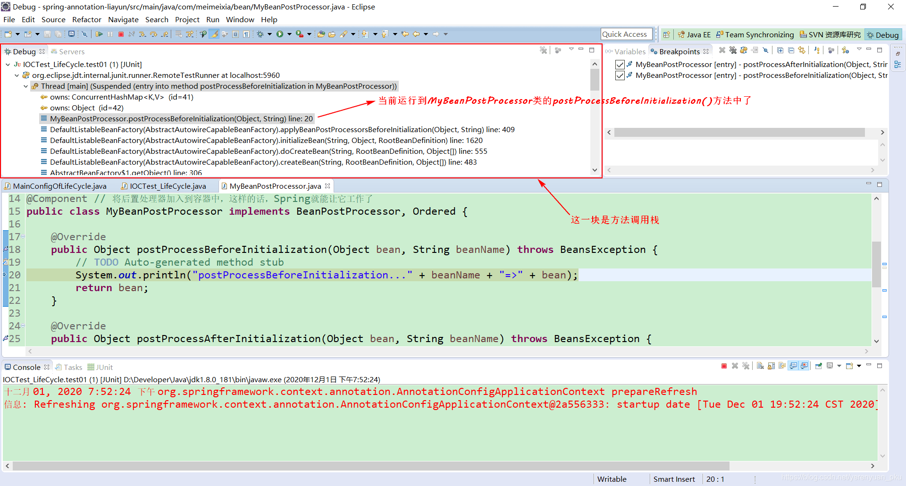

可以看到，程序已经运行到 MyBeanPostProcessor 类的 postProcessBeforeInitialization() 方法中了，而且在Eclipse的左上角我们可以清晰的看到方法的调用栈。

通过这个方法调用栈，我们可以详细地分析从运行IOCTest_LifeCycle类中的test01()方法开始，到进入MyBeanPostProcessor类的postProcessBeforeInitialization()方法中的执行流程。只要我们在Eclipse的方法调用栈中找到IOCTest_LifeCycle类的test01()方法，依次分析方法调用栈中在该类的test01()方法上面位置的方法，即可了解整个方法调用栈的过程。要想定位方法调用栈中的方法，只需要在Eclipse的方法调用栈中单击相应的方法即可。

**温馨提示：方法调用栈是先进后出的，也就是说，最先调用的方法会最后退出，每调用一个方法，JVM会将当前调用的方法放入栈的栈顶，方法退出时，会将方法从栈顶的位置弹出。**

接下来，就跟随着笔者的脚步，一步一步来分析从运行IOCTest_LifeCycle类中的test01()方法开始，到进入MyBeanPostProcessor类的postProcessBeforeInitialization()方法中的执行流程。

**第一步**，我们在Eclipse的方法调用栈中，找到IOCTest_LifeCycle类的test01()方法并单击，此时Eclipse的主界面会定位到IOCTest_LifeCycle类的test01()方法中，如下所示。

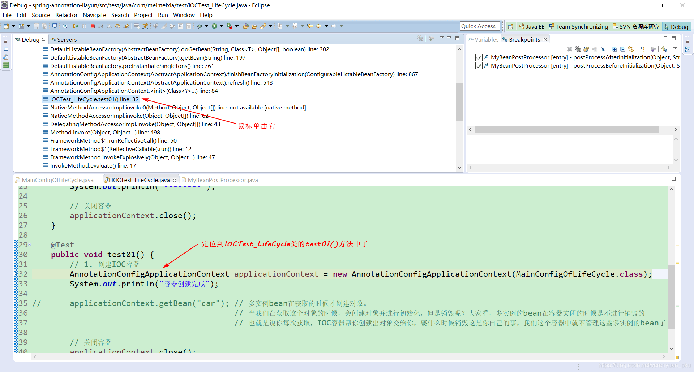

在IOCTest_LifeCycle类的test01()方法中，首先通过 new 实例对象的方式创建了一个IOC容器。

**第二步**，通过Eclipse的方法调用栈继续分析，单击IOCTest_LifeCycle类的test01()方法上面的那个方法，这时会进入 AnnotationConfigApplicationContext 类的构造方法中。

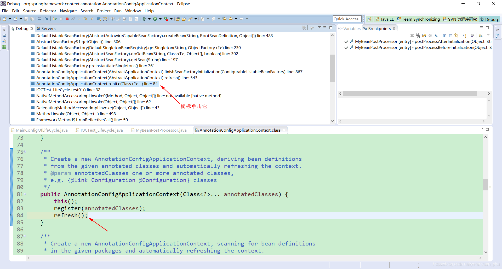

可以看到，在AnnotationConfigApplicationContext类的构造方法中会调用refresh()方法。

**第三步**，我们继续跟进方法调用栈，如下所示，可以看到，方法的执行定位到AbstractApplicationContext类的refresh()方法中的如下那行代码处。

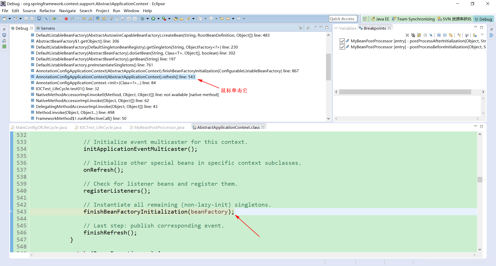

上面这行代码的作用就是初始化所有的（非懒加载的）单实例bean对象。

AbstractApplicationContext类中的refresh()方法有点长，我怕同学们看不清，所以又截了一张图，如下所示，可以清楚地看到 refresh() 方法里面调用了finishBeanFactoryInitialization() 方法。

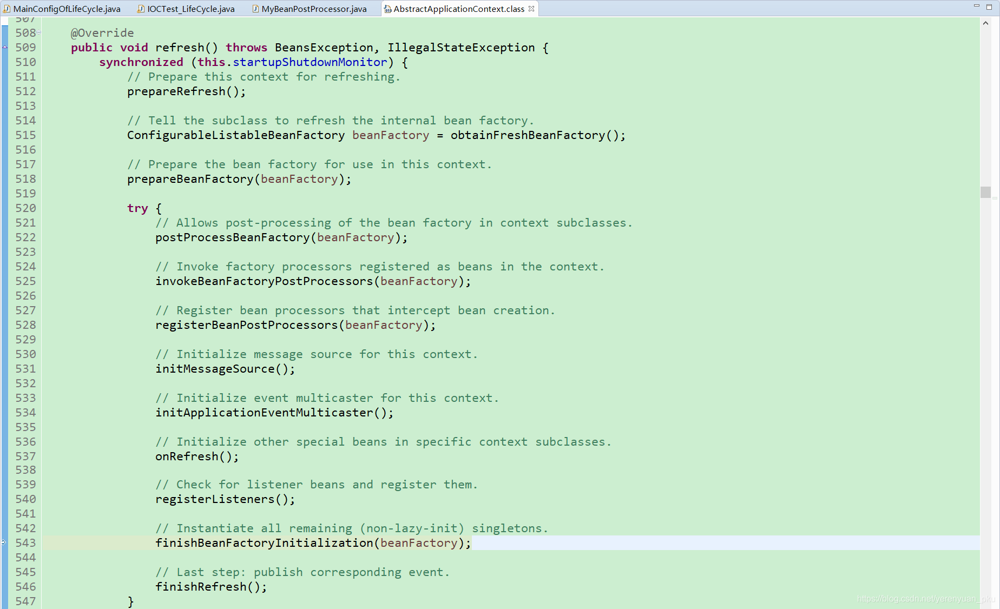

**第四步**，我们继续跟进方法调用栈，如下所示，可以看到，方法的执行定位到 **AbstractApplicationContext** 类的 **finishBeanFactoryInitialization()** 方法中的如下那行代码处。

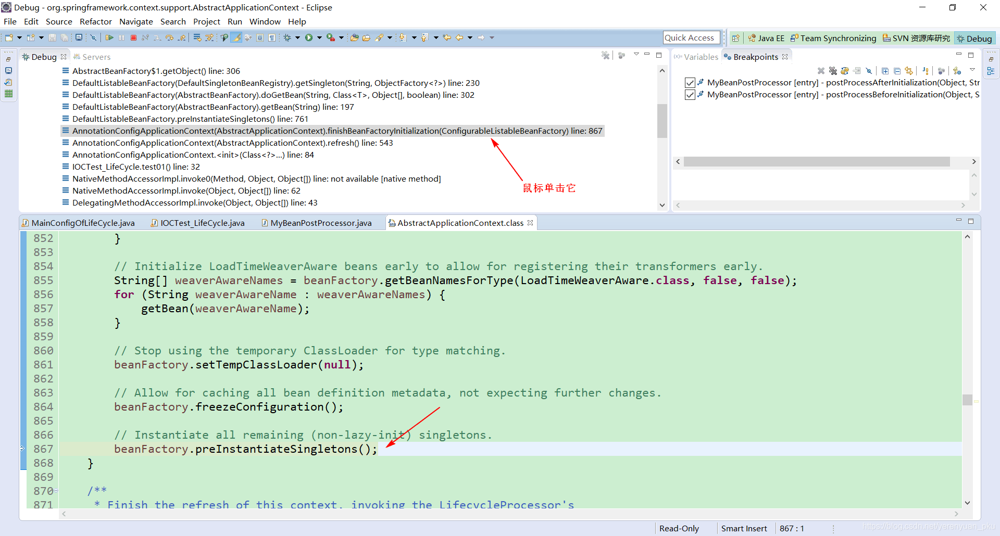

这行代码的作用同样是初始化所有的（非懒加载的）单实例bean。

**AbstractApplicationContext** 类的 **finishBeanFactoryInitialization()** 方法同样有点长，我怕同学们看不清，所以又截了一张图，如下所示。

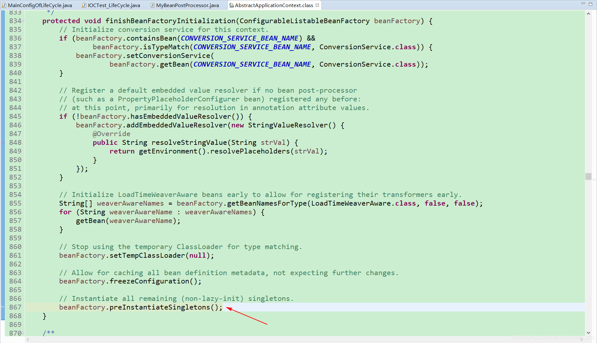

**第五步**，我们继续跟进方法调用栈，如下所示，可以看到，方法的执行定位到 DefaultListableBeanFactory 类的 **preInstantiateSingletons()** 方法的最后一个else分支调用的getBean()方法上。

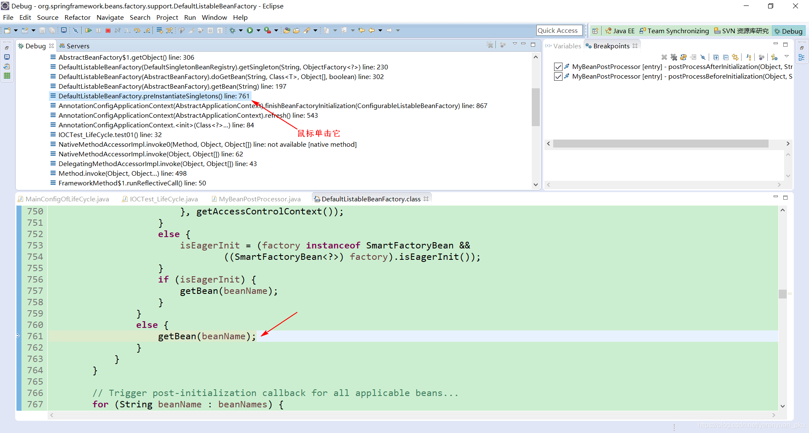

**DefaultListableBeanFactory** 类的 **preInstantiateSingletons()** 方法同样是有点长，我怕同学们看不清，所以又截了一张图，如下所示。

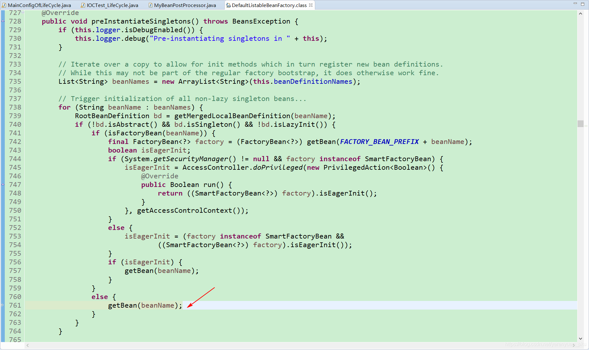

**第六步**，继续跟进方法调用栈，如下所示。

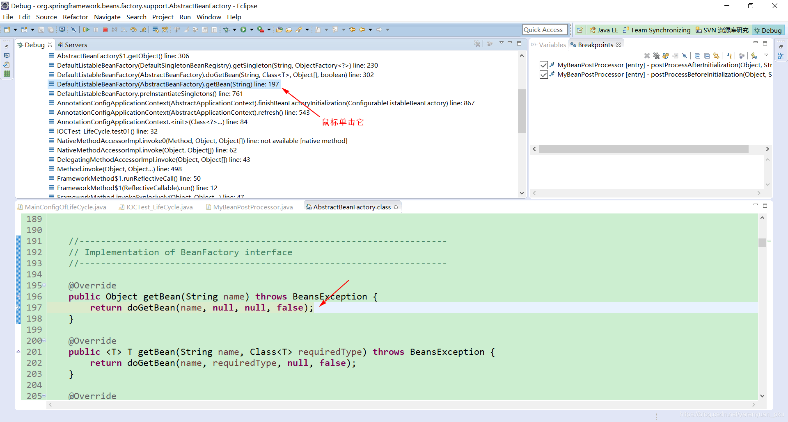

此时方法定位到 **AbstractBeanFactory** 类的 **getBean()** 方法中了，在 getBean() 方法中，又调用了 doGetBean() 方法。

**第七步**，继续跟进方法调用栈，如下所示，此时，方法的执行定位到 **AbstractBeanFactory** 类的 doGetBean() 方法中的如下那行代码处。

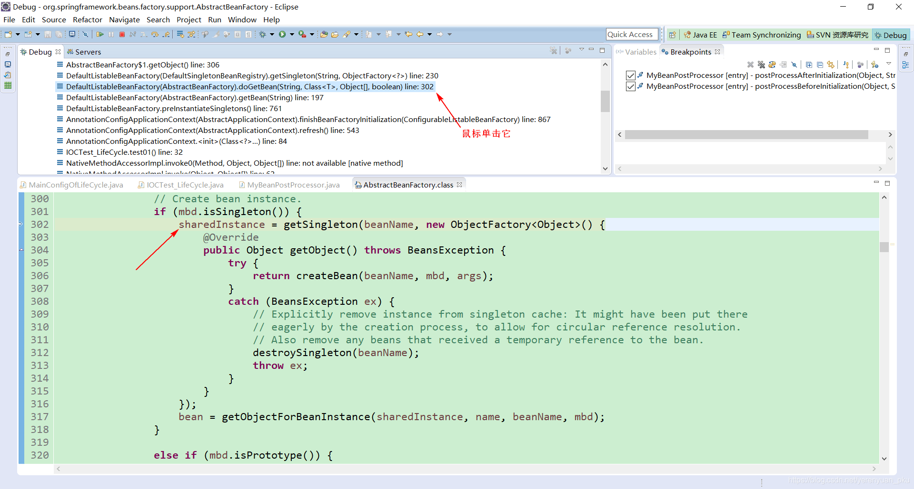

**可以看到，在 Spring 内部是通过 `getSingleton()` 方法来获取单实例bean的。**

**第八步**，继续跟进方法调用栈，如下所示，此时，方法定位到 **DefaultSingletonBeanRegistry** 类的 **getSingleton()** 方法中的如下那行代码处。

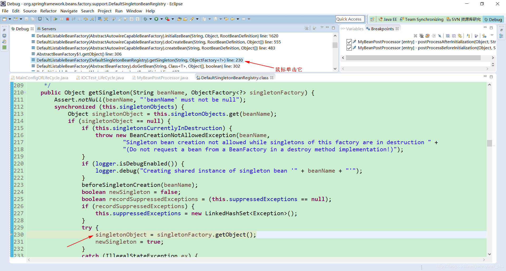

**可以看到，在getSingleton()方法里面又调用了getObject()方法来获取单实例bean。**

**第九步**，继续跟进方法调用栈，如下所示，此时，方法定位到 **AbstractBeanFactory** 类的 doGetBean() 方法中的如下那行代码处。

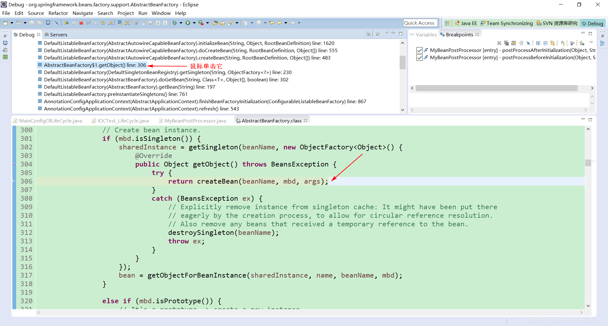

也就是说，当第一次获取单实例bean时，由于单实例bean还未创建，那么 Spring 会调用 **createBean()** 方法来创建单实例bean。

**第十步**，继续跟进方法调用栈，如下所示，可以看到，方法的执行定位到 **AbstractAutowireCapableBeanFactory** 类的 **createBean()** 方法中的如下那行代码处。

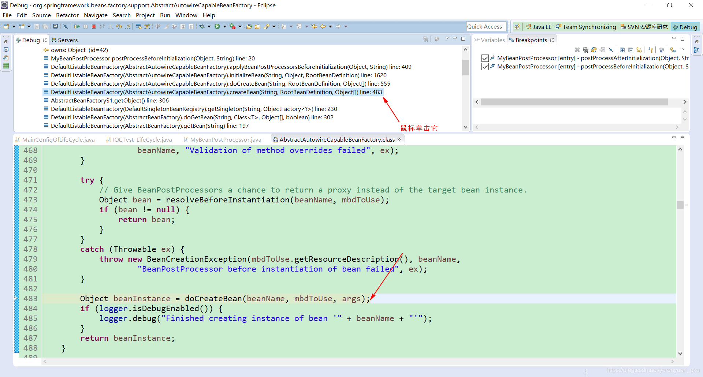

**AbstractAutowireCapableBeanFactory** 类中的 **createBean()** 方法同样也是太长，不太方便观看，所以我就又截了一张图，如下所示。

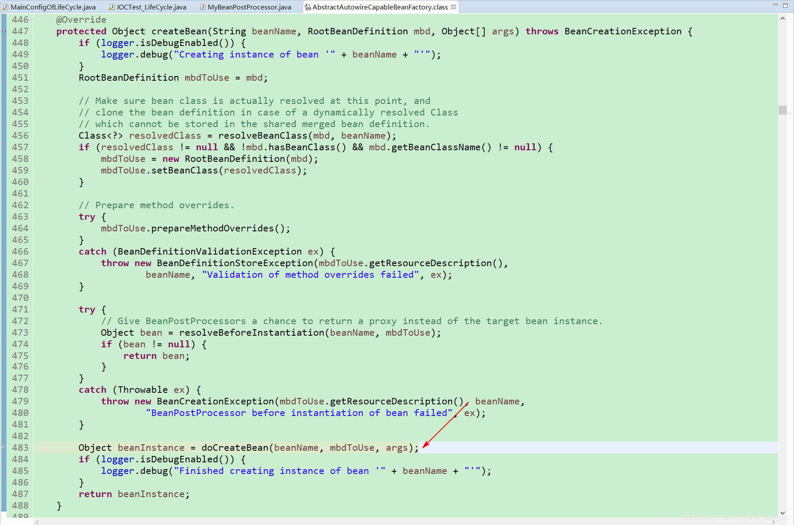

可以看到，Spring中创建单实例bean调用的是 **doCreateBean()** 方法。

**第十一步**，继续跟进方法调用栈，如下所示，此时，方法的执行已经定位到 **AbstractAutowireCapableBeanFactory** 类的 **doCreateBean()** 方法中的如下那行代码处了。

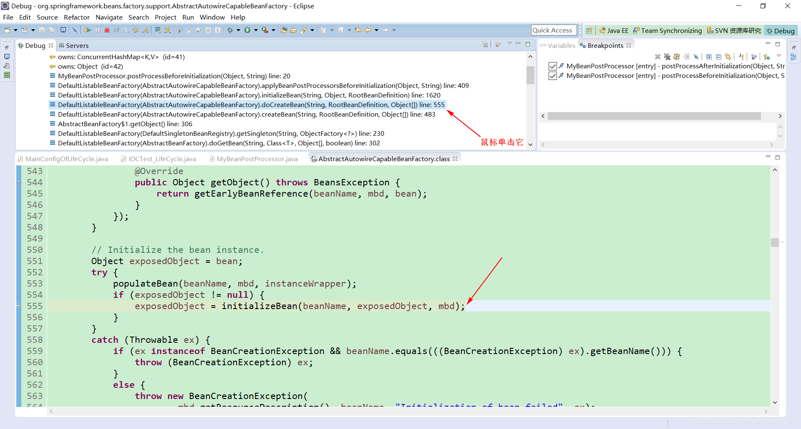

在 **initializeBean()** 方法里面会调用一系列的后置处理器。

第十二步，继续跟进方法调用栈，如下所示，此时，方法的执行定位到 **AbstractAutowireCapableBeanFactory** 类的 **initializeBean()** 方法中的如下那行代码处。

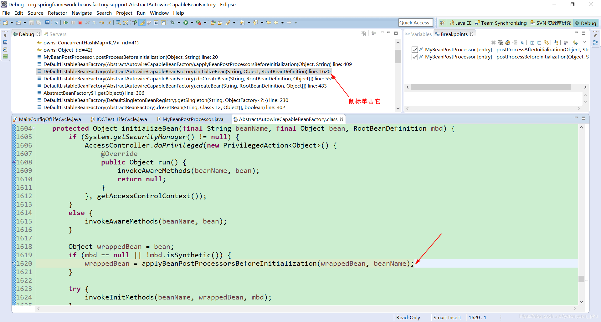

小伙伴们需要重点留意一下这个 **applyBeanPostProcessorsBeforeInitialization()** 方法。

回过头来我们再来看看 **AbstractAutowireCapableBeanFactory** 类的 **doCreateBean()** 方法中的如下这行代码。

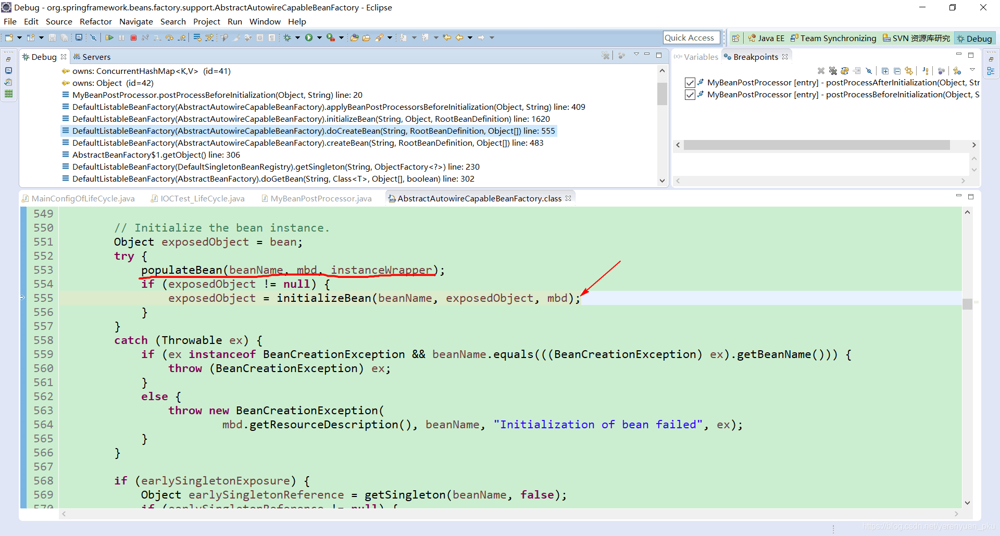

没错，**在以上 initializeBean() 方法中调用了后置处理器的逻辑**，这我上面已经说到了。小伙伴们需要特别注意一下，在 **AbstractAutowireCapableBeanFactory** 类的 **doCreateBean()** 方法中，**调用 initializeBean() 方法之前**，还**调用了一个 populateBean() 方法**，我也在上图中标注出来了。

我们点进去这个 populateBean() 方法中，看下这个方法到底执行了哪些逻辑，如下所示。

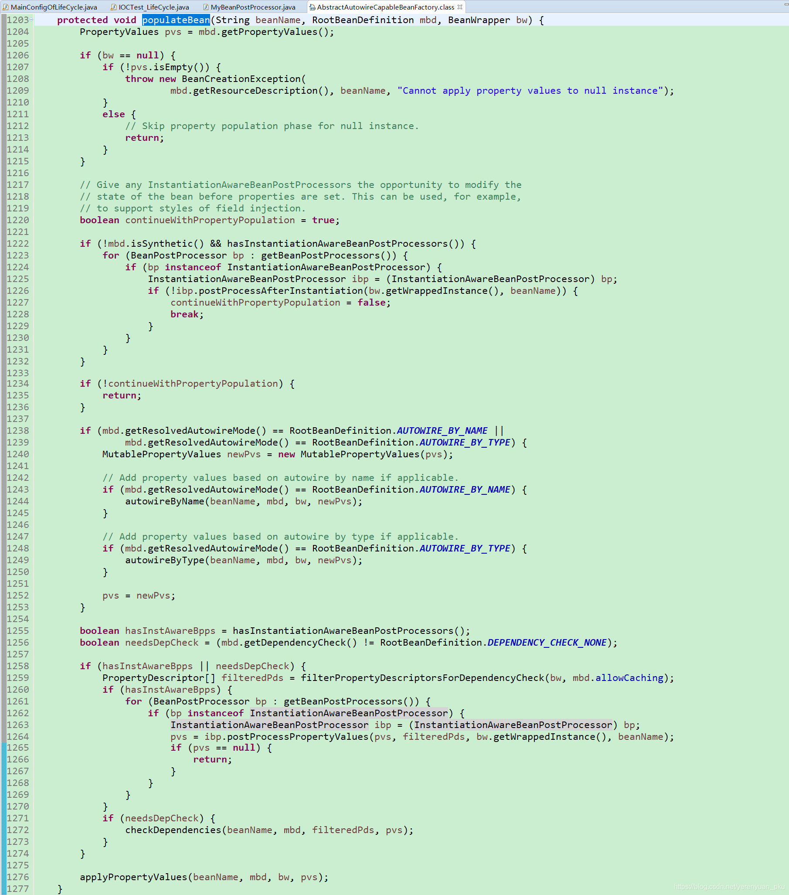

populateBean() 方法同样是 **AbstractAutowireCapableBeanFactory** 类中的方法，它里面的代码比较多，但是逻辑非常简单，**populateBean() 方法做的工作就是为bean的属性赋值**。也就是说，**在 Spring 中会先调用 populateBean() 方法为 bean 的属性赋好值，然后再调用 initializeBean() 方法**。

接下来，我们好好分析下 **initializeBean()** 方法，为了方便，我将 Spring 中 **AbstractAutowireCapableBeanFactory** 类的 **initializeBean()** 方法的代码特意提取出来了，如下所示。

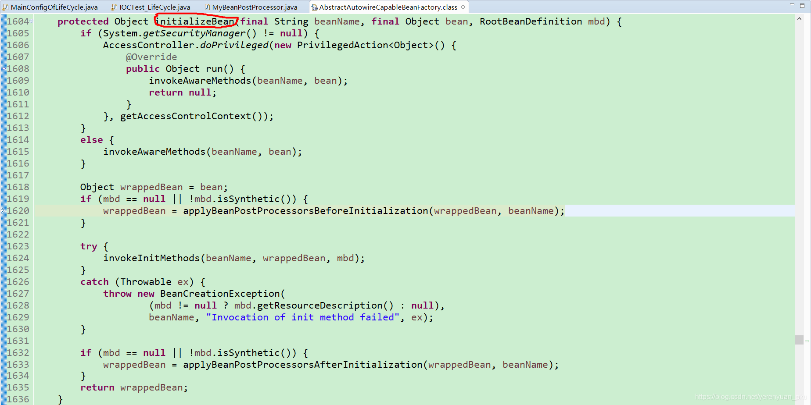

在 **initializeBean()** 方法中，调用了 **invokeInitMethods()** 方法，代码行如下所示。

```java
invokeInitMethods(beanName, wrappedBean, mbd);
```

