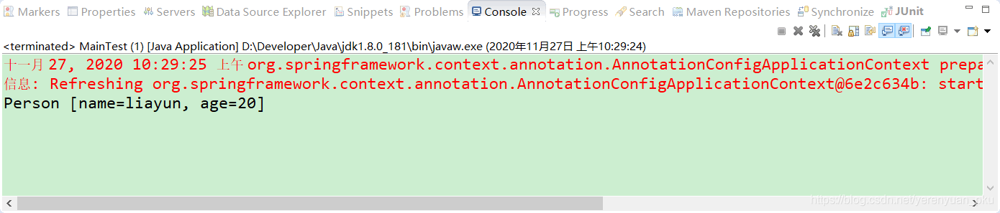

## 使用@Configuration和@Bean给容器中注册组件

### Spring IOC和DI

在Spring容器的底层，最重要的功能就是IOC和DI，也就是控制反转和依赖注入。


DI和IOC它俩之间的关系是DI不能单独存在，DI需要在IOC的基础上来完成。

在Spring内部，所有的组件都会放到IOC容器中，组件之间的关系通过IOC容器来自动装配，也就是我们所说的依赖注入。接下来，我们就使用注解的方式来完成容器中组件的注册、管理及依赖、注入等功能

### 通过XML配置文件注入JavaBean

首先，新建一个maven项目，例如spring-annotation-liayun，注意其打包方式是jar。


在这里我们需要设置编译版本为1.8

```pom
<build>
    <plugins>
        <!-- java编译插件 -->
        <plugin>
            <groupId>org.apache.maven.plugins</groupId>
            <artifactId>maven-compiler-plugin</artifactId>
            <version>3.5.1</version>
            <configuration>
                <source>1.8</source>
                <target>1.8</target>
                <encoding>UTF-8</encoding>
            </configuration>
        </plugin>
    </plugins>
</build>
```

然后，在pom文件中添加对Spring的依赖，注意咱们在这儿使用的Spring是`4.3.12.RELEASE`这个版本的

```pom
<dependencies>
    <dependency>
        <groupId>org.springframework</groupId>
        <artifactId>spring-context</artifactId>
        <version>4.3.12.RELEASE</version>
    </dependency>
</dependencies>
```

接着，在工程的com.meimeixia.bean包下创建一个Person类，作为测试的JavaBean，代码如下所示。

```java
package com.meimeixia.bean;

public class Person {
	
	private String name;
	private Integer age;
	
	public String getName() {
		return name;
	}
	public void setName(String name) {
		this.name = name;
	}
	public Integer getAge() {
		return age;
	}
	public void setAge(Integer age) {
		this.age = age;
	}
	public Person(String name, Integer age) {
		super();
		this.name = name;
		this.age = age;
	}
	public Person() {
		super();
		// TODO Auto-generated constructor stub
	}
	@Override
	public String toString() {
		return "Person [name=" + name + ", age=" + age + "]";
	}
	
}
```

紧接着，在工程的src/main/resources目录下创建Spring的配置文件，例如beans.xml，通过该配置文件将Person类注入到Spring的IOC容器中，该配置文件中的内容如下所示

```xml
<!-- application.xml -->
<?xml version="1.0" encoding="UTF-8"?>
<beans xmlns="http://www.springframework.org/schema/beans"
	xmlns:context="http://www.springframework.org/schema/context" xmlns:p="http://www.springframework.org/schema/p"
	xmlns:aop="http://www.springframework.org/schema/aop" xmlns:tx="http://www.springframework.org/schema/tx"
	xmlns:xsi="http://www.w3.org/2001/XMLSchema-instance"
	xsi:schemaLocation="http://www.springframework.org/schema/beans 
                        http://www.springframework.org/schema/beans/spring-beans-4.2.xsd">
	
	<!-- 注册组件 -->
	<bean id="person" class="com.meimeixia.bean.Person">
		<property name="age" value="18"></property>
		<property name="name" value="liayun"></property>
	</bean>
	
</beans>
```

至此，我们使用XML配置文件的方式注入JavaBean就完成了。

接下来，我们在工程的com.meimeixia包下创建一个MainTest类来进行测试，该类的代码如下所示。

```java
package com.meimeixia;

import org.springframework.context.ApplicationContext;
import org.springframework.context.support.ClassPathXmlApplicationContext;

import com.meimeixia.bean.Person;

public class MainTest {

	public static void main(String[] args) {
		ApplicationContext applicationContext = new ClassPathXmlApplicationContext("application.xml");
		Person person = (Person) applicationContext.getBean("person");
		System.out.println(person);
	}
}
```

运行以上main方法，输出的结果信息如下图所示。


从输出结果中，我们可以看出，Person类通过beans.xml文件的配置，已经注入到Spring的IOC容器中去了。

### 通过注解注入JavaBean

通过XML配置文件的方式，我们可以将JavaBean注入到Spring的IOC容器中。那使用注解又该如何实现呢？别急，其实使用注解比使用XML配置文件要简单的多，我们在项目的com.meimeixia.config包下创建一个MainConfig类，并在该类上添加@Configuration注解来标注该类是一个Spring的配置类，也就是告诉Spring它是一个配置类，最后通过@Bean注解将Person类注入到Spring的IOC容器中

```java
package com.meimeixia.config;

import org.springframework.context.annotation.Bean;
import org.springframework.context.annotation.Configuration;

import com.meimeixia.bean.Person;
/**
 * 以前配置文件的方式被替换成了配置类，即配置类==配置文件
 * @author liayun
 *
 */
// 这个配置类也是一个组件 
@Configuration // 告诉Spring这是一个配置类
public class MainConfig {

	// @Bean注解是给IOC容器中注册一个bean，类型自然就是返回值的类型，id默认是用方法名作为id
	@Bean
	public Person person() {
		return new Person("liayun", 20);
	}
	
}
```

没错，通过MainConfig类我们就能够将Person类注入到Spring的IOC容器中，是不是很Nice啊！！主要是我们在类上加上@Configuration注解，并在方法上加上@Bean注解，就能够将方法中创建的JavaBean注入到Spring的IOC容器中

然后，我们修改MainTest类中的main方法，以测试通过注解注入的Person类，如下所示。

```java
package com.meimeixia;

import org.springframework.context.ApplicationContext;
import org.springframework.context.annotation.AnnotationConfigApplicationContext;
import org.springframework.context.support.ClassPathXmlApplicationContext;

import com.meimeixia.bean.Person;
import com.meimeixia.config.MainConfig;

public class MainTest {

	public static void main(String[] args) {
//		ApplicationContext applicationContext = new ClassPathXmlApplicationContext("beans.xml");
//		Person person = (Person) applicationContext.getBean("person");
//		System.out.println(person);
		
		ApplicationContext applicationContext = new AnnotationConfigApplicationContext(MainConfig.class);
		Person person = applicationContext.getBean(Person.class);
		System.out.println(person);
	}
}
```

再次运行以上main方法，输出的结果信息如下图所示。



可以看出，通过注解将Person类注入到了Spring的IOC容器中。

到这里，我们已经明确了，通过XML配置文件和注解这两种方式都可以将JavaBean注入到Spring的IOC容器中。那么，使用注解将JavaBean注入到IOC容器中时，使用的bean的名称又是什么呢？我们可以在MainTest类的main方法中添加如下代码来获取Person这个类型的组件在IOC容器中的名字。

```java
// Person这个类型的组件在IOC容器中的名字是什么呢？
String[] namesForType = applicationContext.getBeanNamesForType(Person.class);
for (String name : namesForType) {
    System.out.println(name);
}
```

这样，MainTest类的main方法的完整代码如下所示。

```java
package com.meimeixia;

import org.springframework.context.ApplicationContext;
import org.springframework.context.annotation.AnnotationConfigApplicationContext;
import org.springframework.context.support.ClassPathXmlApplicationContext;

import com.meimeixia.bean.Person;
import com.meimeixia.config.MainConfig;

public class MainTest {

	public static void main(String[] args) {
//		ApplicationContext applicationContext = new ClassPathXmlApplicationContext("beans.xml");
//		Person person = (Person) applicationContext.getBean("person");
//		System.out.println(person);
		
		ApplicationContext applicationContext = new AnnotationConfigApplicationContext(MainConfig.class);
		Person person = applicationContext.getBean(Person.class);
		System.out.println(person);
		
		// Person这个类型的组件在IOC容器中的名字是什么呢？
		String[] namesForType = applicationContext.getBeanNamesForType(Person.class);
		for (String name : namesForType) {
			System.out.println(name);
		}
	}
}
```

运行以上main方法之后，输出的结果信息如下图所示。


那这里打印出的person到底是啥呢？我们修改下MainConfig类中的person()方法，将其名字修改成person01，如下所示。

```java
package com.meimeixia.config;

import org.springframework.context.annotation.Bean;
import org.springframework.context.annotation.Configuration;

import com.meimeixia.bean.Person;
/**
 * 以前配置文件的方式被替换成了配置类，即配置类==配置文件
 * @author liayun
 *
 */
// 这个配置类也是一个组件 
@Configuration // 告诉Spring这是一个配置类
public class MainConfig {

	// @Bean注解是给IOC容器中注册一个bean，类型自然就是返回值的类型，id默认是用方法名作为id
	@Bean
	public Person person01() {
		return new Person("liayun", 20);
	}
}
```

此时，我们再次运行MainTest类中的main方法，输出的结果信息如下图所示。


看到这里，大家应该有种豁然开朗的感觉了，没错！！使用注解注入JavaBean时，bean在IOC容器中的名称就是使用@Bean注解标注的方法名称。我们可不可以为bean单独指定名称呢？那必须可以啊！只要在@Bean注解中明确指定名称就可以了。比如在下面MainConfig类的代码中，我们将person01()方法上的@Bean注解修改成了@Bean(“person”)注解，如下所示。

```java
package com.meimeixia.config;

import org.springframework.context.annotation.Bean;
import org.springframework.context.annotation.Configuration;

import com.meimeixia.bean.Person;
/**
 * 以前配置文件的方式被替换成了配置类，即配置类==配置文件
 * @author liayun
 *
 */
// 这个配置类也是一个组件 
@Configuration // 告诉Spring这是一个配置类
public class MainConfig {

	// @Bean注解是给IOC容器中注册一个bean，类型自然就是返回值的类型，id默认是用方法名作为id
	@Bean("person")
	public Person person01() {
		return new Person("liayun", 20);
	}	
}
```

此时，我们再次运行MainTest类中的main方法，输出的结果信息如下图所示。


可以看到，此时，输出的JavaBean的名称确实是person了。

### 小结

我们在使用注解方式向Spring的IOC容器中注入JavaBean时，如果没有在@Bean注解中明确指定bean的名称，那么就会使用当前方法的名称来作为bean的名称；如果在@Bean注解中明确指定了bean的名称，那么就会使用@Bean注解中指定的名称来作为bean的名称。