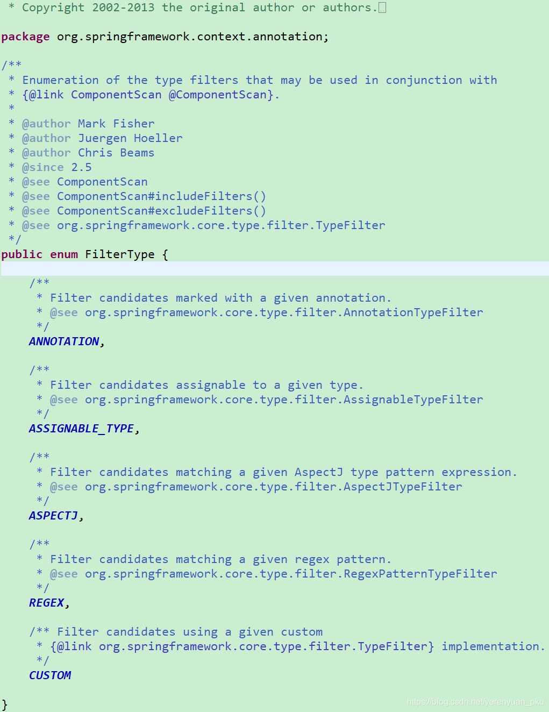
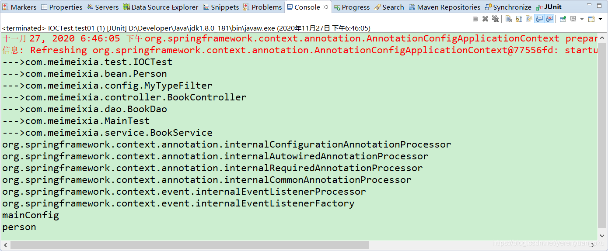
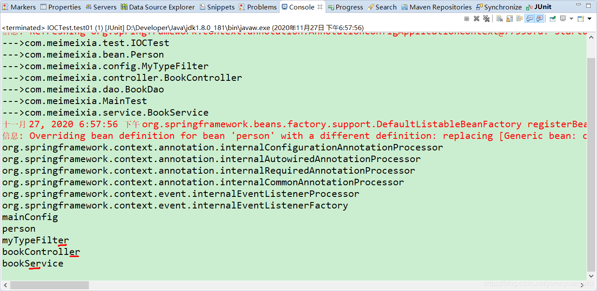

# FilterType中常用的规则

在使用@ComponentScan注解实现包扫描时，我们可以使用@Filter指定过滤规则，在@Filter中，通过type来指定过滤的类型。而@Filter注解中的type属性是一个FilterType枚举，其源码如下图所示。



## FilterType.ANNOTATION：按照注解进行包含或者排除

例如，使用@ComponentScan注解进行包扫描时，如果要想按照注解只包含标注了@Controller注解的组件，那么就需要像下面这样写了。

```java
@ComponentScan(value="com.meimeixia", includeFilters={
		/*
		 * type：指定你要排除的规则，是按照注解进行排除，还是按照给定的类型进行排除，还是按照正则表达式进行排除，等等
		 * classes：我们需要Spring在扫描时，只包含@Controller注解标注的类
		 */
		@Filter(type=FilterType.ANNOTATION, classes={Controller.class})
}, useDefaultFilters=false) // value指定要扫描的包
```

## FilterType.ASSIGNABLE_TYPE：按照给定的类型进行包含或者排除

例如，使用@ComponentScan注解进行包扫描时，如果要想按照给定的类型只包含BookService类（接口）或其子类（实现类或子接口）的组件，那么就需要像下面这样写了。

```java
@ComponentScan(value="com.meimeixia", includeFilters={
		/*
		 * type：指定你要排除的规则，是按照注解进行排除，还是按照给定的类型进行排除，还是按照正则表达式进行排除，等等
		 */
		// 只要是BookService这种类型的组件都会被加载到容器中，不管是它的子类还是什么它的实现类。记住，只要是BookService这种类型的
		@Filter(type=FilterType.ASSIGNABLE_TYPE, classes={BookService.class})
}, useDefaultFilters=false) // value指定要扫描的包
```

此时，只要是BookService这种类型的组件，都会被加载到容器中。也就是说，**当BookService是一个Java类时**，该类及其子类都会被加载到Spring容器中；**当BookService是一个接口时**，其子接口或实现类都会被加载到Spring容器中。

## FilterType.ASPECTJ：按照ASPECTJ表达式进行包含或者排除

例如，使用@ComponentScan注解进行包扫描时，按照正则表达式进行过滤，就得像下面这样子写。

```java
@ComponentScan(value="com.meimeixia", includeFilters={
		/*
		 * type：指定你要排除的规则，是按照注解进行排除，还是按照给定的类型进行排除，还是按照正则表达式进行排除，等等
		 */
		@Filter(type=FilterType.REGEX, classes={RegexPatternTypeFilter.class})
}, useDefaultFilters=false) // value指定要扫描的包
```

## FilterType.CUSTOM：按照自定义规则进行包含或者排除

如果实现自定义规则进行过滤时，自定义规则的类必须是 `org.springframework.core.type.filter.TypeFilter` 接口的实现类。

要想按照自定义规则进行过滤，首先我们得创建 `org.springframework.core.type.filter.TypeFilter` 接口的一个实现类，例如MyTypeFilter，该实现类的代码一开始如下所示。

```java
package com.meimeixia.config;

import java.io.IOException;

import org.springframework.core.type.classreading.MetadataReader;
import org.springframework.core.type.classreading.MetadataReaderFactory;
import org.springframework.core.type.filter.TypeFilter;

public class MyTypeFilter implements TypeFilter {

	/**
	 * 参数：
	 * metadataReader：读取到的当前正在扫描的类的信息
	 * metadataReaderFactory：可以获取到其他任何类的信息的（工厂）
	 */
	@Override
	public boolean match(MetadataReader metadataReader, MetadataReaderFactory metadataReaderFactory) throws IOException {
	
		return false; // 这儿我们先让其返回false

	}

}
```

当我们实现TypeFilter接口时，需要实现该接口中的match()方法，match()方法的返回值为boolean类型。**当返回true时，表示符合规则，会包含在Spring容器中**；**当返回false时，表示不符合规则，那就是一个都不匹配，自然就都不会被包含在Spring容器中**。另外，在match()方法中存在两个参数，分别为MetadataReader类型的参数和MetadataReaderFactory类型的参数，含义分别如下。

- **metadataReader**：读取到的当前正在扫描的类的信息
- **metadataReaderFactory**：可以获取到其他任何类的信息的工厂

然后，使用@ComponentScan注解进行如下配置。

```java
@ComponentScan(value="com.meimeixia", includeFilters={
		/*
		 * type：指定你要排除的规则，是按照注解进行排除，还是按照给定的类型进行排除，还是按照正则表达式进行排除，等等
		 */
		// 指定新的过滤规则，这个过滤规则是我们自个自定义的，过滤规则就是由我们这个自定义的MyTypeFilter类
     	//     返回true或者false来代表匹配还是没匹配
		@Filter(type=FilterType.CUSTOM, classes={MyTypeFilter.class})
}, useDefaultFilters=false) // value指定要扫描的包
```

FilterType枚举中的每一个枚举值的含义我都讲解完了，说了这么多，其实只有ANNOTATION和ASSIGNABLE_TYPE是比较常用的，ASPECTJ和REGEX不太常用，如果FilterType枚举中的类型无法满足我们的需求时，我们也可以通过实现 `org.springframework.core.type.filter.TypeFilter` 接口来自定义过滤规则，此时，将@Filter中的type属性设置为FilterType.CUSTOM，classes属性设置为自定义规则的类所对应的Class对象。 

# 实现自定义过滤规则

从上面可以知道，我们在项目的com.meimeixia.config包下新建了一个类，即MyTypeFilter，它实现了 `org.springframework.core.type.filter.TypeFilter` 接口。此时，我们先在MyTypeFilter类中打印出当前正在扫描的类名，如下所示。

```java
package com.meimeixia.config;

import java.io.IOException;

import org.springframework.core.io.Resource;
import org.springframework.core.type.AnnotationMetadata;
import org.springframework.core.type.ClassMetadata;
import org.springframework.core.type.classreading.MetadataReader;
import org.springframework.core.type.classreading.MetadataReaderFactory;
import org.springframework.core.type.filter.TypeFilter;

public class MyTypeFilter implements TypeFilter {

	/**
	 * 参数：
	 * metadataReader：读取到的当前正在扫描的类的信息
	 * metadataReaderFactory：可以获取到其他任何类的信息的（工厂）
	 */
	@Override
	public boolean match(MetadataReader metadataReader, MetadataReaderFactory metadataReaderFactory) throws IOException {
		// 获取当前类注解的信息
		AnnotationMetadata annotationMetadata = metadataReader.getAnnotationMetadata();
		// 获取当前正在扫描的类的类信息，比如说它的类型是什么啊，它实现了什么接口啊之类的
		ClassMetadata classMetadata = metadataReader.getClassMetadata();
		// 获取当前类的资源信息，比如说类的路径等信息
		Resource resource = metadataReader.getResource();
		// 获取当前正在扫描的类的类名
		String className = classMetadata.getClassName();
		System.out.println("--->" + className);
		
		return false;
	}

}
```

然后，我们在MainConfig类中配置自定义过滤规则，如下所示。

```java
package com.meimeixia.config;

import org.springframework.context.annotation.Bean;
import org.springframework.context.annotation.ComponentScan;
import org.springframework.context.annotation.ComponentScan.Filter;
import org.springframework.context.annotation.ComponentScans;
import org.springframework.context.annotation.Configuration;
import org.springframework.context.annotation.FilterType;

import com.meimeixia.bean.Person;
/**
 * 以前配置文件的方式被替换成了配置类，即配置类==配置文件
 * @author liayun
 *
 */
// 这个配置类也是一个组件
@ComponentScans(value={
		@ComponentScan(value="com.meimeixia", includeFilters={
				/*
				 * type：指定你要排除的规则，是按照注解进行排除，还是按照给定的类型进行排除，还是按照正则表达式进行排除，等等
				 */
				// 指定新的过滤规则，这个过滤规则是我们自个自定义的，过滤规则就是由我们这个自定义的MyTypeFilter类返回true或者false来代表匹配还是没匹配
				@Filter(type=FilterType.CUSTOM, classes={MyTypeFilter.class})
		}, useDefaultFilters=false) // value指定要扫描的包
})
@Configuration // 告诉Spring这是一个配置类
public class MainConfig {

	// @Bean注解是给IOC容器中注册一个bean，类型自然就是返回值的类型，id默认是用方法名作为id
	@Bean("person")
	public Person person01() {
		return new Person("liayun", 20);
	}
	
}
```

接着，我们运行IOCTest类中的test01()方法进行测试，该方法的完整代码如下所示。

```java
@SuppressWarnings("resource")
@Test
public void test01() {
    AnnotationConfigApplicationContext applicationContext = new AnnotationConfigApplicationContext(MainConfig.class);
    // 我们现在就来看一下IOC容器中有哪些bean，即容器中所有bean定义的名字
    String[] definitionNames = applicationContext.getBeanDefinitionNames();
    for (String name : definitionNames) {
        System.out.println(name);
    }
}
```

此时，输出的结果信息如下图所示。



可以看到，已经输出了当前正在扫描的类的名称，同时，除了Spring内置的bean的名称之外，只输出了mainConfig和person，而没有输出使用@Repository、@Service、@Controller这些注解标注的组件的名称。这是因为当前MainConfig类上标注的@ComponentScan注解是使用的自定义规则，而在自定义规则的实现类（即MyTypeFilter类）中，直接返回了false，那么就是一个都不匹配了，自然所有的bean就都没被包含进去容器中了。

我们可以在MyTypeFilter类中简单的实现一个规则，例如，当前扫描的类名称中包含有"er"字符串的，就返回true，否则就返回false。此时，MyTypeFilter类中match()方法的实现代码如下所示。

```java
package com.meimeixia.config;

import java.io.IOException;

import org.springframework.core.io.Resource;
import org.springframework.core.type.AnnotationMetadata;
import org.springframework.core.type.ClassMetadata;
import org.springframework.core.type.classreading.MetadataReader;
import org.springframework.core.type.classreading.MetadataReaderFactory;
import org.springframework.core.type.filter.TypeFilter;

public class MyTypeFilter implements TypeFilter {

	/**
	 * 参数：
	 * metadataReader：读取到的当前正在扫描的类的信息
	 * metadataReaderFactory：可以获取到其他任何类的信息的（工厂）
	 */
	@Override
	public boolean match(MetadataReader metadataReader, MetadataReaderFactory metadataReaderFactory) throws IOException {
		// 获取当前类注解的信息
		AnnotationMetadata annotationMetadata = metadataReader.getAnnotationMetadata();
		// 获取当前正在扫描的类的类信息，比如说它的类型是什么啊，它实现了什么接口啊之类的
		ClassMetadata classMetadata = metadataReader.getClassMetadata();
		// 获取当前类的资源信息，比如说类的路径等信息
		Resource resource = metadataReader.getResource();
		// 获取当前正在扫描的类的类名
		String className = classMetadata.getClassName();
		System.out.println("--->" + className);
		
		// 现在来指定一个规则
		if (className.contains("er")) {
			return true; // 匹配成功，就会被包含在容器中
		}
		
		return false; // 匹配不成功，所有的bean都会被排除
	}

}
```

此时，在com.meimeixia包下的所有类都会通过MyTypeFilter类中的match()方法来验证类名中是否包含有"er"字符串，若包含则返回true，否则返回false。

最后，我们再次运行IOCTest类中的test01()方法进行测试，输出的结果信息如下图所示。



此时，结果信息中输出了使用`@Service`和`@Controller`这俩注解标注的组件的名称，分别是bookController和bookService。

从以上输出的结果信息中，你还可以看到输出了一个myTypeFilter，你不禁要问了，为什么会有myTypeFilter呢？这就是因为我们现在扫描的是com.meimeixia包，**该包下的每一个类都会进到这个自定义规则里面进行匹配**，若匹配成功，则就会被包含在容器中。