# 写在前面

Spring容器中的组件默认是单例的，在Spring启动时就会实例化并初始化这些对象，并将其放到Spring容器中，之后，每次获取对象时，直接从Spring容器中获取，而不再创建对象。如果每次从Spring容器中获取对象时，都要创建一个新的实例对象，那么该如何处理呢？此时就需要使用@Scope注解来设置组件的作用域了。

# 本文内容概览

咱先看看在本文中我们要学习哪些知识点，从而从全局角度把握好方向。本文要学习的知识点疏览如下：

- @Scope注解概述
- 单实例bean作用域
- 多实例bean作用域
- 单实例bean作用域如何创建对象？
- 多实例bean作用域如何创建对象？
- 单实例bean注意的事项
- 多实例bean注意的事项
- 自定义Scope的实现

# @Scope注解概述

@Scope注解能够设置组件的作用域，我们先来看看@Scope注解类的源码，如下所示。

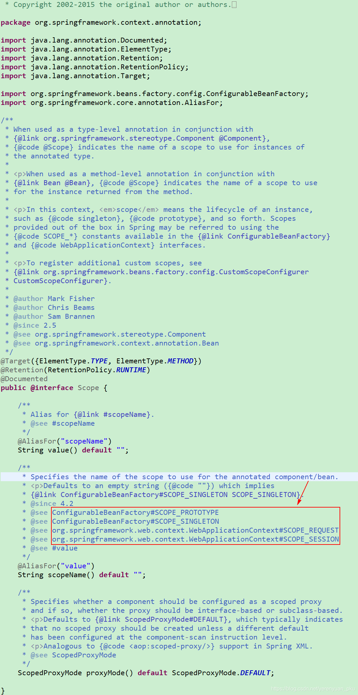

从@Scope注解类的源码中可以看出，在@Scope注解中可以设置如下值：

- ConfigurableBeanFactory#SCOPE_PROTOTYPE
- ConfigurableBeanFactory#SCOPE_SINGLETON
- org.springframework.web.context.WebApplicationContext#SCOPE_REQUEST
- org.springframework.web.context.WebApplicationContext#SCOPE_SESSION

<br/>

很明显，在@Scope注解中可以设置的值包括ConfigurableBeanFactory接口中的SCOPE_PROTOTYPE和SCOPE_SINGLETON，以及WebApplicationContext类中的SCOPE_REQUEST和SCOPE_SESSION。这些都是什么鬼啊？别急，我们来一个个查看。

首先，我们查看一下ConfigurableBeanFactory接口的源码，发现在该接口中存在两个常量的定义，如下所示。

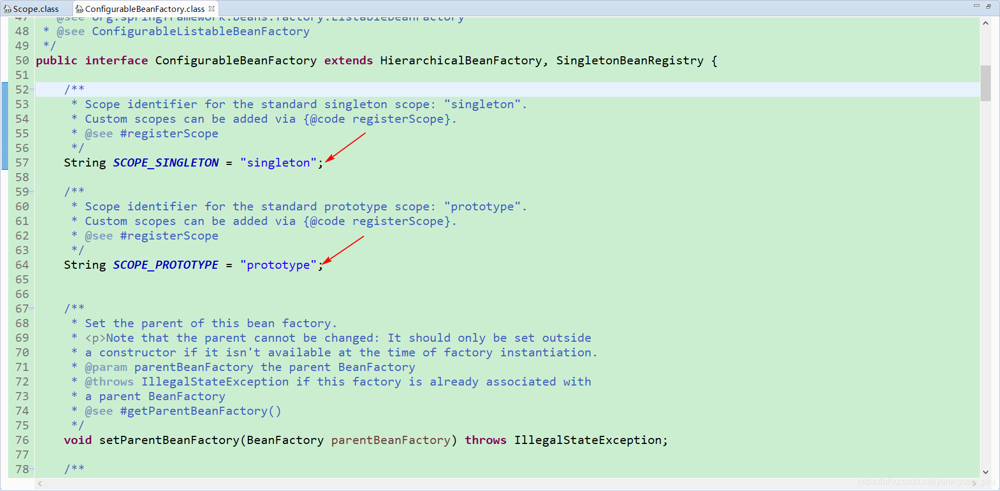

没错，SCOPE_SINGLETON就是singleton，而SCOPE_PROTOTYPE就是prototype。

那么，WebApplicationContext类中的SCOPE_REQUEST和SCOPE_SESSION又是什么鬼呢？我也不卖关子了，就直接说了，当我们使用Web容器来运行Spring应用时，在@Scope注解中可以设置WebApplicationContext类中的SCOPE_REQUEST和SCOPE_SESSION这俩的值，而SCOPE_REQUEST的值就是request，SCOPE_SESSION的值就是session。

综上，在@Scope注解中的取值如下所示。

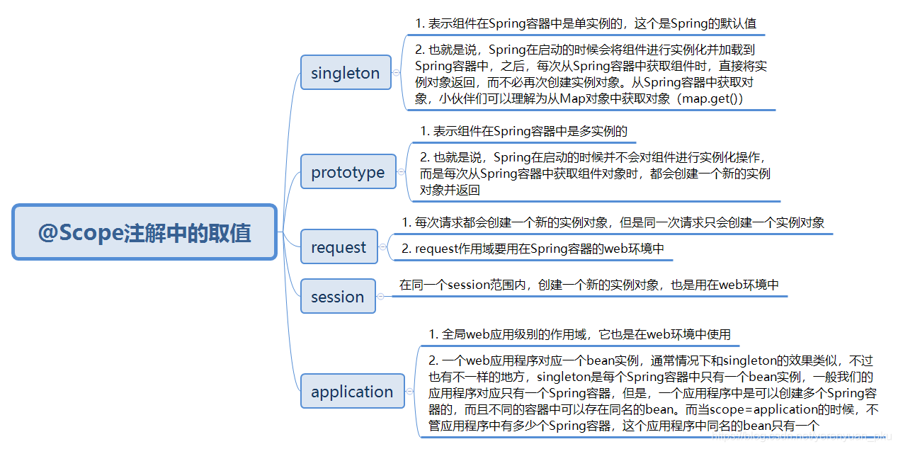

其中，request和session作用域是需要Web环境来支持的，这两个值基本上使用不到。当我们使用Web容器来运行Spring应用时，如果需要将组件的实例对象的作用域设置为request和session，那么我们通常会使用

```java
request.setAttribute("key", object);
```

```java
session.setAttribute("key", object);
```

使用这两种形式来将对象实例设置到request和session中，而不会使用@Scope注解来进行设置。

# 单实例bean作用域

首先，我们在com.meimeixia.config包下创建一个配置类，例如MainConfig2，然后在该配置类中实例化一个Person对象，并将其放置在Spring容器中，如下所示。

```java
package com.meimeixia.config;

import org.springframework.context.annotation.Bean;
import org.springframework.context.annotation.Configuration;

import com.meimeixia.bean.Person;

@Configuration
public class MainConfig2 {
	
	@Bean("person")
	public Person person() {
		return new Person("superMan", 25);
	}
	
}
```

接着，在IOCTest类中创建一个test02()测试方法，在该测试方法中创建一个AnnotationConfigApplicationContext对象，创建完毕后，从Spring容器中按照id获取两个Person对象，并判断这两个对象是否是同一个对象，代码如下所示。

```java
@SuppressWarnings("resource")
@Test
public void test02() {
    AnnotationConfigApplicationContext applicationContext = new AnnotationConfigApplicationContext(MainConfig2.class);
    
    // 获取到的这个Person对象默认是单实例的，因为在IOC容器中给我们加的这些组件默认都是单实例的，
    // 所以说在这儿我们无论多少次获取，获取到的都是我们之前new的那个实例对象
    Person person = (Person) applicationContext.getBean("person");
    Person person2 = (Person) applicationContext.getBean("person");
    System.out.println(person == person2);
}
```

由于对象在Spring容器中默认是单实例的，所以，Spring容器在启动时就会将实例对象加载到Spring容器中，之后，每次从Spring容器中获取实例对象，都是直接将对象返回，而不必再创建新的实例对象了。很显然，此时运行test02()方法之后会输出true，如下所示。

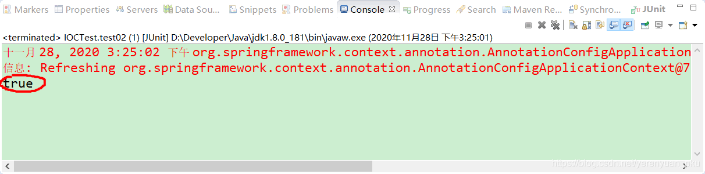

这也正好验证了我们的结论：**对象在Spring容器中默认是单实例的，Spring容器在启动时就会将实例对象加载到Spring容器中，之后，每次从Spring容器中获取实例对象，都是直接将对象返回，而不必再创建新的实例对象了**。

# 多实例bean作用域

修改Spring容器中组件的作用域，我们需要借助于@Scope注解。此时，我们将MainConfig2配置类中Person对象的作用域修改成prototype，如下所示。

```java
package com.meimeixia.config;

import org.springframework.context.annotation.Bean;
import org.springframework.context.annotation.Configuration;
import org.springframework.context.annotation.Scope;

import com.meimeixia.bean.Person;

@Configuration
public class MainConfig2 {
	
	@Scope("prototype") // 通过@Scope注解来指定该bean的作用范围，也可以说成是调整作用域
	@Bean("person")
	public Person person() {
		return new Person("superMan", 25);
	}
	
}
```

其实，通过@Scope注解来设置组件的作用域**就等同于**我们在XML配置文件中为`<bean>`标签设置scope属性，如下所示。

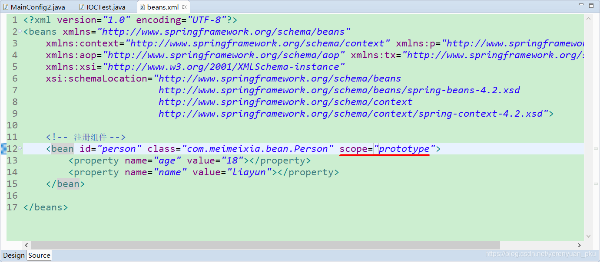

此时，我们再次运行IOCTest类中的test02()方法，你觉得从Spring容器中获取到的person对象和person2对象还是同一个对象吗？

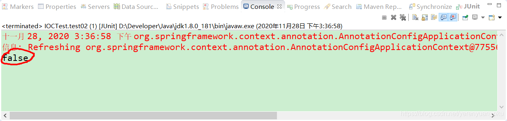

很显然不是，从以上输出结果中也可以看出，此时，输出的person对象和person2对象已经不是同一个对象了。

# 单实例bean作用域何时创建对象？

接下来，我们验证下在单实例作用域下，Spring是在什么时候创建对象的？

首先，我们将MainConfig2配置类中的Person对象的作用域修改成单实例，并在返回Person对象之前打印相关的信息，如下所示。

```java
package com.meimeixia.config;

import org.springframework.context.annotation.Bean;
import org.springframework.context.annotation.Configuration;
import org.springframework.context.annotation.Scope;

import com.meimeixia.bean.Person;

@Configuration
public class MainConfig2 {
	
	@Scope
	@Bean("person")
	public Person person() {
		System.out.println("给容器中添加咱们这个Person对象...");
		return new Person("superMan", 25);
	}
	
}
```

然后，我们在IOCTest类中再创建一个test03()方法，在该方法中我们只创建Spring容器，如下所示。

```java
@Test
public void test03() {
    AnnotationConfigApplicationContext applicationContext = new AnnotationConfigApplicationContext(MainConfig2.class);
}
```

此时，我们运行IOCTest类中的test03()方法，输出的结果信息如下所示。

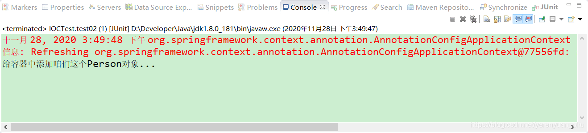

从以上输出的结果信息中可以看出，Spring容器在创建的时候，就将@Scope注解标注为singleton的组件进行了实例化，并加载到了Spring容器中。

接着，我们再运行一下IOCTest类中的test02()方法，可以看到输出的结果信息如下所示。

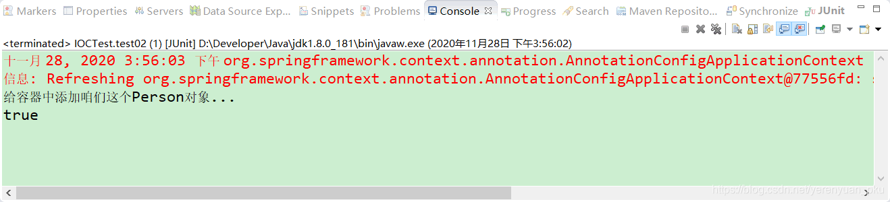

这说明，**Spring容器在启动时，将单实例组件实例化之后**，会即刻加载到Spring容器中，以后每次从容器中获取组件实例对象时，都是直接返回相应的对象，而不必再创建新的对象了。

# 多实例bean作用域何时创建对象？

如果我们将对象的作用域修改成多实例，那么会什么时候创建对象呢？

此时，我们将MainConfig2配置类中的Person对象的作用域修改成多实例，如下所示。

```java
package com.meimeixia.config;

import org.springframework.context.annotation.Bean;
import org.springframework.context.annotation.Configuration;
import org.springframework.context.annotation.Scope;

import com.meimeixia.bean.Person;

@Configuration
public class MainConfig2 {
	
	@Scope("prototype") // 通过@Scope注解来指定该bean的作用范围，也可以说成是调整作用域
	@Bean("person")
	public Person person() {
		System.out.println("给容器中添加咱们这个Person对象...");
		return new Person("superMan", 25);
	}
	
}
```

我们再次运行IOCTest类中的test03()方法，发现没有输出任何结果信息。

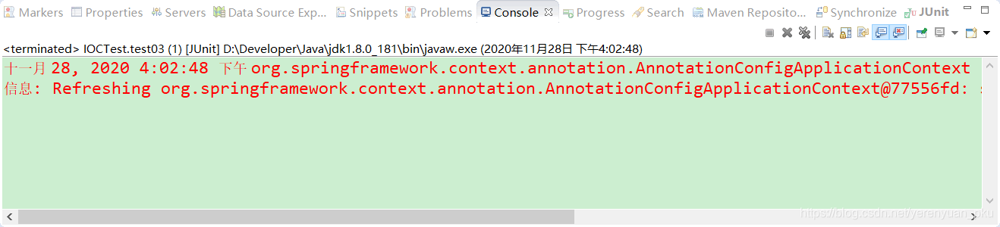

这说明在创建Spring容器时，并不会去实例化和加载多实例对象，那多实例对象到底是什么时候实例化的呢？此时，我们可以在IOCTest类中的test03()方法中添加一行获取Person对象的代码，如下所示。

```java
@Test
public void test03() {
    AnnotationConfigApplicationContext applicationContext = new AnnotationConfigApplicationContext(MainConfig2.class);
    Person person = (Person) applicationContext.getBean("person");
}
```

然后，我们再次运行以上方法，输出的结果信息如下所示。

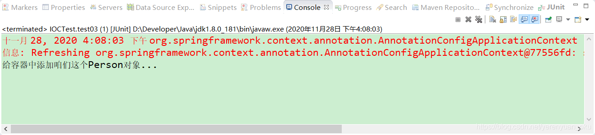

从以上输出的结果信息中可以看出，当向Spring容器中获取Person实例对象时，Spring容器才会实例化Person对象，再将其加载到Spring容器中去。

那么问题来了，此时Spring容器是否只实例化了一个Person对象呢？我们在IOCTest类中的test03()方法中再添加一行获取Person对象的代码，如下所示。

```java
@Test
public void test03() {
    AnnotationConfigApplicationContext applicationContext = new AnnotationConfigApplicationContext(MainConfig2.class);
    Person person = (Person) applicationContext.getBean("person");
    Person person2 = (Person) applicationContext.getBean("person");
}
```

此时，我们再次运行以上方法，输出的结果信息如下所示。

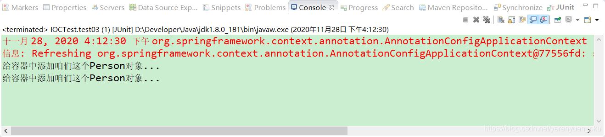

从以上输出的结果信息中可以看出，当对象的Scope作用域为多实例时，每次向Spring容器获取对象时，它都会创建一个新的对象并返回。很显然，以上获取到的person和person2就不是同一个对象了，这我们也可以打印结果信息来进行验证，即在IOCTest类中的test03()方法中判断两个对象是否相等，如下所示。

```java
@Test
public void test03() {
    AnnotationConfigApplicationContext applicationContext = new AnnotationConfigApplicationContext(MainConfig2.class);
    Person person = (Person) applicationContext.getBean("person");
    Person person2 = (Person) applicationContext.getBean("person");
    System.out.println(person == person2);
}
```

此时，我们再次运行以上方法，发现输出的结果信息如下所示。

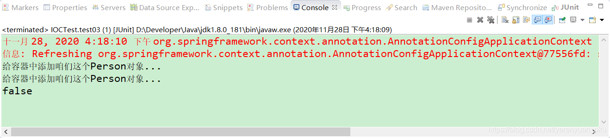

可以看到，当对象是多实例时，每次从Spring容器中获取对象时，都会创建新的实例对象，并且每个实例对象都不相等。

<br/>

# 单实例bean注意的事项

**单实例bean是整个应用所共享的**，所以需要考虑到线程安全问题，之前在玩SpringMVC的时候，SpringMVC中的Controller默认是单例的，有些开发者在Controller中创建了一些变量，那么这些变量实际上就变成共享的了，Controller又可能会被很多线程同时访问，这些线程并发去修改Controller中的共享变量，此时很有可能会出现数据错乱的问题，所以使用的时候需要特别注意。

# 多实例bean注意的事项

**多实例bean每次获取的时候都会重新创建，如果这个bean比较复杂，创建时间比较长，那么就会影响系统的性能，因此这个地方需要注意点。**

<br/>

# 自定义Scope

如果Spring内置的几种scope都无法满足我们的需求时，我们可以自定义bean的作用域。

## 如何实现自定义Scope呢？

自定义Scope主要分为三个步骤，如下所示。

- 第一步，实现Scope接口。我们先来看下Scope接口的源码，如下所示。

```java
package org.springframework.beans.factory.config;

import org.springframework.beans.factory.ObjectFactory;

public interface Scope {

	/**
	 * 返回当前作用域中name对应的bean对象
	 * @param name 需要检索的bean对象的名称
	 * @param objectFactory 如果name对应的bean对象在当前作用域中没有找到，那么可以调用这个objectFactory来创建这个对象
	 */
	Object get(String name, ObjectFactory<?> objectFactory);

	/**
	 * 将name对应的bean对象从当前作用域中移除
	 */
	Object remove(String name);

	/**
	 * 用于注册销毁回调，若想要销毁相应的对象，则由Spring容器注册相应的销毁回调，而由自定义作用域选择是不是要销毁相应的对象
	 */
	void registerDestructionCallback(String name, Runnable callback);

	/**
	 * 用于解析相应的上下文数据，比如request作用域将返回request中的属性
	 */
	Object resolveContextualObject(String key);

	/**
	 * 作用域的会话标识，比如session作用域的会话标识是sessionId
	 */
	String getConversationId();

}
```

- 第二步，将自定义Scope注册到容器中。此时，需要调用`org.springframework.beans.factory.config.ConfigurableBeanFactory#registerScope`这个方法，咱们看一下这个方法的声明。

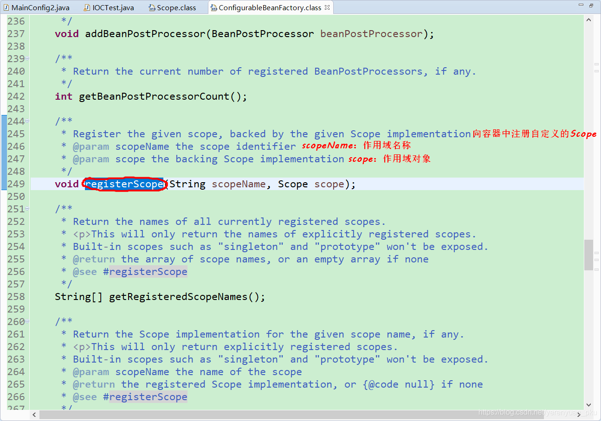

- 第三步，使用自定义的作用域。也就是在定义bean的时候，指定bean的scope属性为自定义的作用域名称。

<br/>

## 一个自定义Scope实现案例

例如，我们来实现一个线程级别的bean作用域，同一个线程中同名的bean是同一个实例，不同的线程中的bean是不同的实例。

这里，要求bean在线程中是共享的，所以我们可以通过ThreadLocal来实现，ThreadLocal可以实现线程中数据的共享。

首先，我们在com.meimeixia.scope包下新建一个ThreadScope类，如下所示。

```java
package com.meimeixia.scope;

import java.util.HashMap;
import java.util.Map;
import java.util.Objects;

import org.springframework.beans.factory.ObjectFactory;
import org.springframework.beans.factory.config.Scope;

/**
 * 自定义本地线程级别的bean作用域，不同的线程中的bean是不同的实例，同一个线程中同名的bean是同一个实例
 * @author liayun
 *
 */
public class ThreadScope implements Scope {
	
	public static final String THREAD_SCOPE = "thread";
	
	private ThreadLocal<Map<String, Object>> beanMap = new ThreadLocal() {
		
		@Override
        protected Object initialValue() {
            return new HashMap<>();
        }
		
	};
	
	/**
	 * 返回当前作用域中name对应的bean对象
	 * @param name：需要检索的bean对象的名称
	 * @param objectFactory：如果name对应的bean对象在当前作用域中没有找到，那么可以调用这个objectFactory来创建这个bean对象
	 */
	@Override
	public Object get(String name, ObjectFactory<?> objectFactory) {
		Object bean = beanMap.get().get(name);
		if (Objects.isNull(bean)) {
			bean = objectFactory.getObject();
			beanMap.get().put(name, bean);
		}
		return bean;
	}

	/**
	 * 将name对应的bean对象从当前作用域中移除
	 */
	@Override
	public Object remove(String name) {
		return this.beanMap.get().remove(name);
	}

	/**
	 * 用于注册销毁回调，若想要销毁相应的对象，则由Spring容器注册相应的销毁回调，而由自定义作用域选择是不是要销毁相应的对象
	 */
	// bean作用域范围结束的时候调用的方法，用于bean的清理
	@Override
	public void registerDestructionCallback(String name, Runnable callback) {
		System.out.println(name);
	}

	/**
	 * 用于解析相应的上下文数据，比如request作用域将返回request中的属性
	 */
	@Override
	public Object resolveContextualObject(String key) {
		return null;
	}

	/**
	 * 作用域的会话标识，比如session作用域的会话标识是sessionId
	 */
	@Override
	public String getConversationId() {
		return Thread.currentThread().getName();
	}

}
```

在ThreadScope类中，我们定义了一个THREAD_SCOPE常量，该常量是在定义bean的时候给scope使用的。

然后，我们在com.meimeixia.config包下创建一个配置类，例如MainConfig3，并使用@Scope(“thread”)注解标注Person对象的作用域为Thread范围，如下所示。

```java
package com.meimeixia.config;

import org.springframework.context.annotation.Bean;
import org.springframework.context.annotation.Configuration;
import org.springframework.context.annotation.Scope;

import com.meimeixia.bean.Person;

/**
 * 测试@Scope注解设置的作用域
 * @author liayun
 *
 */
@Configuration
public class MainConfig3 {

	@Scope("thread")
	@Bean("person")
	public Person person() {
		System.out.println("给容器中添加咱们这个Person对象...");
		return new Person("superMan", 25);
	}
	
}
```

接着，我们在IOCTest类中创建一个test04()方法，我们所要做的事情就是在该方法中创建Spring容器，并向Spring容器中注册ThreadScope对象。最后，使用循环创建两个Thread线程，并分别在每个线程中获取两个Person对象，如下所示。

```java
@Test
public void test04() {
    AnnotationConfigApplicationContext applicationContext = new AnnotationConfigApplicationContext(MainConfig3.class);
    // 向容器中注册自定义的Scope
    applicationContext.getBeanFactory().registerScope(ThreadScope.THREAD_SCOPE, new ThreadScope());
    
    // 使用容器获取bean
    for (int i = 0; i < 2; i++) {
        new Thread(() -> {
            System.out.println(Thread.currentThread() + "," + applicationContext.getBean("person"));
            System.out.println(Thread.currentThread() + "," + applicationContext.getBean("person"));
        }).start();
    }
    try {
        TimeUnit.SECONDS.sleep(1);
    } catch (Exception e) {
        e.printStackTrace();
    }
}
```

此时，我们运行以上方法，会看到输出的结果信息如下所示。

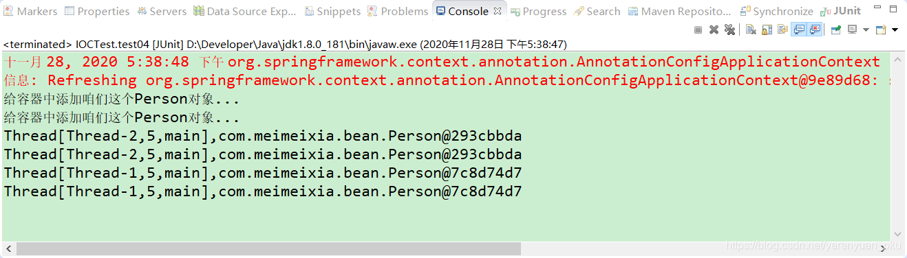

从以上输出的结果信息中可以看到，bean在同样的线程中获取到的是同一个bean的实例，不同的线程中bean的实例是不同的。

注意：这里测试时，我将Person类进行了相应的调整，将toString()方法注释掉了，如下所示。

```java
package com.meimeixia.bean;

public class Person {
	
	private String name;
	private Integer age;
	
	public String getName() {
		return name;
	}
	public void setName(String name) {
		this.name = name;
	}
	public Integer getAge() {
		return age;
	}
	public void setAge(Integer age) {
		this.age = age;
	}
	public Person(String name, Integer age) {
		super();
		this.name = name;
		this.age = age;
	}
	public Person() {
		super();
		// TODO Auto-generated constructor stub
	}
	
//	@Override
//	public String toString() {
//		return "Person [name=" + name + ", age=" + age + "]";
//	}
	
}
```

