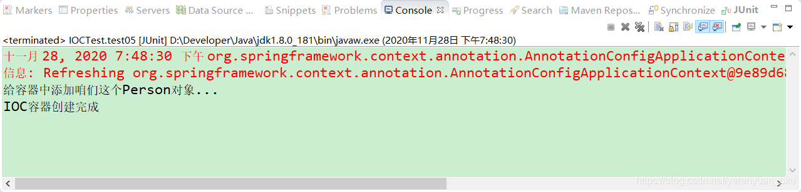
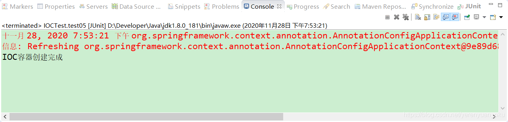
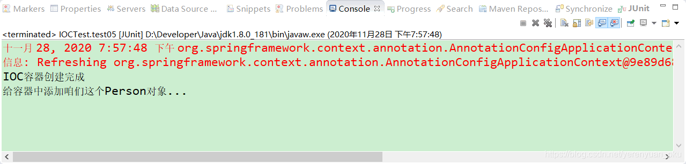
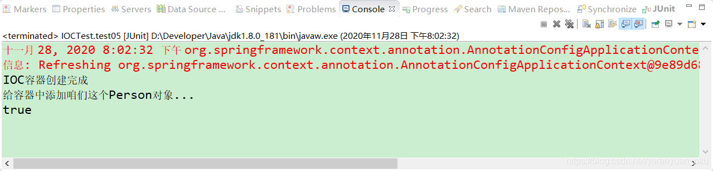

# 写在前面

Spring在启动时，默认会将单实例bean进行实例化，并加载到Spring容器中去。也就是说，单实例bean默认是在Spring容器启动的时候创建对象，并且还会将对象加载到Spring容器中。如果我们需要对某个bean进行延迟加载，那么该如何处理呢？此时，就需要使用到@Lazy注解了。

# 懒加载	

## 什么是懒加载呢？

何为懒加载呢？懒加载就是Spring容器启动的时候，先不创建对象，在第一次使用（获取）bean的时候再来创建对象，并进行一些初始化。

## 非懒加载模式

这里我们先来看看非懒加载这种模式。首先，我们将MainConfig2配置类中Person对象的作用域修改成单实例，如下所示。

```java
package com.meimeixia.config;

import org.springframework.context.annotation.Bean;
import org.springframework.context.annotation.Configuration;

import com.meimeixia.bean.Person;

@Configuration
public class MainConfig2 {
	
	@Bean("person")
	public Person person() {
		System.out.println("给容器中添加咱们这个Person对象...");
		return new Person("superMan", 25);
	}
	
}
```

然后，在IOCTest类中创建一个test05()方法，如下所示。

```java
@Test
public void test05() {
    AnnotationConfigApplicationContext applicationContext = new AnnotationConfigApplicationContext(MainConfig2.class);
    System.out.println("IOC容器创建完成");
}
```

接着，运行IOCTest类中的test05()方法，输出的结果信息如下所示。



可以看到，单实例bean在Spring容器启动的时候就会被创建，并且还加载到Spring容器中去了。

## 懒加载模式

我们再来看看懒加载这种模式。首先，我们在MainConfig2配置类中的person()方法上加上一个@Lazy注解，以此将Person对象设置为懒加载，如下所示。

```java
package com.meimeixia.config;

import org.springframework.context.annotation.Bean;
import org.springframework.context.annotation.Configuration;
import org.springframework.context.annotation.Lazy;

import com.meimeixia.bean.Person;

@Configuration
public class MainConfig2 {

	@Lazy
	@Bean("person")
	public Person person() {
		System.out.println("给容器中添加咱们这个Person对象...");
		return new Person("superMan", 25);
	}
	
}
```

然后，我们再次运行IOCTest类中的test05()方法，输出的结果信息如下所示。



可以看到，此时只是打印出了`IOC容器创建完成`这样一条信息，说明此时只创建了IOC容器，而并没有创建bean对象。

那么，加上@Lazy注解后，bean对象是何时被创建的呢？我们可以试着在IOCTest类中的test05()方法中获取一下Person对象，如下所示。

```java
@Test
public void test05() {
    AnnotationConfigApplicationContext applicationContext = new AnnotationConfigApplicationContext(MainConfig2.class);
    System.out.println("IOC容器创建完成");
    Person person = (Person) applicationContext.getBean("person");
}
```



这说明，我们在获取bean对象的时候，创建出了bean对象并加载到Spring容器中去了。

那么，问题又来了，只是第一次获取bean对象的时候创建出了它吗？多次获取会不会创建多个bean对象呢？我们再来完善下测试用例，在IOCTest类中的test05()方法里面，再次获取一个Person对象，并比较两次获取的Person对象是否相等，如下所示。

```java
@Test
public void test05() {
    AnnotationConfigApplicationContext applicationContext = new AnnotationConfigApplicationContext(MainConfig2.class);
    System.out.println("IOC容器创建完成");
    Person person = (Person) applicationContext.getBean("person");
    Person person2 = (Person) applicationContext.getBean("person");
    System.out.println(person == person2);
}
```

接着，我们再次运行以上方法，发现输出的结果信息如下所示。



从以上输出结果中可以看出，使用@Lazy注解标注后，单实例bean对象只是在第一次从Spring容器中获取时被创建，以后每次获取bean对象时，直接返回创建好的对象。

## 小结

**懒加载，也称延时加载，仅针对单实例bean生效。** 单实例bean是在Spring容器启动的时候加载的，添加@Lazy注解后就会延迟加载，在Spring容器启动的时候并不会加载，而是在第一次使用此bean的时候才会加载，**但当你多次获取bean的时候并不会重复加载，只是在第一次获取的时候才会加载，这不是延迟加载的特性，而是单实例bean的特性。**