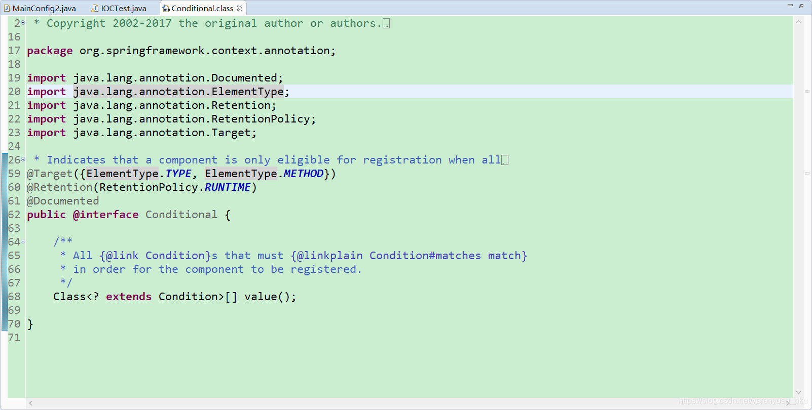
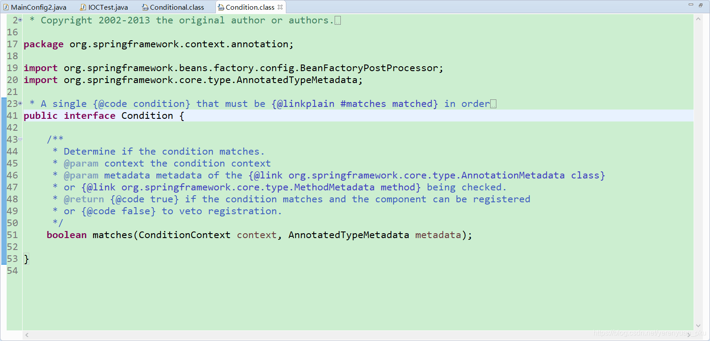
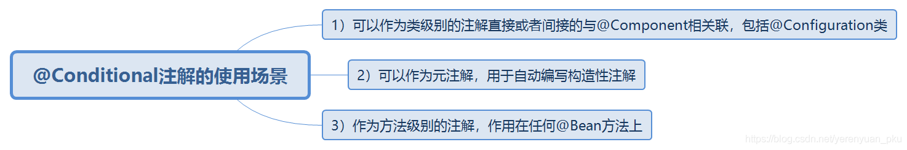
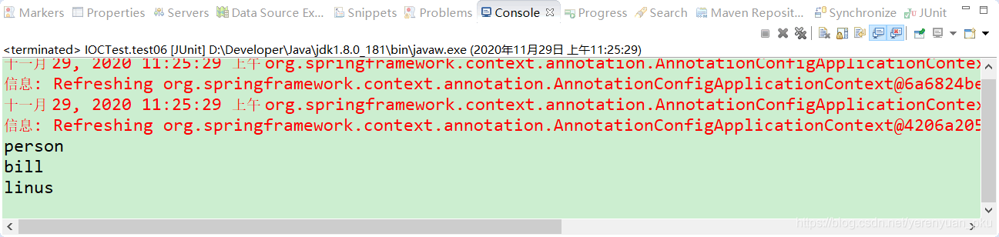
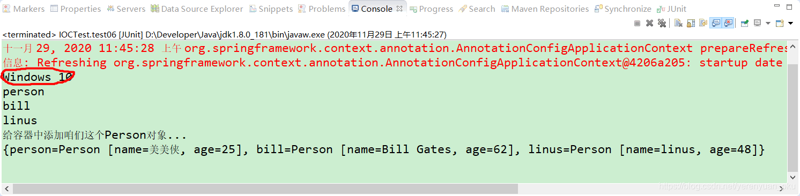
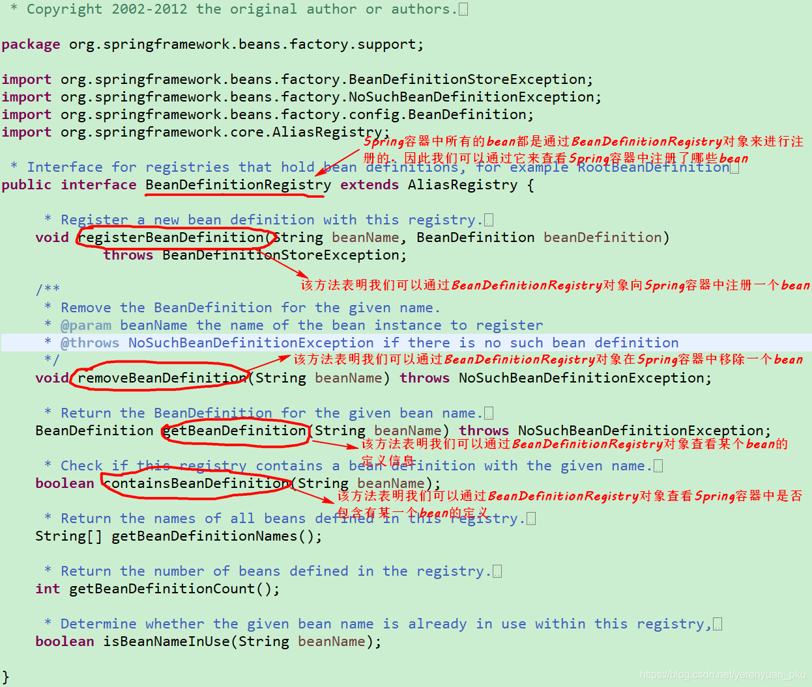
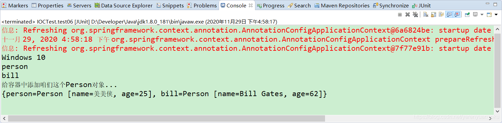
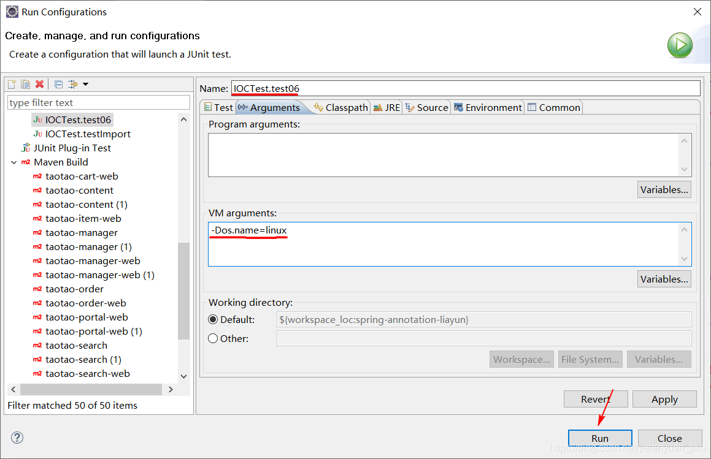
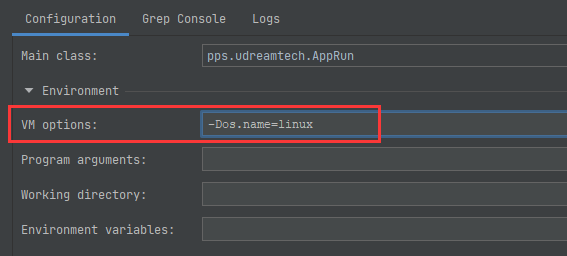
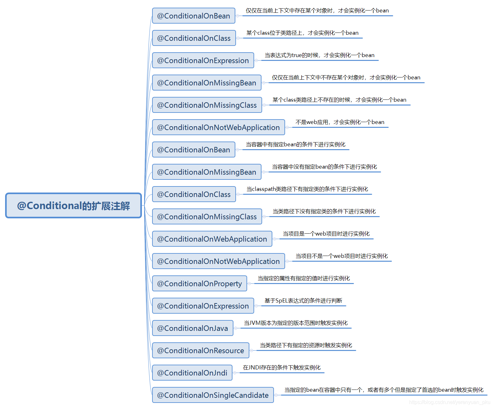

# 写在前面

当bean是单实例，并且没有设置懒加载时，Spring容器启动时，就会实例化bean，并将bean注册到IOC容器中，以后每次从IOC容器中获取bean时，直接返回IOC容器中的bean，而不用再创建新的bean了。

若bean是单实例，并且使用@Lazy注解设置了懒加载，则Spring容器启动时，不会立即实例化bean，自然就不会将bean注册到IOC容器中了，只有第一次获取bean的时候，才会实例化bean，并且将bean注册到IOC容器中。

若bean是多实例，则Spring容器启动时，不会实例化bean，也不会将bean注册到IOC容器中，只是在以后每次从IOC容器中获取bean的时候，都会创建一个新的bean返回。

其实，Spring支持按照条件向IOC容器中注册bean，满足条件的bean就会被注册到IOC容器中，不满足条件的bean就不会被注册到IOC容器中。接下来，我们就一起来探讨一下Spring中是如何实现按照条件向IOC容器中注册bean的。

<br/>

# @Conditional注解概述

@Conditional 注解可以按照一定的条件进行判断，满足条件向容器中注册bean，不满足条件就不向容器中注册bean。

@Conditional 注解是由Spring Framework提供的一个注解，它位于 org.springframework.context.annotation 包内，定义如下。



从@Conditional注解的源码来看，@Conditional注解不仅可以添加到类上，也可以添加到方法上。在@Conditional注解中，还存在着一个`Condition`类型或者其子类型的Class对象数组，`Condition`是个啥呢？我们点进去看一下。



可以看到，它是一个接口。所以，我们使用@Conditional注解时，需要写一个类来实现Spring提供的Condition接口，它会匹配@Conditional所符合的方法（这句话怎么说的那么不明白啊！），然后我们就可以使用我们在@Conditional注解中定义的类来检查了。

我们可以在哪些场合使用@Conditional注解呢？@Conditional注解的使用场景如下图所示。



# 向Spring容器注册bean

# 向Spring容器注册bean

我们在MainConfig2配置类中新增person01()方法和person02()方法，并为这两个方法添加@Bean注解，如下所示。

```java
package com.meimeixia.config;

import org.springframework.context.annotation.Bean;
import org.springframework.context.annotation.Configuration;
import org.springframework.context.annotation.Lazy;

import com.meimeixia.bean.Person;

@Configuration
public class MainConfig2 {
	
	@Lazy
	@Bean("person")
	public Person person() {
		System.out.println("给容器中添加咱们这个Person对象...");
		return new Person("superMan", 25);
	}
	
	@Bean("bill")
	public Person person01() {
		return new Person("Bill Gates", 62);
	}

	@Bean("linus")
	public Person person02() {
		return new Person("linus", 48);
	}
	
}
```

那么，这两个bean默认是否会被注册到Spring容器中去呢？我们新建一个测试用例来测试一下，即在IOCTest类中新建一个test06()方法，如下所示。

```java
@Test
public void test06() {
    AnnotationConfigApplicationContext applicationContext = new AnnotationConfigApplicationContext(MainConfig2.class);
    // 我们现在就来看一下IOC容器中Person这种类型的bean都有哪些
    String[] namesForType = applicationContext.getBeanNamesForType(Person.class);
    
    for (String name : namesForType) {
        System.out.println(name);
    }

}
```

我们运行以上test06()方法，发现输出的结果信息如下所示。



从输出结果中可以看出，同时输出了bill和linus。说明默认情况下，Spring容器会将单实例并且非懒加载的bean注册到IOC容器中。

接下来，我们再输出bean的名称和bean实例对象信息，此时我们只须在test06()方法中添加如下的代码片段即可。

```java
@Test
public void test06() {
    AnnotationConfigApplicationContext applicationContext = new AnnotationConfigApplicationContext(MainConfig2.class);
    // 我们现在就来看一下IOC容器中Person这种类型的bean都有哪些
    String[] namesForType = applicationContext.getBeanNamesForType(Person.class);
    
    for (String name : namesForType) {
        System.out.println(name);
    }
    
    Map<String, Person> persons = applicationContext.getBeansOfType(Person.class); // 找到这个Person类型的所有bean
    System.out.println(persons);
}
```

再次运行以上test06()方法，输出的结果如下所示。


可以看到，输出了注册到容器中的bean实例对象的详细信息。

## 带条件注册bean

现在，我们就要提出一个新的需求了，比如，如果当前操作系统是Windows操作系统，那么就向Spring容器中注册名称为bill的Person对象；如果当前操作系统是Linux操作系统，那么就向Spring容器中注册名称为linus的Person对象。要想实现这个需求，我们就得要使用@Conditional注解了。

这里，有小伙伴可能会问，如何获取操作系统的类型呢？别急，这个问题很简单，我们继续向下看。

使用Spring中的 `AnnotationConfigApplicationContext` 类就能够获取到当前操作系统的类型，如下所示。

```java
AnnotationConfigApplicationContext applicationContext = new AnnotationConfigApplicationContext(MainConfig2.class);
ConfigurableEnvironment environment = applicationContext.getEnvironment(); // 拿到IOC运行环境
// 动态获取坏境变量的值，例如操作系统的名字
String property = environment.getProperty("os.name"); // 获取操作系统的名字，例如Windows 10
System.out.println(property);
```

我们将上述代码整合到IOCTest类中的test06()方法中，如下所示。

```java
@Test
public void test06() {
    AnnotationConfigApplicationContext applicationContext = new AnnotationConfigApplicationContext(MainConfig2.class);
    // 我们现在就来看一下IOC容器中Person这种类型的bean都有哪些
    String[] namesForType = applicationContext.getBeanNamesForType(Person.class);
    ConfigurableEnvironment environment = applicationContext.getEnvironment(); // 拿到IOC运行环境
    // 动态获取坏境变量的值，例如操作系统的名字
    String property = environment.getProperty("os.name"); // 获取操作系统的名字，例如Windows 10
    System.out.println(property);
    
    for (String name : namesForType) {
        System.out.println(name);
    }
    
    Map<String, Person> persons = applicationContext.getBeansOfType(Person.class); // 找到这个Person类型的所有bean
    System.out.println(persons);
}
```

然后，我们运行以上test06()方法，会看到输出了如下图所示的结果信息。



由于我使用的操作系统是Windows 10操作系统，所以在结果信息中输出了Windows 10。

到这里，我们成功获取到了操作系统的类型，接下来就要来实现上面那个需求了。此时，我们可以借助Spring中的@Conditional注解来实现。

要想使用@Conditional注解，我们需要实现Condition接口来为@Conditional注解设置条件，所以，这里我们创建了两个实现Condition接口的类，它们分别是LinuxCondition和WindowsCondition，如下所示。

- LinuxCondition

```java
package com.meimeixia.condition;

import org.springframework.beans.factory.config.ConfigurableListableBeanFactory;
import org.springframework.beans.factory.support.BeanDefinitionRegistry;
import org.springframework.context.annotation.Condition;
import org.springframework.context.annotation.ConditionContext;
import org.springframework.core.env.Environment;
import org.springframework.core.type.AnnotatedTypeMetadata;

/**
* 判断操作系统是否是Linux系统
* @author liayun
*
*/
public class LinuxCondition implements Condition {

    /**
    * ConditionContext：判断条件能使用的上下文（环境）
    * AnnotatedTypeMetadata：当前标注了@Conditional注解的注释信息
    */
    @Override
    public boolean matches(ConditionContext context, AnnotatedTypeMetadata metadata) {
        // 判断操作系统是否是Linux系统
        
        // 1. 获取到bean的创建工厂（能获取到IOC容器使用到的BeanFactory，它就是创建对象以及进行装配的工厂）
        ConfigurableListableBeanFactory beanFactory = context.getBeanFactory();
        // 2. 获取到类加载器
        ClassLoader classLoader = context.getClassLoader();
        // 3. 获取当前环境信息，它里面就封装了我们这个当前运行时的一些信息，包括环境变量，以及包括虚拟机的一些变量
        Environment environment = context.getEnvironment();
        // 4. 获取到bean定义的注册类
        BeanDefinitionRegistry registry = context.getRegistry();
        
        String property = environment.getProperty("os.name");
        if (property.contains("linux")) {
            return true;
        }
        
        return false;
    }

}
```

这里我得好好说道说道通过context的getRegistry()方法获取到的bean定义的注册对象，即BeanDefinitionRegistry对象了。它到底是个啥呢？我们可以点进去看一下它的源码，如下所示，可以看到它是一个接口。



在上图中我对BeanDefinitionRegistry接口的源码作了一点简要的说明。知道了，Spring容器中所有的bean都可以通过BeanDefinitionRegistry对象来进行注册，因此我们可以通过它来查看Spring容器中到底注册了哪些bean。而且仔细查看一下BeanDefinitionRegistry接口中声明的各个方法，你就知道我们还可以通过BeanDefinitionRegistry对象向Spring容器中注册一个bean、移除一个bean、查询某一个bean的定义信息或者判断Spring容器中是否包含有某一个bean的定义。

因此，我们可以在这儿做更多的判断，比如说我可以判断一下Spring容器中是不是包含有某一个bean，就像下面这样，如果Spring容器中果真包含有名称为person的bean，那么就做些什么事情，如果没包含，那么我们还可以利用BeanDefinitionRegistry对象向Spring容器中注册一个bean。

```java
package com.meimeixia.condition;

import org.springframework.beans.factory.config.ConfigurableListableBeanFactory;
import org.springframework.beans.factory.support.BeanDefinitionRegistry;
import org.springframework.context.annotation.Condition;
import org.springframework.context.annotation.ConditionContext;
import org.springframework.core.env.Environment;
import org.springframework.core.type.AnnotatedTypeMetadata;

/**
* 判断操作系统是否是Linux系统
* @author liayun
*
*/
public class LinuxCondition implements Condition {

    /**
    * ConditionContext：判断条件能使用的上下文（环境）
    * AnnotatedTypeMetadata：当前标注了@Conditional注解的注释信息
    */
    @Override
    public boolean matches(ConditionContext context, AnnotatedTypeMetadata metadata) {
        // 判断操作系统是否是Linux系统
        
        // 1. 获取到bean的创建工厂（能获取到IOC容器使用到的BeanFactory，它就是创建对象以及进行装配的工厂）
        ConfigurableListableBeanFactory beanFactory = context.getBeanFactory();
        // 2. 获取到类加载器
        ClassLoader classLoader = context.getClassLoader();
        // 3. 获取当前环境信息，它里面就封装了我们这个当前运行时的一些信息，包括环境变量，以及包括虚拟机的一些变量
        Environment environment = context.getEnvironment();
        // 4. 获取到bean定义的注册类
        BeanDefinitionRegistry registry = context.getRegistry();
        
        // 在这儿还可以做更多的判断，比如说我判断一下Spring容器中是不是包含有某一个bean，就像下面这样，如果Spring容器中果真包含有名称为person的bean，那么就做些什么事情...
        boolean definition = registry.containsBeanDefinition("person");

        String property = environment.getProperty("os.name");
        if (property.contains("linux")) {
            return true;
        }
        
        return false;
    }

}
```

- WindowsCondition

```java
package com.meimeixia.condition;

import org.springframework.context.annotation.Condition;
import org.springframework.context.annotation.ConditionContext;
import org.springframework.core.env.Environment;
import org.springframework.core.type.AnnotatedTypeMetadata;

/**
* 判断操作系统是否是Windows系统
* @author liayun
*
*/
public class WindowsCondition implements Condition {

    @Override
    public boolean matches(ConditionContext context, AnnotatedTypeMetadata metadata) {
        Environment environment = context.getEnvironment();
        String property = environment.getProperty("os.name");
        if (property.contains("Windows")) {
            return true;
        }
        return false;
    }

}
```

然后，我们就需要在MainConfig2配置类中使用@Conditional注解添加条件了。添加该注解后的方法如下所示。

```java
package com.meimeixia.config;

import org.springframework.context.annotation.Bean;
import org.springframework.context.annotation.Conditional;
import org.springframework.context.annotation.Configuration;
import org.springframework.context.annotation.Lazy;

import com.meimeixia.bean.Person;
import com.meimeixia.condition.LinuxCondition;
import com.meimeixia.condition.WindowsCondition;

@Configuration
public class MainConfig2 {
	
	@Lazy
	@Bean("person")
	public Person person() {
		System.out.println("给容器中添加咱们这个Person对象...");
		return new Person("美美侠", 25);
	}

	@Conditional({WindowsCondition.class})
	@Bean("bill")
	public Person person01() {
		return new Person("Bill Gates", 62);
	}
	
	@Conditional({LinuxCondition.class})
	@Bean("linus")
	public Person person02() {
		return new Person("linus", 48);
	}
	
}
```

此时，我们再次运行IOCTest类中的test06()方法，发现输出的结果信息如下所示。



可以看到，输出结果中不再含有名称为linus的bean了，这说明程序中检测到当前操作系统为Windows 10之后，没有向Spring容器中注册名称为linus的bean。

此外，@Conditional注解也可以标注在类上，标注在类上的含义是：只有满足了当前条件，这个配置类中配置的所有bean注册才能生效，也就是对配置类中的组件进行统一设置。

```java
package com.meimeixia.config;

import org.springframework.context.annotation.Bean;
import org.springframework.context.annotation.Conditional;
import org.springframework.context.annotation.Configuration;
import org.springframework.context.annotation.Lazy;

import com.meimeixia.bean.Person;
import com.meimeixia.condition.LinuxCondition;
import com.meimeixia.condition.WindowsCondition;

// 对配置类中的组件进行统一设置
@Conditional({WindowsCondition.class}) // 满足当前条件，这个类中配置的所有bean注册才能生效
@Configuration
public class MainConfig2 {
	
	@Lazy
	@Bean("person")
	public Person person() {
		System.out.println("给容器中添加咱们这个Person对象...");
		return new Person("美美侠", 25);
	}
	
	@Bean("bill")
	public Person person01() {
		return new Person("Bill Gates", 62);
	}
	
	@Conditional({LinuxCondition.class})
	@Bean("linus")
	public Person person02() {
		return new Person("linus", 48);
	}
	
}
```

此时，我们在运行IOCTest类中的test06()方法时，设置一个`-Dos.name=linux`参数，就像下图所示的那样，这是我们将操作系统模拟为了linux系统。





运行以上test06()方法之后，你会发现输出的结果信息如下所示。


<br/>

# @Conditional的扩展注解



# @Conditional与@Profile这俩注解的对比

Spring 3.0也有一些和@Conditional相似的注解，它们是Spring SPEL表达式和Spring Profiles注解，但是Spring 4.0之后的@Conditional注解要比@Profile注解更加高级。@Profile注解用来加载应用程序的环境，该注解仅限于根据预定义属性编写条件检查，而@Conditional注解则没有此限制。

Spring中的@Profile和@Conditional这俩注解都是用来检查If...then...else的语义。然而，Spring 4.0之后的@Conditional注解是@Profile注解的更新用法。

- Spring 3.0中的@Profile仅用于编写基于Environment变量的条件检查。配置文件可用于基于环境加载应用程序配置（这句话好绕口啊😭）。
- Spring 4.0之后的@Conditional注解允许开发人员为条件检查定义用户定义的策略。此外，@Conditional注解还可以用于条件bean注册。