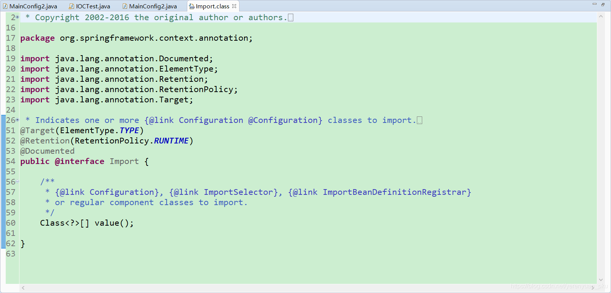
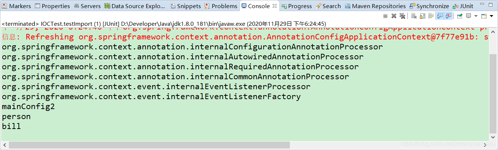
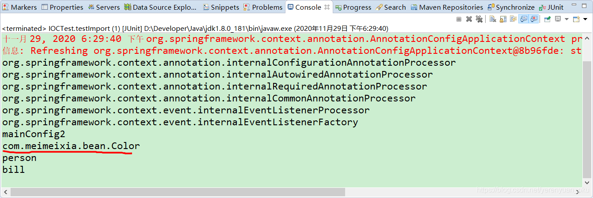
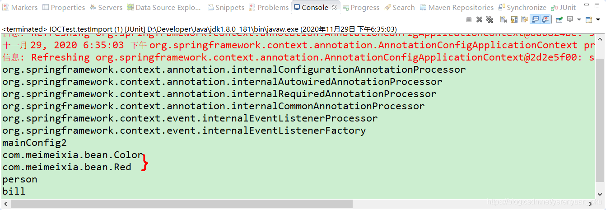

# 写在前面

我们知道，我们可以将一些bean组件交由Spring来管理，并且Spring还支持单实例bean和多实例bean。我们自己写的类，自然是可以通过包扫描+给组件标注注解（@Controller、@Servcie、@Repository、@Component）的形式将其注册到IOC容器中，但这种方式比较有局限性，局限于我们自己写的类，比方说我们自己写的类，我们当然能把以上这些注解标注上去了。

那么如果不是我们自己写的类，比如说我们在项目中会经常引入一些第三方的类库，我们需要将这些第三方类库中的类注册到Spring容器中，该怎么办呢？此时，我们就可以使用@Bean和@Import注解将这些类快速的导入Spring容器中。

接下来，我们来一起探讨下如何使用 `@Import` 注解给容器中快速导入一个组件。

# 注册bean的方式

向Spring容器中注册bean通常有以下几种方式：

1. 包扫描+给组件标注注解（@Controller、@Servcie、@Repository、@Component），但这种方式比较有局限性，局限于我们自己写的类
2. `@Bean ` 注解，通常用于导入第三方包中的组件
3. `@Import` 注解，快速向Spring容器中导入一个组件

# @Import注解概述

Spring 3.0之前，创建bean可以通过XML配置文件与扫描特定包下面的类来将类注入到Spring IOC容器内。而在Spring 3.0之后提供了JavaConfig的方式，也就是将IOC容器里面bean的元信息以Java代码的方式进行描述，然后我们可以通过@Configuration与@Bean这两个注解配合使用来将原来配置在XML文件里面的bean通过Java代码的方式进行描述。

@Import注解提供了@Bean注解的功能，同时还有XML配置文件里面标签组织多个分散的XML文件的功能，当然在这里是组织多个分散的@Configuration，因为一个配置类就约等于一个XML配置文件。

我们先看一下@Import注解的源码，如下所示。



从源码里面可以看出@Import可以配合`Configuration`、`ImportSelector`以及`ImportBeanDefinitionRegistrar`来使用，下面的 or 表示也可以把`Import`当成普通的bean来使用。

**注意：@Import注解只允许放到类上面，不允许放到方法上。**

下面我们来看一下该注解的具体使用方式。

# @Import注解的使用方式

@Import注解的三种用法主要包括：

- 直接填写class数组的方式
- **ImportSelector接口的方式，即批量导入，这是重点**
- ImportBeanDefinitionRegistrar接口方式，即手工注册bean到容器中

注意：我们先来看第一种方法，即直接填写class数组的方式，其他的两种方式我后面会继续讲解。

# @Import导入组件的简单示例

## 没有使用@Import注解时的效果

首先，我们创建一个Color类，这个类是一个空类，没有成员变量和方法，如下所示。

```java
package com.meimeixia.bean;

public class Color {

}
```

然后，我们在IOCTest类中创建一个testImport()方法，在其中输出Spring容器中所有bean定义的名字，来查看是否存在Color类对应的bean实例，以此来判断Spring容器中是否注册有Color类对应的bean实例。

```java
@Test
public void testImport() {
    AnnotationConfigApplicationContext applicationContext = new AnnotationConfigApplicationContext(MainConfig2.class);
    String[] definitionNames = applicationContext.getBeanDefinitionNames();
    for (String name : definitionNames) {
        System.out.println(name);
    }
}
```

运行以上testImport()方法之后，输出的结果信息如下所示。



可以看到Spring容器中并没有Color类对应的bean实例。

## 使用@Import注解时的效果

首先，我们在MainConfig2配置类上添加一个@Import注解，并将Color类填写到该注解中，如下所示。

```java
package com.meimeixia.config;

import org.springframework.context.annotation.Bean;
import org.springframework.context.annotation.Conditional;
import org.springframework.context.annotation.Configuration;
import org.springframework.context.annotation.Import;
import org.springframework.context.annotation.Lazy;

import com.meimeixia.bean.Color;
import com.meimeixia.bean.Person;
import com.meimeixia.condition.LinuxCondition;
import com.meimeixia.condition.WindowsCondition;

// 对配置类中的组件进行统一设置
@Conditional({WindowsCondition.class}) // 满足当前条件，这个类中配置的所有bean注册才能生效
@Configuration
@Import(Color.class) // @Import快速地导入组件，id默认是组件的全类名
public class MainConfig2 {
	
	@Lazy
	@Bean("person")
	public Person person() {
		System.out.println("给容器中添加咱们这个Person对象...");
		return new Person("superMan", 25);
	}
	
	@Bean("bill")
	public Person person01() {
		return new Person("Bill Gates", 62);
	}
	
	@Conditional({LinuxCondition.class})
	@Bean("linus")
	public Person person02() {
		return new Person("linus", 48);
	}
	
}
```

然后，我们运行IOCTest类中的testImport()方法，会发现输出的结果信息如下所示。



可以看到，输出结果中打印了com.meimeixia.bean.Color，说明使用@Import注解快速地导入组件时，容器中就会自动注册这个组件，并且id默认是组件的全类名。

@Import注解还支持同时导入多个类，例如，我们再次创建一个Red类，如下所示。

```java
package com.meimeixia.bean;

public class Red {

}
```

然后，我们也将以上Red类添加到@Import注解中，如下所示。

```java
package com.meimeixia.config;

import org.springframework.context.annotation.Bean;
import org.springframework.context.annotation.Conditional;
import org.springframework.context.annotation.Configuration;
import org.springframework.context.annotation.Import;
import org.springframework.context.annotation.Lazy;

import com.meimeixia.bean.Color;
import com.meimeixia.bean.Person;
import com.meimeixia.condition.LinuxCondition;
import com.meimeixia.condition.WindowsCondition;

// 对配置类中的组件进行统一设置
@Conditional({WindowsCondition.class}) // 满足当前条件，这个类中配置的所有bean注册才能生效
@Configuration
@Import({Color.class, Red.class}) // @Import快速地导入组件，id默认是组件的全类名
public class MainConfig2 {
	
	@Lazy
	@Bean("person")
	public Person person() {
		System.out.println("给容器中添加咱们这个Person对象...");
		return new Person("superMan", 25);
	}
	
	@Bean("bill")
	public Person person01() {
		return new Person("Bill Gates", 62);
	}
	
	@Conditional({LinuxCondition.class})
	@Bean("linus")
	public Person person02() {
		return new Person("linus", 48);
	}
	
}
```

接着，我们运行IOCTest类中的testImport()方法，发现输出的结果信息如下所示。



可以看到，结果信息中同时输出了com.meimeixia.bean.Color和com.meimeixia.bean.Red，说明Color类对应的bean实例和Red类对应的bean实例都导入到Spring容器中去了。