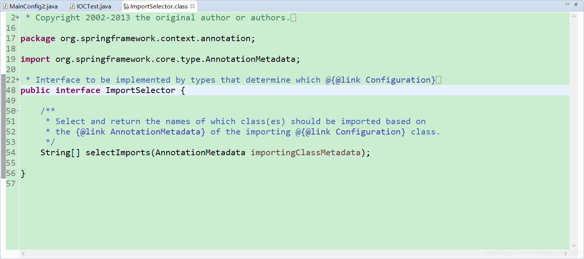
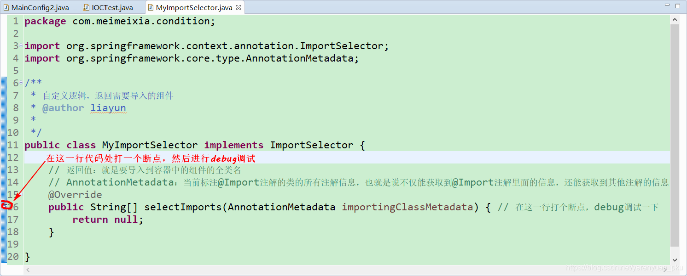
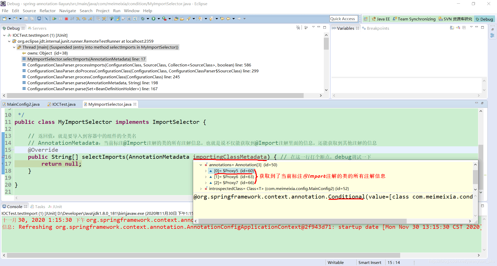
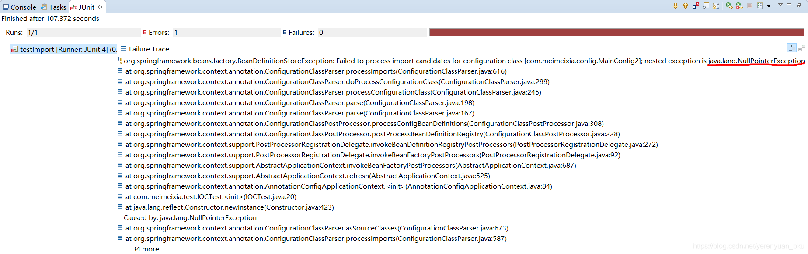
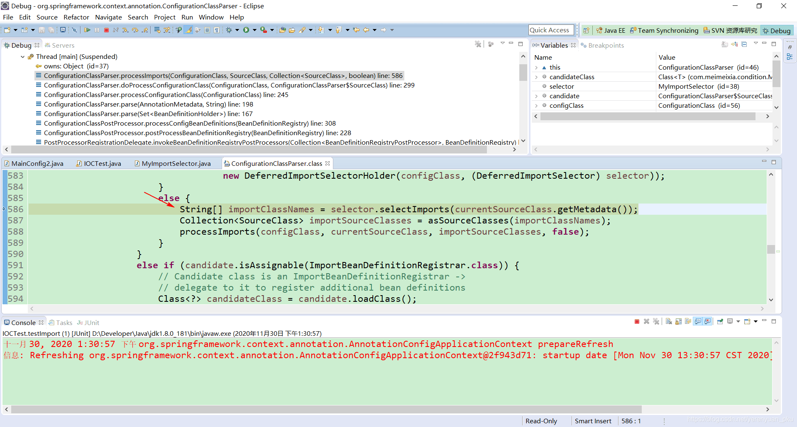
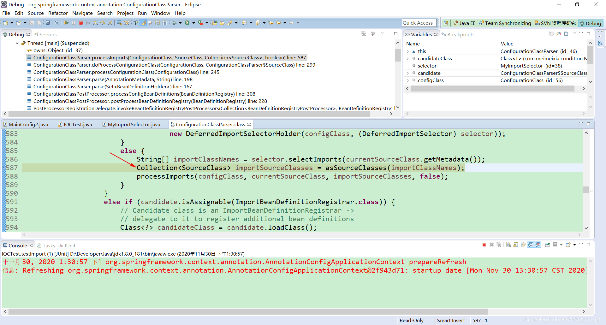
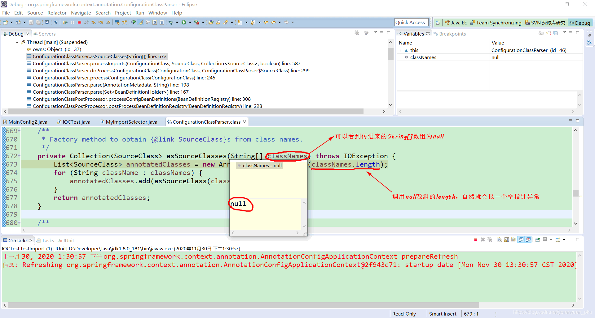
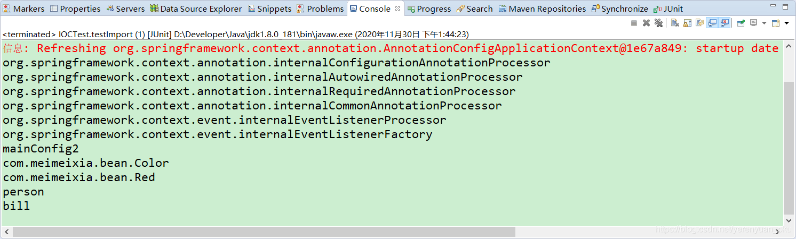
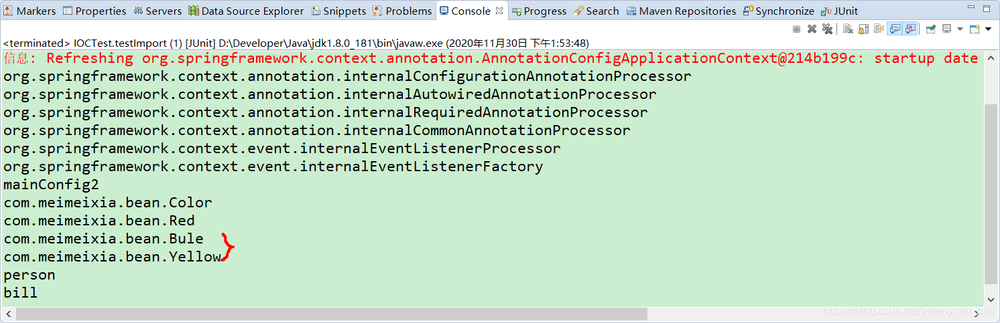

# 写在前面

在上一讲关于Spring的@Import注解的文章中，我们简单介绍了如何使用@Import注解给容器中快速导入一个组件，而我们知道，@Import注解总共包含三种使用方法，上一讲已经讲解完第一种方式了，今天我们就一起来学习下关于@Import注解非常重要的第二种方式，即ImportSelector接口的方式。

# ImportSelector接口概述

ImportSelector接口是Spring中导入外部配置的核心接口，在**Spring Boot的自动化配置和@EnableXXX（功能性注解）都有它的存在**。我们先来看一下ImportSelector接口的源码，如下所示。



该接口文档上说的明明白白，其主要作用是收集需要导入的配置类，selectImports()方法的返回值就是我们向Spring容器中导入的类的全类名。如果该接口的实现类同时实现EnvironmentAware，BeanFactoryAware，BeanClassLoaderAware或者ResourceLoaderAware，那么在调用其selectImports()方法之前先调用上述接口中对应的方法，如果需要在所有的@Configuration处理完再导入时，那么可以实现DeferredImportSelector接口。

在ImportSelector接口的selectImports()方法中，存在一个AnnotationMetadata类型的参数，这个参数能够获取到当前标注@Import注解的类的所有注解信息，也就是说不仅能获取到@Import注解里面的信息，还能获取到其他注解的信息。

# ImportSelector接口实例

首先，我们创建一个MyImportSelector类实现ImportSelector接口，如下所示，先在selectImports()方法中返回null，后面我们再来改。

```java
package com.meimeixia.condition;

import org.springframework.context.annotation.ImportSelector;
import org.springframework.core.type.AnnotationMetadata;

/**
 * 自定义逻辑，返回需要导入的组件
 * @author liayun
 *
 */
public class MyImportSelector implements ImportSelector {

	// 返回值：就是要导入到容器中的组件的全类名
	// AnnotationMetadata：当前标注@Import注解的类的所有注解信息，也就是说不仅能获取到@Import注解里面的信息，还能获取到其他注解的信息
	@Override
	public String[] selectImports(AnnotationMetadata importingClassMetadata) { // 在这一行打个断点，debug调试一下
		return null;
	}

}
```

然后，在MainConfig2配置类的@Import注解中，导入MyImportSelector类，如下所示。

```java
package com.meimeixia.config;

import org.springframework.context.annotation.Bean;
import org.springframework.context.annotation.Conditional;
import org.springframework.context.annotation.Configuration;
import org.springframework.context.annotation.Import;
import org.springframework.context.annotation.Lazy;

import com.meimeixia.bean.Color;
import com.meimeixia.bean.Person;
import com.meimeixia.bean.Red;
import com.meimeixia.condition.LinuxCondition;
import com.meimeixia.condition.MyImportSelector;
import com.meimeixia.condition.WindowsCondition;

// 对配置类中的组件进行统一设置
@Conditional({WindowsCondition.class}) // 满足当前条件，这个类中配置的所有bean注册才能生效
@Configuration
@Import({Color.class, Red.class, MyImportSelector.class}) // @Import快速地导入组件，id默认是组件的全类名
public class MainConfig2 {

	@Lazy
	@Bean("person")
	public Person person() {
		System.out.println("给容器中添加咱们这个Person对象...");
		return new Person("superMan", 25);
	}

	@Bean("bill")
	public Person person01() {
		return new Person("Bill Gates", 62);
	}
	
	@Conditional({LinuxCondition.class})
	@Bean("linus")
	public Person person02() {
		return new Person("linus", 48);
	}
	
}
```

至于使用MyImportSelector类要导入哪些bean，就需要你在MyImportSelector类的selectImports()方法中进行设置了，只须在MyImportSelector类的selectImports()方法中返回要导入的类的全类名（包名+类名）即可。

接着，我们就要运行IOCTest类中的testImport()方法了，在运行该方法之前，咱们先在MyImportSelector类的selectImports()方法处打一个断点，debug调试一下，如下图所示。



打好断点之后，我们再以debug的方式来运行IOCTest类中的testImport()方法。



可以清楚地看到，selectImports()方法中的AnnotationMetadata类型的参数确实获取到了当前标注@Import注解的类的所有注解信息，第一个获取到的注解是@Conditional，其他依此类推。

此时，我们按`F8`键，会发现Eclipse控制台打印了一个空指针异常，如下图所示。



为什么会报这样一个空指针异常呢？我们可以再次以debug的方式来运行IOCTest类中的testImport()方法，并按住`F6`键运行下一行代码，这时应该会跳到下面这行代码处。



然后再按一下`F6`键运行到下一行代码处，如下图所示。



然后再按一下`F6`键运行到下一行代码处，如下图所示。


接着按住`F5`键进入asSourceClasses()方法中，可以看到该方法中的String[]数组参数是null，当调用null数组的length时，自然而然就会报一个空指针异常了。



因此要想不报这样一个空指针异常，咱们MyImportSelector类的selectImports()方法里面就不能返回一个null值了，不妨先返回一个空数组试试，就像下面这样。

```java
package com.meimeixia.condition;

import org.springframework.context.annotation.ImportSelector;
import org.springframework.core.type.AnnotationMetadata;

/**
 * 自定义逻辑，返回需要导入的组件
 * @author liayun
 *
 */
public class MyImportSelector implements ImportSelector {

	// 返回值：就是要导入到容器中的组件的全类名
	// AnnotationMetadata：当前标注@Import注解的类的所有注解信息，也就是说不仅能获取到@Import注解里面的信息，还能获取到其他注解的信息
	@Override
	public String[] selectImports(AnnotationMetadata importingClassMetadata) { // 在这一行打个断点，debug调试一下
		
		// 方法不要返回null值，否则会报空指针异常
		return new String[]{}; // 可以返回一个空数组
	}

}
```

此时，我们运行一下IOCTest类中的testImport()方法，发现输出的结果信息如下所示。



现在总算是能输出点东西了，而且还不报空指针异常了。由于咱们在MyImportSelector类的selectImports()方法中返回的是一个空数组，所以还没有在IOC容器中注册任何组件，自然Eclipse控制台就没有输出通过ImportSelector接口的方式注册的任何组件的名字了。

接下来，我们就来创建两个Java类，它们分别是Blue类和Yellow类，如下所示。

- Blue.java

```java
package com.meimeixia.bean;

public class Blue {

}
```

- Yellow.java

```java
package com.meimeixia.bean;

public class Yellow {

}
```

然后，我们将以上两个类的全类名返回到MyImportSelector类的selectImports()方法中，此时，MyImportSelector类的selectImports()方法如下所示。

```java
package com.meimeixia.condition;

import org.springframework.context.annotation.ImportSelector;
import org.springframework.core.type.AnnotationMetadata;

/**
 * 自定义逻辑，返回需要导入的组件
 * @author liayun
 *
 */
public class MyImportSelector implements ImportSelector {

	// 返回值：就是要导入到容器中的组件的全类名
	// AnnotationMetadata：当前标注@Import注解的类的所有注解信息，也就是说不仅能获取到@Import注解里面的信息，还能获取到其他注解的信息
	@Override
	public String[] selectImports(AnnotationMetadata importingClassMetadata) { // 在这一行打个断点，debug调试一下
		
		// 方法不要返回null值，否则会报空指针异常
//		return new String[]{}; // 可以返回一个空数组
		return new String[]{"com.meimeixia.bean.Blue", "com.meimeixia.bean.Yellow"};
	}

}
```

接着，我们运行IOCTest类的testImport()方法，输出的结果信息如下所示。



可以看到，输出结果中多出了 com.meimeixia.bean.Blue 和 com.meimeixia.bean.Yellow。这说明使用ImportSelector接口的方式已经成功将Blue类和Yellow类导入到Spring容器中去了。