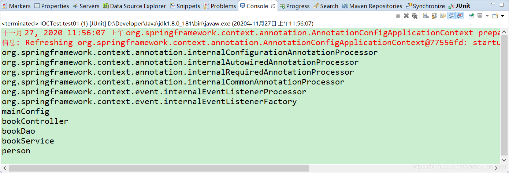
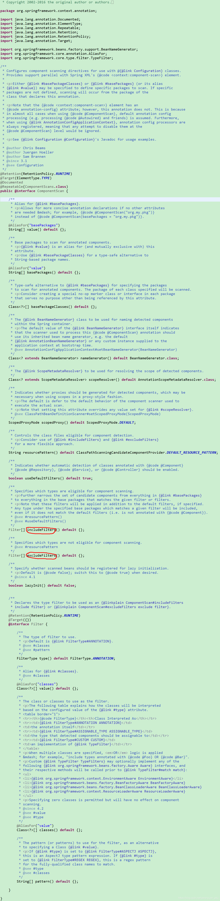
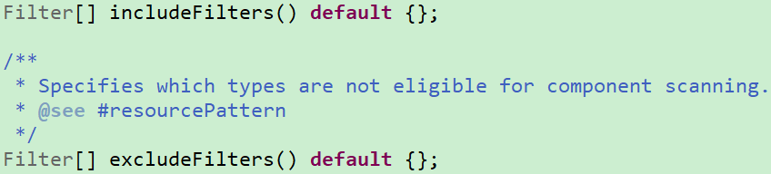
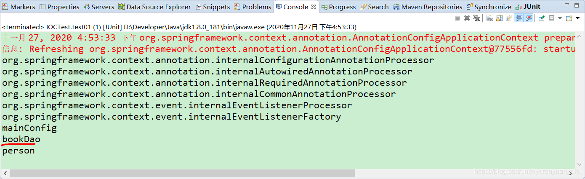
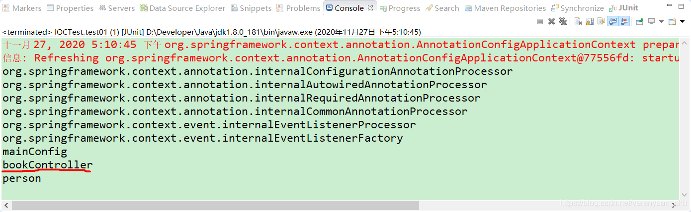
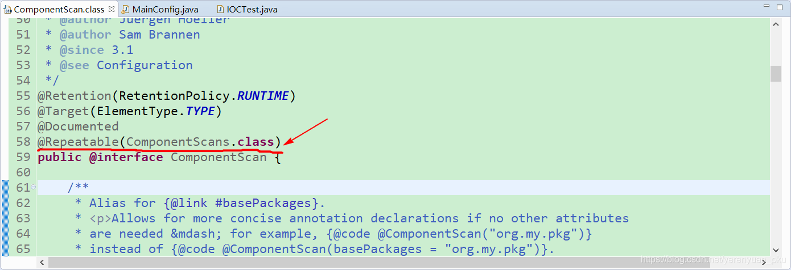
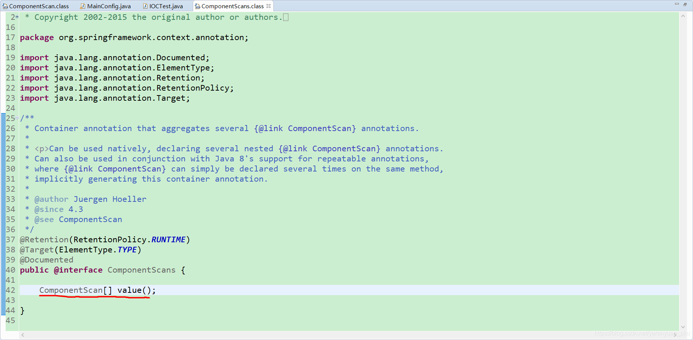
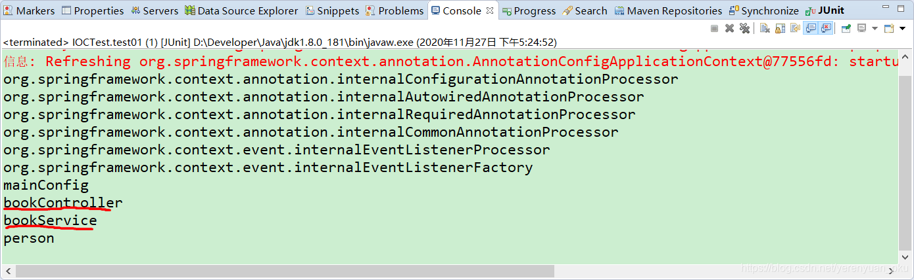
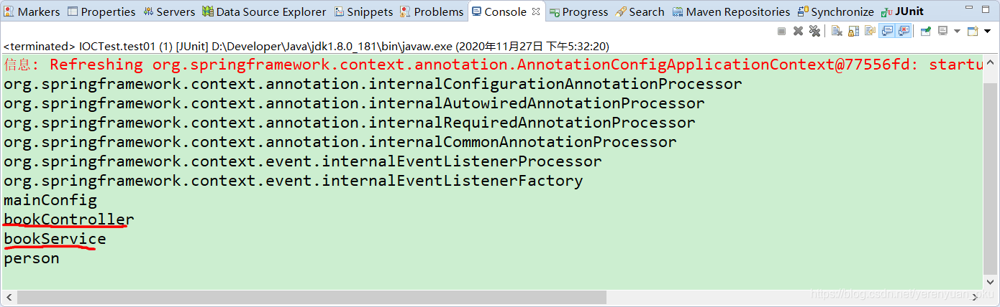

# 写在前面

在实际项目中，我们更多的是使用Spring的包扫描功能对项目中的包进行扫描，凡是在指定的包或其子包中的类上标注了@Repository、@Service、@Controller、@Component注解的类都会被扫描到，并将这个类注入到Spring容器中。

Spring包扫描功能可以使用XML配置文件进行配置，也可以直接使用@ComponentScan注解进行设置，使用@ComponentScan注解进行设置比使用XML配置文件来配置要简单的多

# 使用XML文件配置包扫描

我们可以在Spring的XML配置文件中配置包的扫描，在配置包扫描时，需要在Spring的XML配置文件中的beans节点中引入context标签，如下所示。

```xml
<?xml version="1.0" encoding="UTF-8"?>
<beans xmlns="http://www.springframework.org/schema/beans"
	xmlns:context="http://www.springframework.org/schema/context" xmlns:p="http://www.springframework.org/schema/p"
	xmlns:aop="http://www.springframework.org/schema/aop" xmlns:tx="http://www.springframework.org/schema/tx"
	xmlns:xsi="http://www.w3.org/2001/XMLSchema-instance"
	xsi:schemaLocation="http://www.springframework.org/schema/beans 
                        http://www.springframework.org/schema/beans/spring-beans-4.2.xsd
                        http://www.springframework.org/schema/context 
                        http://www.springframework.org/schema/context/spring-context-4.2.xsd">
```

接下来，我们就可以在XML配置文件中定义要扫描的包了，如下所示。

```xml
<!-- 包扫描：只要是标注了我们熟悉的@Controller、@Service、@Repository、@Component这四个注解中的任何一个的组件，它就会被自动扫描，并加进容器中 -->
<context:component-scan base-package="com.meimeixia"></context:component-scan>
```

整个beans.xml配置文件中的内容如下所示。

```xml
<?xml version="1.0" encoding="UTF-8"?>
<beans xmlns="http://www.springframework.org/schema/beans"
	xmlns:context="http://www.springframework.org/schema/context" xmlns:p="http://www.springframework.org/schema/p"
	xmlns:aop="http://www.springframework.org/schema/aop" xmlns:tx="http://www.springframework.org/schema/tx"
	xmlns:xsi="http://www.w3.org/2001/XMLSchema-instance"
	xsi:schemaLocation="http://www.springframework.org/schema/beans 
						http://www.springframework.org/schema/beans/spring-beans-4.2.xsd
						http://www.springframework.org/schema/context 
						http://www.springframework.org/schema/context/spring-context-4.2.xsd">
	
	<!-- 包扫描：只要是标注了我们熟悉的@Controller、@Service、@Repository、@Component这四个注解中的任何一个的组件，它就会被自动扫描，并加进容器中 -->
	<context:component-scan base-package="com.meimeixia"></context:component-scan>
	
	<!-- 注册组件 -->
	<bean id="person" class="com.meimeixia.bean.Person">
		<property name="age" value="18"></property>
		<property name="name" value="liayun"></property>
	</bean>
	
</beans>
```

这样配置以后，只要在com.meimeixia包下，或者com.meimeixia的子包下标注了@Repository、@Service、@Controller、@Component注解的类都会被扫描到，并自动注入到Spring容器中。

此时，我们分别创建BookDao、BookService以及BookController这三个类，并在这三个类中分别添加@Repository、@Service、@Controller注解，如下所示。

- BookDao

```java
package com.meimeixia.dao;

import org.springframework.stereotype.Repository;

// 名字默认是类名首字母小写
@Repository
public class BookDao {
    
}
```

- BookService

```java
package com.meimeixia.service;

import org.springframework.stereotype.Service;

@Service
public class BookService {
    
}
```

- BookController

```java
package com.meimeixia.controller;

import org.springframework.stereotype.Controller;

@Controller
public class BookController {
    
}
```

接下来，我们在工程的src/test/java目录下新建一个单元测试类来进行测试，例如IOCTest。由于我在这儿使用的是junit来进行测试，因此还须在pom文件中添加对junit的依赖，如下所示。

```pom
<dependency>
    <groupId>junit</groupId>
    <artifactId>junit</artifactId>
    <version>4.12</version>
    <scope>test</scope>
</dependency>
```

添加完依赖之后，我们就可以在IOCTest测试类中编写如下一个方法来进行测试了，即看一看IOC容器中现在有哪些bean。

```java
package com.meimeixia.test;

import org.junit.Test;
import org.springframework.context.annotation.AnnotationConfigApplicationContext;

import com.meimeixia.config.MainConfig;

public class IOCTest {
	
	@SuppressWarnings("resource")
	@Test
	public void test() {
		ClassPathXmlApplicationContext applicationContext = new ClassPathXmlApplicationContext("application.xml");
		// 我们现在就来看一下IOC容器中有哪些bean，即容器中所有bean定义的名字
		String[] definitionNames = applicationContext.getBeanDefinitionNames();
		for (String name : definitionNames) {
			System.out.println(name);
		}
	}

}
```

运行测试用例，输出的结果信息如下图所示。


可以看到，除了输出我们自己创建的bean的名称之外，也输出了Spring内部使用的一些重要的bean的名称。

接下来，我们使用注解来完成这些功能。

# 使用注解配置包扫描

使用@ComponentScan注解之前我们先将application.xml配置文件中的下述配置注释掉。

```xml
<context:component-scan base-package="com.meimeixia"></context:component-scan>
```

注释掉之后，我们就可以使用@ComponentScan注解来配置包扫描了。使用@ComponentScan注解配置包扫描非常非常easy！只须在我们的MainConfig类上添加@ComponentScan注解，并将扫描的包指定为com.meimeixia即可，如下所示。

**如果是一个项目的话 `@ComponentScan` 标注在主启动类上 **

```java
package com.meimeixia.config;

import org.springframework.context.annotation.Bean;
import org.springframework.context.annotation.ComponentScan;
import org.springframework.context.annotation.Configuration;

import com.meimeixia.bean.Person;
/**
 * 以前配置文件的方式被替换成了配置类，即配置类==配置文件
 * @author liayun
 *
 */
// 这个配置类也是一个组件 
@ComponentScan(value="com.meimeixia") // value指定要扫描的包
@Configuration // 告诉Spring这是一个配置类
public class MainConfig {

	// @Bean注解是给IOC容器中注册一个bean，类型自然就是返回值的类型，id默认是用方法名作为id
	@Bean("person")
	public Person person01() {
		return new Person("liayun", 20);
	}
	
}
```

没错，就是这么简单，只需要在类上添加`@ComponentScan(value="com.meimeixia")`这样一个注解即可。

然后，我们在IOCTest类中新增如下一个test01()方法，以便进行测试。

```java
@SuppressWarnings("resource")
@Test
public void test01() {
    AnnotationConfigApplicationContext applicationContext = new AnnotationConfigApplicationContext(MainConfig.class);
    // 我们现在就来看一下IOC容器中有哪些bean，即容器中所有bean定义的名字
    String[] definitionNames = applicationContext.getBeanDefinitionNames();
    for (String name : definitionNames) {
        System.out.println(name);
    }
}
```

运行以上test01()方法，输出的结果信息如下图所示。



可以看到使用@ComponentScan注解同样输出了容器中bean的名称。

既然使用XML配置文件和注解的方式都能够将相应的类注入到Spring容器当中，那我们是使用XML配置文件还是使用注解呢？我更倾向于使用注解，如果你确实喜欢使用XML配置文件来进行配置，也可以啊，哈哈，个人喜好嘛！好了，我们继续。

# 关于@ComponentScan注解

我们点开ComponentScan注解类并查看其源码，如下图所示。



这里，我们着重来看ComponentScan类中的如下两个方法。



`includeFilters()` ：方法指定Spring扫描的时候按照什么规则只需要包含哪些组件，

`excludeFilters()` ：方法指定Spring扫描的时候按照什么规则排除哪些组件。

两个方法的返回值都是Filter[]数组，在ComponentScan注解类的内部存在Filter注解类，大家可以看下上面的代码。

## 扫描时排除注解标注的类

现在有这样一个需求，除了@Controller和@Service标注的组件之外，IOC容器中剩下的组件我都要，即相当于是我要排除@Controller和@Service这俩注解标注的组件。要想达到这样一个目的，我们可以在MainConfig类上通过@ComponentScan注解的excludeFilters()方法实现。例如，我们在MainConfig类上添加了如下的注解。

```java
@ComponentScan(value="com.meimeixia", excludeFilters={
		/*
		 * type：指定你要排除的规则，是按照注解进行排除，还是按照给定的类型进行排除，还是按照正则表达式进行排除，等等
		 * classes：除了@Controller和@Service标注的组件之外，IOC容器中剩下的组件我都要，即相当于是我要排除@Controller和@Service这俩注解标注的组件。
		 */
		@Filter(type=FilterType.ANNOTATION, classes={Controller.class, Service.class})
}) // value指定要扫描的包
```

这样，我们就使得Spring在扫描包的时候排除了使用@Controller和@Service这俩注解标注的类。你要是不信的话，那么可以运行一下IOCTest类中的test01()方法，看看输出的结果信息到底是什么。



从上图中可以清楚地看到，输出的结果信息中不再输出bookController和bookService了，这已然说明了Spring在进行包扫描时，忽略了@Controller和@Service这俩注解标注的类。

## 扫描时只包含注解标注的类

我们也可以使用ComponentScan注解类中的includeFilters()方法来指定Spring在进行包扫描时，只包含哪些注解标注的类。

**这里需要注意的是，当我们使用includeFilters()方法来指定只包含哪些注解标注的类时，需要禁用掉默认的过滤规则。**

还记得我们以前在XML配置文件中配置这个只包含的时候，应该怎么做吗？我们需要在XML配置文件中先配置好use-default-filters="false"，也就是禁用掉默认的过滤规则，因为默认的过滤规则就是扫描所有的，只有我们禁用掉默认的过滤规则之后，只包含才能生效。

```xml
<context:component-scan base-package="com.meimeixia" use-default-filters="false"></context:component-scan>
```

现在有这样一个需求，我们需要Spring在扫描时，只包含@Controller注解标注的类。要想达到这样一个目的，我们该怎么做呢？可以在MainConfig类上添加@ComponentScan注解，设置只包含@Controller注解标注的类，并禁用掉默认的过滤规则，如下所示。

```java
@ComponentScan(value="com.meimeixia", includeFilters={
		/*
		 * type：指定你要排除的规则，是按照注解进行排除，还是按照给定的类型进行排除，还是按照正则表达式进行排除，等等
		 * classes：我们需要Spring在扫描时，只包含@Controller注解标注的类
		 */
		@Filter(type=FilterType.ANNOTATION, classes={Controller.class})
}, useDefaultFilters=false) // value指定要扫描的包
```

此时，我们再次运行IOCTest类中的test01()方法，输出的结果信息如下图所示。



可以看到，在输出的结果中，只包含了@Controller注解标注的组件名称，并没有输出@Service和@Repository这俩注解标注的组件名称。

## 重复注解

不知道小伙伴们有没有注意到ComponentScan注解类上有一个如下所示的注解。



我们先来看看@ComponentScans注解是个啥，如下图所示。



可以看到，在ComponentScans注解类的内部只声明了一个返回ComponentScan[]数组的value()方法，说到这里，大家是不是就明白了，没错，这在Java 8中是一个重复注解。

如果你用的是Java 8，那么@ComponentScan注解就是一个重复注解，也就是说我们可以在一个类上重复使用这个注解，如下所示。

```java
@ComponentScan(value="com.meimeixia", includeFilters={
		/*
		 * type：指定你要排除的规则，是按照注解进行排除，还是按照给定的类型进行排除，还是按照正则表达式进行排除，等等
		 * classes：我们需要Spring在扫描时，只包含@Controller注解标注的类
		 */
		@Filter(type=FilterType.ANNOTATION, classes={Controller.class})
}, useDefaultFilters=false) // value指定要扫描的包
@ComponentScan(value="com.meimeixia", includeFilters={
		/*
		 * type：指定你要排除的规则，是按照注解进行排除，还是按照给定的类型进行排除，还是按照正则表达式进行排除，等等
		 * classes：我们需要Spring在扫描时，只包含@Service注解标注的类
		 */
		@Filter(type=FilterType.ANNOTATION, classes={Service.class})
}, useDefaultFilters=false) // value指定要扫描的包
```

运行IOCTest类中的test01()方法，输出的结果信息如下图所示。



可以看到，同时输出了@Controller注解和@Service注解标注的组件名称。

当然了，如果你使用的是Java 8之前的版本，那也没有问题，虽然我们再也不能直接在类上写多个@ComponentScan注解了，但是我们可以在类上使用@ComponentScans注解，同样也可以指定多个@ComponentScan，如下所示。

```java
@ComponentScans(value={
		@ComponentScan(value="com.meimeixia", includeFilters={
				/*
				 * type：指定你要排除的规则，是按照注解进行排除，还是按照给定的类型进行排除，还是按照正则表达式进行排除，等等
				 * classes：我们需要Spring在扫描时，只包含@Controller注解标注的类
				 */
				@Filter(type=FilterType.ANNOTATION, classes={Controller.class})
		}, useDefaultFilters=false), // value指定要扫描的包
		@ComponentScan(value="com.meimeixia", includeFilters={
				/*
				 * type：指定你要排除的规则，是按照注解进行排除，还是按照给定的类型进行排除，还是按照正则表达式进行排除，等等
				 * classes：我们需要Spring在扫描时，只包含@Service注解标注的类
				 */
				@Filter(type=FilterType.ANNOTATION, classes={Service.class})
		}, useDefaultFilters=false) // value指定要扫描的包
})
```

再次运行IOCTest类中的test01()方法，输出的结果信息如下图所示。



与使用多个@ComponentScan注解输出的结果信息相同。

## 小结

我们可以使用@ComponentScan注解来指定Spring扫描哪些包，可以使用excludeFilters()方法来指定扫描时排除哪些组件，也可以使用includeFilters()方法来指定扫描时只包含哪些组件。当使用includeFilters()方法指定只包含哪些组件时，需要禁用掉默认的过滤规则。